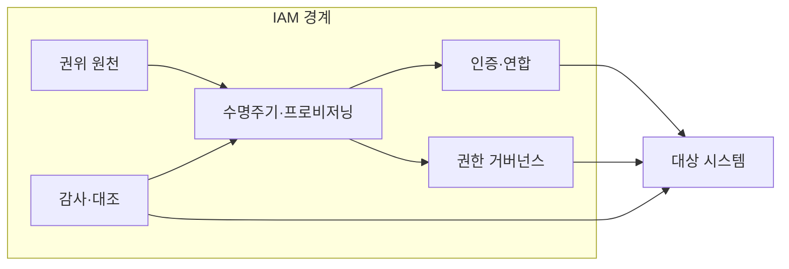
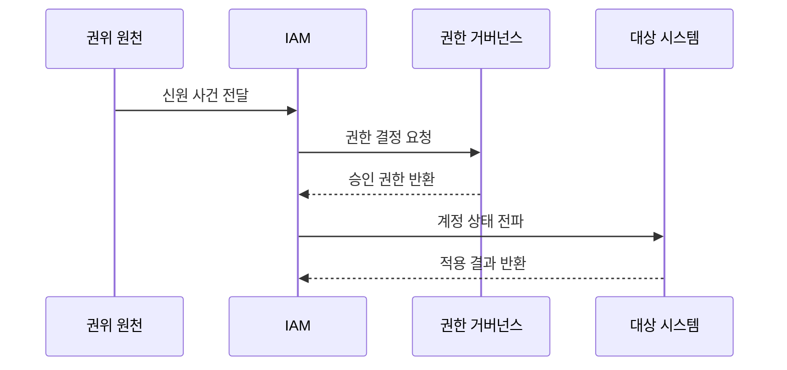

---
sidebar:
  order: 61
  label: "061. IAM 신원·접근 관리 (Identity and Access Management)"
  badge:
    text: "기출 · 70%"
    variant: note
title: "IAM 신원·접근 관리 (Identity and Access Management)"
date: "2026-07-27T23:59:59+09:00"
tags:
  - "notes-security"
weight: 61
extra:
  question_no: "061"
  source_status: "기출"
  source_history: "120회, 135회"
  priority: 70
  priority_note: "120·135회 반복된 신원 수명주기 우산 주제임"
---

## 미리 알고가기

- **신원·접근 관리(Identity and Access Management, IAM)**: 디지털 신원과 접근 권한의 생성·변경·검토·회수를 관리하는 체계이다.
- **디지털 신원(Digital Identity)**: 사람·서비스·장치를 시스템에서 식별하는 속성과 계정의 집합
- **인증(Authentication)**: 접근 주체가 주장한 신원이 맞는지 확인하는 절차
- **인가(Authorization)**: 인증된 주체가 요청한 행위를 할 수 있는지 결정하는 절차
- **프로비저닝(Provisioning)**: 계정과 권한을 대상 시스템에 생성·변경·중지하는 처리
- **권위 원천(Authoritative Source)**: 소속·고용·소유 상태의 기준이 되는 신뢰 정보원
- **통합 인증(Single Sign-On, SSO)**: 한 번의 인증으로 여러 연계 서비스에 접속하게 하는 인증 방식이다.
- **다중 요소 인증(Multi-Factor Authentication, MFA)**: 서로 다른 종류의 인증 요소를 둘 이상 확인하는 인증 방식이다.
- **신원 제공자(Identity Provider, IdP)**: 사용자를 인증하고 그 결과와 신원 정보를 서비스에 전달하는 주체이다.
- **응용 프로그래밍 인터페이스(Application Programming Interface, API)**: IAM이 대상 시스템의 계정과 세션을 제어하는 호출 접점이다.
- **서비스 신원(Service Identity)**: 애플리케이션이나 자동화 작업이 사용하는 비인간 신원
- **고아 계정(Orphan Account)**: 유효한 소유자 없이 시스템에 남은 계정
- **접근 검토(Access Review)**: 부여된 권한의 필요성과 적정성을 다시 확인하는 활동
- **수명주기(Lifecycle)**: 신원의 등록·이동·휴직·퇴사·폐기까지 이어지는 상태 변화

## Ⅰ. 개요

- 정의: 신원·접근 권한의 **전 수명주기 관리**
- 기존 한계: 시스템별 계정의 **권한 불일치·잔존**

### 쉽게 이해하기 (학습용)

- IAM은 로그인 화면만 관리하는 것이 아니라 입사·이동·퇴사에 맞춰 모든 시스템의 계정과 열쇠를 함께 바꾼다.

## Ⅱ. 특징

- 권위 원천 기반 **신원 수명주기 관리**
- 인증·인가·프로비저닝의 **통합 관리**
- 접근 검토 기반 **최소 권한·회수**

### 쉽게 이해하기 (학습용)

- 기준 명부의 상태가 바뀌면 연결된 앱의 계정과 권한도 빠짐없이 같은 상태로 바뀌어야 한다.

## Ⅲ. 아키텍처 및 구성요소

| 설계 요소 | 설명 |
|:---|:---|
| 권위 원천 | 주체·소속·상태의 기준 제공 |
| 수명주기·프로비저닝 | 계정과 상태를 자동 전파 |
| 인증·연합 | 인증기·MFA·SSO 관리 |
| 권한 거버넌스 | 요청·승인·검토·회수 |
| 감사·대조 | 기준과 실제 상태 차이 탐지 |

### 쉽게 이해하기 (학습용)

- 신뢰 명부가 변화를 알리면 IAM이 계정과 권한을 전파하고 감사 기능이 실제 시스템에 빠짐없이 반영됐는지 확인한다.

## Ⅳ. 원리 및 절차 흐름도

| 절차 | 설명 |
|:---|:---|
| 신원 사건 전달 | 입사·이동·퇴사 상태 통보 |
| 권한 결정 요청 | 역할·속성·승인 근거 평가 |
| 승인 권한 반환 | 최소 권한과 만료 확정 |
| 계정 상태 전파 | 생성·변경·중지 자동 적용 |
| 적용 결과 반환 | 누락·실패를 대조하고 재처리 |

> 요약: 신원 변화를 권한과 계정 상태에 전파한다.

### 쉽게 이해하기 (학습용)

- 인사 상태가 바뀌면 필요한 권한을 다시 계산해 각 시스템에 적용하고 실제 성공 여부까지 되돌려 확인한다.

## Ⅴ. 종류 및 비교

| 신원 관리 방식 | IAM | 시스템별 수동 관리 | 연합·클라우드 IAM |
|:---|:---|:---|:---|
| 적용 기준 | 다수 시스템의 일관 통제 | 소규모 단일 시스템 | 조직·클라우드 경계 연동 |
| 핵심 특징 | 중앙 수명주기·권한 관리 | 관리자의 시스템별 처리 | 조직 간 신원·권한 연계 |
| 한계 | 연계 오류·중앙 장애 | 고아 계정·정책 편차 | 신뢰 매핑·토큰 확산 |

### 쉽게 이해하기 (학습용)

- 수동 관리는 작을 때 단순하지만 누락되기 쉽고 중앙 IAM은 일관성을 높이며 연합형은 조직 간 신뢰 설정을 추가로 관리한다.

## Ⅵ. 실무 사례

1. 퇴사자의 **계정·세션·토큰 동시 폐기**

### 쉽게 이해하기 (학습용)

- 인사 시스템의 퇴사 처리를 IAM과 연계해 모든 업무 계정을 비활성화하고 이미 발급된 세션과 접근 토큰도 즉시 폐기한다.

## Ⅶ. 결론

- 분산된 계정과 권한의 불일치를 극복하기 위해 신원 수명주기·권한 승인·전파 실패·세션·토큰 상태를 검토하여, 모든 접근 수단을 IAM으로 일관되게 관리해야 한다.

### 쉽게 이해하기 (학습용)

- IAM의 완성도는 계정을 발급하는 속도보다 상태 변화가 세션·토큰·키까지 빠짐없이 반영되는지로 판단한다.
