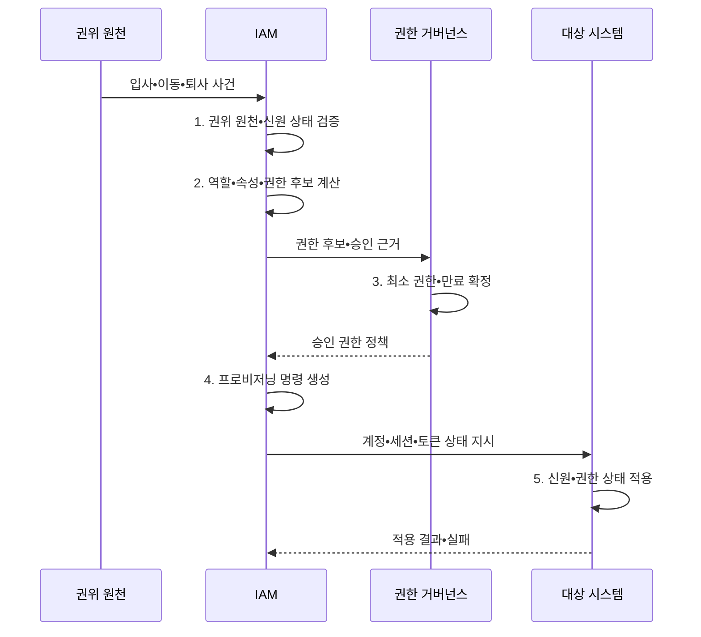

---
sidebar:
  order: 61
  label: "061. IAM 신원•접근 관리 (Identity and Access Management)"
  badge:
    text: "기출 • 70%"
    variant: note
title: "IAM 신원•접근 관리 (Identity and Access Management)"
date: "2026-08-05T01:43:14+09:00"
tags:
  - "notes-security"
weight: 61
extra:
  question_no: "061"
  source_status: "기출"
  source_history: "120회, 135회"
  priority: 70
  priority_note: "120•135회 반복된 신원 수명주기 우산 주제임"
---

## Ⅰ. 개요

<details><summary>핵심 용어</summary>

- **IAM(Identity and Access Management)** 은 디지털 신원과 접근 권한의 생성•변경•검토•회수를 관리하는 체계다.
- **디지털 신원**: 사람•서비스•장치를 시스템에서 식별하는 속성과 계정의 집합이다.

</details>

- 정의/개념: **IAM** 은 사용자•서비스 신원을 등록•인증하고 역할과 정책에 따라 접근 권한을 부여•변경•회수하는 전 수명주기 보안 관리 체계
- 배경/필요성: 시스템별 계정 관리로 **권한 불일치•잔존**

#### 한줄 요약

- IAM은 로그인 화면만 관리하는 것이 아니라 입사•이동•퇴사에 맞춰 모든 시스템의 계정과 열쇠를 함께 바꾼다.

## Ⅱ. 특징

<details><summary>핵심 용어</summary>

- **신원 수명주기**: 신원의 등록•이동•휴직•퇴사•폐기까지 이어지는 상태 변화와 처리를 뜻한다.
- **프로비저닝** 은 계정과 권한을 대상 시스템에 생성•변경•중지하는 처리다.
- **접근 검토** 는 부여된 권한의 업무 필요성과 적정성을 다시 확인하는 절차다.
- **인증** 은 접근을 요청한 주체의 신원을 확인하는 절차다.
- **인가** 는 확인된 주체가 자원에 수행할 수 있는 행위를 판단하는 절차다.

</details>

- **신원 수명주기 관리**: 권위 원천의 상태 변화 반영
- **통합 관리**: 인증•인가•프로비저닝 정책 연결
- **최소 권한•회수**: 접근 검토로 불필요한 권한 제거

#### 한줄 요약

- 기준 명부의 상태가 바뀌면 연결된 앱의 계정과 권한도 빠짐없이 같은 상태로 바뀌어야 한다.

## Ⅲ. 구조 및 구성요소

<details><summary>핵심 용어</summary>

- **권위 원천**: 소속•고용•소유 상태의 기준이 되는 신뢰 정보원이다.
- **권한 거버넌스** 는 권한의 요청•승인•검토•회수를 통제하는 관리 체계다.
- **감사 대조** 는 승인된 기준 권한과 대상 시스템의 실제 권한 차이를 확인한다.
- **MFA(Multi-Factor Authentication)** 는 서로 다른 종류의 인증 요소를 둘 이상 확인하는 방식이다.
- **SSO(Single Sign-On)** 는 한 번의 인증으로 여러 연계 서비스에 접속하게 하는 방식이다.

</details>

```text
[권위 원천]---[수명주기•프로비저닝]---[인증•연합]
                       |                    |
              [권한 거버넌스]----------[감사•대조]
```

선의 의미: 권위 원천을 기준으로 계정 관리•인증•권한 거버넌스•감사 대조 기능이 결합되는 IAM 구조를 나타낸다.

| 구성요소 | 책임 |
|:---|:---|
| **권위 원천** | 주체•소속•상태의 **기준 제공** |
| **수명주기•프로비저닝** | 계정과 상태의 **자동 전파** |
| **인증•연합** | 인증기•**MFA•SSO** 관리 |
| **권한 거버넌스** | 권한의 **요청•승인•검토•회수** |
| **감사•대조** | 기준과 실제 상태의 **차이 탐지** |

#### 한줄 요약

- 신뢰 명부가 변화를 알리면 IAM이 계정과 권한을 전파하고 감사 기능이 실제 시스템에 빠짐없이 반영됐는지 확인한다.

## Ⅳ. 흐름도

<details><summary>핵심 용어</summary>

- **고아 계정**: 유효한 소유자 없이 대상 시스템에 남아 있는 계정이다.
- **계정•세션•토큰 회수**: 퇴사나 권한 변경을 계정뿐 아니라 이미 발급된 세션과 접근 토큰에도 반영하는 처리이다.

</details>



**동작 원리**

1. **권위 원천•신원 상태 검증**: 주체•소속•고용 상태의 변경 확인
2. **역할•속성•권한 후보 계산**: 직무•정책으로 필요한 권한 도출
3. **최소 권한•만료 확정**: 권한 범위•유효기간과 승인 조건 지정
4. **프로비저닝 명령 생성**: 계정•세션•토큰의 목표 상태 구성
5. **신원•권한 상태 적용**: 생성•변경•중지 후 실제 결과 반환


#### 한줄 요약

- 인사 상태가 바뀌면 필요한 권한을 다시 계산해 각 시스템에 적용하고 실제 성공 여부까지 되돌려 확인한다.

## Ⅴ. 종류 및 비교

<details><summary>핵심 용어</summary>

- **중앙 IAM** 은 조직 내 다수 시스템의 신원 수명주기를 일관되게 통제하는 방식이다.
- **연합 IAM** 은 조직 경계를 넘어 신원과 접근 권한을 연계하는 방식이다.

</details>

| 신원 관리 방식 | IAM | 시스템별 수동 관리 | 연합•클라우드 IAM |
|:---|:---|:---|:---|
| 적용 기준 | 다수 시스템의 **일관 통제** | 소규모 **단일 시스템** | 조직•클라우드 **경계 연동** |
| 핵심 특징 | **중앙 수명주기•권한 관리** | **시스템별 관리자 처리** | 조직 간 신원•권한 연계 |
| 한계 | **연계 오류•중앙 장애** | **고아 계정•정책 편차** | **신뢰 매핑•토큰 확산** |

#### 한줄 요약

- 수동 관리는 작을 때 단순하지만 누락되기 쉽고 중앙 IAM은 일관성을 높이며 연합형은 조직 간 신뢰 설정을 추가로 관리한다.

## Ⅵ. 실무 고려사항 및 대책

<details><summary>핵심 용어</summary>

- **NIST(National Institute of Standards and Technology)** 는 미국의 기술 표준과 지침을 개발하는 기관이다.
- **SP(Special Publication) 800-63-4** 는 신원 증명•인증•연합의 위험 기반 보증 수준을 제시한다.
- **SCIM(System for Cross-domain Identity Management)** 은 사용자•그룹 자원의 수명주기 연동 체계다.
- **IETF(Internet Engineering Task Force)** 는 인터넷 기술 표준을 개발•공개하는 국제 공동체다.
- **RFC(Request for Comments) 7644** 는 SCIM 자원의 생성•변경•삭제 프로토콜을 정의한다.

</details>

| 문제 | 대책 | 효과 |
|:---|:---|:---|
| **신원 보증수준 불일치** | **NIST SP 800-63-4 적용** | 증명•인증•연합의 **강도 정렬** |
| **계정 수명주기 연동 편차** | **IETF RFC 7644 SCIM 적용** | 이기종 **생성•변경•회수 통일** |
| **전파 실패•고아 계정** | **결과 대조•재처리•재인증** | **잔존 권한•회수 누락 방지** |

#### 한줄 요약

- 인사 시스템의 퇴사 처리를 IAM과 연계해 모든 업무 계정을 비활성화하고 이미 발급된 세션과 접근 토큰도 즉시 폐기한다.

## Ⅶ. 결론

<details><summary>핵심 용어</summary>

- **상태 전파 완결성**: 신원의 상태 변화가 연결된 모든 계정•세션•토큰•키에 빠짐없이 반영되었는지 확인하는 운영 기준이다.
</details>

- 다수 시스템은 **중앙 IAM**, 조직 간 연계는 **연합 IAM**, 단일 소규모는 **수동 관리**

#### 한줄 요약

- IAM의 완성도는 계정을 발급하는 속도보다 상태 변화가 세션•토큰•키까지 빠짐없이 반영되는지로 판단한다.
