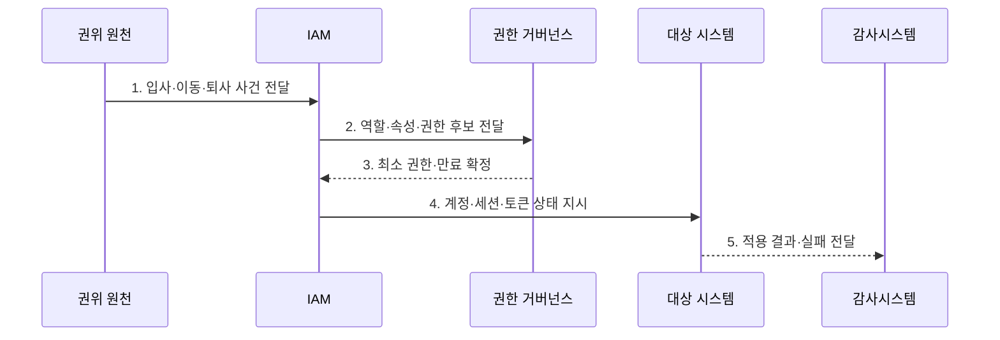

---
sidebar:
  order: 61
  label: "061. IAM 신원·접근 관리 (Identity and Access Management)"
  badge:
    text: "기출 · 70%"
    variant: note
title: "IAM 신원·접근 관리 (Identity and Access Management)"
date: "2026-07-31T01:56:52+09:00"
tags:
  - "notes-security"
weight: 61
extra:
  question_no: "061"
  source_status: "기출"
  source_history: "120회, 135회"
  priority: 70
  priority_note: "120·135회 반복된 신원 수명주기 우산 주제임"
---

## 미리 알고가기

- **신원·접근 관리(Identity and Access Management, IAM)**: 디지털 신원과 접근 권한의 생성·변경·검토·회수를 관리하는 체계이다.
- **디지털 신원(Digital Identity)**: 사람·서비스·장치를 시스템에서 식별하는 속성과 계정의 집합이다.
- **인증(Authentication)**: 접근 주체가 주장한 신원이 맞는지 확인하는 절차이다.
- **인가(Authorization)**: 인증된 주체가 요청한 행위를 할 수 있는지 결정하는 절차이다.
- **프로비저닝(Provisioning)**: 계정과 권한을 대상 시스템에 생성·변경·중지하는 처리이다.
- **권위 원천(Authoritative Source)**: 소속·고용·소유 상태의 기준이 되는 신뢰 정보원이다.
- **통합 인증(Single Sign-On, SSO)**: 한 번의 인증으로 여러 연계 서비스에 접속하게 하는 인증 방식이다.
- **다중 요소 인증(Multi-Factor Authentication, MFA)**: 서로 다른 종류의 인증 요소를 둘 이상 확인하는 인증 방식이다.
- **신원 제공자(Identity Provider, IdP)**: 사용자를 인증하고 그 결과와 신원 정보를 서비스에 전달하는 주체이다.
- **응용 프로그래밍 인터페이스(Application Programming Interface, API)**: IAM이 대상 시스템의 계정과 세션을 제어하는 호출 접점이다.
- **서비스 신원(Service Identity)**: 애플리케이션이나 자동화 작업이 사용하는 비인간 신원이다.
- **고아 계정(Orphan Account)**: 유효한 소유자 없이 시스템에 남은 계정이다.
- **접근 검토(Access Review)**: 부여된 권한의 필요성과 적정성을 다시 확인하는 활동이다.
- **수명주기(Lifecycle)**: 신원의 등록·이동·휴직·퇴사·폐기까지 이어지는 상태 변화이다.
- **NIST SP 800-63-4**: 신원 증명·인증·연합의 위험 기반 보증수준을 제시한 공식 지침이다.
- **IETF RFC 7644**: SCIM 기반 사용자·그룹 자원의 생성·변경·삭제 프로토콜을 정의한 표준이다.
- **교차 도메인 신원 관리 체계(System for Cross-domain Identity Management, SCIM)**: 사용자·그룹 자원의 수명주기 연동 표준이다.
- **권한 거버넌스**: 권한의 요청·승인·검토·회수를 통제하는 관리 체계이다.
- **감사·대조**: 기준 권한과 대상 시스템의 실제 권한 차이를 확인하는 활동이다.
- **접근 토큰**: 인증·인가 결과에 따라 자원 접근 권한을 전달하는 증표이다.
- **재인증**: 계정·권한 상태를 다시 확인해 기존 접근의 유효성을 검증하는 절차이다.

## Ⅰ. 개요

- 정의/개념: 신원·접근 권한을 전 수명주기로 통제하는 **보안 관리 체계**
- 배경/필요성: 시스템별 계정의 **권한 불일치·잔존**

### 쉽게 이해하기 (학습용)

- IAM은 로그인 화면만 관리하는 것이 아니라 입사·이동·퇴사에 맞춰 모든 시스템의 계정과 열쇠를 함께 바꾼다.

## Ⅱ. 특징

- **신원 수명주기 관리**: 권위 원천의 상태 변화 반영
- **통합 관리**: 인증·인가·프로비저닝 정책 연결
- **최소 권한·회수**: 접근 검토로 불필요한 권한 제거

### 쉽게 이해하기 (학습용)

- 기준 명부의 상태가 바뀌면 연결된 앱의 계정과 권한도 빠짐없이 같은 상태로 바뀌어야 한다.

## Ⅲ. 구조 및 구성요소

| 구성요소 | 책임 |
|:---|:---|
| **권위 원천** | 주체·소속·상태의 **기준 제공** |
| **수명주기·프로비저닝** | 계정과 상태의 **자동 전파** |
| **인증·연합** | 인증기·**MFA·SSO** 관리 |
| **권한 거버넌스** | 권한의 **요청·승인·검토·회수** |
| **감사·대조** | 기준과 실제 상태의 **차이 탐지** |

### 쉽게 이해하기 (학습용)

- 신뢰 명부가 변화를 알리면 IAM이 계정과 권한을 전파하고 감사 기능이 실제 시스템에 빠짐없이 반영됐는지 확인한다.

## Ⅳ. 흐름도

**동작 원리**

1. **입사·이동·퇴사 사건 전달**: 권위 원천의 상태 변경 통보
2. **역할·속성·권한 후보 전달**: 직무·정책·승인 근거 제공
3. **최소 권한·만료 확정**: 권한 범위·유효기간 지정
4. **계정·세션·토큰 상태 지시**: 생성·변경·중지 명령 제공
5. **적용 결과·실패 전달**: 누락·고아 계정 재처리 근거 제공

### 쉽게 이해하기 (학습용)

- 인사 상태가 바뀌면 필요한 권한을 다시 계산해 각 시스템에 적용하고 실제 성공 여부까지 되돌려 확인한다.

## Ⅴ. 종류 및 비교

| 신원 관리 방식 | IAM | 시스템별 수동 관리 | 연합·클라우드 IAM |
|:---|:---|:---|:---|
| 적용 기준 | 다수 시스템의 **일관 통제** | 소규모 **단일 시스템** | 조직·클라우드 **경계 연동** |
| 핵심 특징 | **중앙 수명주기·권한 관리** | **시스템별 관리자 처리** | 조직 간 신원·권한 연계 |
| 한계 | **연계 오류·중앙 장애** | **고아 계정·정책 편차** | **신뢰 매핑·토큰 확산** |

### 쉽게 이해하기 (학습용)

- 수동 관리는 작을 때 단순하지만 누락되기 쉽고 중앙 IAM은 일관성을 높이며 연합형은 조직 간 신뢰 설정을 추가로 관리한다.

## Ⅵ. 실무 고려사항 및 대책

| 고려사항 | 대책 | 효과 |
|:---|:---|:---|
| **신원 보증수준 불일치** | **NIST SP 800-63-4 적용** | 증명·인증·연합의 **강도 정렬** |
| **계정 수명주기 연동 편차** | **IETF RFC 7644 SCIM 적용** | 이기종 **생성·변경·회수 통일** |
| **전파 실패·고아 계정** | **결과 대조·재처리·재인증** | **잔존 권한·회수 누락 방지** |

### 쉽게 이해하기 (학습용)

- 인사 시스템의 퇴사 처리를 IAM과 연계해 모든 업무 계정을 비활성화하고 이미 발급된 세션과 접근 토큰도 즉시 폐기한다.

## Ⅶ. 결론

- 다수 시스템은 **중앙 IAM**, 조직 간 연계는 **연합 IAM**, 단일 소규모는 수동 관리

### 쉽게 이해하기 (학습용)

- IAM의 완성도는 계정을 발급하는 속도보다 상태 변화가 세션·토큰·키까지 빠짐없이 반영되는지로 판단한다.
