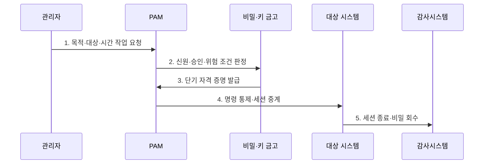

---
sidebar:
  order: 62
  label: "062. PAM 특권 접근 관리 (Privileged Access Management)"
  badge:
    text: "미출제 · 50%"
    variant: note
title: "PAM 특권 접근 관리 (Privileged Access Management)"
date: "2026-07-25T22:02:00+09:00"
tags:
  - "notes-security"
weight: 62
extra:
  question_no: "062"
  source_status: "미출제"
  source_history: ""
  priority: 50
  priority_note: "특권의 적시발급·세션감사를 묻는 강한 설계 주제임"
---

## 미리 알고가기

- **특권 접근 관리(Privileged Access Management, PAM)**: 높은 권한의 계정·자격 증명·접속·세션을 집중적으로 통제하는 체계이다.
- **특권 계정(Privileged Account)**: 시스템 설정·계정·보안 통제를 변경할 수 있는 높은 권한 계정이다.
- **신원·접근 관리(Identity and Access Management, IAM)**: 전체 디지털 신원과 접근 권한의 수명주기를 관리하는 체계이다.
- **자격 증명(Credential)**: 비밀번호·키·토큰처럼 신원과 권한을 증명하는 정보이다.
- **비밀 금고(Secret Vault)**: 특권 비밀번호와 키를 암호화해 보관·회전하는 저장소이다.
- **세션 중계(Session Proxy)**: 사용자를 대상 시스템에 직접 연결하지 않고 통제된 경로로 접속시키는 기능이다.
- **적시 특권(Just-in-Time Privilege, JIT)**: 승인된 작업 시간에만 필요한 특권을 발급하고 종료 후 자동 회수하는 방식이다.
- **최소 특권(Least Privilege)**: 작업에 필요한 최소 범위의 권한만 부여하는 원칙이다.
- **명령 통제(Command Control)**: 특권 세션에서 실행 가능한 명령을 제한하는 통제이다.
- **세션 기록(Session Recording)**: 명령·화면·파일 전송 등 특권 작업의 증적을 저장하는 기능이다.
- **비상 접근(Break Glass Access)**: 정상 통제 체계 장애 때 제한적으로 사용하는 긴급 특권 절차이다.
- **서비스 계정(Service Account)**: 애플리케이션이나 자동화 작업이 사용하는 비인간 계정이다.
- **직접 접속 경로(Direct Access Path)**: PAM 중계를 거치지 않고 대상 시스템에 접근하는 우회 통로이다.
- **NIST SP 800-53 Rev. 5**: 특권 계정·최소 권한·감사·세션 통제 요구를 제시한 공식 지침이다.
- **ISO/IEC 27002:2022 통제 8.2**: 특권 접근권의 할당과 사용을 제한·관리하도록 요구하는 국제표준 통제이다.

## Ⅰ. 개요

- 정의: 고위험 특권의 **발급·사용·회수 통제**
- 기존 한계: 상시 공유 권한의 **탈취·부인·잔존**

### 쉽게 이해하기 (학습용)

- 관리자 열쇠를 계속 나눠 갖지 않고 작업자와 목적을 확인한 뒤 필요한 시간과 기능만 열어 주고 사용 후 회수한다.

## Ⅱ. 특징

- 특권 계정·비밀·우회 경로의 **지속 발견**
- 금고·세션 중계의 **비밀 비노출 통제**
- JIT·작업 기록의 **최소 특권·책임 추적**

### 쉽게 이해하기 (학습용)

- 사용자는 관리자 비밀번호를 직접 알지 못하고 승인된 통로에서만 작업하므로 누가 무엇을 했는지 남길 수 있다.

## Ⅲ. 구조 및 구성요소

| 설계 요소 | 설명 |
|:---|:---|
| 특권 발견·분류 | 계정·키·우회 경로 식별 |
| 요청·승인 | 작업·대상·시간 판정 |
| 비밀·키 금고 | 자격 증명 보관·회전 |
| 세션 중계 | 직접 접속 차단과 작업 통제 |
| 회수·감사 | 권한 폐기와 증적 보호 |

### 쉽게 이해하기 (학습용)

- 특권을 찾아 금고에 넣고 승인된 작업만 중계하며 세션이 끝나면 권한과 비밀을 회수하고 기록을 보호한다.

## Ⅳ. 흐름도

| 절차 | 설명 |
|:---|:---|
| 목적·대상·시간 작업 요청 | 명령·업무 근거를 제출 |
| 신원·승인·위험 조건 판정 | 직무분리·업무 영향을 확인 |
| 단기 자격 증명 발급 | 금고에서 JIT 비밀 제공 |
| 명령 통제·세션 중계 | 직접 접속 차단·작업 기록 |
| 세션 종료·비밀 회수 | 권한 폐기·비밀 회전·감사 |

> 요약: 승인한 작업에만 단기 특권을 중계한다.

### 쉽게 이해하기 (학습용)

- 작업 목적을 심사해 짧게 쓸 열쇠로 통제된 세션을 열고 모든 작업을 기록한 뒤 연결과 열쇠를 함께 닫는다.

## Ⅴ. 종류 및 비교

| 특권 관리 유형 | PAM | 공유 상시 계정 | 금고형 계정 대여 | JIT 최소 특권 |
|:---|:---|:---|:---|:---|
| 적용 기준 | 고위험 접근 통합 관리 | 임시·낮은 성숙 환경 | 기존 계정의 비밀 보호 | 클라우드·자동화 환경 |
| 핵심 특징 | **특권 전주기 통제** | **공용 관리자 권한** | 금고 계정 일시 대여 | 작업별 단기 권한 |
| 한계 | 우회 경로·중앙 장애 | 탈취·부인·회수 곤란 | 공유 계정 잔존 | 정책·비상 절차 복잡 |

### 쉽게 이해하기 (학습용)

- PAM은 단순 금고가 아니라 승인·중계·기록·회수를 묶으며 성숙할수록 공유 계정에서 작업별 단기 권한으로 전환한다.

## Ⅵ. 실무 고려사항 및 대책

| 고려사항 | 대책 | 효과 |
|:---|:---|:---|
| 특권 계정·최소 권한 | **NIST SP 800-53 Rev. 5 적용** | 계정·세션·감사 통제 정렬 |
| 특권 접근권 관리 | **ISO/IEC 27002 통제 8.2 적용** | 할당·검토·회수 책임 명확화 |
| 금고 장애·우회 경로 | **고가용성·직접 접속 차단** | 중앙 장애·통제 회피 위험 완화 |

### 쉽게 이해하기 (학습용)

- 관리자는 PAM을 통해 승인된 시간에만 방화벽에 접속하고, PAM은 관리자 비밀번호를 대신 주입하며 명령과 화면을 감사 기록으로 남긴다.

## Ⅶ. 결론

- **작업위험·권한시간·우회경로**로 PAM 통제를 결정한다.

### 쉽게 이해하기 (학습용)

- PAM의 핵심은 관리자 비밀번호 보관이 아니라 모든 특권을 개인·작업·시간에 묶어 통제하고 사용 뒤 흔적과 권한을 정리하는 것이다.
