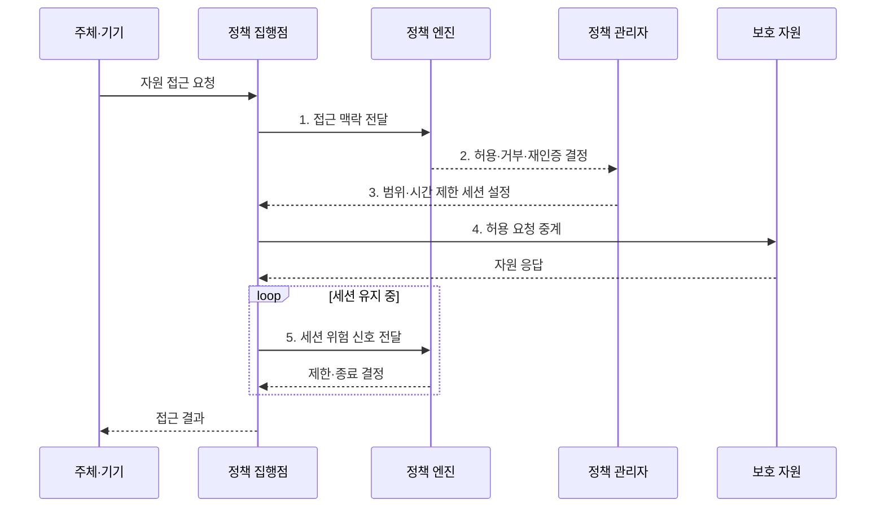

---
sidebar:
  order: 63
  label: "063. 제로 트러스트 아키텍처 (Zero Trust Architecture)"
  badge:
    text: "기출 · 85%"
    variant: note
title: "제로 트러스트 아키텍처 (Zero Trust Architecture)"
date: "2026-08-02T12:04:00+09:00"
tags:
  - "notes-security"
weight: 63
extra:
  question_no: "063"
  source_status: "기출"
  source_history: "126회, 134회, 135회"
  priority: 85
  priority_note: "126·134·135회 반복된 보안 아키텍처 최우선 축임"
---

## Ⅰ. 개요

핵심 용어

- **제로 트러스트 아키텍처(ZTA)**: 네트워크 위치를 신뢰 근거로 삼지 않고 주체·기기·문맥을 바탕으로 자원별 접근을 검증하는 아키텍처이다.
- **묵시적 신뢰·측면 이동**: 내부망이나 기존 세션을 자동 신뢰하면 침해 주체가 다른 내부 자원으로 공격 범위를 넓힐 수 있다.

- 정의/개념: **제로 트러스트**는 네트워크 위치를 신뢰 근거로 삼지 않고 주체·단말·맥락을 자원별로 지속 검증하여 최소 권한을 집행하는 보안 아키텍처
- 배경/필요성: 내부망 신뢰의 **권한 확장·측면 이동**

#### 한줄 요약

- 회사 안에서 접속했다는 이유로 모든 문을 열지 않고 매 자원 요청마다 사용자·기기·위험을 다시 확인한다.

## Ⅱ. 특징

핵심 용어

- **명시적 검증·최소 권한**: 위치와 무관하게 접근 근거를 확인하고 업무에 필요한 자원·행위·시간만 허용하는 원칙이다.
- **지속 평가**: 세션 중에도 기기 상태와 위협 변화를 반영해 접근을 다시 판단하는 활동이다.

- **명시적 검증**: 네트워크 위치와 무관한 접근 판단
- **최소 권한**: 자원·행위·시간 범위로 권한 제한
- **지속 평가**: 세션 중 위험 변화의 재판단

#### 한줄 요약

- 한 번 로그인했어도 기기가 감염되거나 위치와 행동이 달라지면 이미 열린 접근을 줄이거나 끊는다.

## Ⅲ. 구조 및 구성요소

핵심 용어

- **정책 엔진·정책 관리자**: 정책 엔진은 신호와 정책을 평가해 결정하고 정책 관리자는 그 결정에 따라 세션과 자격 증명을 생성·종료한다.
- **정책 집행점·보호 자원**: 정책 집행점은 주체와 보호 대상 데이터·앱·서비스 사이에서 접근 결정을 실제로 적용한다.

| 구성요소 | 책임 |
|:---|:---|
| **주체·기기** | 신원과 **단말 상태 제공** |
| **정책 집행점** | 접근의 **연결·감시·차단** |
| **보호 자원** | 데이터·앱·서비스의 **접근 경계** |
| **정책 관리자** | 세션과 **자격 증명 제어** |
| **정책 엔진·위험 신호** | 정책·민감도·위험의 **결정 근거** |

#### 한줄 요약

- 정책 엔진이 여러 신호를 보고 결정하면 관리자가 세션을 만들고 집행점이 자원 앞에서 그 결정을 계속 적용한다.

## Ⅳ. 흐름도

핵심 용어

- **신뢰 알고리즘**: 신원·기기·자원·행위·위협 신호를 결합해 접근 위험과 허용 범위를 계산하는 판단 로직이다.
- **재인증**: 세션 위험이 변했을 때 신원과 인증 요소를 다시 확인하는 절차이다.

**동작 원리**

- **1. 접근 맥락 전달**: 주체·기기·자원·행위 정보 제공
- **2. 허용·거부·재인증 결정**: 신뢰 알고리즘으로 최소 권한 산출
- **3. 범위·시간 제한 세션 설정**: 자격·행위·만료 조건 적용
- **4. 허용 요청 중계**: 정책을 통과한 자원 요청만 전달
- **5. 세션 위험 신호 전달**: 변화 시 제한·종료 판단 근거 제공
#### 한줄 요약

- 접근 전에는 필요한 만큼만 열고 접근 중에는 위험 변화를 계속 보다가 조건이 달라지면 다시 인증시키거나 연결을 닫는다.

## Ⅴ. 종류 및 비교

핵심 용어

- **경계 중심 보안·혼합 전환**: 경계형은 내부 위치를 넓게 신뢰하고 혼합 전환은 기존 경계를 유지하면서 중요 자원부터 제로 트러스트로 바꾼다.

| 보안 접근 모델 | 제로 트러스트 | 경계 중심 | 혼합 전환 |
|:---|:---|:---|:---|
| 적용 기준 | **분산 자원·원격 업무** | 단순 **폐쇄형 내부망** | 기존 환경의 **단계적 전환** |
| 핵심 특징 | **자원별 동적 접근 판단** | **내부 위치의 넓은 신뢰** | 중요 자원부터 검증 전환 |
| 한계 | **신호 품질·집행 가용성** | **내부 확산·VPN 과신** | **이중 정책·우회 경로** |

#### 한줄 요약

- 경계형은 내부에 들어오면 넓게 믿고 제로 트러스트는 자원마다 검증하며 혼합형은 중요한 자원부터 그 방식으로 바꾼다.

## Ⅵ. 실무 고려사항 및 대책

핵심 용어

- **NIST SP 800-207**: 제로 트러스트의 논리 구성요소·배치 모델·신뢰 알고리즘을 정의한 공식 지침이다.
- **CISA ZTMM 2.0·제한 업무 모드**: ZTMM은 도메인별 전환 성숙도를 제시하고 제한 모드는 신호 장애 때 필수 기능만 허용한다.

| 문제 | 대책 | 효과 |
|:---|:---|:---|
| **논리 구조·신뢰 판단 편차** | **NIST SP 800-207 적용** | PE·PA·PEP의 **책임 정렬** |
| **단계적 전환·측정 부재** | **CISA ZTMM 2.0 활용** | 도메인별 **목표·격차 관리** |
| **신호 장애·집행 중단** | **제한 모드·고가용성 설계** | 오허용을 억제하며 **필수 업무 유지** |

#### 한줄 요약

- 중요 업무 앱은 접속 위치와 관계없이 사용자 신원·기기 관리 상태·세션 위험을 확인하고, 조건이 바뀌면 재인증하거나 세션을 차단한다.

## Ⅶ. 결론

핵심 용어

- **자원별 지속 검증**: 접근 시점뿐 아니라 열린 세션에서도 위험 변화를 관찰해 최소 권한을 유지하는 제로 트러스트 운영 원칙이다.

- 분산·원격은 **ZTA**, 단순 폐쇄망은 경계형, 기존 환경은 **혼합 전환**

#### 한줄 요약

- 제로 트러스트는 특정 제품이 아니라 모든 자원 요청을 최소 권한으로 판단하고 변화한 위험을 열린 세션에도 반영하는 운영 방식이다.
