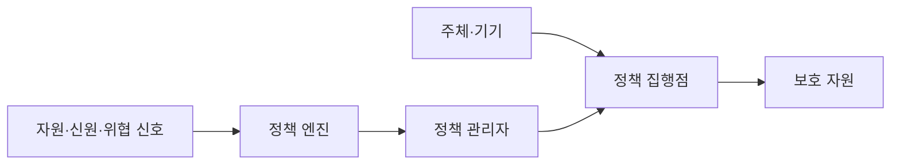
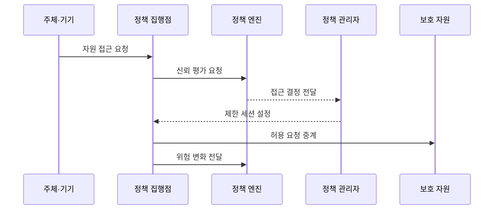

---
sidebar:
  order: 63
  label: "063. 제로 트러스트 아키텍처 (Zero Trust Architecture)"
  badge:
    text: "기출 · 85%"
    variant: note
title: "제로 트러스트 아키텍처 (Zero Trust Architecture)"
date: "2026-07-27T23:59:59+09:00"
tags:
  - "notes-security"
weight: 63
extra:
  question_no: "063"
  source_status: "기출"
  source_history: "126회, 134회, 135회"
  priority: 85
  priority_note: "126·134·135회 반복된 보안 아키텍처 최우선 축임"
---

## 미리 알고가기

- **제로 트러스트 아키텍처(Zero Trust Architecture, ZTA)**: 영문 머리글자를 딴 공식 표기라 “지티에이”로 읽으며, 네트워크 위치를 신뢰 근거로 삼지 않고 자원별 접근을 검증하는 아키텍처
- **묵시적 신뢰(Implicit Trust)**: 내부망이나 기존 세션이라는 이유만으로 추가 검증 없이 부여하는 신뢰
- **최소 권한(Least Privilege)**: 업무에 필요한 최소 범위와 시간의 권한만 부여하는 원칙
- **측면 이동(Lateral Movement)**: 침해한 계정이나 장비에서 다른 내부 자원으로 공격 범위를 넓히는 행위
- **정책 엔진(Policy Engine)**: 신호와 정책을 평가해 접근 허용·거부를 결정하는 구성요소
- **정책 관리자(Policy Administrator)**: 정책 엔진의 결정에 따라 세션과 자격 증명을 생성·종료하는 구성요소
- **정책 집행점(Policy Enforcement Point)**: 주체와 자원 사이에서 접근 결정을 실제로 적용하는 구성요소
- **신뢰 알고리즘(Trust Algorithm)**: 신원·기기·자원·위협 신호를 결합해 접근 위험을 계산하는 판단 로직
- **기기 상태(Device Posture)**: 패치·암호화·보호 도구 등 단말의 보안 상태
- **지속 평가(Continuous Evaluation)**: 세션 중에도 위험 변화를 반영해 접근을 다시 판단하는 활동
- **마이크로 세그멘테이션(Micro-Segmentation)**: 워크로드 단위로 통신 경계를 잘게 나누는 통제
- **가상 사설망(Virtual Private Network, VPN)**: 영문 머리글자를 딴 공식 표기라 “브이피엔”으로 읽으며, 원격 장비를 사설망에 논리적으로 연결하는 경계 중심 비교 기술
- **제한 업무 모드**: 필수 기능만 허용해 보안 신호 장애 중 업무를 제한적으로 유지하는 상태

## Ⅰ. 개요

- 정의: 위치 신뢰를 배제한 **자원별 지속 검증**
- 기존 한계: 내부망 신뢰의 **권한 확장·측면 이동**

### 쉽게 이해하기 (학습용)

- 회사 안에서 접속했다는 이유로 모든 문을 열지 않고 매 자원 요청마다 사용자·기기·위험을 다시 확인한다.

## Ⅱ. 특징

- 네트워크 위치와 무관한 **명시적 검증**
- 자원·행위·시간 범위의 **최소 권한**
- 세션 위험 변화의 **지속 평가**

### 쉽게 이해하기 (학습용)

- 한 번 로그인했어도 기기가 감염되거나 위치와 행동이 달라지면 이미 열린 접근을 줄이거나 끊는다.

## Ⅲ. 아키텍처 및 구성요소

| 설계 요소 | 설명 |
|:---|:---|
| 주체·기기 | 신원과 단말 상태 제공 |
| 정책 집행점 | 접근 연결·감시·차단 |
| 보호 자원 | 데이터·앱·서비스 경계 |
| 정책 관리자 | 세션과 자격 증명 제어 |
| 정책 엔진 | 정책과 신호로 접근 결정 |
| 자원·신원·위협 신호 | 민감도와 위험 근거 제공 |

### 쉽게 이해하기 (학습용)

- 정책 엔진이 여러 신호를 보고 결정하면 관리자가 세션을 만들고 집행점이 자원 앞에서 그 결정을 계속 적용한다.

## Ⅳ. 원리 및 절차 흐름도

| 절차 | 설명 |
|:---|:---|
| 자원 접근 요청 | 신원·기기·대상·행위 제시 |
| 신뢰 평가 요청 | 자원 민감도와 위험 신호 결합 |
| 접근 결정 전달 | 허용·거부·재인증 결정 |
| 제한 세션 설정 | 범위·시간·조건을 세션에 적용 |
| 허용 요청 중계 | 승인된 자원과 행위만 연결 |
| 위험 변화 전달 | 세션을 재평가해 제한·종료 |

> 요약: 자원 요청과 세션을 지속해서 재평가한다.

### 쉽게 이해하기 (학습용)

- 접근 전에는 필요한 만큼만 열고 접근 중에는 위험 변화를 계속 보다가 조건이 달라지면 다시 인증시키거나 연결을 닫는다.

## Ⅴ. 종류 및 비교

| 보안 접근 모델 | 제로 트러스트 | 경계 중심 | 혼합 전환 |
|:---|:---|:---|:---|
| 적용 기준 | 분산 자원·원격 업무 | 단순 폐쇄형 내부망 | 기존 환경의 단계적 전환 |
| 핵심 특징 | 자원별 동적 접근 판단 | 내부 위치에 넓은 신뢰 | 중요 자원부터 검증 전환 |
| 한계 | 신호 품질·집행 가용성 | 내부 확산·VPN 과신 | 이중 정책·우회 경로 |

### 쉽게 이해하기 (학습용)

- 경계형은 내부에 들어오면 넓게 믿고 제로 트러스트는 자원마다 검증하며 혼합형은 중요한 자원부터 그 방식으로 바꾼다.

## Ⅵ. 실무 사례

1. 중요 앱의 **사용자·기기 조건 결합**
2. 자원 주소의 **정책 집행점 후면 배치**
3. 신호 장애의 **제한 업무 모드 적용**
4. 위험 세션의 **재인증·차단**

### 쉽게 이해하기 (학습용)

- 사례 1은 정상 계정이어도 관리되지 않은 기기에서 민감한 업무 앱을 열지 못하게 한다.
- 사례 2는 공격자가 정책 집행점을 우회해 내부 주소로 직접 접근하는 묵시적 신뢰 경로를 없앤다.
- 사례 3은 위험 정보를 받지 못할 때 전체를 무검증 허용하거나 전면 중단하는 대신 필수 기능만 유지한다.
- 사례 4는 로그인 뒤 계정 행동이나 기기 상태가 위험해지면 열린 세션도 다시 제한하거나 종료한다.

## Ⅶ. 결론

- **묵시적 위치 신뢰** 환경을 자원별 검증으로 전환

### 쉽게 이해하기 (학습용)

- 제로 트러스트는 특정 제품이 아니라 모든 자원 요청을 최소 권한으로 판단하고 변화한 위험을 열린 세션에도 반영하는 운영 방식이다.
