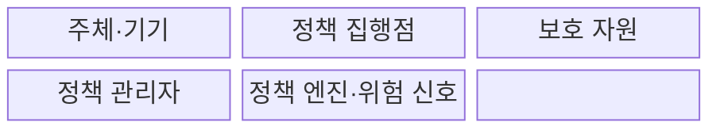
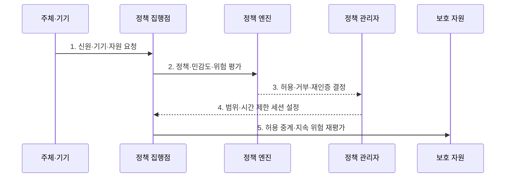

---
sidebar:
  order: 63
  label: "063. 제로 트러스트 아키텍처 (Zero Trust Architecture)"
  badge:
    text: "기출 · 85%"
    variant: note
title: "제로 트러스트 아키텍처 (Zero Trust Architecture)"
date: "2026-07-30T19:15:00+09:00"
tags:
  - "notes-security"
weight: 63
extra:
  question_no: "063"
  source_status: "기출"
  source_history: "126회, 134회, 135회"
  priority: 85
  priority_note: "126·134·135회 반복된 보안 아키텍처 최우선 축임"
---

## 미리 알고가기

- **제로 트러스트 아키텍처(Zero Trust Architecture, ZTA)**: 네트워크 위치를 신뢰 근거로 삼지 않고 주체·기기·문맥을 바탕으로 자원별 접근을 검증하는 아키텍처이다.
- **묵시적 신뢰(Implicit Trust)**: 내부망이나 기존 세션이라는 이유만으로 추가 검증 없이 부여하는 신뢰이다.
- **최소 권한(Least Privilege)**: 업무에 필요한 최소 범위와 시간의 권한만 부여하는 원칙이다.
- **측면 이동(Lateral Movement)**: 침해한 계정이나 장비에서 다른 내부 자원으로 공격 범위를 넓히는 행위이다.
- **정책 엔진(Policy Engine)**: 신호와 정책을 평가해 접근 허용·거부를 결정하는 구성요소이다.
- **정책 관리자(Policy Administrator)**: 정책 엔진의 결정에 따라 세션과 자격 증명을 생성·종료하는 구성요소이다.
- **정책 집행점(Policy Enforcement Point)**: 주체와 자원 사이에서 접근 결정을 실제로 적용하는 구성요소이다.
- **신뢰 알고리즘(Trust Algorithm)**: 신원·기기·자원·위협 신호를 결합해 접근 위험을 계산하는 판단 로직이다.
- **기기 상태(Device Posture)**: 패치·암호화·보호 도구 등 단말의 보안 상태이다.
- **지속 평가(Continuous Evaluation)**: 세션 중에도 위험 변화를 반영해 접근을 다시 판단하는 활동이다.
- **마이크로 세그멘테이션(Micro-Segmentation)**: 워크로드 단위로 통신 경계를 잘게 나누는 통제이다.
- **가상 사설망(Virtual Private Network, VPN)**: 원격 장비를 암호화 터널로 사설망에 논리적으로 연결하는 경계 중심 접근 기술이다.
- **제한 업무 모드(Degraded Mode)**: 필수 기능만 허용해 보안 신호 장애 중 업무를 제한적으로 유지하는 상태이다.
- **NIST SP 800-207**: 제로 트러스트의 논리 구성요소·배치 모델·신뢰 알고리즘을 정의한 공식 지침이다.
- **CISA ZTMM 2.0**: 신원·기기·네트워크·앱·데이터의 성숙 단계와 전환 경로를 제시한 공식 모델이다.

## Ⅰ. 개요

- 정의/개념: 위치 신뢰를 배제한 **자원별 지속 검증**
- 배경/필요성: 내부망 신뢰의 **권한 확장·측면 이동**

### 쉽게 이해하기 (학습용)

- 회사 안에서 접속했다는 이유로 모든 문을 열지 않고 매 자원 요청마다 사용자·기기·위험을 다시 확인한다.

## Ⅱ. 특징

- 네트워크 위치와 무관한 **명시적 검증**
- 자원·행위·시간 범위의 **최소 권한**
- 세션 위험 변화의 **지속 평가**

### 쉽게 이해하기 (학습용)

- 한 번 로그인했어도 기기가 감염되거나 위치와 행동이 달라지면 이미 열린 접근을 줄이거나 끊는다.

## Ⅲ. 구조 및 구성요소

| 구성요소 | 책임 |
|:---|:---|
| 주체·기기 | 신원과 단말 상태 제공 |
| 정책 집행점 | 접근 연결·감시·차단 |
| 보호 자원 | 데이터·앱·서비스 경계 |
| 정책 관리자 | 세션과 자격 증명 제어 |
| 정책 엔진·위험 신호 | 정책·민감도·위험으로 결정 |

### 쉽게 이해하기 (학습용)

- 정책 엔진이 여러 신호를 보고 결정하면 관리자가 세션을 만들고 집행점이 자원 앞에서 그 결정을 계속 적용한다.

## Ⅳ. 흐름도

**동작 원리**

- **1. 신원·기기·자원 요청**: 주체·상태·행위 맥락 제시
- **2. 정책·민감도·위험 평가**: 신뢰 알고리즘으로 신호 결합
- **3. 허용·거부·재인증 결정**: 최소 권한 조건을 산출
- **4. 범위·시간 제한 세션 설정**: 자격·행위·만료를 적용
- **5. 허용 중계·지속 위험 재평가**: 변화 시 제한·세션 종료
### 쉽게 이해하기 (학습용)

- 접근 전에는 필요한 만큼만 열고 접근 중에는 위험 변화를 계속 보다가 조건이 달라지면 다시 인증시키거나 연결을 닫는다.

## Ⅴ. 종류 및 비교

| 보안 접근 모델 | 제로 트러스트 | 경계 중심 | 혼합 전환 |
|:---|:---|:---|:---|
| 적용 기준 | 분산 자원·원격 업무 | 단순 폐쇄형 내부망 | 기존 환경의 단계적 전환 |
| 핵심 특징 | **자원별 동적 접근 판단** | **내부 위치의 넓은 신뢰** | 중요 자원부터 검증 전환 |
| 한계 | 신호 품질·집행 가용성 | 내부 확산·VPN 과신 | 이중 정책·우회 경로 |

### 쉽게 이해하기 (학습용)

- 경계형은 내부에 들어오면 넓게 믿고 제로 트러스트는 자원마다 검증하며 혼합형은 중요한 자원부터 그 방식으로 바꾼다.

## Ⅵ. 실무 고려사항 및 대책

| 고려사항 | 대책 | 효과 |
|:---|:---|:---|
| 논리 구조·신뢰 판단 | **NIST SP 800-207 적용** | PE·PA·PEP 책임 정렬 |
| 단계적 전환·측정 | **CISA ZTMM 2.0 활용** | 도메인별 목표·격차 관리 |
| 신호 장애·집행 중단 | **제한 모드·고가용성 설계** | 오허용·업무 중단 균형 |

### 쉽게 이해하기 (학습용)

- 중요 업무 앱은 접속 위치와 관계없이 사용자 신원·기기 관리 상태·세션 위험을 확인하고, 조건이 바뀌면 재인증하거나 세션을 차단한다.

## Ⅶ. 결론

- **자원민감도·신호품질·집행가용성**으로 ZTA 전환을 결정한다.

### 쉽게 이해하기 (학습용)

- 제로 트러스트는 특정 제품이 아니라 모든 자원 요청을 최소 권한으로 판단하고 변화한 위험을 열린 세션에도 반영하는 운영 방식이다.
