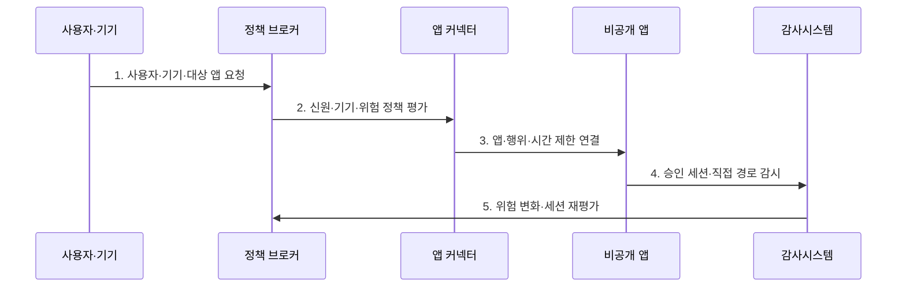

---
sidebar:
  order: 64
  label: "064. ZTNA 제로 트러스트 네트워크 접근 (ZTNA)"
  badge:
    text: "기출 · 70%"
    variant: note
title: "ZTNA 제로 트러스트 네트워크 접근 (ZTNA)"
date: "2026-07-30T19:15:00+09:00"
tags:
  - "notes-security"
weight: 64
extra:
  question_no: "064"
  source_status: "기출"
  source_history: "135회"
  priority: 70
  priority_note: "135회 기출이며 응용 단위 접근 설계로 재사용됨"
---

## 미리 알고가기

- **제로 트러스트 네트워크 접근(Zero Trust Network Access, ZTNA)**: 검증된 주체와 기기에 승인된 애플리케이션 연결만 제공하는 접근 제어 기술이다.
- **제로 트러스트(Zero Trust)**: 네트워크 위치를 신뢰하지 않고 자원별 접근을 검증하는 보안 모델이다.
- **가상 사설망(Virtual Private Network, VPN)**: 원격 장비를 암호화 터널로 사설망에 연결하는 경계 중심 접근 기술이다.
- **소프트웨어 정의 경계(Software-Defined Perimeter, SDP)**: 인증·인가된 주체에게만 자원 경계를 동적으로 공개하는 보안 구조이다.
- **정책 브로커(Policy Broker)**: 신원·기기·위험 정보를 평가해 앱 연결을 결정하는 구성요소이다.
- **앱 커넥터(Application Connector)**: 내부에서 ZTNA 서비스로 연결해 비공개 앱 세션을 중계하는 구성요소이다.
- **기원 서버(Origin Server)**: 실제 애플리케이션을 제공하는 내부 서버이다.
- **기기 상태(Device Posture)**: 패치·암호화·보호 도구 등 단말의 보안 상태이다.
- **애플리케이션 프록시(Application Proxy)**: 사용자의 요청을 대신 받아 특정 앱에 전달하는 중계 서버이다.
- **에이전트(Agent)**: 단말에 설치되어 기기 상태와 트래픽을 ZTNA에 전달하는 프로그램이다.
- **측면 이동(Lateral Movement)**: 침해한 장비에서 다른 내부 자원으로 공격을 확장하는 행위이다.
- **직접 경로(Direct Path)**: ZTNA 중계를 거치지 않고 기원 서버에 접속하는 우회 통로이다.
- **레거시(Legacy)**: 현대 인증·중계 방식과 직접 호환되지 않는 기존 시스템이다.
- **NIST SP 800-207**: 제로 트러스트의 정책 엔진·관리자·집행점과 배치 모델을 정의한 공식 지침이다.
- **CISA ZTMM 2.0**: 신원·기기·네트워크·앱·데이터 중심의 단계적 전환 모델을 제시한 공식 자료이다.

## Ⅰ. 개요

- 정의/개념: 검증된 주체의 **승인 앱 전용 연결**
- 배경/필요성: VPN의 **내부망 노출·측면 이동**

### 쉽게 이해하기 (학습용)

- 원격 사용자를 내부망 전체에 넣지 않고 검증된 사용자에게 승인된 앱 하나로 가는 임시 통로만 연다.

## Ⅱ. 특징

- 신원·기기 상태 기반 **앱 단위 접근**
- 내부 커넥터 기반 **기원 서버 비공개**
- 승인 앱만 연결하는 **최소 노출**

### 쉽게 이해하기 (학습용)

- ZTNA는 앱 문 앞까지만 안전하게 데려가므로 앱 안에서 어떤 데이터와 기능을 쓸지는 다시 확인해야 한다.

## Ⅲ. 구조 및 구성요소

| 구성요소 | 책임 |
|:---|:---|
| 사용자·기기 | 앱 요청과 단말 상태 제공 |
| 정책 브로커·신호 | 접근 정책·신원·위험 평가 |
| 앱 커넥터 | 승인 세션을 내부 앱에 중계 |
| 비공개 앱 | 외부에 숨긴 보호 자원 |
| 로그·가용성 | 연결 추적과 장애 대응 |

### 쉽게 이해하기 (학습용)

- 브로커가 사용자와 기기 신호를 확인해 승인하면 내부 커넥터가 외부에 드러나지 않은 앱으로만 연결한다.

## Ⅳ. 흐름도

**동작 원리**

- **1. 사용자·기기·대상 앱 요청**: 주체·상태·자원 맥락 제시
- **2. 신원·기기·위험 정책 평가**: 허용 조건·재인증 판정
- **3. 앱·행위·시간 제한 연결**: 지정 앱 전용 세션 중계
- **4. 승인 세션·직접 경로 감시**: 우회 접속·행위를 추적
- **5. 위험 변화·세션 재평가**: 조건 변경 시 제한·종료
### 쉽게 이해하기 (학습용)

- 사용자가 앱을 요청할 때마다 정책을 확인하고 승인된 경우에만 커넥터가 그 앱으로 가는 짧고 좁은 통로를 만든다.

## Ⅴ. 종류 및 비교

| 원격 접근 방식 | ZTNA | 전통 VPN | 애플리케이션 프록시 |
|:---|:---|:---|:---|
| 적용 기준 | 앱별 최소 접근 | 넓은 내부망 원격 접속 | 웹 앱 중심 외부 공개 |
| 핵심 특징 | **앱·세션별 동적 연결** | **원격 장비 내부망 연결** | 특정 웹 앱 요청 중계 |
| 한계 | 신호·커넥터·중앙 장애 | 내부 탐색·측면 이동 | 비웹 한계·직접 우회 |

### 쉽게 이해하기 (학습용)

- VPN은 망에 들어가는 통로이고 앱 프록시는 주로 웹을 중계하며 ZTNA는 신원과 기기를 보고 앱별 통로를 동적으로 연다.

## Ⅵ. 실무 고려사항 및 대책

| 고려사항 | 대책 | 효과 |
|:---|:---|:---|
| 정책·집행 구조 | **NIST SP 800-207 적용** | 앱별 결정·세션 책임 정렬 |
| 단계적 VPN 전환 | **CISA ZTMM 2.0 활용** | 중요 앱 중심 전환 측정 |
| 커넥터 장애·직접 우회 | **다중 커넥터·기원 접근 차단** | 가용성·최소 노출 확보 |

### 쉽게 이해하기 (학습용)

- ZTNA는 협력사 사용자의 신원과 기기 상태를 확인한 뒤 계약 업무 앱에만 연결하고 내부망 주소나 다른 서비스는 노출하지 않는다.

## Ⅶ. 결론

- **대상앱·기기상태·직접우회**로 ZTNA 적용범위를 결정한다.

### 쉽게 이해하기 (학습용)

- ZTNA는 내부망 입장권 없이 필요한 앱만 연결하며 직접 경로와 앱 내부 권한도 따로 통제한다.
