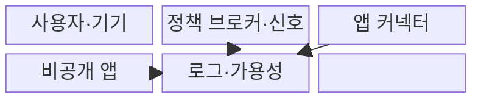
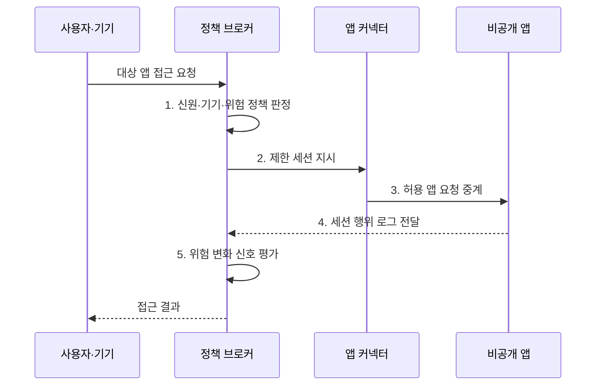

---
sidebar:
  order: 64
  label: "064. ZTNA 제로 트러스트 네트워크 접근 (ZTNA)"
  badge:
    text: "기출 · 70%"
    variant: note
title: "ZTNA 제로 트러스트 네트워크 접근 (ZTNA)"
date: "2026-08-02T12:06:00+09:00"
tags:
  - "notes-security"
weight: 64
extra:
  question_no: "064"
  source_status: "기출"
  source_history: "135회"
  priority: 70
  priority_note: "135회 기출이며 응용 단위 접근 설계로 재사용됨"
---

## Ⅰ. 개요

핵심 용어

- **ZTNA**: 검증된 주체와 기기에 승인된 애플리케이션 연결만 제공하는 제로 트러스트 기반 접근 제어 기술이다.
- **VPN·측면 이동**: VPN은 원격 장비를 내부망에 연결하므로 침해 장비가 다른 내부 자원을 탐색하고 공격을 확장할 위험이 있다.

- 정의/개념: **ZTNA**는 사용자·단말·접속 맥락을 검증한 뒤 내부망 전체가 아니라 승인된 애플리케이션에만 세션을 연결하는 원격 접근 제어 기술
- 배경/필요성: VPN의 넓은 내부망 노출로 **측면 이동 허용**

#### 한줄 요약

- 원격 사용자를 내부망 전체에 넣지 않고 검증된 사용자에게 승인된 앱 하나로 가는 임시 통로만 연다.

## Ⅱ. 특징

핵심 용어

- **앱 단위 접근**: 사용자 신원과 기기 상태를 검증해 내부망 전체가 아닌 승인된 애플리케이션 세션만 제공하는 방식이다.
- **기원 서버 비공개**: 내부 앱 커넥터의 발신 연결을 사용하여 실제 애플리케이션 서버를 외부에 노출하지 않는 구조이다.

- **앱 단위 접근**: 신원·기기 상태별 허용 앱 제한
- **기원 서버 비공개**: 내부 커넥터의 발신 연결 사용
- **최소 노출**: 승인된 앱과 세션만 동적 연결

#### 한줄 요약

- ZTNA는 앱 문 앞까지만 안전하게 데려가므로 앱 안에서 어떤 데이터와 기능을 쓸지는 다시 확인해야 한다.

## Ⅲ. 구조 및 구성요소

핵심 용어

- **정책 브로커**: 신원·기기·위험 정보를 평가하여 애플리케이션 연결의 허용·거부를 결정하는 구성요소이다.
- **앱 커넥터**: 내부에서 ZTNA 서비스로 연결해 승인된 비공개 앱 세션을 중계하는 구성요소이다.

| 구성요소 | 책임 |
|:---|:---|
| **사용자·기기** | 앱 요청과 **단말 상태 제공** |
| **정책 브로커·신호** | 접근 정책·신원·**위험 평가** |
| **앱 커넥터** | 승인 세션의 **내부 앱 중계** |
| **비공개 앱** | 외부에 숨긴 **보호 자원** |
| **로그·가용성** | 연결 추적과 **장애 대응** |

#### 한줄 요약

- 브로커가 사용자와 기기 신호를 확인해 승인하면 내부 커넥터가 외부에 드러나지 않은 앱으로만 연결한다.

## Ⅳ. 흐름도

핵심 용어

- **제한 세션·연결 로그**: 앱·행위·시간 범위를 제한한 연결을 만들고 사용자·기기·앱·허용 결과를 접속 증적으로 기록한다.
- **위험 신호 환류**: 세션 행위와 기기 상태의 변화를 정책 브로커에 되돌려 재인증·제한·종료를 판단하게 하는 과정이다.

**동작 원리**

- **1. 신원·기기·위험 정책 판정**: 허용 조건·재인증 결정
- **2. 제한 세션 지시**: 앱·행위·시간 조건을 커넥터에 제공
- **3. 허용 앱 요청 중계**: 지정 앱 전용 세션으로 전달
- **4. 세션 행위 로그 전달**: 승인 세션과 우회 접속 증적 제공
- **5. 위험 변화 신호 평가**: 조건 변경 시 제한·종료 여부 판정
#### 한줄 요약

- 사용자가 앱을 요청할 때마다 정책을 확인하고 승인된 경우에만 커넥터가 그 앱으로 가는 짧고 좁은 통로를 만든다.

## Ⅴ. 종류 및 비교

핵심 용어

- **ZTNA·VPN·앱 프록시**: ZTNA는 앱별 동적 연결, VPN은 내부망 터널, 앱 프록시는 주로 특정 웹 애플리케이션 요청의 중계를 제공한다.

| 원격 접근 방식 | ZTNA | 전통 VPN | 애플리케이션 프록시 |
|:---|:---|:---|:---|
| 적용 기준 | 앱별 **최소 접근** | 넓은 **내부망 원격 접속** | 웹 앱 중심의 **외부 공개** |
| 핵심 특징 | **앱·세션별 동적 연결** | **원격 장비 내부망 연결** | 특정 웹 앱 요청 중계 |
| 한계 | **신호·커넥터·중앙 장애** | **내부 탐색·측면 이동** | **비웹 한계·직접 우회** |

#### 한줄 요약

- VPN은 망에 들어가는 통로이고 앱 프록시는 주로 웹을 중계하며 ZTNA는 신원과 기기를 보고 앱별 통로를 동적으로 연다.

## Ⅵ. 실무 고려사항 및 대책

핵심 용어

- **NIST SP 800-207·CISA ZTMM 2.0**: 전자는 제로 트러스트 구성과 배치를 정의하고 후자는 중요 앱 중심의 단계적 전환 성숙도를 제시한다.
- **다중 커넥터·직접 경로 차단**: 앱 중계 구성요소를 이중화하고 ZTNA를 우회한 기원 서버 접속을 네트워크에서 차단하는 대책이다.

| 문제 | 대책 | 효과 |
|:---|:---|:---|
| **정책·집행 책임 혼선** | **NIST SP 800-207 적용** | 앱별 결정·세션의 **책임 정렬** |
| **단계적 VPN 전환 지연** | **CISA ZTMM 2.0 활용** | 중요 앱 중심의 **전환 측정** |
| **커넥터 장애·직접 우회** | **다중 커넥터·기원 접근 차단** | 가용성과 **최소 노출 확보** |

#### 한줄 요약

- ZTNA는 협력사 사용자의 신원과 기기 상태를 확인한 뒤 계약 업무 앱에만 연결하고 내부망 주소나 다른 서비스는 노출하지 않는다.

## Ⅶ. 결론

핵심 용어

- **최소 노출**: 사용자에게 내부망 주소나 다른 서비스를 보여 주지 않고 승인된 앱과 세션만 동적으로 연결하는 원칙이다.
- **ZTNA·VPN·앱 프록시 선택**: 앱별 최소 접근, 넓은 레거시 망 접속, 특정 웹 앱 공개 중 필요한 연결 범위에 맞춘 판단이다.

- 승인 앱 최소 접근은 **ZTNA**, 넓은 레거시 망은 **VPN**, 웹 공개는 **앱 프록시**

#### 한줄 요약

- ZTNA는 내부망 입장권 없이 필요한 앱만 연결하며 직접 경로와 앱 내부 권한도 따로 통제한다.
