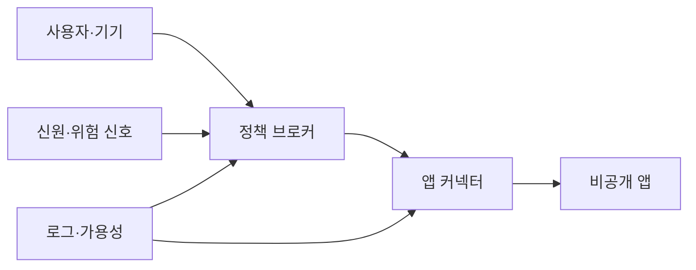
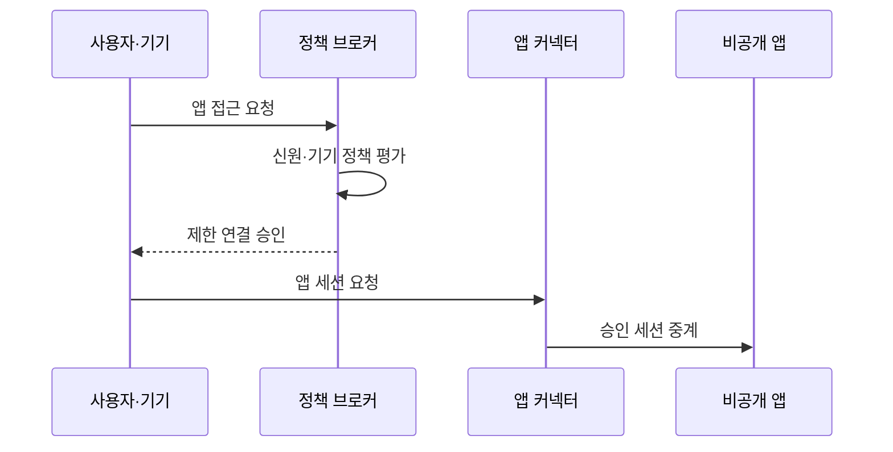

---
sidebar:
  order: 64
  label: "064. ZTNA 제로 트러스트 네트워크 접근 (ZTNA)"
  badge:
    text: "기출 · 70%"
    variant: note
title: "ZTNA 제로 트러스트 네트워크 접근 (ZTNA)"
date: "2026-07-25T22:04:00+09:00"
tags:
  - "notes-security"
weight: 64
extra:
  question_no: "064"
  source_status: "기출"
  source_history: "135회"
  priority: 70
  priority_note: "135회 기출이며 응용 단위 접근 설계로 재사용됨"
---

## 미리 알고가기

- **제로 트러스트 네트워크 접근(Zero Trust Network Access, ZTNA)**: 영문 머리글자를 딴 공식 표기라 “지티엔에이”로 읽으며, 검증된 주체와 기기에 승인된 애플리케이션 연결만 제공한다
- **제로 트러스트(Zero Trust)**: 네트워크 위치를 신뢰하지 않고 자원별 접근을 검증하는 보안 모델
- **가상 사설망(Virtual Private Network, VPN)**: 영문 머리글자를 딴 공식 표기라 “브이피엔”으로 읽으며, 원격 장비를 암호화 터널로 사설망에 연결하는 비교 기술
- **소프트웨어 정의 경계(Software-Defined Perimeter, SDP)**: 영문 머리글자를 딴 공식 표기라 “에스디피”로 읽으며, 인증·인가된 주체에게만 자원 경계를 동적으로 공개한다
- **정책 브로커(Policy Broker)**: 신원·기기·위험 정보를 평가해 앱 연결을 결정하는 구성요소
- **앱 커넥터(Application Connector)**: 내부에서 ZTNA 서비스로 연결해 비공개 앱 세션을 중계하는 구성요소
- **기원 서버(Origin Server)**: 실제 애플리케이션을 제공하는 내부 서버
- **기기 상태(Device Posture)**: 패치·암호화·보호 도구 등 단말의 보안 상태
- **애플리케이션 프록시(Application Proxy)**: 사용자의 요청을 대신 받아 특정 앱에 전달하는 중계 서버
- **에이전트(Agent)**: 단말에 설치되어 기기 상태와 트래픽을 ZTNA에 전달하는 프로그램
- **측면 이동(Lateral Movement)**: 침해한 장비에서 다른 내부 자원으로 공격을 확장하는 행위
- **직접 경로**: ZTNA 중계를 거치지 않고 기원 서버에 접속하는 우회 통로
- **레거시(Legacy)**: 현대 인증·중계 방식과 직접 호환되지 않는 기존 시스템

## Ⅰ. 개요

- **정의**: 승인 앱만 연결하는 제로 트러스트 수단
- **배경/필요성**: 내부 주소 노출과 측면 이동 축소
- **범위**: 사용자·서비스의 앱 단위 접근

### 쉽게 이해하기 (학습용)

- 원격 사용자를 내부망 전체에 넣지 않고 검증된 사용자에게 승인된 앱 하나로 가는 임시 통로만 연다.

## Ⅱ. 특징

- 앱 기원을 숨기고 내부 커넥터가 연결한다.
- 신원·기기·앱·위험 조건을 요청마다 평가한다.
- 승인 앱 외 주소·포트의 탐색을 제한한다.
- 앱 연결 뒤 내부 기능 인가를 별도로 수행한다.
- 직접 경로는 정책 우회와 측면 이동을 허용한다.

### 쉽게 이해하기 (학습용)

- ZTNA는 앱 문 앞까지만 안전하게 데려가므로 앱 안에서 어떤 데이터와 기능을 쓸지는 다시 확인해야 한다.

## Ⅲ. 아키텍처 및 구성요소

| 설계 요소 | 설명 |
|:---|:---|
| 사용자·기기 | 앱 요청과 단말 상태 제공 |
| 정책 브로커 | 접근 정책과 위험 평가 |
| 신원·위험 신호 | 인증·기기·행위 정보 제공 |
| 앱 커넥터 | 승인 세션을 내부 앱에 중계 |
| 비공개 앱 | 외부에 숨긴 보호 자원 |
| 로그·가용성 | 연결 추적과 장애 대응 |

### 쉽게 이해하기 (학습용)

- 브로커가 사용자와 기기 신호를 확인해 승인하면 내부 커넥터가 외부에 드러나지 않은 앱으로만 연결한다.

## Ⅳ. 원리 및 절차 흐름도

| 절차 | 설명 |
|:---|:---|
| 앱 접근 요청 | 사용자·기기·대상 앱 제시 |
| 신원·기기 정책 평가 | 위험과 허용 조건 확인 |
| 제한 연결 승인 | 앱·행위·세션 시간을 제한 |
| 앱 세션 요청 | 승인 정보로 커넥터 접속 |
| 승인 세션 중계 | 지정 앱에만 트래픽 전달 |

> 요약: 검증된 요청에 앱 전용 연결만 제공한다.

### 쉽게 이해하기 (학습용)

- 사용자가 앱을 요청할 때마다 정책을 확인하고 승인된 경우에만 커넥터가 그 앱으로 가는 짧고 좁은 통로를 만든다.

## Ⅴ. 종류 및 비교

| 비교축 | ZTNA | 전통 VPN | 애플리케이션 프록시 |
|:---|:---|:---|:---|
| 핵심 특징 | 앱·세션별 동적 연결 | 원격 장비를 내부망에 연결 | 특정 웹 앱 요청 중계 |
| 적용 기준 | 앱별 최소 접근 | 넓은 내부망 원격 접속 | 웹 앱 중심 외부 공개 |
| 주요 위험 | 신호·커넥터·중앙 장애 | 내부 탐색·측면 이동 | 비웹 한계·직접 우회 |

### 쉽게 이해하기 (학습용)

- VPN은 망에 들어가는 통로이고 앱 프록시는 주로 웹을 중계하며 ZTNA는 신원과 기기를 보고 앱별 통로를 동적으로 연다.

## Ⅵ. 실무 사례

- **사례 1**: 협력사에 특정 업무 앱만 공개
- **사례 2**: 기원 서버의 직접 주소 접근 차단
- **사례 3**: 앱 내부의 객체 권한을 별도 검증
- **사례 4**: VPN 예외에 소유자·만료일 지정

### 쉽게 이해하기 (학습용)

- 사례 1은 협력사 장비가 내부망 전체를 탐색하지 못하고 계약 업무 앱에만 접속하게 한다.
- 사례 2는 공격자가 커넥터와 정책 검사를 건너뛰어 실제 앱 서버로 바로 들어가지 못하게 한다.
- 사례 3은 앱 연결 허가를 받은 사용자가 다른 사용자의 데이터나 관리자 기능까지 쓰는 일을 방지한다.
- 사례 4는 전환 중 남겨 둔 기존 망 통로가 영구적인 우회 경로로 굳어지지 않게 한다.

## Ⅶ. 결론

- 원격 앱 접근이면 망 대신 앱 연결만 허용한다.

### 쉽게 이해하기 (학습용)

- ZTNA는 내부망 입장권 없이 필요한 앱만 연결하며 직접 경로와 앱 내부 권한도 따로 통제한다.
