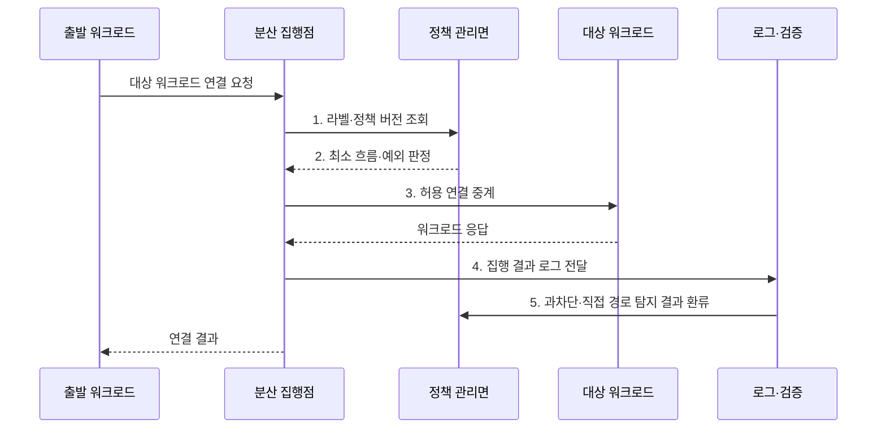

---
sidebar:
  order: 65
  label: "065. 마이크로 세그멘테이션 (Micro-Segmentation)"
  badge:
    text: "기출 · 70%"
    variant: note
title: "마이크로 세그멘테이션 (Micro-Segmentation)"
date: "2026-07-31T11:17:29+09:00"
tags:
  - "notes-security"
weight: 65
extra:
  question_no: "065"
  source_status: "기출"
  source_history: "135회"
  priority: 70
  priority_note: "135회 기출이며 제로트러스트 피해범위 축소 수단임"
---

## 미리 알고가기

- **마이크로 세그멘테이션(Micro-Segmentation)**: 워크로드 단위로 필요한 통신만 허용하는 내부 분리 기법이다.
- **워크로드(Workload)**: 서버·가상 머신·컨테이너처럼 응용 기능을 실행하는 단위이다.
- **동서 트래픽(East-West Traffic)**: 데이터센터나 클라우드 내부 시스템 사이의 통신이다.
- **측면 이동(Lateral Movement)**: 침해한 워크로드에서 다른 내부 자원으로 공격을 확장하는 행위이다.
- **기본 거부(Default Deny)**: 명시적으로 허용되지 않은 통신을 차단하는 원칙이다.
- **라벨(Label)**: 역할·환경·소유자 등 워크로드를 식별하는 속성값이다.
- **인터넷 프로토콜(Internet Protocol, IP)**: 주소를 사용하여 네트워크 통신의 출발지와 목적지를 식별하는 통신 규약이다.
- **가상 근거리 통신망(Virtual Local Area Network, VLAN)**: 하나의 물리망을 여러 논리적 네트워크 구역으로 분리하는 기술이다.
- **가상 머신(Virtual Machine, VM)**: 물리 컴퓨터의 자원을 소프트웨어로 분할하여 만든 독립 실행 환경이다.
- **확장 버클리 패킷 필터(Extended Berkeley Packet Filter, eBPF)**: 운영체제 커널에서 안전하게 관찰·필터 프로그램을 실행하는 기술이다.
- **서비스 메시(Service Mesh)**: 서비스 간 통신의 인증·정책·관찰을 중계 계층에서 제공하는 구조이다.
- **정책 집행점(Policy Enforcement Point)**: 허용·차단 정책을 실제 통신에 적용하는 지점이다.
- **관리면(Control Plane)**: 정책을 생성·배포하고 집행 상태를 관리하는 계층이다.
- **NIST SP 800-207**: 자원별 정책 집행과 최소 권한 통신을 포함한 제로 트러스트 구조를 정의한 지침이다.
- **NIST SP 800-125B**: 가상 네트워크의 트래픽 제어·분리·모니터링 보안 지침을 제시한 공식 문서이다.
- **자산·흐름 가시성**: 워크로드와 정상 통신 의존성을 식별하는 능력이다.
- **분산 집행점**: 각 호스트·가상망에서 연결별 정책을 적용하는 지점이다.
- **정책 버전**: 배포된 허용·차단 규칙의 변경 상태를 식별하는 값이다.
- **관찰 모드**: 통신을 차단하지 않고 정책 영향을 기록하는 검증 방식이다.
- **과차단**: 정상 업무 통신을 보안 정책이 잘못 막는 오류이다.
- **정책 누락**: 필요한 통신 통제가 작성·배포되지 않은 상태이다.

> **키워드:** 마이크로 세그멘테이션 (Micro-Segmentation)

## Ⅰ. 개요

- 정의/개념: 워크로드별 최소 통신만 허용하는 **내부 접근 통제 기법**
- 배경/필요성: 구역 내부 자유 통신으로 **측면 이동 확산**

### 쉽게 이해하기 (학습용)

- 건물 안을 한 공간으로 두지 않고 방마다 필요한 문만 열어 한 방의 침해가 다른 방으로 번지지 않게 한다.

## Ⅱ. 특징

- **신원 기반 정책**: 워크로드·서비스 역할로 통신 표현
- **기본 거부·최소 허용**: 동서 트래픽의 필요 흐름만 개방
- **분산 정책 집행**: 호스트·가상망에서 연결별 적용

### 쉽게 이해하기 (학습용)

- 서버 주소가 바뀌어도 역할 라벨로 같은 정책을 적용할 수 있지만 잘못된 라벨은 엉뚱한 통신을 열거나 정상 업무를 차단한다.

## Ⅲ. 구조 및 구성요소

| 구성요소 | 책임 |
|:---|:---|
| **자산·흐름 가시성** | 정상 통신과 **의존성 식별** |
| **신원·라벨** | 워크로드의 **역할·환경 구분** |
| **정책 관리면** | 허용 규칙과 **예외 배포** |
| **분산 집행점** | 연결별 **허용·차단 적용** |
| **워크로드·로그 검증** | 보호 대상과 **집행 결과 검증** |

### 쉽게 이해하기 (학습용)

- 정상 연결을 먼저 찾아 워크로드 신원에 정책을 붙이고 각 실행 지점이 통신을 차단하거나 허용한다.

## Ⅳ. 흐름도

**동작 원리**

- **1. 라벨·정책 버전 조회**: 최신 속성과 허용 규칙 확인
- **2. 최소 흐름·예외 판정**: 기본 거부와 예외 조건 평가
- **3. 허용 연결 중계**: 승인된 동서 통신만 대상에 전달
- **4. 집행 결과 로그 전달**: 허용·차단과 직접 경로 증적 제공
- **5. 과차단·직접 경로 탐지 결과 환류**: 정책 보정 근거 제공
### 쉽게 이해하기 (학습용)

- 워크로드가 연결을 시도하면 집행점이 정책을 확인해 승인된 대상과 포트로만 보내고 결과를 남긴다.

## Ⅴ. 종류 및 비교

| 내부 통신 분리 | 마이크로 세그멘테이션 | 네트워크 구역 분리 | 호스트·워크로드 분리 | 서비스 신원 분리 |
|:---|:---|:---|:---|:---|
| 적용 기준 | 측면 이동의 **범위 축소** | 단순 **구역 경계** | 워크로드별 **세밀 통제** | 동적 **서비스 간 통신** |
| 핵심 특징 | **최소 내부 흐름 통제** | **서브넷·VLAN 경계** | **워크로드별 정책** | **서비스 호출 신원 정책** |
| 한계 | **가시성·정책 누락** | **구역 내부 이동** | **에이전트 적용 공백** | **인증서·메시 복잡성** |

### 쉽게 이해하기 (학습용)

- 구역 분리는 큰 방을 나누고 워크로드 분리는 개별 서버를, 서비스 신원 분리는 실제 호출 관계를 기준으로 통제한다.

## Ⅵ. 실무 고려사항 및 대책

| 고려사항 | 대책 | 효과 |
|:---|:---|:---|
| **자원별 최소 통신 편차** | **NIST SP 800-207 적용** | 제로 트러스트의 **집행 정렬** |
| **가상망 트래픽 분리 미흡** | **NIST SP 800-125B 적용** | VM 간 **제어·감시 강화** |
| **라벨 오류·과차단** | **관찰 모드·단계적 기본 거부** | 업무 장애와 **정책 누락 완화** |

### 쉽게 이해하기 (학습용)

- 웹 계층의 워크로드 신원에서 지정된 DB 서비스 포트로 가는 통신만 허용해 웹 서버가 침해돼도 다른 서버로 측면 이동하지 못하게 한다.

## Ⅶ. 결론

- 단순 구역은 **VLAN**, 워크로드별 통제는 호스트 정책, 동적 서비스는 **서비스 메시**

### 쉽게 이해하기 (학습용)

- 마이크로 세그멘테이션의 성과는 구역 수가 아니라 침해한 워크로드가 도달할 수 있는 내부 경로를 얼마나 줄였는지로 판단한다.
