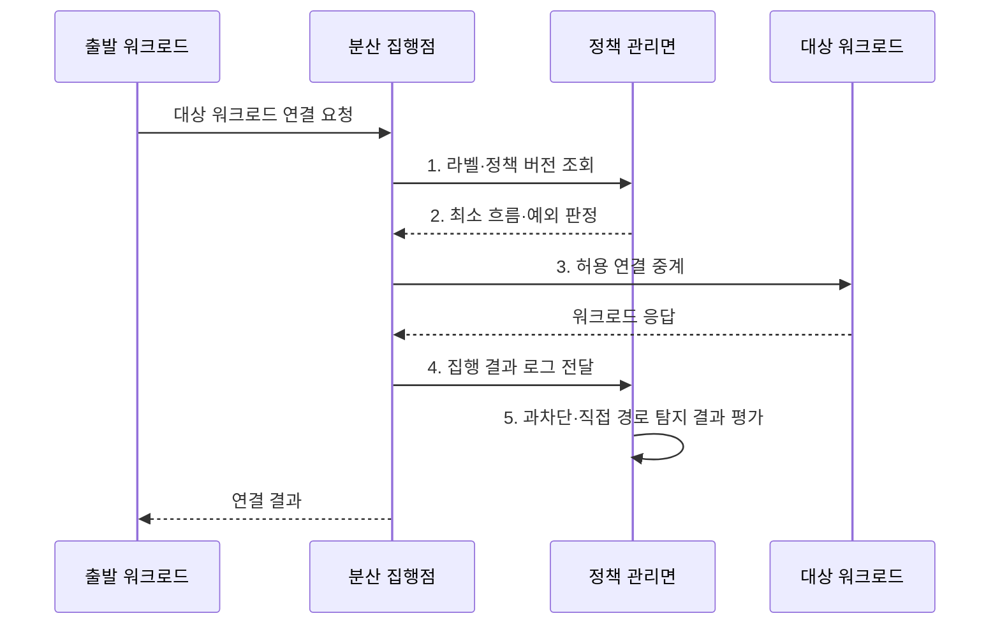

---
sidebar:
  order: 65
  label: "065. 마이크로 세그멘테이션 (Micro-Segmentation)"
  badge:
    text: "기출 · 70%"
    variant: note
title: "마이크로 세그멘테이션 (Micro-Segmentation)"
date: "2026-08-02T12:08:00+09:00"
tags:
  - "notes-security"
weight: 65
extra:
  question_no: "065"
  source_status: "기출"
  source_history: "135회"
  priority: 70
  priority_note: "135회 기출이며 제로트러스트 피해범위 축소 수단임"
---

## Ⅰ. 개요

핵심 용어

- **마이크로 세그멘테이션**: 서버·가상 머신·컨테이너 같은 워크로드 단위로 필요한 내부 통신만 허용하는 분리 기법이다.
- **측면 이동**: 침해한 워크로드에서 다른 내부 자원으로 공격 범위를 확장하는 행위이다.

- 정의/개념: **마이크로 세그멘테이션**은 워크로드의 신원과 역할에 따라 세밀한 통신 구역을 만들고 필요한 동서 트래픽만 허용하는 내부 접근 통제 기법
- 배경/필요성: 구역 내부 자유 통신으로 **측면 이동 확산**

#### 한줄 요약

- 건물 안을 한 공간으로 두지 않고 방마다 필요한 문만 열어 한 방의 침해가 다른 방으로 번지지 않게 한다.

## Ⅱ. 특징

핵심 용어

- **동서 트래픽·기본 거부**: 데이터센터 내부 시스템 간 통신에서 명시적으로 필요한 연결만 허용하고 나머지는 차단하는 원칙이다.
- **라벨·분산 집행**: 역할·환경·소유자 속성으로 워크로드를 식별하고 각 호스트나 가상망에서 연결별 정책을 적용한다.

- **신원 기반 정책**: 워크로드·서비스 역할로 통신 표현
- **기본 거부·최소 허용**: 동서 트래픽의 필요 흐름만 개방
- **분산 정책 집행**: 호스트·가상망에서 연결별 적용

#### 한줄 요약

- 서버 주소가 바뀌어도 역할 라벨로 같은 정책을 적용할 수 있지만 잘못된 라벨은 엉뚱한 통신을 열거나 정상 업무를 차단한다.

## Ⅲ. 구조 및 구성요소

핵심 용어

- **자산·흐름 가시성**: 워크로드 자산과 정상 통신 의존성을 식별하여 최소 허용 정책의 근거를 만드는 능력이다.
- **정책 관리면·집행점**: 관리면은 정책을 생성·배포하고 분산 집행점은 허용·차단 결정을 실제 통신에 적용한다.

| 구성요소 | 책임 |
|:---|:---|
| **자산·흐름 가시성** | 정상 통신과 **의존성 식별** |
| **신원·라벨** | 워크로드의 **역할·환경 구분** |
| **정책 관리면** | 허용 규칙과 **예외 배포** |
| **분산 집행점** | 연결별 **허용·차단 적용** |
| **워크로드·로그 검증** | 보호 대상과 **집행 결과 검증** |

#### 한줄 요약

- 정상 연결을 먼저 찾아 워크로드 신원에 정책을 붙이고 각 실행 지점이 통신을 차단하거나 허용한다.

## Ⅳ. 흐름도

핵심 용어

- **정책 버전**: 집행점에 배포된 허용·차단 규칙의 변경 상태를 식별하여 최신 정책 적용 여부를 확인하는 값이다.
- **과차단·직접 경로**: 정상 업무 통신을 잘못 막는 오류와 정책 집행점을 우회해 대상에 연결하는 통로를 뜻한다.

**동작 원리**

- **1. 라벨·정책 버전 조회**: 최신 속성과 허용 규칙 확인
- **2. 최소 흐름·예외 판정**: 기본 거부와 예외 조건 평가
- **3. 허용 연결 중계**: 승인된 동서 통신만 대상에 전달
- **4. 집행 결과 로그 전달**: 허용·차단과 직접 경로 증적 제공
- **5. 과차단·직접 경로 탐지 결과 평가**: 정책 보정 필요 여부 판정
#### 한줄 요약

- 워크로드가 연결을 시도하면 집행점이 정책을 확인해 승인된 대상과 포트로만 보내고 결과를 남긴다.

## Ⅴ. 종류 및 비교

핵심 용어

- **VLAN·호스트 정책·서비스 메시**: VLAN은 큰 네트워크 구역, 호스트 정책은 개별 워크로드, 서비스 메시는 서비스 신원과 호출 관계를 기준으로 통신을 분리한다.

| 내부 통신 분리 | 마이크로 세그멘테이션 | 네트워크 구역 분리 | 호스트·워크로드 분리 | 서비스 신원 분리 |
|:---|:---|:---|:---|:---|
| 적용 기준 | 측면 이동의 **범위 축소** | 단순 **구역 경계** | 워크로드별 **세밀 통제** | 동적 **서비스 간 통신** |
| 핵심 특징 | **최소 내부 흐름 통제** | **서브넷·VLAN 경계** | **워크로드별 정책** | **서비스 호출 신원 정책** |
| 한계 | **가시성·정책 누락** | **구역 내부 이동** | **에이전트 적용 공백** | **인증서·메시 복잡성** |

#### 한줄 요약

- 구역 분리는 큰 방을 나누고 워크로드 분리는 개별 서버를, 서비스 신원 분리는 실제 호출 관계를 기준으로 통제한다.

## Ⅵ. 실무 고려사항 및 대책

핵심 용어

- **NIST SP 800-207·SP 800-125B**: 전자는 자원별 제로 트러스트 집행을, 후자는 가상 네트워크의 트래픽 제어·분리·모니터링을 안내한다.
- **VM(Virtual Machine)**: 물리 서버 자원을 논리적으로 나눠 실행하는 가상 머신으로, 호스트·가상망 정책의 분리 대상이다.
- **관찰 모드**: 통신을 즉시 차단하지 않고 정책 적용 결과를 기록하여 과차단과 누락을 먼저 찾아내는 검증 방식이다.

| 문제 | 대책 | 효과 |
|:---|:---|:---|
| **자원별 최소 통신 편차** | **NIST SP 800-207 적용** | 제로 트러스트의 **집행 정렬** |
| **가상망 트래픽 분리 미흡** | **NIST SP 800-125B 적용** | VM 간 **제어·감시 강화** |
| **라벨 오류·과차단** | **관찰 모드·단계적 기본 거부** | 업무 장애와 **정책 누락 완화** |

#### 한줄 요약

- 웹 계층의 워크로드 신원에서 지정된 DB 서비스 포트로 가는 통신만 허용해 웹 서버가 침해돼도 다른 서버로 측면 이동하지 못하게 한다.

## Ⅶ. 결론

핵심 용어

- **침해 도달 범위**: 한 워크로드가 침해되었을 때 공격자가 허용된 내부 경로를 따라 접근할 수 있는 자원의 범위이다.
- **VLAN·호스트 정책·서비스 메시 선택**: 단순 구역, 워크로드별 통제, 동적 서비스 호출 관계 중 필요한 분리 수준에 맞춘 판단이다.

- 단순 구역은 **VLAN**, 워크로드별 통제는 **호스트 정책**, 동적 서비스는 **서비스 메시**

#### 한줄 요약

- 마이크로 세그멘테이션의 성과는 구역 수가 아니라 침해한 워크로드가 도달할 수 있는 내부 경로를 얼마나 줄였는지로 판단한다.
