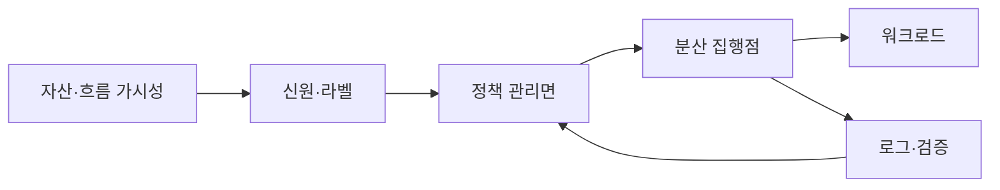
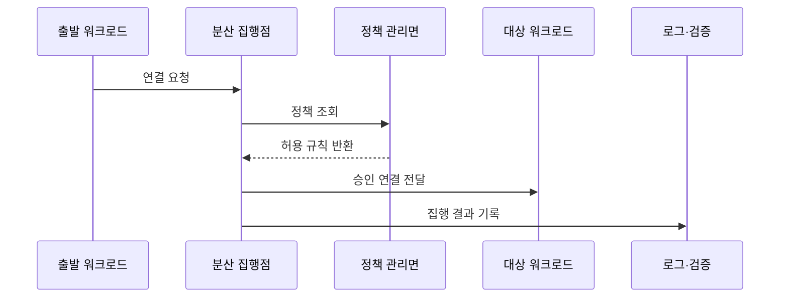

---
sidebar:
  order: 65
  label: "065. 마이크로 세그멘테이션 (Micro-Segmentation)"
  badge:
    text: "기출 · 70%"
    variant: note
title: "마이크로 세그멘테이션 (Micro-Segmentation)"
date: "2026-07-27T23:59:59+09:00"
tags:
  - "notes-security"
weight: 65
extra:
  question_no: "065"
  source_status: "기출"
  source_history: "135회"
  priority: 70
  priority_note: "135회 기출이며 제로트러스트 피해범위 축소 수단임"
---

## 미리 알고가기

- **마이크로 세그멘테이션(Micro-Segmentation)**: 워크로드 단위로 필요한 통신만 허용하는 내부 분리 기법
- **워크로드(Workload)**: 서버·가상 머신·컨테이너처럼 응용 기능을 실행하는 단위
- **동서 트래픽(East-West Traffic)**: 데이터센터나 클라우드 내부 시스템 사이의 통신
- **측면 이동(Lateral Movement)**: 침해한 워크로드에서 다른 내부 자원으로 공격을 확장하는 행위
- **기본 거부(Default Deny)**: 명시적으로 허용되지 않은 통신을 차단하는 원칙
- **라벨(Label)**: 역할·환경·소유자 등 워크로드를 식별하는 속성값
- **인터넷 프로토콜(Internet Protocol, IP)**: 영문 머리글자를 딴 공식 표기라 “아이피”로 읽으며, 주소를 사용해 네트워크 통신 대상을 식별한다
- **가상 근거리 통신망(Virtual Local Area Network, VLAN)**: 영문 머리글자를 딴 공식 표기라 “브이랜”으로 읽으며, 물리망 위에 논리적인 네트워크 구역을 나눈다
- **가상 머신(Virtual Machine, VM)**: 영문 머리글자를 딴 공식 표기라 “브이엠”으로 읽으며, 물리 컴퓨터를 소프트웨어로 모사한 독립 실행 환경
- **확장 버클리 패킷 필터(Extended Berkeley Packet Filter, eBPF)**: 소문자 `e`가 확장을 뜻하는 공식 표기라 “이비피에프”로 읽으며, 운영체제 커널에서 관찰·필터 프로그램을 실행한다
- **서비스 메시(Service Mesh)**: 서비스 간 통신의 인증·정책·관찰을 중계 계층에서 제공하는 구조
- **정책 집행점(Policy Enforcement Point)**: 허용·차단 정책을 실제 통신에 적용하는 지점
- **관리면(Control Plane)**: 정책을 생성·배포하고 집행 상태를 관리하는 계층
- **용어 읽기와 표기**: 마이크로 세그멘테이션은 Micro와 Segmentation을 결합한 표기이며, 워크로드 단위로 통신 경계를 세분화하는 역할

## Ⅰ. 개요

- 정의: 워크로드별 **최소 통신 흐름 분리**
- 기존 한계: 구역 내부의 **자유 통신·측면 이동**

### 쉽게 이해하기 (학습용)

- 건물 안을 한 공간으로 두지 않고 방마다 필요한 문만 열어 한 방의 침해가 다른 방으로 번지지 않게 한다.

## Ⅱ. 특징

- 워크로드·서비스 신원 기반 **정책 표현**
- 동서 트래픽의 **기본 거부·최소 허용**
- 호스트·가상망의 **분산 정책 집행**

### 쉽게 이해하기 (학습용)

- 서버 주소가 바뀌어도 역할 라벨로 같은 정책을 적용할 수 있지만 잘못된 라벨은 엉뚱한 통신을 열거나 정상 업무를 차단한다.

## Ⅲ. 아키텍처 및 구성요소

| 설계 요소 | 설명 |
|:---|:---|
| 자산·흐름 가시성 | 정상 통신과 의존성 식별 |
| 신원·라벨 | 워크로드 역할·환경 구분 |
| 정책 관리면 | 허용 규칙과 예외 배포 |
| 분산 집행점 | 연결별 허용·차단 적용 |
| 워크로드 | 정책 보호 대상 |
| 로그·검증 | 위반·과차단·우회 탐지 |

### 쉽게 이해하기 (학습용)

- 정상 연결을 먼저 찾아 워크로드 신원에 정책을 붙이고 각 실행 지점이 통신을 차단하거나 허용한다.

## Ⅳ. 원리 및 절차 흐름도

| 절차 | 설명 |
|:---|:---|
| 연결 요청 | 출발·대상·포트·신원 제시 |
| 정책 조회 | 라벨과 현재 정책 확인 |
| 허용 규칙 반환 | 최소 흐름과 예외 판정 |
| 승인 연결 전달 | 허용 통신만 대상에 연결 |
| 집행 결과 기록 | 차단·과차단·우회 분석 |

> 요약: 워크로드 신원별 최소 통신만 전달한다.

### 쉽게 이해하기 (학습용)

- 워크로드가 연결을 시도하면 집행점이 정책을 확인해 승인된 대상과 포트로만 보내고 결과를 남긴다.

## Ⅴ. 종류 및 비교

| 내부 통신 분리 | 마이크로 세그멘테이션 | 네트워크 구역 분리 | 호스트·워크로드 분리 | 서비스 신원 분리 |
|:---|:---|:---|:---|:---|
| 적용 기준 | 측면 이동 범위 축소 | 단순 구역 경계 | 워크로드별 세밀 통제 | 동적 서비스 간 통신 |
| 핵심 특징 | 최소 내부 흐름 통제 | 서브넷·VLAN 경계 | 서버·VM·컨테이너 정책 | 서비스 호출 신원 정책 |
| 한계 | 가시성·정책 누락 | 구역 내부 이동 | 에이전트 적용 공백 | 인증서·메시 복잡성 |

### 쉽게 이해하기 (학습용)

- 구역 분리는 큰 방을 나누고 워크로드 분리는 개별 서버를, 서비스 신원 분리는 실제 호출 관계를 기준으로 통제한다.

## Ⅵ. 실무 사례

1. 웹 서버에서 DB로 **필수 서비스 포트만 허용**

### 쉽게 이해하기 (학습용)

- 웹 계층의 워크로드 신원에서 지정된 DB 서비스 포트로 가는 통신만 허용해 웹 서버가 침해돼도 다른 서버로 측면 이동하지 못하게 한다.

## Ⅶ. 결론

- 내부 침해의 측면 이동을 제한하기 위해 워크로드 신원·정상 통신 흐름·운영 예외·정책 관리 권한을 검토하여, 필요한 경로만 허용하는 마이크로 세그멘테이션을 적용해야 한다.

### 쉽게 이해하기 (학습용)

- 마이크로 세그멘테이션의 성과는 구역 수가 아니라 침해한 워크로드가 도달할 수 있는 내부 경로를 얼마나 줄였는지로 판단한다.
