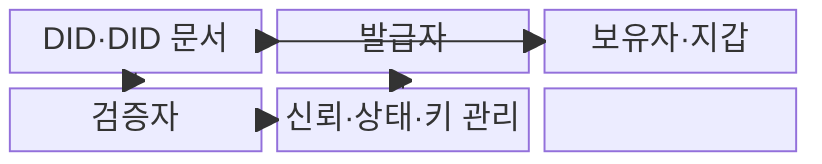
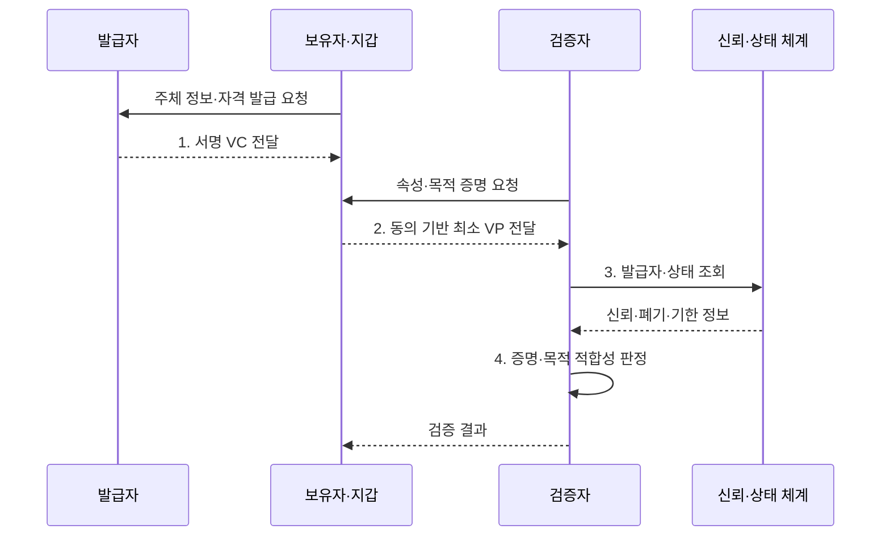

---
sidebar:
  order: 66
  label: "066. 디지털 신원 — DID·SSI (Decentralized Identity DID SSI)"
  badge:
    text: "기출 · 70%"
    variant: note
title: "디지털 신원 — DID·SSI (Decentralized Identity DID SSI)"
date: "2026-08-02T12:10:00+09:00"
tags:
  - "notes-security"
weight: 66
extra:
  question_no: "066"
  source_status: "기출"
  source_history: "123회, 128회, 132회"
  priority: 70
  priority_note: "123·128·132회 반복된 분산 신원 우산 주제임"
---

## Ⅰ. 개요

핵심 용어

- **DID·SSI**: DID는 중앙 등록기관 없이 검증 키와 제어 관계를 확인하는 식별자이고 SSI는 개인이 자격을 보유해 필요한 정보만 제시하는 신원 관리 원칙이다.
- **VC**: 발급자가 주체에 관한 주장을 디지털 서명한 기계 판독형 자격 증명이다.

- 정의/개념: **DID·SSI**는 사용자가 분산 식별자와 검증 가능 자격증명을 지갑에 보유하고 필요한 속성만 직접 제시·검증하게 하는 분산 디지털 신원 체계
- 배경/필요성: 중앙 신원 저장으로 **기관 종속·정보 과다 제공**

#### 한줄 요약

- 기관이 서명한 디지털 자격을 사용자가 지갑에 보관하고 서비스에는 필요한 사실만 골라 보여 주는 신원 방식이다.

## Ⅱ. 특징

핵심 용어

- **DID 문서**: DID의 검증 키·서비스 주소·키 용도와 제어 관계를 나타내는 문서이다.
- **VP·선택적 공개**: 보유자가 하나 이상의 VC에서 요청 목적에 필요한 내용만 구성하여 검증자에게 제시하는 기능이다.

- **검증 키·제어 관계 해석**: DID 문서로 식별자 통제 확인
- **자격 발급·제시·검증**: VC·VP의 서명 신뢰 판단
- **선택적 공개**: 보유자 동의로 필요한 속성만 증명

#### 한줄 요약

- 서명이 맞다는 사실은 문서가 안 바뀌었다는 뜻이지 발급 기관과 적힌 내용까지 무조건 믿어도 된다는 뜻은 아니다.

## Ⅲ. 구조 및 구성요소

핵심 용어

- **발급자·보유자·검증자**: 발급자는 VC를 서명하고 보유자는 지갑에서 VP를 만들며 검증자는 증명·신뢰·상태·목적 적합성을 판정한다.
- **신뢰 등록부·상태 정보**: 인정할 발급자와 자격 유형을 정하고 VC의 정지·폐기·유효 여부를 확인하는 신뢰 기반이다.

| 구성요소 | 책임 |
|:---|:---|
| **DID·DID 문서** | 식별자와 **검증 관계 제공** |
| **발급자** | 주체 확인과 **VC 발급** |
| **보유자·지갑** | 키 보관과 **최소 VP 생성** |
| **검증자** | 증명·신뢰·**목적 적합성 판정** |
| **신뢰·상태·키 관리** | 발급자·폐기·**회전·복구 관리** |

#### 한줄 요약

- DID가 서명 키를 연결하고 발급자가 자격을 만들며 보유자가 필요한 정보만 검증자에게 제시한다.

## Ⅳ. 흐름도

핵심 용어

- **암호학적 증명**: VC·VP의 발급자와 데이터 무결성을 검증할 수 있게 하는 서명 자료이다.
- **목적 적합성 판정**: 서명이 유효한 자격이라도 현재 서비스의 요청 목적과 업무 조건에 맞는지 별도로 확인하는 절차이다.

**동작 원리**

- **1. 서명 VC 전달**: 확인된 주장·유효기간을 서명해 제공
- **2. 동의 기반 최소 VP 전달**: 선택 공개로 노출 최소화
- **3. 발급자·상태 조회**: 신뢰·폐기·기한 판단 자료 요청
- **4. 증명·목적 적합성 판정**: 서명과 요청 목적을 함께 검증
#### 한줄 요약

- 사용자는 자격을 받아 보관하고 요청받은 최소 사실만 제시하며 서비스는 서명과 발급자 신뢰를 각각 확인한다.

## Ⅴ. 종류 및 비교

핵심 용어

- **중앙·연합·DID 신원**: 중앙형은 서비스가 계정을 보관하고 연합형은 신원 제공자가 인증을 공유하며 DID형은 보유자가 서명 자격을 제시한다.

| 디지털 신원 모델 | DID·SSI | 중앙 계정 | 연합 신원 |
|:---|:---|:---|:---|
| 적용 기준 | 조직 간 **최소 정보 증명** | 단일 서비스의 **계정 관리** | 다수 서비스의 **통합 로그인** |
| 핵심 특징 | **보유자 중심 자격 제시** | **서비스 직접 계정 보관** | 신원 제공자의 **인증 공유** |
| 한계 | **키 복구·상태·추적** | **중앙 저장소 유출** | **제공자 집중·연계 추적** |

#### 한줄 요약

- 중앙 계정은 서비스가 신원을 보관하고 연합 신원은 제공자가 로그인을 대신하며 DID·SSI는 사용자가 서명 자격을 들고 다닌다.

## Ⅵ. 실무 고려사항 및 대책

핵심 용어

- **W3C DID Core 1.0·VC Data Model 2.0**: 전자는 DID 문서와 해석·제어 모델을, 후자는 VC·VP의 발급·제시·검증 데이터 모델을 정의한다.
- **쌍별 DID·키 복구**: 서비스마다 다른 식별자를 사용해 활동 연결을 줄이고 키 분실 때 안전하게 통제권을 되찾는 설계이다.

| 문제 | 대책 | 효과 |
|:---|:---|:---|
| **DID 해석·제어 편차** | **W3C DID Core 1.0 준수** | 식별자·키 관계의 **상호운용** |
| **자격·프레젠테이션 불일치** | **W3C VC Data Model 2.0 적용** | 발급·제시·검증의 **구조 통일** |
| **상관 추적·키 분실** | **쌍별 DID·선택 공개·복구 설계** | 개인정보 노출과 **접근 상실 완화** |

#### 한줄 요약

- 사용자는 공공기관이 발급한 자격을 자신의 지갑에 보관하고 생년월일 전체 대신 성인 조건을 충족했다는 증명만 판매자에게 제시한다.

## Ⅶ. 결론

핵심 용어

- **분산 신원 신뢰 사슬**: 발급자 신뢰·서명 키·자격 상태·보유자 제시·검증 목적을 함께 확인해야 성립하는 신뢰 관계이다.

- 조직 간 최소 증명은 **DID·SSI**, 단일 서비스는 중앙 계정, 통합 로그인은 **연합 신원**

#### 한줄 요약

- DID·SSI는 사용자가 자격을 직접 통제하게 하지만 안전성은 발급자 신뢰·키 복구·폐기 상태·추적 방지를 함께 설계할 때 완성된다.
