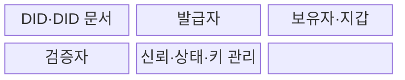
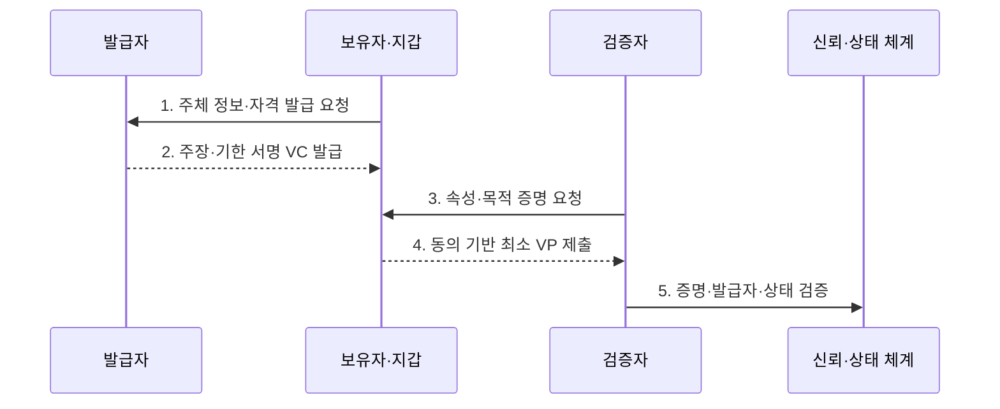

---
sidebar:
  order: 66
  label: "066. 디지털 신원 — DID·SSI (Decentralized Identity DID SSI)"
  badge:
    text: "기출 · 70%"
    variant: note
title: "디지털 신원 — DID·SSI (Decentralized Identity DID SSI)"
date: "2026-07-30T19:15:00+09:00"
tags:
  - "notes-security"
weight: 66
extra:
  question_no: "066"
  source_status: "기출"
  source_history: "123회, 128회, 132회"
  priority: 70
  priority_note: "123·128·132회 반복된 분산 신원 우산 주제임"
---

## 미리 알고가기

- **분산 식별자(Decentralized Identifier, DID)**: 중앙 등록기관 없이 검증 키와 제어 관계를 확인할 수 있는 식별자이다.
- **자기주권 신원(Self-Sovereign Identity, SSI)**: 개인이 자신의 신원 자격을 보유하고 필요한 정보만 선택하여 제시하는 신원 관리 원칙이다.
- **검증 가능 자격 증명(Verifiable Credential, VC)**: 발급자가 주체에 관한 주장을 디지털 서명한 기계 판독형 자격 증명이다.
- **검증 가능 프레젠테이션(Verifiable Presentation, VP)**: 보유자가 하나 이상의 자격 증명에서 필요한 내용을 구성하여 검증자에게 제시하는 증명 문서이다.
- **DID 문서(DID Document)**: DID의 검증 키·서비스 주소·키 용도를 나타내는 문서이다.
- **DID 방법(DID Method)**: 특정 저장·해석 체계에서 DID를 생성·갱신·폐기하는 규칙이다.
- **발급자(Issuer)**: 주체를 확인하고 VC를 발급·서명하는 기관이다.
- **보유자(Holder)**: VC를 지갑에 보관하고 VP를 만들어 제시하는 주체이다.
- **검증자(Verifier)**: VP의 증명과 자격의 신뢰·상태·목적 적합성을 판정하는 주체이다.
- **디지털 지갑(Digital Wallet)**: 보유자의 키와 자격 증명을 저장·제시하는 소프트웨어이다.
- **선택적 공개(Selective Disclosure)**: 자격 전체가 아니라 필요한 속성만 증명하는 기능이다.
- **상태 정보(Status Information)**: VC의 정지·폐기·유효 여부를 확인하는 정보이다.
- **상관관계 공격(Correlation Attack)**: 여러 서비스의 식별자나 조회 기록을 연결해 같은 사용자를 추적하는 공격이다.
- **신뢰 등록부(Trust Registry)**: 어떤 발급자를 어떤 자격에 신뢰할지 정리한 목록이다.
- **W3C DID Core 1.0**: 분산 식별자 구문·DID 문서·해석·제어 모델을 정의한 W3C 권고 표준이다.
- **W3C VC Data Model 2.0**: VC·VP의 발급·보유·제시·검증 데이터 모델을 정의한 W3C 권고 표준이다.

## Ⅰ. 개요

- 정의/개념: DID·VC 기반 **보유자 중심 신원 체계**
- 배경/필요성: 중앙 신원 저장의 **종속·정보 과다 제공**

### 쉽게 이해하기 (학습용)

- 기관이 서명한 디지털 자격을 사용자가 지갑에 보관하고 서비스에는 필요한 사실만 골라 보여 주는 신원 방식이다.

## Ⅱ. 특징

- DID 기반 **검증 키·제어 관계 해석**
- VC·VP 기반 **자격 발급·제시·검증**
- 보유자 동의 기반 **선택적 공개**

### 쉽게 이해하기 (학습용)

- 서명이 맞다는 사실은 문서가 안 바뀌었다는 뜻이지 발급 기관과 적힌 내용까지 무조건 믿어도 된다는 뜻은 아니다.

## Ⅲ. 구조 및 구성요소

| 구성요소 | 책임 |
|:---|:---|
| DID·DID 문서 | 식별자와 검증 관계 제공 |
| 발급자 | 주체 확인과 VC 발급 |
| 보유자·지갑 | 키 보관과 최소 VP 생성 |
| 검증자 | 증명·신뢰·목적 적합성 판정 |
| 신뢰·상태·키 관리 | 발급자·폐기·회전·복구 관리 |

### 쉽게 이해하기 (학습용)

- DID가 서명 키를 연결하고 발급자가 자격을 만들며 보유자가 필요한 정보만 검증자에게 제시한다.

## Ⅳ. 흐름도

**동작 원리**

- **1. 주체 정보·자격 발급 요청**: 신원·발급 조건을 제시
- **2. 주장·기한 서명 VC 발급**: 확인된 내용·유효기간 서명
- **3. 속성·목적 증명 요청**: 필요한 정보·사용 목적 명시
- **4. 동의 기반 최소 VP 제출**: 선택 공개로 노출을 최소화
- **5. 증명·발급자·상태 검증**: 서명·신뢰·폐기·기한 판정
### 쉽게 이해하기 (학습용)

- 사용자는 자격을 받아 보관하고 요청받은 최소 사실만 제시하며 서비스는 서명과 발급자 신뢰를 각각 확인한다.

## Ⅴ. 종류 및 비교

| 디지털 신원 모델 | DID·SSI | 중앙 계정 | 연합 신원 |
|:---|:---|:---|:---|
| 적용 기준 | 조직 간 최소 정보 증명 | 단일 서비스의 계정 관리 | 다수 서비스 통합 로그인 |
| 핵심 특징 | **보유자 중심 자격 제시** | **서비스 직접 계정 보관** | 신원 제공자의 인증 공유 |
| 한계 | 키 복구·상태·추적 | 중앙 저장소 유출 | 제공자 집중·연계 추적 |

### 쉽게 이해하기 (학습용)

- 중앙 계정은 서비스가 신원을 보관하고 연합 신원은 제공자가 로그인을 대신하며 DID·SSI는 사용자가 서명 자격을 들고 다닌다.

## Ⅵ. 실무 고려사항 및 대책

| 고려사항 | 대책 | 효과 |
|:---|:---|:---|
| DID 해석·제어 | **W3C DID Core 1.0 준수** | 식별자·키 관계 상호운용 |
| 자격·프레젠테이션 | **W3C VC Data Model 2.0 적용** | 발급·제시·검증 구조 통일 |
| 상관 추적·키 분실 | **쌍별 DID·선택 공개·복구 설계** | 개인정보 노출·접근 상실 완화 |

### 쉽게 이해하기 (학습용)

- 사용자는 공공기관이 발급한 자격을 자신의 지갑에 보관하고 생년월일 전체 대신 성인 조건을 충족했다는 증명만 판매자에게 제시한다.

## Ⅶ. 결론

- **발급자신뢰·선택공개·키복구**로 DID·SSI 적용을 결정한다.

### 쉽게 이해하기 (학습용)

- DID·SSI는 사용자가 자격을 직접 통제하게 하지만 안전성은 발급자 신뢰·키 복구·폐기 상태·추적 방지를 함께 설계할 때 완성된다.
