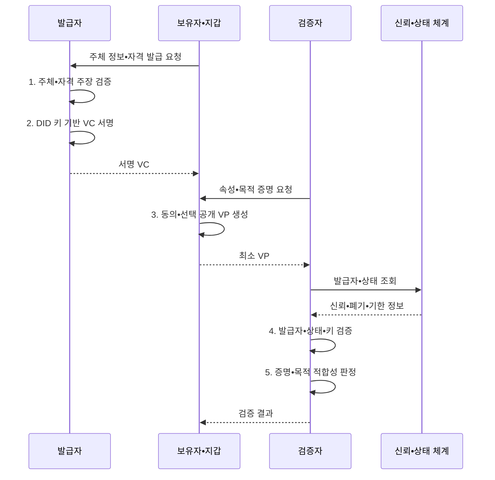

---
sidebar:
  order: 66
  label: "066. 디지털 신원 — DID•SSI (Decentralized Identity DID SSI)"
  badge:
    text: "기출 • 70%"
    variant: note
title: "디지털 신원 — DID•SSI (Decentralized Identity DID SSI)"
date: "2026-08-05T01:43:14+09:00"
tags:
  - "notes-security"
weight: 66
extra:
  question_no: "066"
  source_status: "기출"
  source_history: "123회, 128회, 132회"
  priority: 70
  priority_note: "123•128•132회 반복된 분산 신원 우산 주제임"
---

## Ⅰ. 개요

<details><summary>핵심 용어</summary>

- **DID(Decentralized Identifier)** 는 중앙 등록기관 없이 검증 키와 제어 관계를 확인하는 식별자다.
- **SSI(Self-Sovereign Identity)** 는 개인이 자격을 보유하고 필요한 정보만 제시하는 신원 관리 원칙이다.
- **VC(Verifiable Credential)** 는 발급자가 주체에 관한 주장을 디지털 서명한 기계 판독형 자격 증명이다.

</details>

- 정의/개념: **DID•SSI** 는 사용자가 분산 식별자와 검증 가능 자격증명을 지갑에 보유하고 필요한 속성만 직접 제시•검증하게 하는 분산 디지털 신원 체계
- 배경/필요성: 중앙 신원 저장으로 **기관 종속•정보 과다 제공**

#### 한줄 요약

- 기관이 서명한 디지털 자격을 사용자가 지갑에 보관하고 서비스에는 필요한 사실만 골라 보여 주는 신원 방식이다.

## Ⅱ. 특징

<details><summary>핵심 용어</summary>

- **DID 문서**: DID의 검증 키•서비스 주소•키 용도와 제어 관계를 나타내는 문서이다.
- **VP(Verifiable Presentation)** 는 보유자가 하나 이상의 VC에서 구성해 검증자에게 제출하는 증명이다.
- **선택적 공개** 는 요청 목적에 필요한 자격 속성만 골라 제시하는 기능이다.

</details>

- **검증 키•제어 관계 해석**: DID 문서로 식별자 통제 확인
- **자격 발급•제시•검증**: VC•VP의 서명 신뢰 판단
- **선택적 공개**: 보유자 동의로 필요한 속성만 증명

#### 한줄 요약

- 서명이 맞다는 사실은 문서가 안 바뀌었다는 뜻이지 발급 기관과 적힌 내용까지 무조건 믿어도 된다는 뜻은 아니다.

## Ⅲ. 구조 및 구성요소

<details><summary>핵심 용어</summary>

- **발급자** 는 주체의 자격 정보를 확인하고 VC에 서명해 발급하는 기관이다.
- **보유자** 는 발급받은 VC를 지갑에 보관하고 필요한 VP를 생성하는 주체다.
- **검증자** 는 VP의 증명•신뢰•상태•목적 적합성을 판정하는 서비스다.
- **신뢰 등록부** 는 인정할 발급자와 자격 유형을 관리하는 신뢰 정보원이다.
- **상태 정보** 는 VC의 정지•폐기•유효 여부를 확인하는 자료다.

</details>

```text
[DID•DID 문서]---[발급자]---[보유자•지갑]---[검증자]
        |              |                         |
        +------[신뢰•상태•키 관리]-------------+
```

선의 의미: DID 문서와 신뢰•상태•키 관리 기반 위에서 발급자•보유자•검증자가 연결되는 분산 신원 구조를 나타낸다.

| 구성요소 | 책임 |
|:---|:---|
| **DID•DID 문서** | 식별자와 **검증 관계 제공** |
| **발급자** | 주체 확인과 **VC 발급** |
| **보유자•지갑** | 키 보관과 **최소 VP 생성** |
| **검증자** | 증명•신뢰•**목적 적합성 판정** |
| **신뢰•상태•키 관리** | 발급자•폐기•**회전•복구 관리** |

#### 한줄 요약

- DID가 서명 키를 연결하고 발급자가 자격을 만들며 보유자가 필요한 정보만 검증자에게 제시한다.

## Ⅳ. 흐름도

<details><summary>핵심 용어</summary>

- **암호학적 증명**: VC•VP의 발급자와 데이터 무결성을 검증할 수 있게 하는 서명 자료이다.
- **목적 적합성 판정**: 서명이 유효한 자격이라도 현재 서비스의 요청 목적과 업무 조건에 맞는지 별도로 확인하는 절차이다.

</details>



**동작 원리**

- **1. 주체•자격 주장 검증**: 발급 근거와 자격 내용을 확인
- **2. DID 키 기반 VC 서명**: 주장•유효기간을 발급자 키로 보호
- **3. 동의•선택 공개 VP 생성**: 요청 목적에 필요한 속성만 구성
- **4. 발급자•상태•키 검증**: 신뢰•폐기•기한과 DID 문서 확인
- **5. 증명•목적 적합성 판정**: 암호학적 증명과 업무 조건을 함께 평가
#### 한줄 요약

- 사용자는 자격을 받아 보관하고 요청받은 최소 사실만 제시하며 서비스는 서명과 발급자 신뢰를 각각 확인한다.

## Ⅴ. 종류 및 비교

<details><summary>핵심 용어</summary>

- **중앙 신원** 은 각 서비스가 사용자 계정과 신원 정보를 직접 보관하는 모델이다.
- **연합 신원** 은 신원 제공자가 인증 결과를 여러 서비스와 공유하는 모델이다.

</details>

| 디지털 신원 모델 | DID•SSI | 중앙 계정 | 연합 신원 |
|:---|:---|:---|:---|
| 적용 기준 | 조직 간 **최소 정보 증명** | 단일 서비스의 **계정 관리** | 다수 서비스의 **통합 로그인** |
| 핵심 특징 | **보유자 중심 자격 제시** | **서비스 직접 계정 보관** | 신원 제공자의 **인증 공유** |
| 한계 | **키 복구•상태•추적** | **중앙 저장소 유출** | **제공자 집중•연계 추적** |

#### 한줄 요약

- 중앙 계정은 서비스가 신원을 보관하고 연합 신원은 제공자가 로그인을 대신하며 DID•SSI는 사용자가 서명 자격을 들고 다닌다.

## Ⅵ. 실무 고려사항 및 대책

<details><summary>핵심 용어</summary>

- **W3C(World Wide Web Consortium)** 는 웹 기술의 상호운용 표준을 개발하는 국제 협력체다.
- **DID Core 1.0** 은 DID 문서와 식별자 해석•제어 모델을 정의한다.
- **VC Data Model 2.0** 은 VC•VP의 발급•제시•검증 데이터 모델을 정의한다.
- **쌍별 DID** 는 서비스마다 다른 식별자를 사용해 활동 간 연결을 줄이는 방식이다.
- **키 복구** 는 키 분실 때 검증된 절차로 식별자의 통제권을 되찾는 설계다.

</details>

| 문제 | 대책 | 효과 |
|:---|:---|:---|
| **DID 해석•제어 편차** | **W3C DID Core 1.0 준수** | 식별자•키 관계의 **상호운용** |
| **자격•프레젠테이션 불일치** | **W3C VC Data Model 2.0 적용** | 발급•제시•검증의 **구조 통일** |
| **상관 추적•키 분실** | **쌍별 DID•선택 공개•복구 설계** | 개인정보 노출과 **접근 상실 완화** |

#### 한줄 요약

- 사용자는 공공기관이 발급한 자격을 자신의 지갑에 보관하고 생년월일 전체 대신 성인 조건을 충족했다는 증명만 판매자에게 제시한다.

## Ⅶ. 결론

<details><summary>핵심 용어</summary>

- **분산 신원 신뢰 사슬**: 발급자 신뢰•서명 키•자격 상태•보유자 제시•검증 목적을 함께 확인해야 성립하는 신뢰 관계이다.
</details>

- 조직 간 최소 증명은 **DID•SSI**, 단일 서비스는 **중앙 계정**, 통합 로그인은 **연합 신원**

#### 한줄 요약

- DID•SSI는 사용자가 자격을 직접 통제하게 하지만 안전성은 발급자 신뢰•키 복구•폐기 상태•추적 방지를 함께 설계할 때 완성된다.
