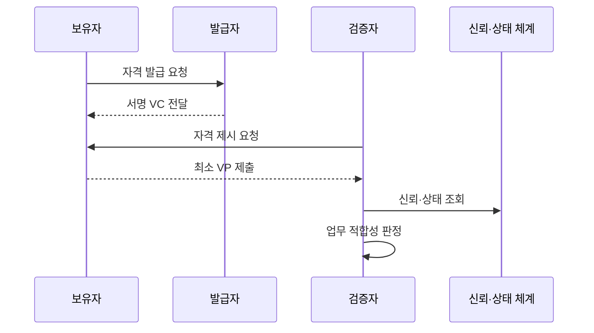

---
sidebar:
  order: 67
  label: "067. 검증가능 자격증명 VC (Verifiable Credential)"
  badge:
    text: "기출 · 50%"
    variant: note
title: "검증가능 자격증명 VC (Verifiable Credential)"
date: "2026-07-25T22:07:00+09:00"
tags:
  - "notes-security"
weight: 67
extra:
  question_no: "067"
  source_status: "기출"
  source_history: "132회"
  priority: 50
  priority_note: "132회 기출이며 DID 신뢰사슬의 핵심 자격증명임"
---

## 미리 알고가기

- **검증 가능 자격 증명(Verifiable Credential, VC)**: 영문 머리글자를 딴 공식 표기라 “브이시”로 읽으며, 발급자가 주체에 관한 주장을 디지털 서명한 자격 증명
- **검증 가능 프레젠테이션(Verifiable Presentation, VP)**: 영문 머리글자를 딴 공식 표기라 “브이피”로 읽으며, 보유자가 하나 이상의 VC에서 필요한 내용을 묶어 제시한다
- **분산 식별자(Decentralized Identifier, DID)**: 영문 머리글자를 딴 공식 표기라 “디아이디”로 읽으며, 중앙 등록기관 없이 검증 키와 제어 관계를 찾게 한다
- **이동식 문서 형식(Portable Document Format, PDF)**: 영문 머리글자를 딴 공식 표기라 “피디에프”로 읽으며, 사람이 원본을 대조하는 비교 증명서 형식
- **발급자(Issuer)**: 신청자의 자격을 확인하고 VC를 서명해 발급하는 기관
- **보유자(Holder)**: VC를 지갑에 저장하고 필요한 증명을 제시하는 주체
- **검증자(Verifier)**: VC·VP의 증명과 업무 적합성을 판정하는 주체
- **주장(Claim)**: 이름·면허·학위처럼 발급자가 자격 증명에 적은 사실
- **암호 증명(Cryptographic Proof)**: 데이터의 무결성과 서명 키의 통제 사실을 확인하는 정보
- **상태 정보(Status Information)**: VC의 유효·정지·폐기 여부를 나타내는 정보
- **선택적 공개(Selective Disclosure)**: 전체 자격이 아니라 필요한 속성만 증명하는 기능
- **신뢰 등록부(Trust Registry)**: 업무별로 인정하는 발급자와 자격 유형을 관리하는 목록
- **상호운용성(Interoperability)**: 서로 다른 기관과 시스템이 같은 형식과 규칙으로 자격을 교환하는 성질
- **디지털 지갑(Digital Wallet)**: 보유자의 키와 VC를 저장·제시하는 소프트웨어

## Ⅰ. 개요

- **정의**: 발급자 서명으로 검증 가능한 디지털 자격
- **배경/필요성**: 기관 간 자동 검증과 자격 재사용
- **핵심**: 서명 진위와 주장 신뢰의 분리 판정

### 쉽게 이해하기 (학습용)

- VC는 기관이 서명한 디지털 증명서라서 다른 서비스가 원본 기관에 매번 전화하지 않고도 변조 여부를 확인할 수 있다.

## Ⅱ. 특징

- 발급자·보유자·검증자의 책임을 분리한다.
- 암호 증명으로 발급 뒤 데이터 변조를 확인한다.
- 상태·기한으로 정지·폐기된 자격을 통제한다.
- 선택적 공개로 필요한 속성만 제시한다.
- 업무 규칙으로 발급자와 주장 적합성을 판단한다.

### 쉽게 이해하기 (학습용)

- 서명이 맞아도 인정하지 않는 기관이 발급했거나 이미 취소된 면허라면 서비스는 그 자격을 거부해야 한다.

## Ⅲ. 아키텍처 및 구성요소

| 설계 요소 | 설명 |
|:---|:---|
| 발급자 | 자격 확인과 VC 서명 |
| VC | 주장·주체·기한·증명 포함 |
| 보유자·지갑 | 자격 보관과 제시 통제 |
| VP | 목적에 맞는 최소 자격 제시 |
| 검증자 | 증명과 업무 적합성 판정 |
| 신뢰·상태 체계 | 발급자 인정과 폐기 관리 |

### 쉽게 이해하기 (학습용)

- 발급자가 서명한 VC를 보유자가 지갑에 넣고 필요한 부분을 VP로 만들어 검증자에게 보여 준다.

## Ⅳ. 원리 및 절차 흐름도

| 절차 | 설명 |
|:---|:---|
| 자격 발급 요청 | 원천 자료와 신청자 확인 |
| 서명 VC 전달 | 주장·기한·증명을 결합 |
| 자격 제시 요청 | 목적과 필요한 속성 명시 |
| 최소 VP 제출 | 동의한 정보만 구성해 제시 |
| 신뢰·상태 조회 | 발급자 인정과 폐기 확인 |
| 업무 적합성 판정 | 주장 내용을 업무 규칙과 비교 |

> 요약: 증명·상태·업무 적합성을 모두 확인한다.

### 쉽게 이해하기 (학습용)

- 사용자는 발급받은 자격에서 필요한 정보만 보여 주고 검증자는 서명뿐 아니라 발급기관·취소 여부·업무 조건까지 확인한다.

## Ⅴ. 종류 및 비교

| 비교축 | VC | 종이·PDF 증명서 | 중앙 조회 증명 |
|:---|:---|:---|:---|
| 핵심 특징 | 서명 자격을 보유자가 제시 | 문서 원본을 수동 대조 | 발급기관 시스템에 직접 조회 |
| 적용 기준 | 기관 간 자동 검증·재사용 | 소규모 수동 확인 | 최신 상태의 실시간 확인 |
| 주요 위험 | 키·상태·발급자 신뢰 | 위변조·처리 지연 | 중앙 장애·이용 추적 |

### 쉽게 이해하기 (학습용)

- 종이와 PDF는 사람이 확인하고 중앙 조회는 발급기관에 매번 묻지만 VC는 보유한 서명 자격을 여러 곳에서 자동 검증한다.

## Ⅵ. 실무 사례

- **사례 1**: 대학 VC를 채용 시스템에서 검증
- **사례 2**: 면허 VC의 폐기 상태를 확인
- **사례 3**: 연령 조건만 선택적으로 공개
- **사례 4**: 인정 발급자를 신뢰 등록부로 제한

### 쉽게 이해하기 (학습용)

- 사례 1은 지원자가 낸 학위 정보를 대학별 수동 확인 없이 서명과 자격 유형으로 자동 검증한다.
- 사례 2는 서명이 정상이어도 징계나 만료로 더는 유효하지 않은 면허의 사용을 방지한다.
- 사례 3은 생년월일 전체를 넘기지 않고 서비스가 요구한 최소 연령 충족 사실만 증명한다.
- 사례 4는 공격자가 스스로 만든 기관 키로 서명한 가짜 자격을 유효한 VC처럼 제시하지 못하게 한다.

## Ⅶ. 결론

- 디지털 자격이면 서명과 업무 신뢰를 함께 판정한다.

### 쉽게 이해하기 (학습용)

- VC는 자동 검증 뒤에도 발급 심사·서명 키·폐기 상태·업무 규칙을 함께 확인해야 신뢰할 수 있다.
