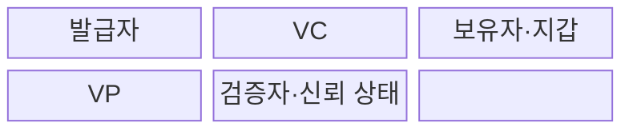
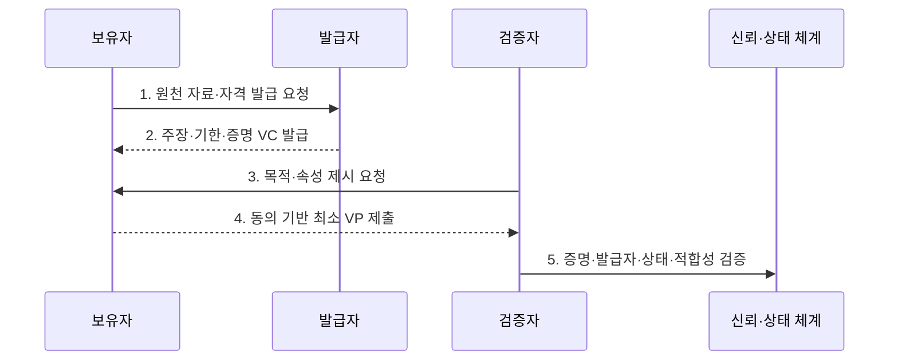

---
sidebar:
  order: 67
  label: "067. 검증가능 자격증명 VC (Verifiable Credential)"
  badge:
    text: "기출 · 50%"
    variant: note
title: "검증가능 자격증명 VC (Verifiable Credential)"
date: "2026-07-30T19:15:00+09:00"
tags:
  - "notes-security"
weight: 67
extra:
  question_no: "067"
  source_status: "기출"
  source_history: "132회"
  priority: 50
  priority_note: "132회 기출이며 DID 신뢰사슬의 핵심 자격증명임"
---

## 미리 알고가기

- **검증 가능 자격 증명(Verifiable Credential, VC)**: 발급자가 주체에 관한 주장을 디지털 서명한 기계 판독형 자격 증명이다.
- **검증 가능 프레젠테이션(Verifiable Presentation, VP)**: 보유자가 하나 이상의 자격 증명에서 필요한 내용을 구성하여 검증자에게 제시하는 증명 문서이다.
- **분산 식별자(Decentralized Identifier, DID)**: 중앙 등록기관 없이 검증 키와 제어 관계를 확인할 수 있는 식별자이다.
- **이동식 문서 형식(Portable Document Format, PDF)**: 문서의 서식과 내용을 환경과 관계없이 동일하게 표현하는 전자문서 형식이다.
- **발급자(Issuer)**: 신청자의 자격을 확인하고 VC를 서명해 발급하는 기관이다.
- **보유자(Holder)**: VC를 지갑에 저장하고 필요한 증명을 제시하는 주체이다.
- **검증자(Verifier)**: VC·VP의 증명과 업무 적합성을 판정하는 주체이다.
- **주장(Claim)**: 이름·면허·학위처럼 발급자가 자격 증명에 적은 사실이다.
- **암호 증명(Cryptographic Proof)**: 데이터의 무결성과 서명 키의 통제 사실을 확인하는 정보이다.
- **상태 정보(Status Information)**: VC의 유효·정지·폐기 여부를 나타내는 정보이다.
- **선택적 공개(Selective Disclosure)**: 전체 자격이 아니라 필요한 속성만 증명하는 기능이다.
- **신뢰 등록부(Trust Registry)**: 업무별로 인정하는 발급자와 자격 유형을 관리하는 목록이다.
- **상호운용성(Interoperability)**: 서로 다른 기관과 시스템이 같은 형식과 규칙으로 자격을 교환하는 성질이다.
- **디지털 지갑(Digital Wallet)**: 보유자의 키와 VC를 저장·제시하는 소프트웨어이다.
- **W3C VC Data Model 2.0**: VC·VP의 역할·구문·처리·검증 모델을 정의한 W3C 권고 표준이다.
- **W3C Bitstring Status List 1.0**: VC의 정지·폐기 상태를 개인정보 보호형 비트열로 표현하는 권고 표준이다.

## Ⅰ. 개요

- 정의/개념: 발급자 서명의 **검증 가능한 디지털 자격**
- 배경/필요성: 종이·PDF의 **수동 검증·위변조**

### 쉽게 이해하기 (학습용)

- VC는 기관이 서명한 디지털 증명서라서 다른 서비스가 원본 기관에 매번 전화하지 않고도 변조 여부를 확인할 수 있다.

## Ⅱ. 특징

- 발급자·보유자·검증자의 **역할 분리**
- 암호 증명 기반 **무결성·발급자 검증**
- VP 기반 **선택적 공개·최소 제시**

### 쉽게 이해하기 (학습용)

- 서명이 맞아도 인정하지 않는 기관이 발급했거나 이미 취소된 면허라면 서비스는 그 자격을 거부해야 한다.

## Ⅲ. 구조 및 구성요소

| 구성요소 | 책임 |
|:---|:---|
| 발급자 | 자격 확인과 VC 서명 |
| VC | 주장·주체·기한·증명 포함 |
| 보유자·지갑 | 자격 보관과 제시 통제 |
| VP | 목적에 맞는 최소 자격 제시 |
| 검증자·신뢰 상태 | 증명·발급자·폐기·적합성 판정 |

### 쉽게 이해하기 (학습용)

- 발급자가 서명한 VC를 보유자가 지갑에 넣고 필요한 부분을 VP로 만들어 검증자에게 보여 준다.

## Ⅳ. 흐름도

**동작 원리**

- **1. 원천 자료·자격 발급 요청**: 신청자·발급 조건을 확인
- **2. 주장·기한·증명 VC 발급**: 자격 내용·유효기간 서명
- **3. 목적·속성 제시 요청**: 필요한 정보·용도를 명시
- **4. 동의 기반 최소 VP 제출**: 선택 공개로 노출 최소화
- **5. 증명·발급자·상태·적합성 검증**: 서명·폐기·업무 규칙 판정
### 쉽게 이해하기 (학습용)

- 사용자는 발급받은 자격에서 필요한 정보만 보여 주고 검증자는 서명뿐 아니라 발급기관·취소 여부·업무 조건까지 확인한다.

## Ⅴ. 종류 및 비교

| 자격 증명 방식 | VC | 종이·PDF 증명서 | 중앙 조회 증명 |
|:---|:---|:---|:---|
| 적용 기준 | 기관 간 자동 검증·재사용 | 소규모 수동 확인 | 최신 상태의 실시간 확인 |
| 핵심 특징 | **서명 자격 보유자 제시** | **문서 원본 수동 대조** | 발급기관 시스템 직접 조회 |
| 한계 | 키·상태·발급자 신뢰 | 위변조·처리 지연 | 중앙 장애·이용 추적 |

### 쉽게 이해하기 (학습용)

- 종이와 PDF는 사람이 확인하고 중앙 조회는 발급기관에 매번 묻지만 VC는 보유한 서명 자격을 여러 곳에서 자동 검증한다.

## Ⅵ. 실무 고려사항 및 대책

| 고려사항 | 대책 | 효과 |
|:---|:---|:---|
| 자격·제시 상호운용 | **W3C VC Data Model 2.0 적용** | 역할·구문·검증 절차 통일 |
| 정지·폐기 상태 확인 | **W3C Bitstring Status List 1.0 적용** | 상태 조회·추적 위험 균형 |
| 발급자·업무 적합성 | **신뢰 등록부·목적 제한 검증** | 서명만 믿는 오수용 방지 |

### 쉽게 이해하기 (학습용)

- 채용 시스템은 대학이 발급한 학위 VC의 서명·발급자·자격 유형·폐기 상태를 검증해 지원자의 학력을 확인한다.

## Ⅶ. 결론

- **발급자신뢰·폐기상태·업무적합성**으로 VC 수용을 결정한다.

### 쉽게 이해하기 (학습용)

- VC는 자동 검증 뒤에도 발급 심사·서명 키·폐기 상태·업무 규칙을 함께 확인해야 신뢰할 수 있다.
