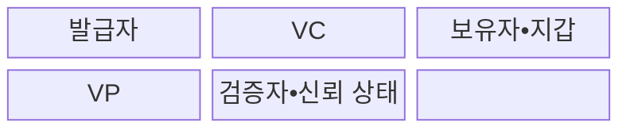
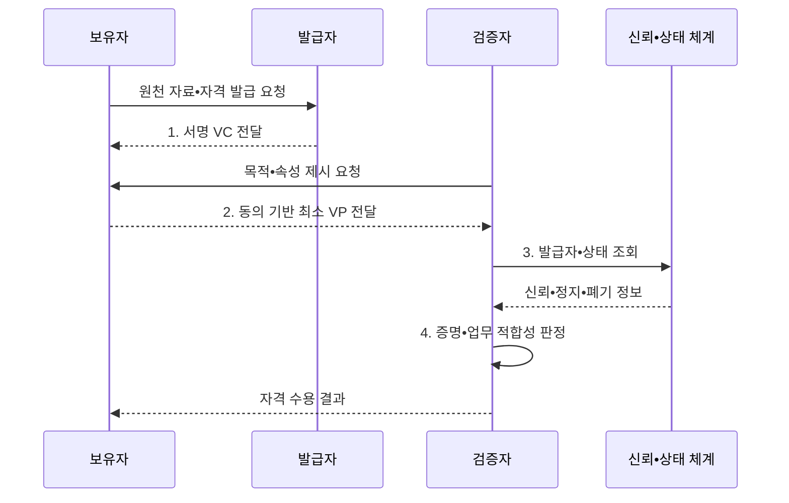

---
sidebar:
  order: 67
  label: "067. 검증가능 자격증명 VC (Verifiable Credential)"
  badge:
    text: "기출 • 50%"
    variant: note
title: "검증가능 자격증명 VC (Verifiable Credential)"
date: "2026-08-03T08:48:47+09:00"
tags:
  - "notes-security"
weight: 67
extra:
  question_no: "067"
  source_status: "기출"
  source_history: "132회"
  priority: 50
  priority_note: "132회 기출이며 DID 신뢰사슬의 핵심 자격증명임"
---

## Ⅰ. 개요

핵심 용어

- **VC**: 발급자가 주체의 자격과 주장을 디지털 서명한 기계 판독형 증명서이다.
- **종이•PDF 증명서**: 사람이 원본과 내용을 대조해야 하므로 기관 간 자동 검증과 위변조 판별에 한계가 있는 문서형 자격이다.

- 정의/개념: **검증 가능 자격증명(VC)** 은 발급자의 자격 주장에 암호학적 증명을 결합하여 보유자가 제시하고 검증자가 진위와 상태를 확인할 수 있는 디지털 자격
- 배경/필요성: 종이•PDF는 **자동 검증 불가•위변조 취약**

#### 한줄 요약

- VC는 기관이 서명한 디지털 증명서라서 다른 서비스가 원본 기관에 매번 전화하지 않고도 변조 여부를 확인할 수 있다.

## Ⅱ. 특징

핵심 용어

- **발급자•보유자•검증자**: 발급자는 자격을 서명하고 보유자는 지갑에 저장•제시하며 검증자는 증명과 업무 적합성을 판단한다.
- **VP•선택적 공개**: 보유자가 하나 이상의 VC에서 필요한 주장만 구성하여 검증자에게 제시하는 증명 문서와 기능이다.

- **역할 분리**: 발급자•보유자•검증자의 책임 구분
- **무결성•발급자 검증**: 암호 증명으로 변조와 서명자 확인
- **선택적 공개•최소 제시**: VP로 필요한 주장만 제공

#### 한줄 요약

- 서명이 맞아도 인정하지 않는 기관이 발급했거나 이미 취소된 면허라면 서비스는 그 자격을 거부해야 한다.

## Ⅲ. 구조 및 구성요소

핵심 용어

- **주장•암호 증명**: 주장은 자격에 적힌 사실이고 암호 증명은 데이터 무결성과 서명 키 통제를 확인하게 하는 정보이다.
- **신뢰•상태 체계**: 인정할 발급자와 자격 유형을 관리하고 VC의 유효•정지•폐기 상태를 제공하는 기반이다.

| 구성요소 | 책임 |
|:---|:---|
| **발급자** | 자격 확인과 **VC 서명** |
| **VC** | 주장•주체•기한•**암호 증명 포함** |
| **보유자•지갑** | 자격 보관과 **제시 통제** |
| **VP** | 목적에 맞는 **최소 자격 제시** |
| **검증자•신뢰 상태** | 증명•발급자•**폐기•적합성 판정** |

#### 한줄 요약

- 발급자가 서명한 VC를 보유자가 지갑에 넣고 필요한 부분을 VP로 만들어 검증자에게 보여 준다.

## Ⅳ. 흐름도

핵심 용어

- **목적 제한•업무 적합성**: 자격 사용을 명시한 용도로 제한하고 자격 유형과 주장이 현재 업무 조건에 맞는지 확인하는 원칙이다.
- **상태 조회**: 제시된 자격이 발급 뒤 정지되거나 폐기되지 않았는지 최신 정보를 확인하는 절차이다.

**동작 원리**

- **1. 서명 VC 전달**: 확인한 주장•유효기간을 서명해 제공
- **2. 동의 기반 최소 VP 전달**: 선택 공개로 노출 최소화
- **3. 발급자•상태 조회**: 신뢰•정지•폐기 판단 자료 요청
- **4. 증명•업무 적합성 판정**: 서명•목적 제한•업무 규칙 확인
#### 한줄 요약

- 사용자는 발급받은 자격에서 필요한 정보만 보여 주고 검증자는 서명뿐 아니라 발급기관•취소 여부•업무 조건까지 확인한다.

## Ⅴ. 종류 및 비교

핵심 용어

- **VC•문서•중앙 조회**: VC는 보유한 서명 자격을 자동 검증하고 문서는 수동 대조하며 중앙 조회는 발급기관 시스템에 매번 상태를 묻는다.

| 자격 증명 방식 | VC | 종이•PDF 증명서 | 중앙 조회 증명 |
|:---|:---|:---|:---|
| 적용 기준 | 기관 간 **자동 검증•재사용** | 소규모 **수동 확인** | 최신 상태의 **실시간 확인** |
| 핵심 특징 | **서명 자격 보유자 제시** | **문서 원본 수동 대조** | 발급기관의 **시스템 직접 조회** |
| 한계 | **키•상태•발급자 신뢰** | **위변조•처리 지연** | **중앙 장애•이용 추적** |

#### 한줄 요약

- 종이와 PDF는 사람이 확인하고 중앙 조회는 발급기관에 매번 묻지만 VC는 보유한 서명 자격을 여러 곳에서 자동 검증한다.

## Ⅵ. 실무 고려사항 및 대책

핵심 용어

- **W3C VC Data Model 2.0**: VC•VP의 역할•구문•처리•검증 모델을 정의한 W3C 권고 표준이다.
- **Bitstring Status List 1.0**: VC의 정지•폐기 상태를 개인정보 보호형 비트열로 표현하여 개별 상태 조회의 이용 추적을 줄이는 표준이다.

| 문제 | 대책 | 효과 |
|:---|:---|:---|
| **자격•제시 상호운용 편차** | **W3C VC Data Model 2.0 적용** | 역할•구문•검증의 **절차 통일** |
| **정지•폐기 상태 확인 누락** | **W3C Bitstring Status List 1.0 적용** | 폐기 상태 확인 시 **이용 추적 억제** |
| **발급자•업무 적합성 오판** | **신뢰 등록부•목적 제한 검증** | 서명만 믿는 **오수용 방지** |

#### 한줄 요약

- 채용 시스템은 대학이 발급한 학위 VC의 서명•발급자•자격 유형•폐기 상태를 검증해 지원자의 학력을 확인한다.

## Ⅶ. 결론

핵심 용어

- **VC 수용 조건**: 서명•발급자 신뢰•자격 상태•요청 업무 적합성이 모두 유효해야 자격을 인정한다는 검증 기준이다.

- 서명•발급자•상태•업무 적합성이 모두 맞으면 **VC 수용**, 하나라도 틀리면 **거부**

#### 한줄 요약

- VC는 자동 검증 뒤에도 발급 심사•서명 키•폐기 상태•업무 규칙을 함께 확인해야 신뢰할 수 있다.
