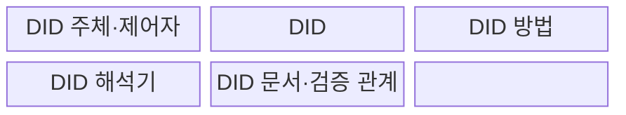
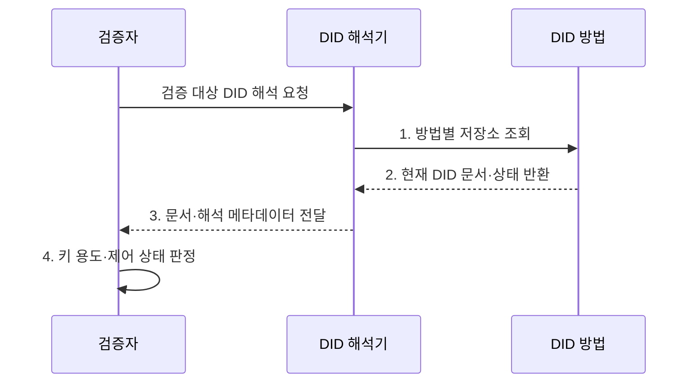

---
sidebar:
  order: 68
  label: "068. W3C DID 표준 (W3C DID Standard)"
  badge:
    text: "기출 · 50%"
    variant: note
title: "W3C DID 표준 (W3C DID Standard)"
date: "2026-07-31T02:01:22+09:00"
tags:
  - "notes-security"
weight: 68
extra:
  question_no: "068"
  source_status: "기출"
  source_history: "132회"
  priority: 50
  priority_note: "132회 기출이며 DID 문서·해석 표준으로 보존함"
---

## 미리 알고가기

- **월드 와이드 웹 컨소시엄(World Wide Web Consortium, W3C)**: 웹 기술의 상호운용 표준을 개발하는 국제 표준화 조직이다.
- **분산 식별자(Decentralized Identifier, DID)**: 중앙 등록기관 없이 검증 키와 제어 관계를 확인할 수 있는 식별자이다.
- **검증 가능 자격 증명(Verifiable Credential, VC)**: 발급자가 주체에 관한 주장을 디지털 서명한 기계 판독형 자격 증명이다.
- **DID 주체(DID Subject)**: DID가 식별하는 사람·조직·사물·데이터이다.
- **제어자(Controller)**: DID 문서를 변경할 권한을 가진 주체이다.
- **DID 문서(DID Document)**: 제어자·검증 방법·키 용도·서비스 접점을 담은 문서이다.
- **DID 방법(DID Method)**: 특정 저장·해석 체계에서 DID를 생성·조회·갱신·비활성화하는 규칙이다.
- **검증 방법(Verification Method)**: 공개키 등 암호 검증에 필요한 정보와 식별자이다.
- **검증 관계(Verification Relationship)**: 인증·주장·키 합의처럼 검증 방법이 허용된 용도이다.
- **DID 해석기(DID Resolver)**: DID를 입력받아 DID 문서와 해석 메타데이터를 반환하는 기능이다.
- **방법 등록부(Method Registry)**: DID 방법 이름과 규격 위치를 찾게 하는 목록이다.
- **서비스 접점(Service Endpoint)**: DID 주체와 통신하거나 서비스를 찾는 주소이다.
- **키 회전(Key Rotation)**: 기존 검증 키를 새 키로 교체하는 관리 활동이다.
- **비활성화(Deactivation)**: DID를 더는 유효한 식별자로 사용할 수 없게 하는 처리이다.
- **상관관계 공격(Correlation Attack)**: 같은 DID의 반복 사용을 연결해 여러 서비스의 활동을 추적하는 공격이다.
- **W3C DID Core 1.0**: DID 구문·문서·검증 관계·핵심 해석 모델을 정의한 W3C 권고 표준이다.
- **해석 메타데이터(Resolution Metadata)**: DID 해석 결과의 오류·내용 유형·처리 정보를 나타내는 자료이다.
- **주장 방법(assertionMethod)**: 자격 주장 서명에 사용할 수 있는 검증 방법의 관계이다.
- **키 복구(Key Recovery)**: 키 분실 뒤 DID 제어권을 안전하게 되찾는 절차이다.
- **쌍별 DID(Pairwise DID)**: 서비스 관계마다 다른 식별자를 사용해 활동 연결을 줄이는 방식이다.

## Ⅰ. 개요

- 정의/개념: DID 구문·문서·해석 절차를 규정한 **분산 식별자 표준**
- 배경/필요성: 분산 식별 체계의 **키 해석 불일치**

### 쉽게 이해하기 (학습용)

- W3C DID는 식별자만 정하는 것이 아니라 그 식별자에서 현재 검증 키와 용도를 어떻게 찾아 읽을지도 정한다.

## Ⅱ. 특징

- **분산 식별자**: `did:method:id` 형식의 전역 이름
- **검증 방법·관계 표현**: DID 문서로 키와 용도 연결
- **DID 방법**: 생성·해석·갱신·비활성화 규칙

### 쉽게 이해하기 (학습용)

- 같은 DID 형식을 써도 어떤 저장소와 규칙으로 문서를 바꾸고 잃은 키를 복구하는지에 따라 실제 안전성은 달라진다.

## Ⅲ. 구조 및 구성요소

| 구성요소 | 책임 |
|:---|:---|
| **DID 주체·제어자** | 식별 대상과 **변경 권한 구분** |
| **DID** | 방법과 **고유 식별값 표현** |
| **DID 방법** | 생성·조회·**갱신·비활성화 규칙** |
| **DID 해석기** | 문서와 **해석 메타데이터 반환** |
| **DID 문서·검증 관계** | 키·용도·**서비스 정보 제공** |

### 쉽게 이해하기 (학습용)

- DID의 방법 이름이 해석 규칙을 고르고 해석기가 현재 문서를 찾아 검증 키의 허용 용도와 서비스 주소를 돌려준다.

## Ⅳ. 흐름도

**동작 원리**

- **1. 방법별 저장소 조회**: DID 방법 규칙으로 현재 상태 요청
- **2. 현재 DID 문서·상태 반환**: 키·서비스·비활성 정보 제공
- **3. 문서·해석 메타데이터 전달**: 조회 결과와 오류 상태 제공
- **4. 키 용도·제어 상태 판정**: 검증 관계와 현재 제어권 확인
### 쉽게 이해하기 (학습용)

- 검증자는 DID에 적힌 방법으로 현재 문서를 찾고 서명에 쓴 키가 그 목적에 실제로 허용된 키인지 확인한다.

## Ⅴ. 종류 및 비교

| 식별자 관리 방식 | W3C DID | 중앙 식별자 | 연합 식별자 |
|:---|:---|:---|:---|
| 적용 기준 | 분산된 **검증 관계 관리** | 단일 **서비스 계정** | 조직 간 **통합 인증** |
| 핵심 특징 | **제어자 중심 키 해석** | **서비스 계정 식별** | 신원 제공자의 **식별 연계** |
| 한계 | **방법 거버넌스·키 복구** | **제공자 종속·중앙 유출** | **제공자 장애·활동 추적** |

### 쉽게 이해하기 (학습용)

- 중앙 식별자는 서비스가, 연합 식별자는 신원 제공자가 통제하며 DID는 방법 규칙에 따라 제어자가 검증 관계를 갱신한다.

## Ⅵ. 실무 고려사항 및 대책

| 고려사항 | 대책 | 효과 |
|:---|:---|:---|
| **DID 문서·키 용도 불일치** | **W3C DID Core 1.0 준수** | 식별·검증 관계의 **상호운용** |
| **방법별 거버넌스 편차** | **방법 규격·등록·감사 검토** | 저장소·갱신의 **위험 식별** |
| **키 분실·상관 추적** | **회전·복구·쌍별 DID 적용** | 제어권 상실과 **활동 연결 완화** |

### 쉽게 이해하기 (학습용)

- 검증자는 발급자 DID를 해석해 DID 문서의 assertionMethod에 지정된 공개키로 VC 서명을 확인하고 폐기·교체된 키는 거부한다.

## Ⅶ. 결론

- 방법이 검증되고 키 용도·상태가 맞으면 **DID 수용**, 하나라도 실패하면 **거부**

### 쉽게 이해하기 (학습용)

- W3C DID는 현재 문서를 신뢰성 있게 해석해 목적에 맞는 키와 제어 상태를 확인해야 한다.
