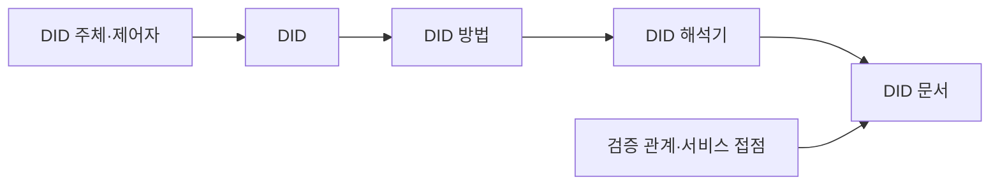
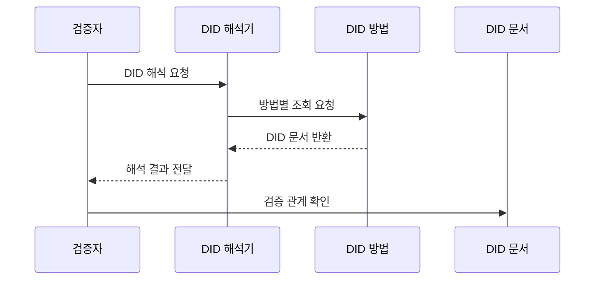

---
sidebar:
  order: 68
  label: "068. W3C DID 표준 (W3C DID Standard)"
  badge:
    text: "기출 · 50%"
    variant: note
title: "W3C DID 표준 (W3C DID Standard)"
date: "2026-07-27T23:59:59+09:00"
tags:
  - "notes-security"
weight: 68
extra:
  question_no: "068"
  source_status: "기출"
  source_history: "132회"
  priority: 50
  priority_note: "132회 기출이며 DID 문서·해석 표준으로 보존함"
---

## 미리 알고가기

- **월드 와이드 웹 컨소시엄(World Wide Web Consortium, W3C)**: 웹 기술의 상호운용 표준을 개발하는 국제 표준화 조직이다.
- **분산 식별자(Decentralized Identifier, DID)**: 중앙 등록기관 없이 검증 키와 제어 관계를 확인할 수 있는 식별자이다.
- **검증 가능 자격 증명(Verifiable Credential, VC)**: 발급자가 주체에 관한 주장을 디지털 서명한 기계 판독형 자격 증명이다.
- **DID 주체(DID Subject)**: DID가 식별하는 사람·조직·사물·데이터
- **제어자(Controller)**: DID 문서를 변경할 권한을 가진 주체
- **DID 문서(DID Document)**: 제어자·검증 방법·키 용도·서비스 접점을 담은 문서
- **DID 방법(DID Method)**: 특정 저장·해석 체계에서 DID를 생성·조회·갱신·비활성화하는 규칙
- **검증 방법(Verification Method)**: 공개키 등 암호 검증에 필요한 정보와 식별자
- **검증 관계(Verification Relationship)**: 인증·주장·키 합의처럼 검증 방법이 허용된 용도
- **DID 해석기(DID Resolver)**: DID를 입력받아 DID 문서와 해석 메타데이터를 반환하는 기능
- **방법 등록부(Method Registry)**: DID 방법 이름과 규격 위치를 찾게 하는 목록
- **서비스 접점(Service Endpoint)**: DID 주체와 통신하거나 서비스를 찾는 주소
- **키 회전(Key Rotation)**: 기존 검증 키를 새 키로 교체하는 관리 활동
- **비활성화(Deactivation)**: DID를 더는 유효한 식별자로 사용할 수 없게 하는 처리
- **상관관계 공격(Correlation Attack)**: 같은 DID의 반복 사용을 연결해 여러 서비스의 활동을 추적하는 공격

## Ⅰ. 개요

- 정의: DID 문자열·문서·해석의 **공통 모델**
- 기존 한계: 분산 식별 체계의 **키 해석 불일치**

### 쉽게 이해하기 (학습용)

- W3C DID는 식별자만 정하는 것이 아니라 그 식별자에서 현재 검증 키와 용도를 어떻게 찾아 읽을지도 정한다.

## Ⅱ. 특징

- `did:method:id` 형식의 **분산 식별자**
- DID 문서 기반 **검증 방법·관계 표현**
- DID 방법 기반 **생성·해석·갱신·비활성화**

### 쉽게 이해하기 (학습용)

- 같은 DID 형식을 써도 어떤 저장소와 규칙으로 문서를 바꾸고 잃은 키를 복구하는지에 따라 실제 안전성은 달라진다.

## Ⅲ. 아키텍처 및 구성요소

| 설계 요소 | 설명 |
|:---|:---|
| DID 주체·제어자 | 식별 대상과 변경 권한 구분 |
| DID | 방법과 고유 식별값 표현 |
| DID 방법 | 생성·조회·갱신·비활성화 규칙 |
| DID 해석기 | 문서와 메타데이터 반환 |
| DID 문서 | 키·용도·서비스 정보 제공 |
| 검증 관계·서비스 접점 | 키 사용 목적과 통신 주소 정의 |

### 쉽게 이해하기 (학습용)

- DID의 방법 이름이 해석 규칙을 고르고 해석기가 현재 문서를 찾아 검증 키의 허용 용도와 서비스 주소를 돌려준다.

## Ⅳ. 원리 및 절차 흐름도

| 절차 | 설명 |
|:---|:---|
| DID 해석 요청 | 검증 대상 식별자 제출 |
| 방법별 조회 요청 | 방법 규칙으로 저장소 접근 |
| DID 문서 반환 | 현재 문서와 상태 제공 |
| 해석 결과 전달 | 문서와 해석 메타데이터 반환 |
| 검증 관계 확인 | 키가 해당 용도에 허용됐는지 판정 |

> 요약: 현재 문서에서 키의 허용 용도를 확인한다.

### 쉽게 이해하기 (학습용)

- 검증자는 DID에 적힌 방법으로 현재 문서를 찾고 서명에 쓴 키가 그 목적에 실제로 허용된 키인지 확인한다.

## Ⅴ. 종류 및 비교

| 식별자 관리 방식 | W3C DID | 중앙 식별자 | 연합 식별자 |
|:---|:---|:---|:---|
| 적용 기준 | 분산된 검증 관계 관리 | 단일 서비스 계정 | 조직 간 통합 인증 |
| 핵심 특징 | 제어자 중심 키 해석 | 서비스의 계정 식별 | 신원 제공자의 식별 연계 |
| 한계 | 방법 거버넌스·키 복구 | 제공자 종속·중앙 유출 | 제공자 장애·활동 추적 |

### 쉽게 이해하기 (학습용)

- 중앙 식별자는 서비스가, 연합 식별자는 신원 제공자가 통제하며 DID는 방법 규칙에 따라 제어자가 검증 관계를 갱신한다.

## Ⅵ. 실무 사례

1. VC 검증 시 **DID 문서의 서명 키 확인**

### 쉽게 이해하기 (학습용)

- 검증자는 발급자 DID를 해석해 DID 문서의 assertionMethod에 지정된 공개키로 VC 서명을 확인하고 폐기·교체된 키는 거부한다.

## Ⅶ. 결론

- 분산 식별자의 키와 서비스 정보를 신뢰성 있게 확인하기 위해 DID 방법·문서 무결성·키 용도·회전 상태를 검토하여, 현재 제어권 검증에 W3C DID를 활용해야 한다.

### 쉽게 이해하기 (학습용)

- W3C DID는 현재 문서를 신뢰성 있게 해석해 목적에 맞는 키와 제어 상태를 확인해야 한다.
