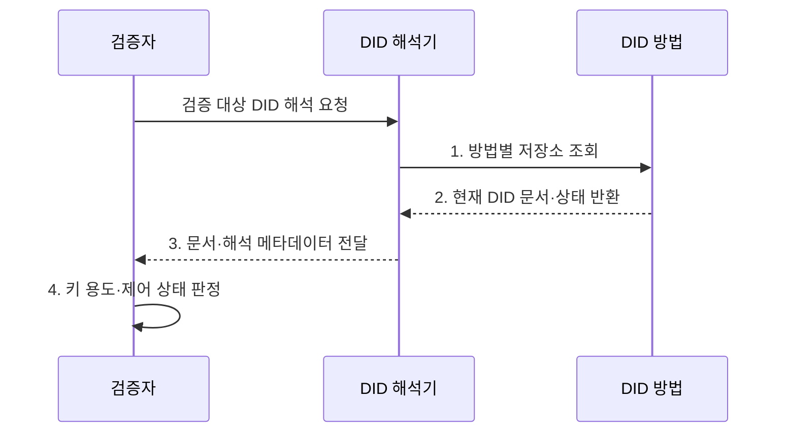

---
sidebar:
  order: 68
  label: "068. W3C DID 표준 (W3C DID Standard)"
  badge:
    text: "기출 · 50%"
    variant: note
title: "W3C DID 표준 (W3C DID Standard)"
date: "2026-08-02T12:14:00+09:00"
tags:
  - "notes-security"
weight: 68
extra:
  question_no: "068"
  source_status: "기출"
  source_history: "132회"
  priority: 50
  priority_note: "132회 기출이며 DID 문서·해석 표준으로 보존함"
---

## Ⅰ. 개요

핵심 용어

- **W3C DID 표준**: 분산 식별자의 구문·문서·검증 관계·해석 절차를 규정하여 키와 제어 상태를 상호운용 가능하게 확인하는 표준이다.
- **DID**: 중앙 등록기관 없이 검증 키와 제어 관계를 확인할 수 있는 식별자이다.

- 정의/개념: **W3C DID** 는 중앙 등록기관 없이 주체가 제어하는 식별자의 URI 구문·DID 문서·생성·해석·갱신 절차를 규정한 분산 식별자 표준
- 배경/필요성: 방법별 저장·해석 규칙 차이로 **키 해석 불일치**

#### 한줄 요약

- W3C DID는 식별자만 정하는 것이 아니라 그 식별자에서 현재 검증 키와 용도를 어떻게 찾아 읽을지도 정한다.

## Ⅱ. 특징

핵심 용어

- **DID 문서·검증 관계**: DID 문서는 공개키와 서비스 정보를 담고 검증 관계는 각 키가 인증·주장·키 합의 중 어디에 쓰일 수 있는지 정한다.
- **DID 방법**: 특정 저장·해석 체계에서 DID를 생성·조회·갱신·비활성화하는 규칙이다.

- **분산 식별자**: `did:method:id` 형식의 전역 이름
- **검증 방법·관계 표현**: DID 문서로 키와 용도 연결
- **DID 방법**: 생성·해석·갱신·비활성화 규칙

#### 한줄 요약

- 같은 DID 형식을 써도 어떤 저장소와 규칙으로 문서를 바꾸고 잃은 키를 복구하는지에 따라 실제 안전성은 달라진다.

## Ⅲ. 구조 및 구성요소

핵심 용어

- **DID 주체·제어자**: DID 주체는 식별 대상이고 제어자는 DID 문서를 변경할 권한을 가진 주체이다.
- **DID 해석기·해석 메타데이터**: 해석기는 DID 문서와 함께 조회 오류·내용 유형·처리 상태를 설명하는 메타데이터를 반환한다.

| 구성요소 | 책임 |
|:---|:---|
| **DID 주체·제어자** | 식별 대상과 **변경 권한 구분** |
| **DID** | 방법과 **고유 식별값 표현** |
| **DID 방법** | 생성·조회·**갱신·비활성화 규칙** |
| **DID 해석기** | 문서와 **해석 메타데이터 반환** |
| **DID 문서·검증 관계** | 키·용도·**서비스 정보 제공** |

#### 한줄 요약

- DID의 방법 이름이 해석 규칙을 고르고 해석기가 현재 문서를 찾아 검증 키의 허용 용도와 서비스 주소를 돌려준다.

## Ⅳ. 흐름도

핵심 용어

- **현재 DID 문서**: 방법별 저장소에서 조회한 최신 키·서비스·비활성화 상태를 담은 검증 기준 문서이다.
- **키 용도 판정**: 서명에 사용한 검증 방법이 현재 DID 문서에서 해당 목적의 검증 관계로 허용되는지 확인하는 절차이다.

**동작 원리**

- **1. 방법별 저장소 조회**: DID 방법 규칙으로 현재 상태 요청
- **2. 현재 DID 문서·상태 반환**: 키·서비스·비활성 정보 제공
- **3. 문서·해석 메타데이터 전달**: 조회 결과와 오류 상태 제공
- **4. 키 용도·제어 상태 판정**: 검증 관계와 현재 제어권 확인
#### 한줄 요약

- 검증자는 DID에 적힌 방법으로 현재 문서를 찾고 서명에 쓴 키가 그 목적에 실제로 허용된 키인지 확인한다.

## Ⅴ. 종류 및 비교

핵심 용어

- **DID·중앙·연합 식별자**: DID는 제어자가 키 관계를 관리하고 중앙형은 서비스가 계정을, 연합형은 신원 제공자가 식별 연계를 통제한다.

| 식별자 관리 방식 | W3C DID | 중앙 식별자 | 연합 식별자 |
|:---|:---|:---|:---|
| 적용 기준 | 분산된 **검증 관계 관리** | 단일 **서비스 계정** | 조직 간 **통합 인증** |
| 핵심 특징 | **제어자 중심 키 해석** | **서비스 계정 식별** | 신원 제공자의 **식별 연계** |
| 한계 | **방법 거버넌스·키 복구** | **제공자 종속·중앙 유출** | **제공자 장애·활동 추적** |

#### 한줄 요약

- 중앙 식별자는 서비스가, 연합 식별자는 신원 제공자가 통제하며 DID는 방법 규칙에 따라 제어자가 검증 관계를 갱신한다.

## Ⅵ. 실무 고려사항 및 대책

핵심 용어

- **W3C DID Core 1.0**: DID 구문·문서·검증 관계·핵심 해석 모델을 정의한 W3C 권고 표준이다.
- **키 회전·복구·쌍별 DID**: 검증 키 교체와 통제권 복구 절차를 마련하고 서비스별 식별자를 사용해 활동 연결을 줄이는 대책이다.

| 문제 | 대책 | 효과 |
|:---|:---|:---|
| **DID 문서·키 용도 불일치** | **W3C DID Core 1.0 준수** | 식별·검증 관계의 **상호운용** |
| **방법별 거버넌스 편차** | **방법 규격·등록·감사 검토** | 저장소·갱신의 **위험 식별** |
| **키 분실·상관 추적** | **회전·복구·쌍별 DID 적용** | 제어권 상실과 **활동 연결 완화** |

#### 한줄 요약

- 검증자는 발급자 DID를 해석해 DID 문서의 assertionMethod에 지정된 공개키로 VC 서명을 확인하고 폐기·교체된 키는 거부한다.

## Ⅶ. 결론

핵심 용어

- **DID 수용 조건**: DID 방법의 신뢰성과 현재 문서의 제어 상태, 서명 키의 허용 용도가 모두 유효해야 식별자를 인정한다는 기준이다.

- 방법이 검증되고 키 용도·상태가 맞으면 **DID 수용**, 하나라도 실패하면 **거부**

#### 한줄 요약

- W3C DID는 현재 문서를 신뢰성 있게 해석해 목적에 맞는 키와 제어 상태를 확인해야 한다.
