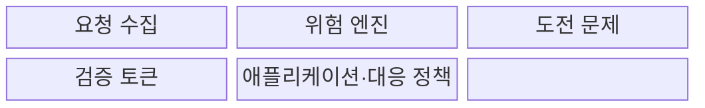
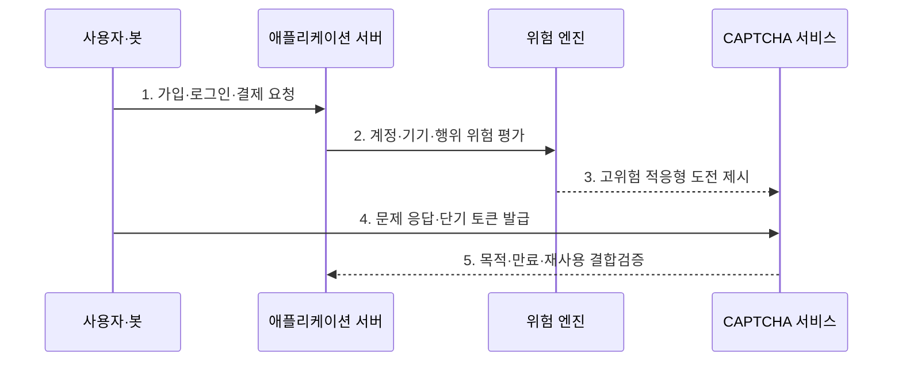

---
sidebar:
  order: 69
  label: "069. CAPTCHA·reCAPTCHA (CAPTCHA)"
  badge:
    text: "기출 · 30%"
    variant: note
title: "CAPTCHA·reCAPTCHA (CAPTCHA)"
date: "2026-07-30T19:15:00+09:00"
tags:
  - "notes-security"
weight: 69
extra:
  question_no: "069"
  source_status: "기출"
  source_history: "128회"
  priority: 30
  priority_note: "128회 기출이나 봇 방지 보조통제의 범위는 좁음"
---

## 미리 알고가기

- **컴퓨터와 인간을 구별하는 완전 자동화된 공개 튜링 테스트(Completely Automated Public Turing Test to Tell Computers and Humans Apart, CAPTCHA)**: 사람과 자동화 요청을 구분하여 봇의 서비스 남용 비용을 높이는 시험이다.
- **리캡차(reCAPTCHA)**: 문제 풀이와 사용자 행위 신호를 분석하여 자동화 요청을 판별하는 CAPTCHA 서비스이다.
- **봇(Bot)**: 정해진 작업을 대량으로 자동 수행하는 프로그램이다.
- **크리덴셜 스터핑(Credential Stuffing)**: 다른 서비스에서 유출된 계정·비밀번호 조합으로 대량 로그인을 시도하는 공격이다.
- **위험 엔진(Risk Engine)**: 기기·행위·요청 맥락을 분석해 자동화 가능성을 점수화하는 기능이다.
- **도전 문제(Challenge)**: 이미지·문자·동작처럼 사용자가 수행해야 하는 시험이다.
- **검증 토큰(Verification Token)**: CAPTCHA 통과 결과와 짧은 유효 시간을 나타내는 증표이다.
- **호출률 제한(Rate Limiting)**: 일정 시간 동안 허용할 요청 수를 제한하는 통제이다.
- **다중 요소 인증(Multi-Factor Authentication, MFA)**: 고위험 요청에서 서로 다른 종류의 인증 요소를 둘 이상 확인하는 인증 방식이다.
- **인공지능(Artificial Intelligence, AI)**: 학습된 패턴을 이용하여 문제 풀이형 CAPTCHA를 자동 해석할 수 있는 우회 기술이다.
- **적응형 통제(Adaptive Control)**: 요청 위험에 따라 추가 검증의 강도를 바꾸는 방식이다.
- **접근성(Accessibility)**: 장애나 사용 환경과 관계없이 서비스를 이용할 수 있는 성질이다.
- **오탐(False Positive)**: 정상 사용자를 자동화 공격으로 잘못 판단하는 결과이다.
- **재전송 공격(Replay Attack)**: 이전에 받은 정상 토큰을 다시 제출해 검증을 우회하는 공격이다.
- **W3C WCAG 2.2**: 웹 콘텐츠의 인식·운용·이해·견고성에 관한 접근성 요구를 정의한 권고 표준이다.
- **OWASP OAT-009 CAPTCHA Defeat**: CAPTCHA 우회·대행·자동 풀이 위협을 분류한 공식 자동화 위협 식별자이다.

## Ⅰ. 개요

- 정의/개념: 사람·자동화 요청을 구별하는 **보조 통제**
- 배경/필요성: 대량 가입·스팸·로그인의 **자동 남용**

### 쉽게 이해하기 (학습용)

- CAPTCHA는 사용자가 누구인지 증명하지 않고 한꺼번에 많은 요청을 보내는 프로그램의 속도와 비용을 불리하게 만든다.

## Ⅱ. 특징

- 공개 진입점의 **위험 기반 선택 적용**
- 토큰 목적·만료·재사용의 **서버 검증**
- 호출률·MFA·접근성의 **다층 통제**

### 쉽게 이해하기 (학습용)

- 문제를 맞혔다는 결과만 믿지 말고 그 결과가 지금 이 요청을 위해 방금 발급됐는지 서버에서 확인해야 한다.

## Ⅲ. 구조 및 구성요소

| 구성요소 | 책임 |
|:---|:---|
| 요청 수집 | 계정·기기·행위 신호 수집 |
| 위험 엔진 | 자동화 가능성 평가 |
| 도전 문제 | 필요 시 추가 과제 제시 |
| 검증 토큰 | 통과 결과와 맥락 전달 |
| 애플리케이션·대응 정책 | 토큰 검증·허용·지연·MFA 결정 |

### 쉽게 이해하기 (학습용)

- 위험 엔진이 수상한 요청에 문제를 내고 서버는 통과 토큰을 원래 업무 요청과 묶어 최종 대응을 정한다.

## Ⅳ. 흐름도

**동작 원리**

- **1. 가입·로그인·결제 요청**: 공개 기능의 업무 시도
- **2. 계정·기기·행위 위험 평가**: 자동화 가능성·규모 산출
- **3. 고위험 적응형 도전 제시**: 임계값에 따라 과제 요구
- **4. 문제 응답·단기 토큰 발급**: 풀이 결과·맥락을 결속
- **5. 목적·만료·재사용 결합검증**: 서버에서 토큰·업무 판정
### 쉽게 이해하기 (학습용)

- 위험한 요청에만 문제를 내고 통과 결과를 원래 요청과 묶어 확인한 뒤 가입이나 로그인을 계속 진행한다.

## Ⅴ. 종류 및 비교

| CAPTCHA 유형 | CAPTCHA 공통 | 문제 풀이형 | 위험 점수형 | 적응형 혼합 |
|:---|:---|:---|:---|:---|
| 적용 기준 | 공개 기능의 자동화 억제 | 단순하고 명시적 검증 | 사용자 마찰 최소화 | 위험별 검증 강도 조정 |
| 핵심 특징 | **봇 처리 비용 증가** | **사용자 과제 직접 수행** | 행위 신호 점수 산출 | 위험할 때만 문제 제시 |
| 한계 | 우회·대행 서비스 | 접근성 저하·AI 풀이 | 추적·모델 오탐 | 정책 복잡성과 편향 |

### 쉽게 이해하기 (학습용)

- 문제형은 눈에 보이는 부담이 크고 점수형은 조용하지만 오탐과 추적 위험이 있으며 적응형은 위험한 요청에 부담을 집중한다.

## Ⅵ. 실무 고려사항 및 대책

| 고려사항 | 대책 | 효과 |
|:---|:---|:---|
| 우회·대행·AI 풀이 | **OWASP OAT-009 기준 대응** | 공격 자동화 비용 증가 |
| 장애 사용자 접근성 | **W3C WCAG 2.2 대체 경로** | 차별·정상 사용자 차단 완화 |
| 토큰 재사용·대량 요청 | **목적 결속·호출률·MFA 적용** | 단일 보조 통제 우회 제한 |

### 쉽게 이해하기 (학습용)

- 가입 요청이 비정상적으로 반복되면 CAPTCHA를 제시하고 계정·IP·기기별 호출률도 제한해 자동화와 CAPTCHA 대행을 함께 억제한다.

## Ⅶ. 결론

- **공격규모·오탐률·접근성**으로 CAPTCHA 적용강도를 결정한다.

### 쉽게 이해하기 (학습용)

- CAPTCHA는 봇을 완전히 식별하는 답이 아니라 공격 경제성을 낮추는 보조 수단이므로 호출률·계정 위험·강한 인증과 함께 써야 한다.
