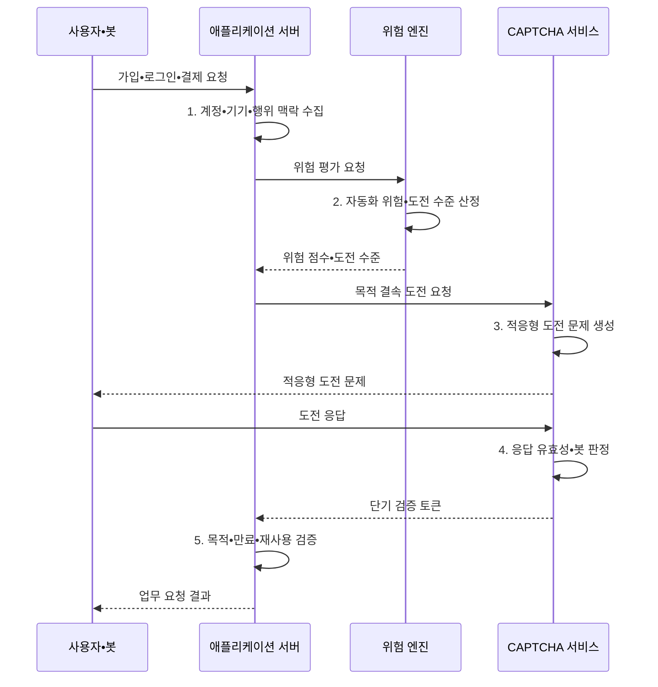

---
sidebar:
  order: 69
  label: "069. CAPTCHA•reCAPTCHA (CAPTCHA)"
  badge:
    text: "기출 • 30%"
    variant: note
title: "CAPTCHA•reCAPTCHA (CAPTCHA)"
date: "2026-08-05T11:21:00+09:00"
tags:
  - "notes-security"
weight: 69
extra:
  question_no: "069"
  source_status: "기출"
  source_history: "128회"
  priority: 30
  priority_note: "128회 기출이나 봇 방지 보조통제의 범위는 좁음"
---

## Ⅰ. 개요

<details><summary>핵심 용어</summary>

- **CAPTCHA(Completely Automated Public Turing test to tell Computers and Humans Apart)** 는 사람과 자동화 요청을 구분하는 보조 통제다.
- **reCAPTCHA** 는 위험 신호와 사용자 도전을 결합한 CAPTCHA 서비스다.
- **봇**: 정해진 작업을 대량으로 자동 수행하는 프로그램이다.

</details>

- 정의/개념: **CAPTCHA** 는 사용자의 상호작용이나 위험 신호를 검사하여 사람의 요청과 자동화된 봇 요청을 구별하는 남용 방지 보조 통제
- 배경/필요성: 대량 가입•스팸•로그인의 **자동 남용**

#### 한줄 요약

- CAPTCHA는 사용자가 누구인지 증명하지 않고 한꺼번에 많은 요청을 보내는 프로그램의 속도와 비용을 불리하게 만든다.

## Ⅱ. 특징

<details><summary>핵심 용어</summary>

- **검증 토큰** 은 CAPTCHA 통과 결과를 전달하는 짧은 수명의 증표다.
- **목적 결속** 은 검증 토큰을 발급받은 특정 업무 요청에만 사용하게 하는 통제다.
- **호출률 제한** 은 일정 시간 동안 주체별 요청 수를 제한하는 통제다.
- **MFA(Multi-Factor Authentication)** 는 서로 다른 종류의 인증 요소를 둘 이상 확인하는 방식이다.

</details>

- **위험 기반 선택 적용**: 공개 진입점의 고위험 요청만 추가 검증
- **서버 검증**: 토큰 목적•만료•재사용 여부 확인
- **다층 통제**: 호출률•MFA•접근성 대체 경로 결합

#### 한줄 요약

- 문제를 맞혔다는 결과만 믿지 말고 그 결과가 지금 이 요청을 위해 방금 발급됐는지 서버에서 확인해야 한다.

## Ⅲ. 구조 및 구성요소

<details><summary>핵심 용어</summary>

- **위험 엔진**: 계정•기기•행위•요청 맥락을 분석해 자동화 가능성을 점수화하는 기능이다.
- **도전 문제**: 위험한 요청에 이미지•문자•동작 등 사용자가 수행할 추가 과제를 제시하는 시험이다.

</details>

```text
                         [위험 엔진]
                        /          \
                 [요청 수집]     [도전 문제]
                                      |
                                 [검증 토큰]
                                      |
                         [애플리케이션•대응 정책]
```

선의 의미: 위험 엔진이 요청 신호와 도전 문제를 결합하고, 도전 결과인 검증 토큰을 애플리케이션•대응 정책의 판단 근거로 연결하는 정적 봇 통제 구조

| 구성요소 | 책임 |
|:---|:---|
| **요청 수집** | 계정•기기•**행위 신호 수집** |
| **위험 엔진** | 자동화 가능성의 **위험 평가** |
| **도전 문제** | 필요 시 **추가 과제 제시** |
| **검증 토큰** | 통과 결과와 **요청 맥락 전달** |
| **애플리케이션•대응 정책** | 토큰 검증과 **허용•지연•MFA 결정** |

#### 한줄 요약

- 위험 엔진이 수상한 요청에 문제를 내고 서버는 통과 토큰을 원래 업무 요청과 묶어 최종 대응을 정한다.

## Ⅳ. 흐름도

<details><summary>핵심 용어</summary>

- **적응형 통제**: 요청 위험 점수에 따라 CAPTCHA 제시 여부와 추가 검증 강도를 동적으로 바꾸는 방식이다.
- **재전송 검증**: 서버가 토큰의 목적•만료•사용 이력을 확인해 이전 정상 결과를 다시 제출하는 우회를 막는 처리이다.

</details>



**동작 원리**

- **1. 계정•기기•행위 맥락 수집**: 자동화 판단 신호 구성
- **2. 자동화 위험•도전 수준 산정**: 봇 가능성과 남용 규모 평가
- **3. 적응형 도전 문제 생성**: 고위험 업무와 검증 과제 결속
- **4. 응답 유효성•봇 판정**: 풀이 결과와 행위 신호를 함께 검증
- **5. 목적•만료•재사용 검증**: 토큰을 현재 업무 요청에만 허용
#### 한줄 요약

- 위험한 요청에만 문제를 내고 통과 결과를 원래 요청과 묶어 확인한 뒤 가입이나 로그인을 계속 진행한다.

## Ⅴ. 종류 및 비교

<details><summary>핵심 용어</summary>

- **문제형 CAPTCHA** 는 사용자가 이미지•문자•동작 과제를 직접 수행하는 유형이다.
- **점수형 CAPTCHA** 는 계정•기기•행위 신호로 자동화 가능성을 점수화하는 유형이다.
- **적응형 CAPTCHA** 는 요청 위험이 높을 때만 추가 도전 문제를 제시하는 유형이다.
- **오탐** 은 정상 사용자를 봇으로 잘못 판단하는 오류다.
- **모델 편향** 은 특정 환경이나 사용자 집단을 체계적으로 불리하게 판정하는 오류다.

</details>

| CAPTCHA 유형 | CAPTCHA 공통 | 문제 풀이형 | 위험 점수형 | 적응형 혼합 |
|:---|:---|:---|:---|:---|
| 적용 기준 | 공개 기능의 **자동화 억제** | 단순하고 **명시적 검증** | 사용자 **마찰 최소화** | 위험별 **검증 강도 조정** |
| 핵심 특징 | **봇 처리 비용 증가** | **사용자 과제 직접 수행** | **행위 신호 점수 산출** | 위험할 때만 **문제 제시** |
| 한계 | **우회•대행 서비스** | **접근성 저하•AI 풀이** | **추적•모델 오탐** | **정책 복잡성•편향** |

#### 한줄 요약

- 문제형은 눈에 보이는 부담이 크고 점수형은 조용하지만 오탐과 추적 위험이 있으며 적응형은 위험한 요청에 부담을 집중한다.

## Ⅵ. 실무 고려사항 및 대책

<details><summary>핵심 용어</summary>

- **OWASP(Open Worldwide Application Security Project)** 는 애플리케이션 보안 지침을 공개하는 비영리 프로젝트다.
- **OAT(OWASP Automated Threat)-009** 는 CAPTCHA 우회•대행•자동 풀이 위협을 분류한 식별자다.
- **W3C(World Wide Web Consortium)** 는 웹 기술의 상호운용 표준을 개발하는 국제 협력체다.
- **WCAG(Web Content Accessibility Guidelines) 2.2** 는 웹 콘텐츠의 접근성 요구를 제시한다.
- **대체 경로** 는 장애나 사용 환경과 관계없이 검증을 완료할 다른 인증 수단이다.
- **AI(Artificial Intelligence) 풀이** 는 인공지능 모델로 CAPTCHA 과제를 자동 해결하는 우회 방식이다.
- **IP(Internet Protocol)** 는 네트워크에서 장치 간 패킷 주소 지정과 전달을 위한 통신 규약이다.

</details>

| 문제 | 대책 | 효과 |
|:---|:---|:---|
| **우회•대행•AI 풀이** | **OWASP OAT-009 기준 대응** | 공격의 **자동화 비용 증가** |
| **장애 사용자 접근성 저하** | **W3C WCAG 2.2 대체 경로** | 차별•정상 사용자의 **차단 완화** |
| **토큰 재사용•대량 요청** | **목적 결속•호출률•MFA 적용** | CAPTCHA **우회 성공률 저하** |

#### 한줄 요약

- 가입 요청이 비정상적으로 반복되면 CAPTCHA를 제시하고 계정•IP•기기별 호출률도 제한해 자동화와 CAPTCHA 대행을 함께 억제한다.

## Ⅶ. 결론

<details><summary>핵심 용어</summary>

- **공격 경제성 저하**: CAPTCHA를 단독 인증으로 보지 않고 호출률•위험 평가•강한 인증과 결합해 자동화 공격의 시간과 비용을 높이는 목표이다.
</details>

- 저위험은 **호출률 제한**, 중위험은 **적응형 CAPTCHA**, 계정•결제 고위험은 **MFA**

#### 한줄 요약

- CAPTCHA는 봇을 완전히 식별하는 답이 아니라 공격 경제성을 낮추는 보조 수단이므로 호출률•계정 위험•강한 인증과 함께 써야 한다.
