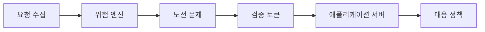
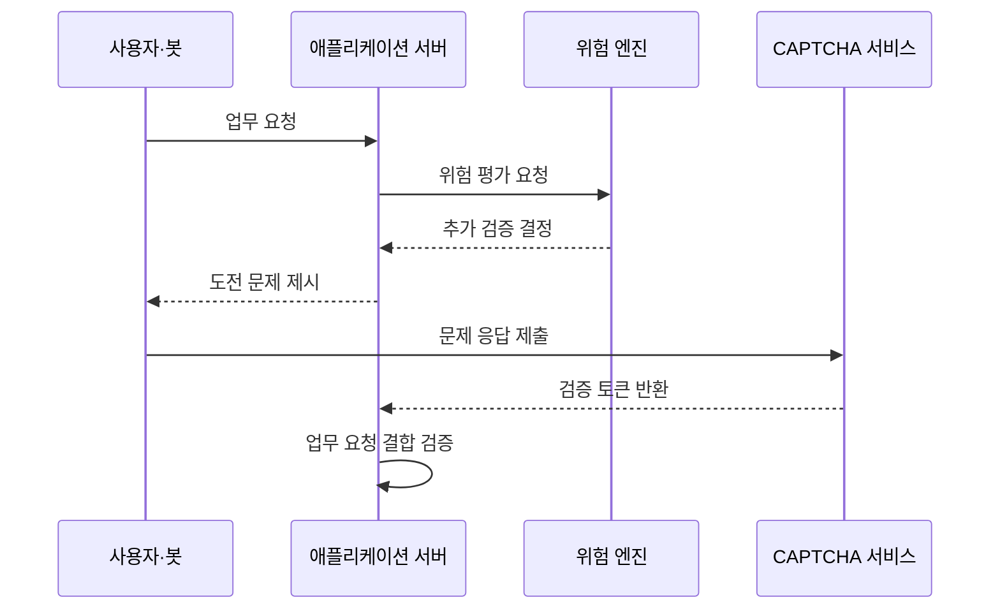

---
sidebar:
  order: 69
  label: "069. CAPTCHA·reCAPTCHA (CAPTCHA)"
  badge:
    text: "기출 · 30%"
    variant: note
title: "CAPTCHA·reCAPTCHA (CAPTCHA)"
date: "2026-07-25T22:09:00+09:00"
tags:
  - "notes-security"
weight: 69
extra:
  question_no: "069"
  source_status: "기출"
  source_history: "128회"
  priority: 30
  priority_note: "128회 기출이나 봇 방지 보조통제의 범위는 좁음"
---

## 미리 알고가기

- **컴퓨터와 인간을 구별하는 완전 자동화된 공개 튜링 테스트(Completely Automated Public Turing Test to Tell Computers and Humans Apart, CAPTCHA)**: 영문 주요 글자를 딴 공식 표기라 “캡차”로 읽으며, 사람과 자동화 요청을 구분해 봇의 처리 비용을 높이는 시험
- **리캡차(reCAPTCHA, 리캡차)**: `re`를 앞에 붙인 공식 서비스명이라 “리캡차”로 읽으며, 문제 풀이와 행위 신호로 CAPTCHA를 구현한다
- **봇(Bot)**: 정해진 작업을 대량으로 자동 수행하는 프로그램
- **크리덴셜 스터핑(Credential Stuffing)**: 다른 서비스에서 유출된 계정·비밀번호 조합으로 대량 로그인을 시도하는 공격
- **위험 엔진(Risk Engine)**: 기기·행위·요청 맥락을 분석해 자동화 가능성을 점수화하는 기능
- **도전 문제(Challenge)**: 이미지·문자·동작처럼 사용자가 수행해야 하는 시험
- **검증 토큰(Verification Token)**: CAPTCHA 통과 결과와 짧은 유효 시간을 나타내는 증표
- **호출률 제한(Rate Limiting)**: 일정 시간 동안 허용할 요청 수를 제한하는 통제
- **다중 요소 인증(Multi-Factor Authentication, MFA)**: 영문 머리글자를 딴 공식 표기라 “엠에프에이”로 읽으며, 위험한 CAPTCHA 요청에서 서로 다른 인증 요소를 둘 이상 확인한다
- **인공지능(Artificial Intelligence, AI)**: 영문 머리글자를 딴 공식 표기라 “에이아이”로 읽으며, 문제 풀이형 CAPTCHA를 자동 해석하는 비교 위험
- **적응형 통제(Adaptive Control)**: 요청 위험에 따라 추가 검증의 강도를 바꾸는 방식
- **접근성(Accessibility)**: 장애나 사용 환경과 관계없이 서비스를 이용할 수 있는 성질
- **오탐(False Positive)**: 정상 사용자를 자동화 공격으로 잘못 판단하는 결과
- **재전송 공격(Replay Attack)**: 이전에 받은 정상 토큰을 다시 제출해 검증을 우회하는 공격

## Ⅰ. 개요

- **정의**: 자동화 요청의 비용을 높이는 보조 통제
- **배경/필요성**: 대량 가입·스팸·로그인 공격
- **한계**: 사람 인증이나 계정 권한을 보장하지 않음

### 쉽게 이해하기 (학습용)

- CAPTCHA는 사용자가 누구인지 증명하지 않고 한꺼번에 많은 요청을 보내는 프로그램의 속도와 비용을 불리하게 만든다.

## Ⅱ. 특징

- 공개 진입점의 위험 요청에 선택적으로 적용한다.
- 문제 풀이형과 행위 점수형으로 구분한다.
- 서버가 토큰의 목적·만료·재사용을 검증한다.
- 호출률 제한·계정 위험·MFA와 결합한다.
- 접근성과 개인정보 영향을 함께 관리한다.

### 쉽게 이해하기 (학습용)

- 문제를 맞혔다는 결과만 믿지 말고 그 결과가 지금 이 요청을 위해 방금 발급됐는지 서버에서 확인해야 한다.

## Ⅲ. 아키텍처 및 구성요소

| 설계 요소 | 설명 |
|:---|:---|
| 요청 수집 | 계정·기기·행위 신호 수집 |
| 위험 엔진 | 자동화 가능성 평가 |
| 도전 문제 | 필요 시 추가 과제 제시 |
| 검증 토큰 | 통과 결과와 맥락 전달 |
| 애플리케이션 서버 | 토큰과 업무 요청 결합 검증 |
| 대응 정책 | 허용·지연·차단·MFA 결정 |

### 쉽게 이해하기 (학습용)

- 위험 엔진이 수상한 요청에 문제를 내고 서버는 통과 토큰을 원래 업무 요청과 묶어 최종 대응을 정한다.

## Ⅳ. 원리 및 절차 흐름도

| 절차 | 설명 |
|:---|:---|
| 업무 요청 | 가입·로그인·결제 시도 |
| 위험 평가 요청 | 계정·기기·행위 신호 전달 |
| 추가 검증 결정 | 위험 임계값과 정책 적용 |
| 도전 문제 제시 | 고위험 요청에만 과제 요구 |
| 문제 응답 제출 | 사용자 풀이 결과 전송 |
| 검증 토큰 반환 | 서명된 단기 결과 발급 |
| 업무 요청 결합 검증 | 목적·만료·재사용 확인 |

> 요약: 위험한 요청에만 단기 검증을 결합한다.

### 쉽게 이해하기 (학습용)

- 위험한 요청에만 문제를 내고 통과 결과를 원래 요청과 묶어 확인한 뒤 가입이나 로그인을 계속 진행한다.

## Ⅴ. 종류 및 비교

| 비교축 | CAPTCHA 공통 | 문제 풀이형 | 위험 점수형 | 적응형 혼합 |
|:---|:---|:---|:---|:---|
| 핵심 특징 | 봇 처리 비용 증가 | 사용자가 과제 직접 수행 | 행위 신호로 점수 산출 | 위험할 때만 문제 제시 |
| 적용 기준 | 공개 기능의 자동화 억제 | 단순하고 명시적 검증 | 사용자 마찰 최소화 | 위험별 검증 강도 조정 |
| 주요 위험 | 우회·대행 서비스 | 접근성 저하·AI 풀이 | 추적·모델 오탐 | 정책 복잡성과 편향 |

### 쉽게 이해하기 (학습용)

- 문제형은 눈에 보이는 부담이 크고 점수형은 조용하지만 오탐과 추적 위험이 있으며 적응형은 위험한 요청에 부담을 집중한다.

## Ⅵ. 실무 사례

- **사례 1**: 대량 가입에 호출률 제한과 함께 적용
- **사례 2**: 로그인 위험 상승 시 MFA로 단계 상향
- **사례 3**: 시각 과제에 접근 가능한 대안 제공
- **사례 4**: 정상 실패율과 봇 통과율을 함께 관찰

### 쉽게 이해하기 (학습용)

- 사례 1은 CAPTCHA 대행만으로 대량 계정을 빠르게 만들지 못하도록 요청 속도 자체도 제한한다.
- 사례 2는 문제 통과만으로 계정 주인을 인정하지 않고 위험한 로그인에는 실제 인증 요소를 더 요구한다.
- 사례 3은 시각·청각·인지 제약이 있는 정상 사용자가 서비스에서 배제되지 않게 한다.
- 사례 4는 공격 차단률만 높이다가 정상 고객까지 거부하는 정책 실패를 함께 찾아 조정한다.

## Ⅶ. 결론

- 자동화 남용이면 CAPTCHA를 다른 통제와 결합한다.

### 쉽게 이해하기 (학습용)

- CAPTCHA는 봇을 완전히 식별하는 답이 아니라 공격 경제성을 낮추는 보조 수단이므로 호출률·계정 위험·강한 인증과 함께 써야 한다.
