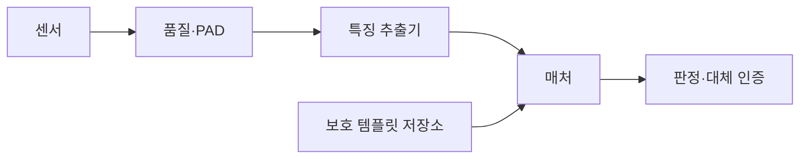
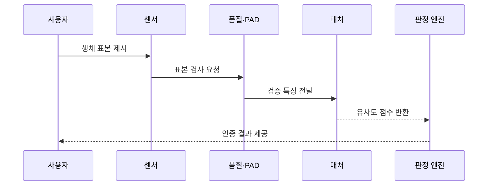

---
sidebar:
  order: 70
  label: "070. 생체 인식 — 지문·얼굴·홍채 (Biometric Authentication)"
  badge:
    text: "기출 · 50%"
    variant: note
title: "생체 인식 — 지문·얼굴·홍채 (Biometric Authentication)"
date: "2026-07-27T23:59:59+09:00"
tags:
  - "notes-security"
weight: 70
extra:
  question_no: "070"
  source_status: "기출"
  source_history: "126회"
  priority: 50
  priority_note: "126회 기출이며 인증 성능·프라이버시 비교에 유용함"
---

## 미리 알고가기

- **생체 인증(Biometric Authentication)**: 신체·행동 특징의 유사도로 사용자를 판정하는 인증 방식
- **생체 표본(Biometric Sample)**: 센서가 촬영·측정한 지문·얼굴·홍채의 원시 데이터
- **생체 템플릿(Biometric Template)**: 생체 표본에서 추출한 비교용 특징값
- **특징 추출기(Feature Extractor)**: 원시 표본을 비교 가능한 템플릿으로 변환하는 기능
- **매처(Matcher)**: 새 템플릿과 등록 템플릿의 유사도를 계산하는 기능
- **판정 임계값(Decision Threshold)**: 유사도 점수를 수락 또는 거부로 나누는 기준
- **오일치율(False Match Rate, FMR)**: 다른 사람의 생체 정보를 등록 사용자의 것으로 잘못 수락하는 비율이다.
- **오불일치율(False Non-Match Rate, FNMR)**: 등록 사용자의 생체 정보를 본인의 것이 아니라고 잘못 거부하는 비율이다.
- **제시 공격 탐지(Presentation Attack Detection, PAD)**: 사진·모형·복제 지문처럼 센서에 제시된 위조 생체 표본을 탐지하는 기술이다.
- **취소 가능 템플릿(Cancelable Template)**: 유출되면 변환 방식을 바꿔 다시 등록할 수 있는 생체 템플릿
- **로컬 비교(Local Matching)**: 생체 표본이나 템플릿을 외부 서버로 보내지 않고 단말 안에서 비교하는 방식
- **대체 인증(Fallback Authentication)**: 생체 인식 실패·불가 때 사용하는 다른 인증 수단
- **보안 영역(Secure Enclave)**: 키와 민감 연산을 일반 실행 환경과 분리해 보호하는 하드웨어 영역

## Ⅰ. 개요

- **정의**: 생체 표본과 등록 템플릿의 유사도로 본인을 판정
- **배경/필요성**: 비밀번호 탈취·공유에 따른 본인 확인 한계 보완
- **한계**: 생체정보 유출 시 원본 특징 변경 곤란

### 쉽게 이해하기 (학습용)

- 생체 인증은 완전히 같은 값을 찾는 것이 아니라 새 표본이 등록 특징과 충분히 비슷한지를 임계값으로 판단한다.

## Ⅱ. 특징

- 확률 판정이라 오수락과 오거부가 발생한다.
- 센서·조명·자세·사용자 집단에 민감하다.
- PAD로 사진·모형 같은 제시 공격을 탐지한다.
- 생체 정보는 교체가 어려워 템플릿을 보호한다.
- 안전한 등록과 대체 인증이 전체 강도를 결정한다.

### 쉽게 이해하기 (학습용)

- 임계값을 낮추면 편하지만 타인을 받아들일 위험이 커지고 높이면 안전하지만 본인을 자주 거부할 수 있다.

## Ⅲ. 아키텍처 및 구성요소

| 설계 요소 | 설명 |
|:---|:---|
| 센서 | 생체 표본 수집 |
| 품질·PAD | 표본 품질과 위조 여부 검사 |
| 특징 추출기 | 표본을 비교 템플릿으로 변환 |
| 매처 | 등록값과 유사도 계산 |
| 보호 템플릿 저장소 | 등록 특징을 암호화 보관 |
| 판정·대체 인증 | 임계값 판정과 실패 처리 |

### 쉽게 이해하기 (학습용)

- 센서가 받은 표본의 품질과 위조 여부를 먼저 보고 특징을 추출해 보호된 등록값과 비교한 뒤 인증 여부를 정한다.

## Ⅳ. 원리 및 절차 흐름도

| 절차 | 설명 |
|:---|:---|
| 생체 표본 제시 | 지문·얼굴·홍채를 센서에 입력 |
| 표본 검사 요청 | 품질과 제시 공격 여부 확인 |
| 검증 특징 전달 | 통과 표본에서 템플릿 추출 |
| 유사도 점수 반환 | 등록 템플릿과 비교 |
| 인증 결과 제공 | 임계값 판정 또는 대체 인증 |

> 요약: 위조를 거른 뒤 특징 유사도로 판정한다.

### 쉽게 이해하기 (학습용)

- 새 표본이 실제 사람에게서 왔는지 먼저 확인하고 등록 특징과의 유사도가 기준을 넘을 때만 인증한다.

## Ⅴ. 생체 인증 방식 비교

| 비교축 | 생체 인증 공통 | 지문 | 얼굴 | 홍채 |
|:---|:---|:---|:---|:---|
| 적용 기준 | 빠른 로컬 사용자 확인 | 모바일·개인 단말 | 출입·비접촉 환경 | 고정 센서의 고정밀 확인 |
| 핵심 특징 | 생체 특징의 확률 비교 | 융선 무늬를 접촉 측정 | 얼굴 구조를 비접촉 촬영 | 홍채 무늬를 근적외선 촬영 |
| 한계 | 템플릿 유출·편향 | 복제 지문·표면 상태 | 사진·영상·조명 | 인공 안구·정렬 실패 |

### 쉽게 이해하기 (학습용)

- 지문은 접촉 상태, 얼굴은 조명과 각도, 홍채는 촬영 거리와 정렬에 민감하므로 환경과 위조 방식에 맞춰 선택한다.

## Ⅵ. 실무 사례

1. 휴대전화의 **보안 영역에서 지문 인증**

### 쉽게 이해하기 (학습용)

- 휴대전화는 지문 템플릿과 비교 연산을 단말의 보안 영역에 두고, 서버에는 생체 원본 대신 인증 성공을 증명하는 서명 결과만 보낸다.

## Ⅶ. 결론

- 생체 정보의 위조와 비가역적 유출 위험을 줄이기 위해 등록 신뢰·PAD·FMR·FNMR·템플릿 보호·대체 절차를 검토하여, 위험 수준에 맞는 생체 인증을 선택해야 한다.

### 쉽게 이해하기 (학습용)

- 생체 인증의 품질은 센서 편의보다 안전한 등록·위조 탐지·오류율 조정·템플릿 보호·대체 절차를 함께 운영하는 데서 결정된다.
