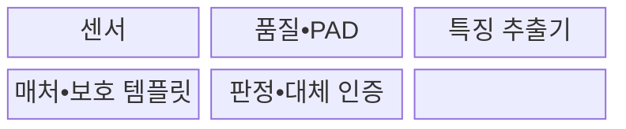
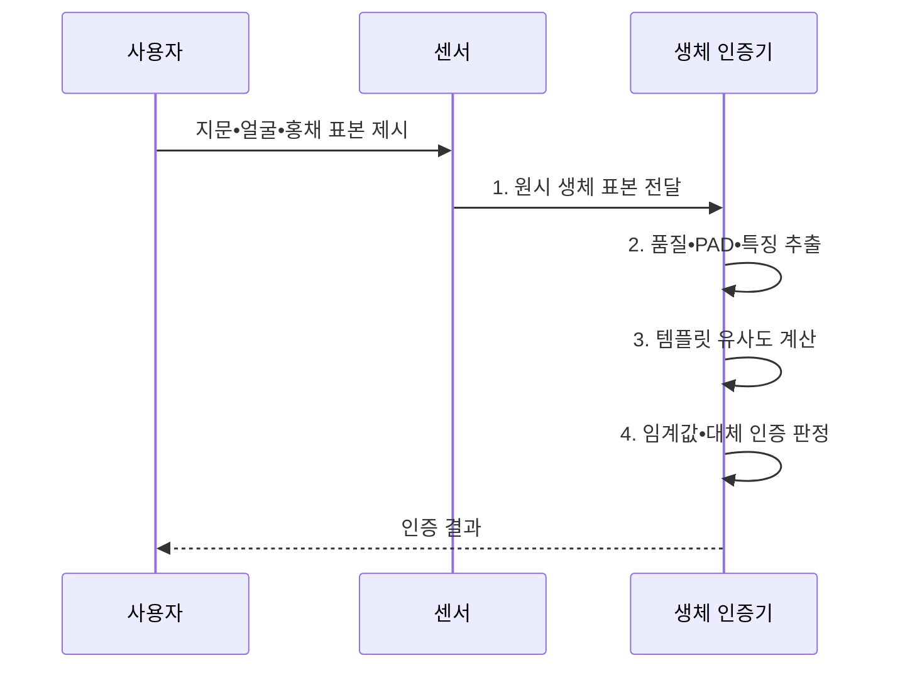

---
sidebar:
  order: 70
  label: "070. 생체 인식 — 지문•얼굴•홍채 (Biometric Authentication)"
  badge:
    text: "기출 • 50%"
    variant: note
title: "생체 인식 — 지문•얼굴•홍채 (Biometric Authentication)"
date: "2026-08-03T14:40:00+09:00"
tags:
  - "notes-security"
weight: 70
extra:
  question_no: "070"
  source_status: "기출"
  source_history: "126회"
  priority: 50
  priority_note: "126회 기출이며 인증 성능•프라이버시 비교에 유용함"
---

## Ⅰ. 개요

핵심 용어

- **생체 인증**: 지문•얼굴•홍채 같은 신체 특징의 유사도를 등록값과 비교하여 사용자를 판정하는 인증 방식이다.
- **생체 표본•템플릿**: 표본은 센서가 측정한 원시 데이터이고 템플릿은 그 표본에서 추출한 비교용 특징값이다.

- 정의/개념: **생체 인증** 은 사용자의 지문•얼굴•홍채 같은 생체 표본을 등록 템플릿과 비교하여 유사도가 임계값을 충족하는지 판정하는 사용자 인증 방식
- 배경/필요성: 비밀번호의 **탈취•공유•대리 사용**

#### 한줄 요약

- 생체 인증은 완전히 같은 값을 찾는 것이 아니라 새 표본이 등록 특징과 충분히 비슷한지를 임계값으로 판단한다.

## Ⅱ. 특징

핵심 용어

- **FMR•FNMR•EER**: FMR은 타인을 잘못 수락하는 비율, FNMR은 본인을 잘못 거부하는 비율이며 EER은 두 오류율이 같아지는 지점이다.
- **판정 임계값•PAD(Presentation Attack Detection)**: 임계값은 유사도 점수의 수락 기준이고 PAD는 사진•모형•복제 지문 같은 위조 표본을 탐지하는 기술이다.

> 정규화한 대칭 오류 곡선을 가정한 개념도에서 임계값이 높아지면 파란 FMR은 감소하고 붉은 FNMR은 증가하며 교차점이 EER의 의미를 보여 줄 뿐 실제 오류율은 장비•데이터로 측정해야 한다.

- **FMR•FNMR 상충**: 임계값 상승 시 FMR 감소•FNMR 증가
- **성능•편향 차이**: 센서•환경•집단별 오류율 변동
- **다층 보호**: PAD•템플릿 보호•대체 인증 결합

#### 한줄 요약

- 임계값을 낮추면 편하지만 타인을 받아들일 위험이 커지고 높이면 안전하지만 본인을 자주 거부할 수 있다.

## Ⅲ. 구조 및 구성요소

핵심 용어

- **특징 추출기•매처**: 특징 추출기는 원시 표본을 비교 템플릿으로 변환하고 매처는 새 템플릿과 등록값의 유사도를 계산한다.
- **판정 엔진•대체 인증**: 판정 엔진은 임계값으로 수락•거부를 결정하고 인식 실패나 이용 불가 때 다른 인증 수단으로 전환한다.

| 구성요소 | 책임 |
|:---|:---|
| **센서** | 생체 **표본 수집** |
| **품질•PAD** | 표본 품질과 **위조 여부 검사** |
| **특징 추출기** | 표본을 **비교 템플릿으로 변환** |
| **매처•보호 템플릿** | 등록값 보관과 **유사도 계산** |
| **판정•대체 인증** | 임계값 판정과 **실패 처리** |

#### 한줄 요약

- 센서가 받은 표본의 품질과 위조 여부를 먼저 보고 특징을 추출해 보호된 등록값과 비교한 뒤 인증 여부를 정한다.

## Ⅳ. 흐름도

핵심 용어

- **품질•제시 공격 검사**: 표본의 비교 가능성과 실제 사용자에게서 수집되었는지를 특징 추출 전에 확인하는 절차이다.
- **유사도 점수**: 새 생체 특징과 등록 템플릿이 얼마나 가까운지를 수치화해 임계값 판정에 제공하는 값이다.

**동작 원리**

- **1. 원시 생체 표본 전달**: 센서가 측정한 생체정보 제공
- **2. 품질•PAD•특징 추출**: 품질•위조 검사 후 비교용 특징 생성
- **3. 템플릿 유사도 계산**: 보호 등록값과 비교해 점수 산출
- **4. 임계값•대체 인증 판정**: 수락•거부•보조 경로 선택
#### 한줄 요약

- 새 표본이 실제 사람에게서 왔는지 먼저 확인하고 등록 특징과의 유사도가 기준을 넘을 때만 인증한다.

## Ⅴ. 종류 및 비교

핵심 용어

- **지문•얼굴•홍채**: 지문은 융선 접촉, 얼굴은 구조의 비접촉 촬영, 홍채는 무늬의 근적외선 촬영으로 특징을 얻는 생체 방식이다.
- **성능 편향**: 센서•환경•사용자 집단에 따라 FMR과 FNMR 같은 오류율이 달라지는 현상이다.

| 생체 인증 유형 | 생체 인증 공통 | 지문 | 얼굴 | 홍채 |
|:---|:---|:---|:---|:---|
| 적용 기준 | 빠른 **로컬 사용자 확인** | **모바일•개인 단말** | **출입•비접촉 환경** | 고정 센서의 **고정밀 확인** |
| 핵심 특징 | **생체 특징 확률 비교** | **융선 무늬 접촉 측정** | **얼굴 구조 비접촉 촬영** | **홍채 무늬 근적외선 촬영** |
| 한계 | **템플릿 유출•편향** | **복제 지문•표면 상태** | **사진•영상•조명** | **인공 안구•정렬 실패** |

#### 한줄 요약

- 지문은 접촉 상태, 얼굴은 조명과 각도, 홍채는 촬영 거리와 정렬에 민감하므로 환경과 위조 방식에 맞춰 선택한다.

## Ⅵ. 실무 고려사항 및 대책

핵심 용어

- **ISO/IEC 19795-1•30107-3**: 전자는 생체 성능 시험과 오류율 보고를, 후자는 제시 공격 탐지의 시험•평가 방법을 정의한다.
- **로컬 비교•취소 가능 템플릿**: 민감한 비교를 단말에서 수행하고 유출 때 변환 방식을 바꿔 다시 등록할 수 있게 하는 보호 방식이다.

| 문제 | 대책 | 효과 |
|:---|:---|:---|
| **FMR•FNMR•편향** | **ISO/IEC 19795-1:2021 시험** | 환경•집단별 **성능 근거 확보** |
| **사진•모형 제시 공격** | **ISO/IEC 30107-3:2023 평가** | PAD 성능과 **보고 일관화** |
| **템플릿 유출•인식 실패** | **로컬 비교•취소형•대체 인증** | 비가역 노출과 **접근 실패 완화** |

#### 한줄 요약

- 휴대전화는 지문 템플릿과 비교 연산을 단말의 보안 영역에 두고, 서버에는 생체 원본 대신 인증 성공을 증명하는 서명 결과만 보낸다.

## Ⅶ. 결론

핵심 용어

- **생체 인증 운영 품질**: 안전한 등록•위조 탐지•오류율 조정•템플릿 보호•대체 절차를 함께 유지하는 능력이다.
- **지문•얼굴•홍채 선택**: 모바일 개인 단말, 비접촉 출입, 고정밀 고정 센서라는 사용 환경에 맞춘 판단이다.

- 모바일 개인 단말은 **지문**, 비접촉 출입은 **얼굴**, 고정밀 고정 센서는 **홍채**

#### 한줄 요약

- 생체 인증의 품질은 센서 편의보다 안전한 등록•위조 탐지•오류율 조정•템플릿 보호•대체 절차를 함께 운영하는 데서 결정된다.
