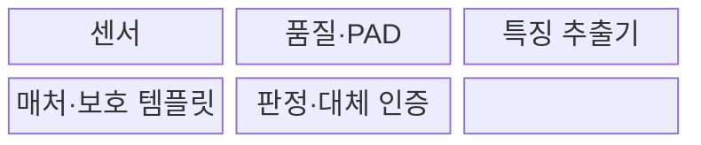
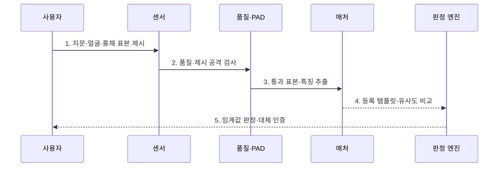

---
sidebar:
  order: 70
  label: "070. 생체 인식 — 지문·얼굴·홍채 (Biometric Authentication)"
  badge:
    text: "기출 · 50%"
    variant: note
title: "생체 인식 — 지문·얼굴·홍채 (Biometric Authentication)"
date: "2026-07-30T19:15:00+09:00"
tags:
  - "notes-security"
weight: 70
extra:
  question_no: "070"
  source_status: "기출"
  source_history: "126회"
  priority: 50
  priority_note: "126회 기출이며 인증 성능·프라이버시 비교에 유용함"
---

## 미리 알고가기

- **생체 인증(Biometric Authentication)**: 신체·행동 특징의 유사도로 사용자를 판정하는 인증 방식이다.
- **생체 표본(Biometric Sample)**: 센서가 촬영·측정한 지문·얼굴·홍채의 원시 데이터이다.
- **생체 템플릿(Biometric Template)**: 생체 표본에서 추출한 비교용 특징값이다.
- **특징 추출기(Feature Extractor)**: 원시 표본을 비교 가능한 템플릿으로 변환하는 기능이다.
- **매처(Matcher)**: 새 템플릿과 등록 템플릿의 유사도를 계산하는 기능이다.
- **판정 임계값(Decision Threshold)**: 유사도 점수를 수락 또는 거부로 나누는 기준이다.
- **오일치율(False Match Rate, FMR)**: 다른 사람의 생체 정보를 등록 사용자의 것으로 잘못 수락하는 비율이다.
- **오불일치율(False Non-Match Rate, FNMR)**: 등록 사용자의 생체 정보를 본인의 것이 아니라고 잘못 거부하는 비율이다.
- **제시 공격 탐지(Presentation Attack Detection, PAD)**: 사진·모형·복제 지문처럼 센서에 제시된 위조 생체 표본을 탐지하는 기술이다.
- **취소 가능 템플릿(Cancelable Template)**: 유출되면 변환 방식을 바꿔 다시 등록할 수 있는 생체 템플릿이다.
- **로컬 비교(Local Matching)**: 생체 표본이나 템플릿을 외부 서버로 보내지 않고 단말 안에서 비교하는 방식이다.
- **대체 인증(Fallback Authentication)**: 생체 인식 실패·불가 때 사용하는 다른 인증 수단이다.
- **보안 영역(Secure Enclave)**: 키와 민감 연산을 일반 실행 환경과 분리해 보호하는 하드웨어 영역이다.
- **ISO/IEC 19795-1:2021**: 생체인식 성능 시험의 원칙·오류율·보고 요구를 정의한 국제표준이다.
- **ISO/IEC 30107-3:2023**: 생체 제시 공격 탐지의 시험·평가·보고 방법을 정의한 국제표준이다.

## Ⅰ. 개요

- 정의/개념: 생체 표본·등록 템플릿의 **유사도 판정**
- 배경/필요성: 비밀번호의 **탈취·공유·대리 사용**

### 쉽게 이해하기 (학습용)

- 생체 인증은 완전히 같은 값을 찾는 것이 아니라 새 표본이 등록 특징과 충분히 비슷한지를 임계값으로 판단한다.

## Ⅱ. 특징

> 정규화한 대칭 오류 곡선을 가정한 개념도에서 임계값이 높아지면 파란 FMR은 감소하고 붉은 FNMR은 증가하며 교차점이 EER의 의미를 보여 줄 뿐 실제 오류율은 장비·데이터로 측정해야 한다.

- 확률 판정의 **FMR·FNMR 상충**
- 센서·환경·집단별 **성능·편향 차이**
- PAD·템플릿·대체 인증의 **다층 보호**

### 쉽게 이해하기 (학습용)

- 임계값을 낮추면 편하지만 타인을 받아들일 위험이 커지고 높이면 안전하지만 본인을 자주 거부할 수 있다.

## Ⅲ. 구조 및 구성요소

| 구성요소 | 책임 |
|:---|:---|
| 센서 | 생체 표본 수집 |
| 품질·PAD | 표본 품질과 위조 여부 검사 |
| 특징 추출기 | 표본을 비교 템플릿으로 변환 |
| 매처·보호 템플릿 | 등록값 보관·유사도 계산 |
| 판정·대체 인증 | 임계값 판정과 실패 처리 |

### 쉽게 이해하기 (학습용)

- 센서가 받은 표본의 품질과 위조 여부를 먼저 보고 특징을 추출해 보호된 등록값과 비교한 뒤 인증 여부를 정한다.

## Ⅳ. 흐름도

**동작 원리**

- **1. 지문·얼굴·홍채 표본 제시**: 센서에 원시 생체정보 입력
- **2. 품질·제시 공격 검사**: 환경 품질·위조 여부 확인
- **3. 통과 표본·특징 추출**: 비교용 템플릿으로 변환
- **4. 등록 템플릿·유사도 비교**: 보호 저장값과 점수 산출
- **5. 임계값 판정·대체 인증**: 수락·거부·보조 경로 선택
### 쉽게 이해하기 (학습용)

- 새 표본이 실제 사람에게서 왔는지 먼저 확인하고 등록 특징과의 유사도가 기준을 넘을 때만 인증한다.

## Ⅴ. 종류 및 비교

| 생체 인증 유형 | 생체 인증 공통 | 지문 | 얼굴 | 홍채 |
|:---|:---|:---|:---|:---|
| 적용 기준 | 빠른 로컬 사용자 확인 | 모바일·개인 단말 | 출입·비접촉 환경 | 고정 센서의 고정밀 확인 |
| 핵심 특징 | **생체 특징 확률 비교** | **융선 무늬 접촉 측정** | 얼굴 구조 비접촉 촬영 | 홍채 무늬 근적외선 촬영 |
| 한계 | 템플릿 유출·편향 | 복제 지문·표면 상태 | 사진·영상·조명 | 인공 안구·정렬 실패 |

### 쉽게 이해하기 (학습용)

- 지문은 접촉 상태, 얼굴은 조명과 각도, 홍채는 촬영 거리와 정렬에 민감하므로 환경과 위조 방식에 맞춰 선택한다.

## Ⅵ. 실무 고려사항 및 대책

| 고려사항 | 대책 | 효과 |
|:---|:---|:---|
| FMR·FNMR·편향 | **ISO/IEC 19795-1:2021 시험** | 환경·집단별 성능 근거 확보 |
| 사진·모형 제시 공격 | **ISO/IEC 30107-3:2023 평가** | PAD 성능·보고 일관화 |
| 템플릿 유출·인식 실패 | **로컬 비교·취소형·대체 인증** | 비가역 노출·접근 실패 완화 |

### 쉽게 이해하기 (학습용)

- 휴대전화는 지문 템플릿과 비교 연산을 단말의 보안 영역에 두고, 서버에는 생체 원본 대신 인증 성공을 증명하는 서명 결과만 보낸다.

## Ⅶ. 결론

- **오류율·제시공격·템플릿보호**로 생체 방식을 결정한다.

### 쉽게 이해하기 (학습용)

- 생체 인증의 품질은 센서 편의보다 안전한 등록·위조 탐지·오류율 조정·템플릿 보호·대체 절차를 함께 운영하는 데서 결정된다.
