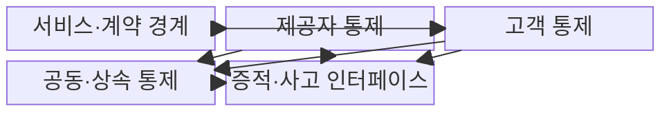
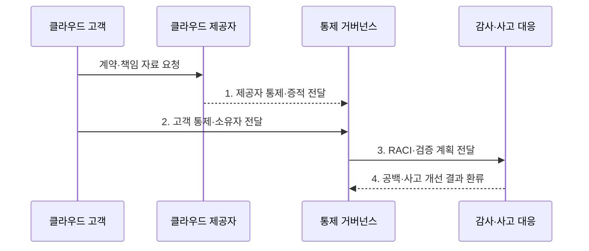

---
sidebar:
  order: 71
  label: "071. 클라우드 보안 공유 책임 모델 (Cloud Shared Responsibility)"
  badge:
    text: "기출 · 70%"
    variant: note
title: "클라우드 보안 공유 책임 모델 (Cloud Shared Responsibility)"
date: "2026-08-02T12:20:00+09:00"
tags:
  - "notes-security"
weight: 71
extra:
  question_no: "071"
  source_status: "기출"
  source_history: "137회"
  priority: 70
  priority_note: "137회 기출이며 서비스모델별 책임 설계가 반복 활용됨"
---

## Ⅰ. 개요

핵심 용어

- **공유 책임 모델**: 클라우드 제공자와 고객이 서비스 계층별 보안 통제의 수행·증명 책임을 나누는 원칙이다.
- **책임 공백**: 제공자와 고객 어느 쪽에도 특정 통제의 수행 책임이 지정되지 않은 상태이다.

- 정의/개념: **클라우드 공유 책임 모델**은 서비스 계층별 보안 통제의 수행·증명 책임을 제공자와 고객에게 배분하는 **보안 거버넌스 원칙**
- 배경/필요성: 제공자 전담 오해로 **통제 책임 공백**

### 쉽게 이해하기 (학습용)

- 클라우드를 빌려도 보안 전체를 맡긴 것은 아니므로 건물 관리와 입주자 관리처럼 각자 해야 할 일을 통제별로 나눠야 한다.

## Ⅱ. 특징

핵심 용어

- **통제 소유권**: 각 보안 통제를 수행하고 결과를 증명할 제공자 또는 고객 책임 주체를 지정하는 것이다.
- **운영 증적**: 설정·로그·감사 보고서처럼 통제가 실제 수행되었음을 입증하는 자료이다.

- **계층별 통제 소유권**: 제공자·고객의 수행 책임 지정
- **책임 경계 이동**: IaaS·PaaS·SaaS별 고객 관리 범위 변화
- **책임 이행 증명**: 계약·설정·로그로 수행 결과 확인

### 쉽게 이해하기 (학습용)

- 제공자가 서버를 안전하게 운영해도 고객이 관리자 계정이나 공개 공유 설정을 잘못 관리하면 데이터는 여전히 노출된다.

## Ⅲ. 구조 및 구성요소

핵심 용어

- **공동·상속 통제**: 공동 통제는 양측이 각 부분을 수행해야 완성되고 상속 통제는 제공자의 수행 결과를 고객 통제의 일부로 활용한다.
- **SLA·사고 인터페이스**: SLA는 가용성·지원·복구와 책임 범위를 정하고 사고 인터페이스는 탐지·통보·조사·복구의 협업 절차를 정한다.

| 구성요소 | 책임 |
|:---|:---|
| **서비스·계약 경계** | 기능·SLA·**제외 책임 정의** |
| **제공자 통제** | 시설·하드웨어·**관리 계층 보호** |
| **고객 통제** | 계정·데이터·**앱 설정 보호** |
| **공동·상속 통제** | 책임 분담과 **제공자 결과 활용** |
| **증적·사고 인터페이스** | 감사 자료와 **대응 협업 연결** |

### 쉽게 이해하기 (학습용)

- 계약으로 경계를 정하고 양측 통제를 이어 붙인 뒤 감사 자료와 사고 대응 절차로 실제 수행 여부를 확인한다.

## Ⅳ. 흐름도

핵심 용어

- **RACI**: 통제별 수행자·최종 책임자·협의자·통보 대상을 구분하여 책임과 검증 절차를 연결하는 행렬이다.
- **책임 검증 계획**: 양측의 통제 수행 결과를 어떤 증거와 주기로 확인할지 정한 계획이다.

**동작 원리**

- **1. 제공자 통제·증적 전달**: 하부 계층 보호 근거 제공
- **2. 고객 통제·소유자 전달**: 계정·데이터·설정 책임 제공
- **3. RACI·검증 계획 전달**: 수행·승인·증거 확인 방법 제공
- **4. 공백·사고 개선 결과 환류**: 책임표·설정·협업 절차 갱신
### 쉽게 이해하기 (학습용)

- 양측이 맡은 통제와 확인할 증거를 미리 연결해야 사고 때 서로의 책임이라고 미루지 않고 빠르게 조치할 수 있다.

## Ⅴ. 종류 및 비교

핵심 용어

- **IaaS·PaaS·SaaS**: IaaS는 고객이 OS부터, PaaS는 애플리케이션부터, SaaS는 계정·데이터·업무 설정부터 관리 책임을 진다.

| 클라우드 책임 유형 | 공유 책임 공통 | IaaS | PaaS | SaaS |
|:---|:---|:---|:---|:---|
| 적용 기준 | 클라우드 **통제 소유권 정의** | 높은 **구성 자유도** | **개발 플랫폼 활용** | 완성 **업무 기능 사용** |
| 핵심 특징 | **제공자·고객 계층 분담** | **고객이 OS부터 관리** | **고객이 앱부터 관리** | **고객이 계정·데이터 관리** |
| 한계 | **책임 공백·증적 단절** | **패치·망 설정 오류** | **비밀·권한 구성 오류** | **계정·공유 설정 오류** |

### 쉽게 이해하기 (학습용)

- IaaS는 고객이 관리할 층이 가장 많고 PaaS와 SaaS로 갈수록 줄지만 계정·데이터·업무 설정 책임은 계속 남는다.

## Ⅵ. 실무 고려사항 및 대책

핵심 용어

- **NIST SP 800-145**: IaaS·PaaS·SaaS 등 클라우드 서비스와 배치 모델을 정의한 공식 문서이다.
- **ISO/IEC 27017:2015**: 클라우드 제공자와 고객의 역할별 정보보호 통제 지침을 제시한 국제표준이다.

| 문제 | 대책 | 효과 |
|:---|:---|:---|
| **서비스 모델별 경계 혼선** | **NIST SP 800-145 기준 분류** | IaaS·PaaS·SaaS의 **책임 정렬** |
| **제공자·고객 통제 편차** | **ISO/IEC 27017:2015 적용** | 역할·구현의 **지침 명확화** |
| **증적·사고 협업 공백** | **RACI·SLA·로그 제공 명시** | 책임 전가와 **대응 지연 방지** |

### 쉽게 이해하기 (학습용)

- 클라우드 제공자는 저장 인프라를 보호하지만 고객은 버킷 공개 여부와 사용자 권한을 설정·점검해야 하므로 양측 책임을 통제표에 명시한다.

## Ⅶ. 결론

핵심 용어

- **통제별 책임 완결성**: 모든 통제에 수행 주체·최종 책임·증거·사고 협업 절차가 빠짐없이 지정된 상태이다.

- **IaaS·PaaS·SaaS**는 OS·앱·계정부터 각각 **고객 책임**으로 지정

### 쉽게 이해하기 (학습용)

- 공유 책임은 사고 책임을 나누는 면책 문구가 아니라 각 통제를 누가 어떻게 수행하고 무엇으로 증명할지 정하는 운영 기준이다.
