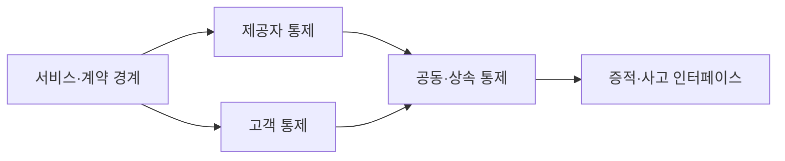
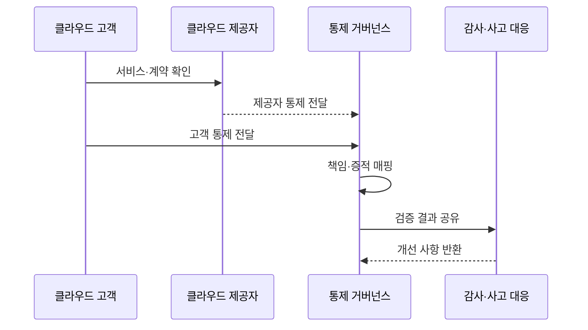

---
sidebar:
  order: 71
  label: "071. 클라우드 보안 공유 책임 모델 (Cloud Shared Responsibility)"
  badge:
    text: "기출 · 70%"
    variant: note
title: "클라우드 보안 공유 책임 모델 (Cloud Shared Responsibility)"
date: "2026-07-27T23:59:59+09:00"
tags:
  - "notes-security"
weight: 71
extra:
  question_no: "071"
  source_status: "기출"
  source_history: "137회"
  priority: 70
  priority_note: "137회 기출이며 서비스모델별 책임 설계가 반복 활용됨"
---

## 미리 알고가기

- **공유 책임 모델(Shared Responsibility Model)**: 클라우드 제공자와 고객이 계층별 보안 책임을 나누는 원칙
- **서비스형 인프라(Infrastructure as a Service, IaaS)**: 영문 주요 글자를 딴 공식 표기라 “아이아스”로 읽으며, 서버·저장소·네트워크 인프라를 서비스로 제공한다
- **서비스형 플랫폼(Platform as a Service, PaaS)**: 영문 주요 글자를 딴 공식 표기라 “파스”로 읽으며, 응용 개발·실행 플랫폼을 서비스로 제공한다
- **서비스형 소프트웨어(Software as a Service, SaaS)**: 영문 주요 글자를 딴 공식 표기라 “사스”로 읽으며, 완성된 응용 소프트웨어를 서비스로 제공한다
- **클라우드 제공자(Cloud Service Provider)**: 클라우드 인프라·플랫폼·소프트웨어를 운영해 제공하는 사업자
- **클라우드 고객(Cloud Customer)**: 제공된 서비스를 구성하고 계정·데이터·업무를 운영하는 이용 조직
- **통제(Control)**: 위험을 줄이기 위한 정책·절차·기술 조치
- **상속 통제(Inherited Control)**: 제공자가 수행한 결과를 고객 통제의 일부로 활용하는 통제
- **공동 통제(Shared Control)**: 제공자와 고객이 서로 다른 부분을 함께 수행해야 완성되는 통제
- **서비스 수준 협약(Service Level Agreement, SLA)**: 영문 머리글자를 딴 공식 표기라 “에스엘에이”로 읽으며, 서비스 가용성·지원·복구 수준을 정한 계약
- **수행·최종 책임·협의·통보(Responsible, Accountable, Consulted, Informed, RACI)**: 네 역할의 영문 머리글자를 딴 공식 표기라 “레이시”로 읽으며, 통제별 책임 주체를 구분하는 행렬
- **신원·접근 관리(Identity and Access Management, IAM)**: 영문 머리글자를 딴 공식 표기라 “아이에이엠”으로 읽으며, 고객 계정과 접근 권한의 생성·변경·회수를 관리한다
- **운영체제(Operating System, OS)**: 영문 머리글자를 딴 공식 표기라 “오에스”로 읽으며, IaaS에서 고객이 패치·구성을 맡는 소프트웨어 계층
- **포렌식(Forensics)**: 사고 원인과 행위 증거를 보존·분석하는 활동

## Ⅰ. 개요

- **정의**: 클라우드 계층별 제공자·고객 보안 책임 분담 원칙
- **배경/필요성**: 모든 보안을 제공자가 담당한다는 오해로 인한 책임 공백
- **한계**: 계약·서비스 구성에 따라 책임 경계 변동

### 쉽게 이해하기 (학습용)

- 클라우드를 빌려도 보안 전체를 맡긴 것은 아니므로 건물 관리와 입주자 관리처럼 각자 해야 할 일을 통제별로 나눠야 한다.

## Ⅱ. 특징

- 제공자는 물리·가상화 등 하부 계층을 보호한다.
- 고객은 계정·데이터·업무 설정을 보호한다.
- SaaS로 갈수록 고객의 직접 관리 계층이 줄어든다.
- 계약과 기능에 따라 같은 모델도 경계가 달라진다.
- 설정·로그·감사 증적으로 책임 이행을 확인한다.

### 쉽게 이해하기 (학습용)

- 제공자가 서버를 안전하게 운영해도 고객이 관리자 계정이나 공개 공유 설정을 잘못 관리하면 데이터는 여전히 노출된다.

## Ⅲ. 아키텍처 및 구성요소

| 설계 요소 | 설명 |
|:---|:---|
| 서비스·계약 경계 | 기능·SLA·제외 책임 정의 |
| 제공자 통제 | 시설·하드웨어·관리 계층 보호 |
| 고객 통제 | 계정·데이터·앱 설정 보호 |
| 공동·상속 통제 | 분담 또는 제공자 결과 활용 |
| 증적·사고 인터페이스 | 감사 자료와 대응 협업 연결 |

### 쉽게 이해하기 (학습용)

- 계약으로 경계를 정하고 양측 통제를 이어 붙인 뒤 감사 자료와 사고 대응 절차로 실제 수행 여부를 확인한다.

## Ⅳ. 원리 및 절차 흐름도

| 절차 | 설명 |
|:---|:---|
| 서비스·계약 확인 | 모델·기능·SLA·제외 범위 식별 |
| 제공자 통제 전달 | 하부 계층 통제와 증적 제공 |
| 고객 통제 전달 | 계정·데이터·설정 책임 지정 |
| 책임·증적 매핑 | 통제별 RACI와 검증 방법 확정 |
| 검증 결과 공유 | 공백·중복·사고 협업 점검 |
| 개선 사항 반환 | 변경된 책임표와 설정 반영 |

> 요약: 통제 책임과 증적을 같은 표로 검증한다.

### 쉽게 이해하기 (학습용)

- 양측이 맡은 통제와 확인할 증거를 미리 연결해야 사고 때 서로의 책임이라고 미루지 않고 빠르게 조치할 수 있다.

## Ⅴ. 클라우드 책임 모델 비교

| 비교축 | 공유 책임 공통 | IaaS | PaaS | SaaS |
|:---|:---|:---|:---|:---|
| 적용 기준 | 클라우드 통제 소유권 정의 | 높은 구성 자유도 | 개발 플랫폼 활용 | 완성 업무 기능 사용 |
| 핵심 특징 | 제공자·고객 계층별 분담 | 고객이 OS부터 관리 | 고객이 앱부터 관리 | 고객이 계정·데이터 관리 |
| 한계 | 책임 공백·증적 단절 | 패치·망 설정 오류 | 비밀·권한 구성 오류 | 계정·공유 설정 오류 |

### 쉽게 이해하기 (학습용)

- IaaS는 고객이 관리할 층이 가장 많고 PaaS와 SaaS로 갈수록 줄지만 계정·데이터·업무 설정 책임은 계속 남는다.

## Ⅵ. 실무 사례

1. 클라우드 저장소의 **제공자 인프라 보호와 고객 접근 설정 분담**

### 쉽게 이해하기 (학습용)

- 클라우드 제공자는 저장 인프라를 보호하지만 고객은 버킷 공개 여부와 사용자 권한을 설정·점검해야 하므로 양측 책임을 통제표에 명시한다.

## Ⅶ. 결론

- 클라우드 통제의 책임 공백을 막기 위해 서비스 모델·통제 수행자·승인 책임·운영 증적·사고 절차를 검토하여, 제공자와 고객의 공유 책임을 명시해야 한다.

### 쉽게 이해하기 (학습용)

- 공유 책임은 사고 책임을 나누는 면책 문구가 아니라 각 통제를 누가 어떻게 수행하고 무엇으로 증명할지 정하는 운영 기준이다.
