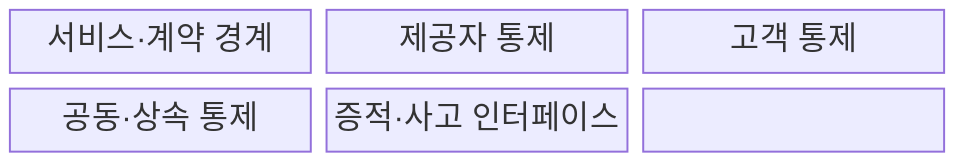
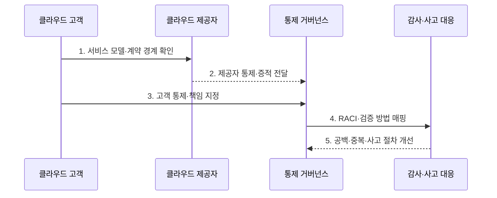

---
sidebar:
  order: 71
  label: "071. 클라우드 보안 공유 책임 모델 (Cloud Shared Responsibility)"
  badge:
    text: "기출 · 70%"
    variant: note
title: "클라우드 보안 공유 책임 모델 (Cloud Shared Responsibility)"
date: "2026-07-30T19:15:00+09:00"
tags:
  - "notes-security"
weight: 71
extra:
  question_no: "071"
  source_status: "기출"
  source_history: "137회"
  priority: 70
  priority_note: "137회 기출이며 서비스모델별 책임 설계가 반복 활용됨"
---

## 미리 알고가기

- **공유 책임 모델(Shared Responsibility Model)**: 클라우드 제공자와 고객이 계층별 보안 책임을 나누는 원칙이다.
- **서비스형 인프라(Infrastructure as a Service, IaaS)**: 서버·저장소·네트워크 같은 컴퓨팅 인프라를 서비스로 제공하는 모델이다.
- **서비스형 플랫폼(Platform as a Service, PaaS)**: 애플리케이션의 개발·배포·실행 환경을 서비스로 제공하는 모델이다.
- **서비스형 소프트웨어(Software as a Service, SaaS)**: 공급자가 운영하는 완성된 애플리케이션을 인터넷으로 제공하는 모델이다.
- **클라우드 제공자(Cloud Service Provider)**: 클라우드 인프라·플랫폼·소프트웨어를 운영해 제공하는 사업자이다.
- **클라우드 고객(Cloud Customer)**: 제공된 서비스를 구성하고 계정·데이터·업무를 운영하는 이용 조직이다.
- **통제(Control)**: 위험을 줄이기 위한 정책·절차·기술 조치이다.
- **상속 통제(Inherited Control)**: 제공자가 수행한 결과를 고객 통제의 일부로 활용하는 통제이다.
- **공동 통제(Shared Control)**: 제공자와 고객이 서로 다른 부분을 함께 수행해야 완성되는 통제이다.
- **서비스 수준 협약(Service Level Agreement, SLA)**: 서비스의 가용성·지원·복구 수준과 책임 범위를 정한 계약이다.
- **수행·최종 책임·협의·통보(Responsible, Accountable, Consulted, Informed, RACI)**: 통제별 수행자·최종 책임자·협의자·통보 대상을 구분하는 책임 행렬이다.
- **신원·접근 관리(Identity and Access Management, IAM)**: 고객 계정과 접근 권한의 생성·변경·검토·회수를 관리하는 체계이다.
- **운영체제(Operating System, OS)**: 하드웨어 자원을 관리하고 애플리케이션 실행 환경을 제공하며, IaaS에서는 고객이 패치와 구성을 담당하는 소프트웨어 계층이다.
- **포렌식(Forensics)**: 사고 원인과 행위 증거를 보존·분석하는 활동이다.
- **NIST SP 800-145**: IaaS·PaaS·SaaS 등 클라우드 서비스·배치 모델을 정의한 공식 문서이다.
- **ISO/IEC 27017:2015**: 클라우드 제공자와 고객의 역할별 정보보호 통제 지침을 제시한 국제표준이다.

## Ⅰ. 개요

- 정의/개념: 클라우드 계층별 **제공자·고객 책임 분담**
- 배경/필요성: 제공자 전담 오해의 **통제 책임 공백**

### 쉽게 이해하기 (학습용)

- 클라우드를 빌려도 보안 전체를 맡긴 것은 아니므로 건물 관리와 입주자 관리처럼 각자 해야 할 일을 통제별로 나눠야 한다.

## Ⅱ. 특징

- 제공자·고객의 **계층별 통제 소유권**
- IaaS·PaaS·SaaS별 **책임 경계 이동**
- 계약·설정·로그 기반 **책임 이행 증명**

### 쉽게 이해하기 (학습용)

- 제공자가 서버를 안전하게 운영해도 고객이 관리자 계정이나 공개 공유 설정을 잘못 관리하면 데이터는 여전히 노출된다.

## Ⅲ. 구조 및 구성요소

| 구성요소 | 책임 |
|:---|:---|
| 서비스·계약 경계 | 기능·SLA·제외 책임 정의 |
| 제공자 통제 | 시설·하드웨어·관리 계층 보호 |
| 고객 통제 | 계정·데이터·앱 설정 보호 |
| 공동·상속 통제 | 분담 또는 제공자 결과 활용 |
| 증적·사고 인터페이스 | 감사 자료와 대응 협업 연결 |

### 쉽게 이해하기 (학습용)

- 계약으로 경계를 정하고 양측 통제를 이어 붙인 뒤 감사 자료와 사고 대응 절차로 실제 수행 여부를 확인한다.

## Ⅳ. 흐름도

**동작 원리**

- **1. 서비스 모델·계약 경계 확인**: 기능·SLA·제외 범위 식별
- **2. 제공자 통제·증적 전달**: 하부 계층 보호 근거 제공
- **3. 고객 통제·책임 지정**: 계정·데이터·설정 소유자 지정
- **4. RACI·검증 방법 매핑**: 통제별 수행·승인·증거 확정
- **5. 공백·중복·사고 절차 개선**: 책임표·설정·협업 절차 갱신
### 쉽게 이해하기 (학습용)

- 양측이 맡은 통제와 확인할 증거를 미리 연결해야 사고 때 서로의 책임이라고 미루지 않고 빠르게 조치할 수 있다.

## Ⅴ. 종류 및 비교

| 클라우드 책임 유형 | 공유 책임 공통 | IaaS | PaaS | SaaS |
|:---|:---|:---|:---|:---|
| 적용 기준 | 클라우드 통제 소유권 정의 | 높은 구성 자유도 | 개발 플랫폼 활용 | 완성 업무 기능 사용 |
| 핵심 특징 | **제공자·고객 계층 분담** | **고객이 OS부터 관리** | 고객이 앱부터 관리 | 고객이 계정·데이터 관리 |
| 한계 | 책임 공백·증적 단절 | 패치·망 설정 오류 | 비밀·권한 구성 오류 | 계정·공유 설정 오류 |

### 쉽게 이해하기 (학습용)

- IaaS는 고객이 관리할 층이 가장 많고 PaaS와 SaaS로 갈수록 줄지만 계정·데이터·업무 설정 책임은 계속 남는다.

## Ⅵ. 실무 고려사항 및 대책

| 고려사항 | 대책 | 효과 |
|:---|:---|:---|
| 서비스 모델별 경계 | **NIST SP 800-145 기준 분류** | IaaS·PaaS·SaaS 책임 정렬 |
| 제공자·고객 통제 | **ISO/IEC 27017:2015 적용** | 역할·구현 지침 명확화 |
| 증적·사고 협업 공백 | **RACI·SLA·로그 제공 명시** | 책임 전가·대응 지연 방지 |

### 쉽게 이해하기 (학습용)

- 클라우드 제공자는 저장 인프라를 보호하지만 고객은 버킷 공개 여부와 사용자 권한을 설정·점검해야 하므로 양측 책임을 통제표에 명시한다.

## Ⅶ. 결론

- **서비스모델·통제소유권·운영증적**으로 공유책임을 결정한다.

### 쉽게 이해하기 (학습용)

- 공유 책임은 사고 책임을 나누는 면책 문구가 아니라 각 통제를 누가 어떻게 수행하고 무엇으로 증명할지 정하는 운영 기준이다.
