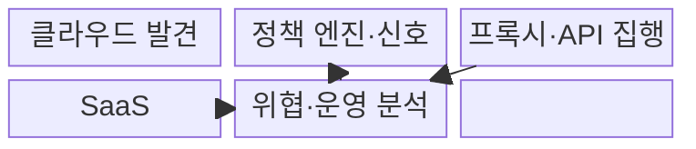
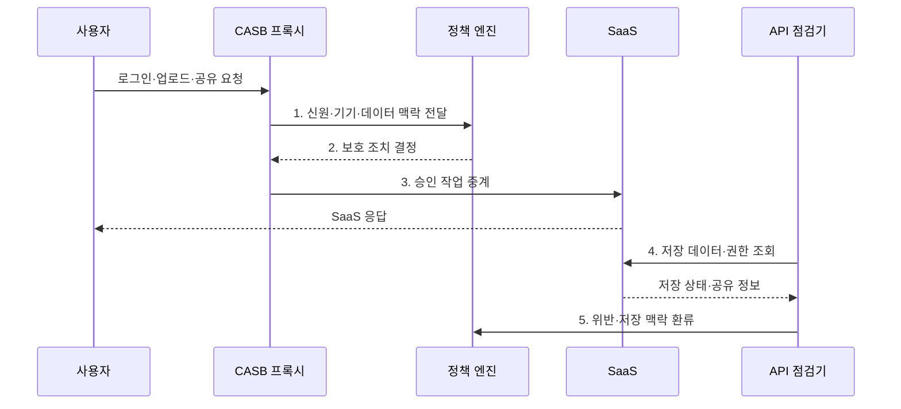

---
sidebar:
  order: 72
  label: "072. CASB 클라우드 접근 보안 브로커 (Cloud Access Security Broker)"
  badge:
    text: "기출 · 70%"
    variant: note
title: "CASB 클라우드 접근 보안 브로커 (Cloud Access Security Broker)"
date: "2026-07-31T11:17:29+09:00"
tags:
  - "notes-security"
weight: 72
extra:
  question_no: "072"
  source_status: "기출"
  source_history: "122회, 137회"
  priority: 70
  priority_note: "122·137회 반복된 SaaS 데이터·접근 통제 핵심임"
---

## 미리 알고가기

- **클라우드 접근 보안 브로커(Cloud Access Security Broker, CASB)**: 사용자와 클라우드 서비스 사이에서 접근·데이터·위협·준수 정책을 중개하는 보안 통제 지점이다.
- **서비스형 소프트웨어(Software as a Service, SaaS)**: 공급자가 운영하는 완성된 애플리케이션을 인터넷으로 제공하는 서비스 모델이다.
- **그림자 정보기술(Shadow Information Technology, Shadow IT)**: 조직의 승인과 관리 없이 사용하는 클라우드 서비스나 정보기술이다.
- **발견(Discovery)**: 로그와 트래픽에서 사용 중인 클라우드 서비스를 식별·분류하는 기능이다.
- **응용 프로그래밍 인터페이스(Application Programming Interface, API)**: CASB가 클라우드의 저장 데이터와 관리 기능을 점검하는 호출 접점이다.
- **인라인 프록시(Inline Proxy)**: 사용자 트래픽 경로에서 요청을 실시간 검사·통제하는 중계 방식이다.
- **데이터 유출 방지(Data Loss Prevention, DLP)**: 민감정보의 저장·전송·반출을 탐지하고 정책에 따라 차단하는 통제이다.
- **사용자·개체 행동 분석(User and Entity Behavior Analytics, UEBA)**: 사용자와 시스템의 정상 행위 기준선을 학습하고 편차를 분석하여 이상을 탐지하는 기술이다.
- **토큰화(Tokenization)**: 민감한 값을 의미 없는 대체값으로 바꾸고 원본을 별도 보호하는 기술이다.
- **전송 계층 보안(Transport Layer Security, TLS)**: CASB가 중계하는 통신의 기밀성과 무결성을 보호하는 암호 통신 규약이다.
- **다중 요소 인증(Multi-Factor Authentication, MFA)**: 고위험 SaaS 요청에서 서로 다른 종류의 인증 요소를 추가로 확인하는 인증 방식이다.
- **관리되지 않은 기기(Unmanaged Device)**: 조직의 보안 정책과 상태 점검을 받지 않는 단말이다.
- **역방향 프록시(Reverse Proxy)**: 서비스 앞에서 외부 요청을 받아 내부 서비스로 전달하는 중계 방식이다.
- **순방향 프록시(Forward Proxy)**: 사용자 앞에서 외부 서비스 요청을 대신 전달하는 중계 방식이다.
- **ISO/IEC 27017:2015**: 클라우드 제공자·고객의 접근·구성·운영 보안 통제를 제시한 국제표준이다.
- **CSA Cloud Controls Matrix v4.1**: 클라우드 보안의 통제 영역·책임·평가 항목을 제공하는 공식 프레임워크이다.
- **서비스 위험**: SaaS의 보안 기능·법적 위치·사고 이력에 따른 위험 수준이다.
- **데이터 등급**: 정보의 민감도와 보호 요구를 분류한 값이다.
- **정책 엔진**: 신원·기기·행위·데이터 맥락으로 보호 조치를 결정하는 기능이다.
- **예외 증적**: 정책 예외의 승인 근거·범위·만료·사용 이력을 남긴 기록이다.

> **키워드:** CASB 클라우드 접근 보안 브로커 (Cloud Access Security Broker)

## Ⅰ. 개요

- 정의/개념: 사용자와 클라우드 사이에서 정책을 집행하는 **보안 통제 지점**
- 배경/필요성: 경계 보안으로는 **SaaS 사용·저장 데이터 파악 불가**

### 쉽게 이해하기 (학습용)

- CASB는 직원이 어떤 클라우드를 쓰고 어떤 파일을 올리거나 공유하는지 보고 위험한 동작만 차단하는 관문이다.

## Ⅱ. 특징

- **SaaS 사용·위험 발견**: 로그·트래픽으로 서비스 식별
- **맥락 평가**: 신원·기기·행위·민감도 결합
- **다중 집행 방식**: 프록시·API·DLP로 시점별 통제

### 쉽게 이해하기 (학습용)

- 실시간 통로만 보면 이미 저장된 파일을 놓치고 API 점검만 하면 업로드 순간을 놓치므로 여러 방식을 함께 써야 한다.

## Ⅲ. 구조 및 구성요소

| 구성요소 | 책임 |
|:---|:---|
| **클라우드 발견** | SaaS 사용과 **서비스 위험 분류** |
| **정책 엔진·신호** | 접근·공유·**반출 맥락 판정** |
| **프록시·API 집행** | 실시간 통제와 **저장 상태 점검** |
| **SaaS** | 정책을 적용할 **클라우드 서비스** |
| **위협·운영 분석** | 이상행위·예외·**증적 관리** |

### 쉽게 이해하기 (학습용)

- 사용 중인 SaaS를 찾아 위험을 분류하고 요청 맥락과 데이터 민감도에 따라 프록시나 API로 정책을 적용한다.

## Ⅳ. 흐름도

**동작 원리**

- **1. 신원·기기·데이터 맥락 전달**: 사용자·행위·등급 정보 제공
- **2. 보호 조치 결정**: 허용·차단·암호화·MFA 선택
- **3. 승인 작업 중계**: 허용된 SaaS 동작만 실시간 전달
- **4. 저장 데이터·권한 조회**: API로 파일·공유 상태 요청
- **5. 위반·저장 맥락 환류**: 사후 회수와 정책 보정 근거 제공
### 쉽게 이해하기 (학습용)

- 파일을 올리는 순간에는 프록시가 검사하고 이미 클라우드에 저장된 파일과 공유 권한은 API가 다시 찾아 조치한다.

## Ⅴ. 종류 및 비교

| CASB 적용 유형 | CASB | 로그 기반 발견 | 인라인 프록시 | API 연동 |
|:---|:---|:---|:---|:---|
| 적용 기준 | SaaS **접근·데이터 통제** | **그림자 IT 파악** | **즉시 차단 필요** | 이미 저장된 **상태 검사** |
| 핵심 특징 | **클라우드 정책 통합 중개** | **사용 현황 사후 분석** | 요청 경로의 **실시간 집행** | **저장 데이터·설정 점검** |
| 한계 | **방식별 사각지대** | **개별 동작 차단 불가** | **프록시 미경유·지연·TLS 부담** | **호출량·반영 지연** |

### 쉽게 이해하기 (학습용)

- 로그는 무엇을 쓰는지 찾고 프록시는 지금 하는 동작을 차단하며 API는 클라우드 안에 남아 있는 데이터와 권한을 점검한다.

## Ⅵ. 실무 고려사항 및 대책

| 고려사항 | 대책 | 효과 |
|:---|:---|:---|
| **클라우드 역할·통제 편차** | **ISO/IEC 27017:2015 적용** | 접근·운영의 **책임 정렬** |
| **통제 범위·평가 공백** | **CSA CCM v4.1 매핑** | SaaS의 **보안 공백 식별** |
| **프록시·API 사각지대** | **로그·인라인·API 조합** | 실시간·저장 상태의 **가시성 확보** |

### 쉽게 이해하기 (학습용)

- CASB는 개인 기기에서 SaaS 조회는 허용하되 문서 등급과 기기 관리 상태를 평가해 민감 파일의 로컬 다운로드는 차단한다.

## Ⅶ. 결론

- 사용 발견은 **로그**, 실시간 차단은 **인라인 프록시**, 저장 데이터는 API 점검

### 쉽게 이해하기 (학습용)

- CASB의 효과는 제품 설치보다 어떤 SaaS·기기·데이터·행위가 각 집행 방식에서 보이지 않는지 찾아 사각지대를 줄이는 데 달려 있다.
