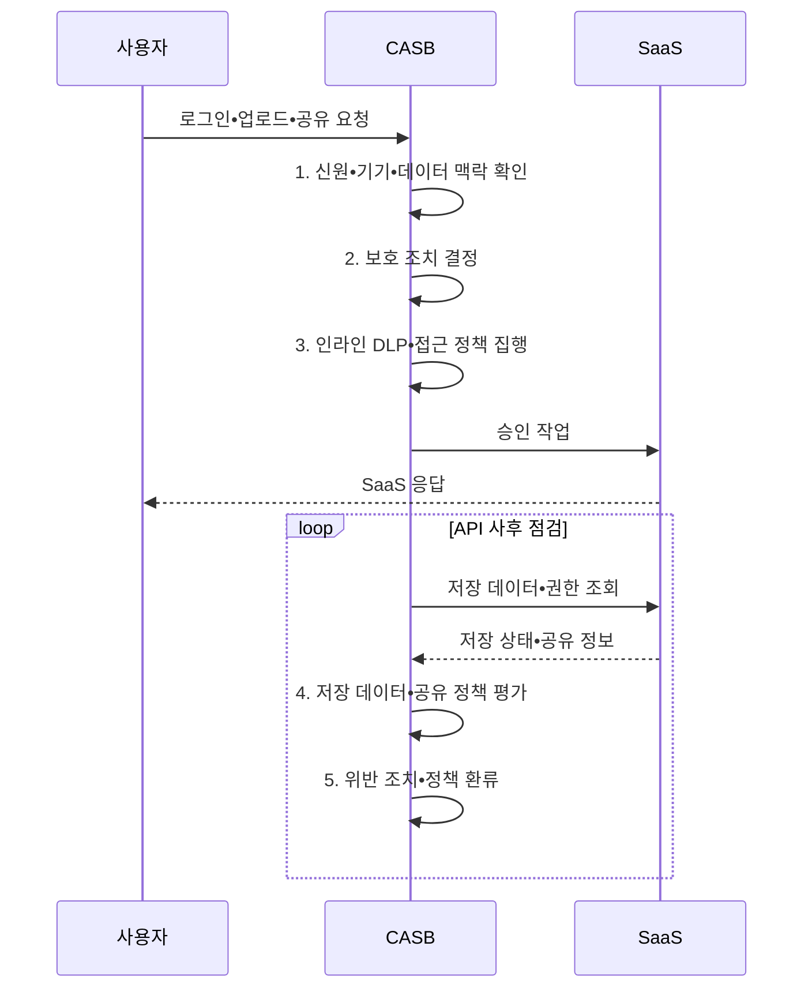

---
sidebar:
  order: 72
  label: "072. CASB 클라우드 접근 보안 브로커 (Cloud Access Security Broker)"
  badge:
    text: "기출 • 70%"
    variant: note
title: "CASB 클라우드 접근 보안 브로커 (Cloud Access Security Broker)"
date: "2026-08-05T11:24:00+09:00"
tags:
  - "notes-security"
weight: 72
extra:
  question_no: "072"
  source_status: "기출"
  source_history: "122회, 137회"
  priority: 70
  priority_note: "122•137회 반복된 SaaS 데이터•접근 통제 핵심임"
---

## Ⅰ. 개요

<details><summary>핵심 용어</summary>

- **CASB(Cloud Access Security Broker)** 는 사용자와 클라우드 서비스 사이에서 접근•데이터•위협•준수 정책을 중개하는 통제 지점이다.
- **SaaS(Software as a Service)** 는 공급자가 운영하는 완성된 애플리케이션을 인터넷으로 제공하는 서비스 모델이다.

</details>

- 정의/개념: **CASB** 는 사용자와 클라우드 서비스 사이에서 접근•데이터•위협•준수 정책을 중개하고 집행하는 **클라우드 보안 통제 지점**
- 배경/필요성: 경계 보안으로는 **SaaS 사용•저장 데이터 파악 불가**

#### 한줄 요약

- CASB는 직원이 어떤 클라우드를 쓰고 어떤 파일을 올리거나 공유하는지 보고 위험한 동작만 차단하는 관문이다.

## Ⅱ. 특징

<details><summary>핵심 용어</summary>

- **클라우드 발견** 은 로그와 트래픽에서 사용 중인 SaaS와 서비스 위험을 식별하는 기능이다.
- **그림자 IT(Information Technology)** 는 조직의 승인 없이 사용되는 정보기술 서비스와 자산이다.
- **프록시** 는 사용자와 SaaS 사이에서 실시간 요청을 중계•검사하는 구성요소다.
- **API(Application Programming Interface)** 는 서비스 기능과 데이터를 정해진 요청•응답 형식으로 제공하는 경계다.
- **DLP(Data Loss Prevention)** 는 민감정보의 저장•전송•반출을 식별하고 통제하는 기술이다.

</details>

- **SaaS 사용•위험 발견**: 로그•트래픽으로 서비스 식별
- **맥락 평가**: 신원•기기•행위•민감도 결합
- **다중 집행 방식**: 프록시•API•DLP로 시점별 통제

#### 한줄 요약

- 실시간 통로만 보면 이미 저장된 파일을 놓치고 API 점검만 하면 업로드 순간을 놓치므로 여러 방식을 함께 써야 한다.

## Ⅲ. 구조 및 구성요소

<details><summary>핵심 용어</summary>

- **정책 엔진**: 신원•기기•행위•데이터 등급을 결합해 허용•차단•암호화•추가 인증을 결정하는 기능이다.
- **서비스 위험** 은 SaaS의 보안•법적•사고 대응 수준에서 발생하는 위험이다.
- **예외 증적** 은 정책 예외의 승인 근거•범위•만료•사용 이력을 보존한 자료다.

</details>

```text
                        [정책 엔진•신호]
                         /            \
                 [클라우드 발견]  [프록시•API 집행] -- [SaaS]
                         \            /                 /
                         [위협•운영 분석]
```

선의 의미: 클라우드 발견과 위협•운영 분석의 신호를 정책 엔진에 결합하고, 프록시•API 집행 영역이 SaaS의 접근 및 저장 상태를 통제하는 정적 CASB 구조

| 구성요소 | 책임 |
|:---|:---|
| **클라우드 발견** | SaaS 사용과 **서비스 위험 분류** |
| **정책 엔진•신호** | 접근•공유•**반출 맥락 판정** |
| **프록시•API 집행** | 실시간 통제와 **저장 상태 점검** |
| **SaaS** | 정책을 적용할 **클라우드 서비스** |
| **위협•운영 분석** | 이상행위•예외•**증적 관리** |

#### 한줄 요약

- 사용 중인 SaaS를 찾아 위험을 분류하고 요청 맥락과 데이터 민감도에 따라 프록시나 API로 정책을 적용한다.

## Ⅳ. 흐름도

<details><summary>핵심 용어</summary>

- **인라인 검사** 는 사용자 요청 경로에서 업로드•다운로드를 즉시 검사하는 방식이다.
- **API 사후 점검** 은 이미 저장된 데이터와 공유 권한을 API로 다시 확인하는 방식이다.
- **보호 조치 결정**: 요청 맥락과 데이터 민감도에 따라 허용•차단•암호화•MFA 중 적절한 대응을 선택하는 과정이다.
- **MFA(Multi-Factor Authentication)** 는 서로 다른 종류의 인증 요소를 둘 이상 확인하는 방식이다.

</details>



**동작 원리**

- **1. 신원•기기•데이터 맥락 확인**: 사용자•행위•등급 정보 확인
- **2. 보호 조치 결정**: 허용•차단•암호화•MFA 선택
- **3. 인라인 DLP•접근 정책 집행**: 허용된 SaaS 동작만 실시간 중계
- **4. 저장 데이터•공유 정책 평가**: API 상태와 민감도•권한 대조
- **5. 위반 조치•정책 환류**: 공유 회수•격리와 탐지 규칙 보정
#### 한줄 요약

- 파일을 올리는 순간에는 프록시가 검사하고 이미 클라우드에 저장된 파일과 공유 권한은 API가 다시 찾아 조치한다.

## Ⅴ. 종류 및 비교

<details><summary>핵심 용어</summary>

- **TLS(Transport Layer Security) 검사 부담** 은 암호화 통신의 복호화•재암호화로 생기는 지연과 인증서 운영 비용이다.

</details>

| CASB 적용 유형 | CASB | 로그 기반 발견 | 인라인 프록시 | API 연동 |
|:---|:---|:---|:---|:---|
| 적용 기준 | SaaS **접근•데이터 통제** | **그림자 IT 파악** | **즉시 차단 필요** | 이미 저장된 **상태 검사** |
| 핵심 특징 | **클라우드 정책 통합 중개** | **사용 현황 사후 분석** | 요청 경로의 **실시간 집행** | **저장 데이터•설정 점검** |
| 한계 | **방식별 사각지대** | **개별 동작 차단 불가** | **프록시 미경유•지연•TLS 부담** | **호출량•반영 지연** |

#### 한줄 요약

- 로그는 무엇을 쓰는지 찾고 프록시는 지금 하는 동작을 차단하며 API는 클라우드 안에 남아 있는 데이터와 권한을 점검한다.

## Ⅵ. 실무 고려사항 및 대책

<details><summary>핵심 용어</summary>

- **ISO(International Organization for Standardization)** 는 국제 표준을 개발•발행하는 기구다.
- **IEC(International Electrotechnical Commission)** 는 전기•전자 분야 국제 표준을 개발하는 기구다.
- **ISO/IEC 27017:2015** 는 클라우드 제공자•고객의 접근•구성•운영 보안 통제를 제시한다.
- **CSA(Cloud Security Alliance)** 는 클라우드 보안 지침과 통제 체계를 개발하는 비영리 단체다.
- **CCM(Cloud Controls Matrix) v4.1** 은 클라우드 보안의 통제 영역•책임•평가 항목을 제공한다.

</details>

| 문제 | 대책 | 효과 |
|:---|:---|:---|
| **클라우드 역할•통제 편차** | **ISO/IEC 27017:2015 적용** | 접근•운영의 **책임 정렬** |
| **통제 범위•평가 공백** | **CSA CCM v4.1 매핑** | SaaS의 **보안 공백 식별** |
| **프록시•API 사각지대** | **로그•인라인•API 조합** | 실시간•저장 상태의 **가시성 확보** |

#### 한줄 요약

- CASB는 개인 기기에서 SaaS 조회는 허용하되 문서 등급과 기기 관리 상태를 평가해 민감 파일의 로컬 다운로드는 차단한다.

## Ⅶ. 결론

<details><summary>핵심 용어</summary>

- **집행 사각지대**: 특정 SaaS•기기•데이터•행위가 로그•프록시•API 중 어떤 통제 방식에서도 보이거나 차단되지 않는 영역이다.
</details>

- 사용 발견은 **로그**, 실시간 차단은 **인라인 프록시**, 저장 데이터는 **API 점검**

#### 한줄 요약

- CASB의 효과는 제품 설치보다 어떤 SaaS•기기•데이터•행위가 각 집행 방식에서 보이지 않는지 찾아 사각지대를 줄이는 데 달려 있다.
