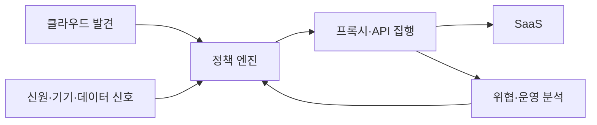
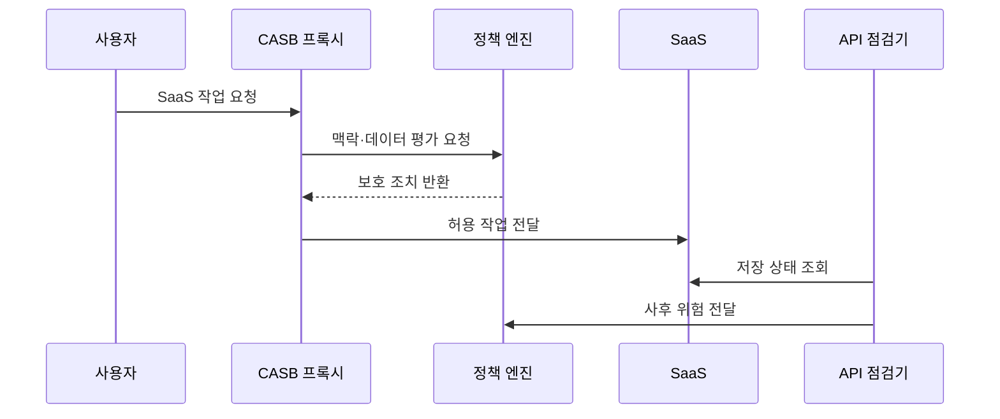

---
sidebar:
  order: 72
  label: "072. CASB 클라우드 접근 보안 브로커 (Cloud Access Security Broker)"
  badge:
    text: "기출 · 70%"
    variant: note
title: "CASB 클라우드 접근 보안 브로커 (Cloud Access Security Broker)"
date: "2026-07-27T23:59:59+09:00"
tags:
  - "notes-security"
weight: 72
extra:
  question_no: "072"
  source_status: "기출"
  source_history: "122회, 137회"
  priority: 70
  priority_note: "122·137회 반복된 SaaS 데이터·접근 통제 핵심임"
---

## 미리 알고가기

- **클라우드 접근 보안 브로커(Cloud Access Security Broker, CASB)**: 영문 머리글자를 딴 공식 표기라 “캐스비”로 읽으며, 사용자와 클라우드 서비스 사이에서 접근·데이터·위협·준수 정책을 중개한다
- **서비스형 소프트웨어(Software as a Service, SaaS)**: 영문 주요 글자를 딴 공식 표기라 “사스”로 읽으며, CASB가 통제할 완성형 응용 소프트웨어 서비스
- **그림자 정보기술(Shadow Information Technology, Shadow IT)**: `Information Technology`를 줄인 공식 표기라 “섀도 아이티”로 읽으며, 조직 승인과 관리 없이 사용하는 클라우드 서비스나 기술
- **발견(Discovery)**: 로그와 트래픽에서 사용 중인 클라우드 서비스를 식별·분류하는 기능
- **응용 프로그래밍 인터페이스(Application Programming Interface, API)**: 영문 머리글자를 딴 공식 표기라 “에이피아이”로 읽으며, CASB가 클라우드의 저장 데이터와 관리 기능을 점검하는 호출 접점
- **인라인 프록시(Inline Proxy)**: 사용자 트래픽 경로에서 요청을 실시간 검사·통제하는 중계 방식
- **데이터 유출 방지(Data Loss Prevention, DLP)**: 영문 머리글자를 딴 공식 표기라 “디엘피”로 읽으며, 민감정보의 저장·전송·반출을 탐지하고 차단한다
- **사용자·개체 행동 분석(User and Entity Behavior Analytics, UEBA)**: 영문 머리글자를 딴 공식 표기라 “유이비에이”로 읽으며, 사용자와 시스템의 행위 패턴을 분석해 이상을 탐지한다
- **토큰화(Tokenization)**: 민감한 값을 의미 없는 대체값으로 바꾸고 원본을 별도 보호하는 기술
- **전송 계층 보안(Transport Layer Security, TLS)**: 영문 머리글자를 딴 공식 표기라 “티엘에스”로 읽으며, CASB가 중계하는 통신의 기밀성과 무결성을 보호한다
- **다중 요소 인증(Multi-Factor Authentication, MFA)**: 영문 머리글자를 딴 공식 표기라 “엠에프에이”로 읽으며, 고위험 SaaS 요청에 추가 인증 요소를 요구한다
- **관리되지 않은 기기(Unmanaged Device)**: 조직의 보안 정책과 상태 점검을 받지 않는 단말
- **역방향 프록시(Reverse Proxy)**: 서비스 앞에서 외부 요청을 받아 내부 서비스로 전달하는 중계 방식
- **순방향 프록시(Forward Proxy)**: 사용자 앞에서 외부 서비스 요청을 대신 전달하는 중계 방식

## Ⅰ. 개요

- **정의**: 사용자와 클라우드 사이에서 접근·데이터 정책을 집행하는 보안 중개 체계
- **배경/필요성**: 기존 경계 보안의 SaaS 사용·데이터 반출 가시성 부족
- **한계**: 연동 방식별 가시성과 실시간 통제 범위 차이

### 쉽게 이해하기 (학습용)

- CASB는 직원이 어떤 클라우드를 쓰고 어떤 파일을 올리거나 공유하는지 보고 위험한 동작만 차단하는 관문이다.

## Ⅱ. 특징

- 로그·트래픽으로 SaaS 사용과 위험을 발견한다.
- 신원·기기·위치·행위·민감도를 함께 평가한다.
- DLP·암호화·토큰화로 데이터 이동을 통제한다.
- UEBA로 계정 탈취와 이상 공유를 탐지한다.
- 프록시·API·로그 방식을 조합해 사각지대를 줄인다.

### 쉽게 이해하기 (학습용)

- 실시간 통로만 보면 이미 저장된 파일을 놓치고 API 점검만 하면 업로드 순간을 놓치므로 여러 방식을 함께 써야 한다.

## Ⅲ. 아키텍처 및 구성요소

| 설계 요소 | 설명 |
|:---|:---|
| 클라우드 발견 | SaaS 사용과 서비스 위험 분류 |
| 정책 엔진 | 접근·공유·반출 조건 판정 |
| 신원·기기·데이터 신호 | 요청 맥락과 민감도 제공 |
| 프록시·API 집행 | 실시간 통제와 저장 상태 점검 |
| SaaS | 정책 적용 대상 서비스 |
| 위협·운영 분석 | 이상행위·예외·증적 관리 |

### 쉽게 이해하기 (학습용)

- 사용 중인 SaaS를 찾아 위험을 분류하고 요청 맥락과 데이터 민감도에 따라 프록시나 API로 정책을 적용한다.

## Ⅳ. 원리 및 절차 흐름도

| 절차 | 설명 |
|:---|:---|
| SaaS 작업 요청 | 로그인·업로드·공유 동작 제출 |
| 맥락·데이터 평가 요청 | 신원·기기·민감도 결합 |
| 보호 조치 반환 | 허용·차단·암호화·MFA 결정 |
| 허용 작업 전달 | 승인된 동작만 SaaS에 중계 |
| 저장 상태 조회 | API로 파일·권한·공유 점검 |
| 사후 위험 전달 | 위반 상태를 격리·회수 |

> 요약: 실시간 요청과 저장 상태를 함께 통제한다.

### 쉽게 이해하기 (학습용)

- 파일을 올리는 순간에는 프록시가 검사하고 이미 클라우드에 저장된 파일과 공유 권한은 API가 다시 찾아 조치한다.

## Ⅴ. CASB 적용 방식 비교

| 비교축 | CASB | 로그 기반 발견 | 인라인 프록시 | API 연동 |
|:---|:---|:---|:---|:---|
| 적용 기준 | SaaS 접근·데이터 통제 | 그림자 IT 파악 | 즉시 차단 필요 | 이미 저장된 상태 검사 |
| 핵심 특징 | 클라우드 정책 통합 중개 | 사용 현황 사후 분석 | 요청 경로 실시간 집행 | 저장 데이터·설정 점검 |
| 한계 | 방식별 사각지대 | 개별 동작 차단 불가 | 우회·지연·TLS 부담 | 호출량·반영 지연 |

### 쉽게 이해하기 (학습용)

- 로그는 무엇을 쓰는지 찾고 프록시는 지금 하는 동작을 차단하며 API는 클라우드 안에 남아 있는 데이터와 권한을 점검한다.

## Ⅵ. 실무 사례

- **사례 1**: 비관리 기기의 민감 파일 다운로드 차단
- **사례 2**: 공개 공유된 고객정보를 API로 회수
- **사례 3**: TLS 복호화 대상에서 민감 업무 제외
- **사례 4**: 오탐 예외에 승인·범위·만료 적용

### 쉽게 이해하기 (학습용)

- 사례 1은 개인 장비에서 업무 앱은 쓰게 하되 민감한 파일을 로컬로 가져가지 못하게 한다.
- 사례 2는 사용자가 이미 외부 공개로 바꾼 저장 파일을 사후 점검으로 찾아 공유 권한을 되돌린다.
- 사례 3은 트래픽 검사를 위해 암호화를 풀 때 의료·개인 통신까지 불필요하게 수집하지 않게 한다.
- 사례 4는 정상 업무를 위해 잠시 연 예외가 모든 사용자와 데이터에 영구 적용되지 않게 한다.

## Ⅶ. 결론

- SaaS 데이터 통제면 프록시와 API를 함께 쓴다.

### 쉽게 이해하기 (학습용)

- CASB의 효과는 제품 설치보다 어떤 SaaS·기기·데이터·행위가 각 집행 방식에서 보이지 않는지 찾아 사각지대를 줄이는 데 달려 있다.
