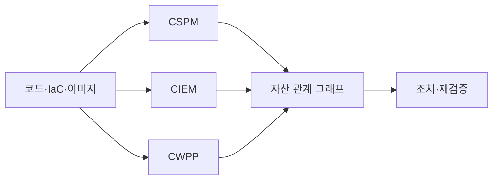
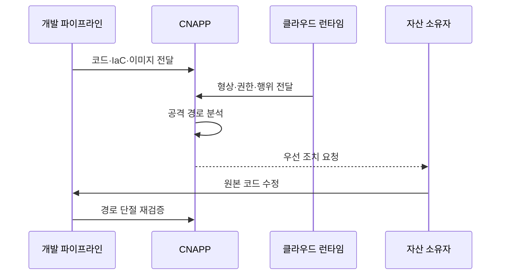

---
sidebar:
  order: 73
  label: "073. 클라우드 네이티브 애플리케이션 보호 플랫폼 (Cloud-Native Application Protection Platform, CNAPP)"
  badge:
    text: "미출제 · 70%"
    variant: note
title: "클라우드 네이티브 애플리케이션 보호 플랫폼 (Cloud-Native Application Protection Platform, CNAPP)"
date: "2026-07-25T22:13:00+09:00"
tags:
  - "notes-security"
weight: 73
extra:
  question_no: "073"
  source_status: "미출제"
  source_history: ""
  priority: 70
  priority_note: "클라우드 보안 도구군을 통합하는 코드-런타임 우산임"
---

## 미리 알고가기

- **클라우드 네이티브 애플리케이션 보호 플랫폼(Cloud-Native Application Protection Platform, CNAPP)**: 영문 머리글자를 딴 공식 표기라 “씨냅”으로 읽으며, 개발 코드부터 런타임까지 형상·권한·취약점·위협을 연결한다
- **클라우드 네이티브(Cloud Native)**: 컨테이너·자동화·관리형 서비스를 활용해 클라우드 특성에 맞게 개발·운영하는 방식
- **코드형 인프라(Infrastructure as Code, IaC)**: 영문 주요 글자를 딴 공식 표기라 “아이에이시”로 읽으며, 인프라 설정을 코드 파일로 정의·배포한다
- **클라우드 보안 태세 관리(Cloud Security Posture Management, CSPM)**: 영문 머리글자를 딴 공식 표기라 “씨에스피엠”으로 읽으며, 클라우드 자원 설정 오류와 준수 상태를 지속 점검한다
- **클라우드 인프라 권한 관리(Cloud Infrastructure Entitlement Management, CIEM)**: 영문 머리글자를 딴 공식 표기라 “씨아이이엠”으로 읽으며, 사람과 워크로드의 실제 클라우드 권한을 분석한다
- **클라우드 워크로드 보호 플랫폼(Cloud Workload Protection Platform, CWPP)**: 영문 머리글자를 딴 공식 표기라 “씨더블유피피”로 읽으며, 가상 머신·컨테이너·서버리스 워크로드를 보호한다
- **이미지(Image)**: 컨테이너 실행에 필요한 파일과 설정을 묶은 불변 배포 패키지
- **런타임(Runtime)**: 배포된 응용과 워크로드가 실제 실행되는 환경
- **드리프트(Drift)**: 배포된 실제 설정이 승인된 코드나 기준과 달라진 상태
- **자산 관계 그래프(Asset Relationship Graph)**: 자원·권한·네트워크·취약점 관계를 연결한 모델
- **공격 경로(Attack Path)**: 공격자가 노출 지점에서 중요 자산까지 도달할 수 있는 연결 경로
- **응용 프로그래밍 인터페이스(Application Programming Interface, API)**: 영문 머리글자를 딴 공식 표기라 “에이피아이”로 읽으며, 비밀 키가 클라우드 기능 호출을 인증하는 접점
- **비밀(Secret)**: 비밀번호·API 키·토큰처럼 인증과 암호화에 쓰는 민감 정보
- **오탐(False Positive)**: 실제 위험이 아닌 상태를 위험으로 잘못 경보하는 결과

## Ⅰ. 개요

- **정의**: 코드부터 런타임까지 위험을 연결하는 플랫폼
- **배경/필요성**: 분리 경보를 실제 공격 경로로 우선순위화
- **범위**: 형상·권한·취약점·워크로드 보호

### 쉽게 이해하기 (학습용)

- CNAPP는 각각 따로 울리는 보안 경보를 묶어 어떤 조합이 실제 중요 자산 침해로 이어지는지 보여 준다.

## Ⅱ. 특징

- IaC·코드·이미지 점검과 운영 감시를 연결한다.
- 자산·권한·노출·취약점 관계를 그래프로 분석한다.
- 위험을 소유자와 원본 코드에 연결한다.
- CSPM·CIEM·CWPP 결과를 통합한다.
- 센서 공백과 데이터 불일치는 분석 품질을 낮춘다.

### 쉽게 이해하기 (학습용)

- 심각한 취약점 하나보다 인터넷에 노출되고 강한 권한까지 가진 취약 워크로드가 실제로 더 먼저 고쳐야 할 대상이다.

## Ⅲ. 아키텍처 및 구성요소

| 설계 요소 | 설명 |
|:---|:---|
| 코드·IaC·이미지 | 배포 전 설정·비밀·취약점 점검 |
| CSPM | 형상·노출·드리프트 평가 |
| CIEM | 사람·워크로드 유효 권한 분석 |
| CWPP | 워크로드와 런타임 위협 보호 |
| 자산 관계 그래프 | 위험 연결과 공격 경로 계산 |
| 조치·재검증 | 원본 수정과 경로 단절 확인 |

### 쉽게 이해하기 (학습용)

- 개발 산출물과 운영 자원의 설정·권한·실행 위험을 한 그래프로 묶고 원인이 있는 코드까지 돌아가 수정한다.

## Ⅳ. 원리 및 절차 흐름도

| 절차 | 설명 |
|:---|:---|
| 코드·IaC·이미지 전달 | 배포 전 결함과 비밀 수집 |
| 형상·권한·행위 전달 | 운영 자산의 실제 상태 수집 |
| 공격 경로 분석 | 노출·권한·취약점 관계 계산 |
| 우선 조치 요청 | 중요 자산 영향과 소유자 연결 |
| 원본 코드 수정 | 재배포 가능한 근본 원인 교정 |
| 경로 단절 재검증 | 운영 환경의 위험 제거 확인 |

> 요약: 코드·운영 위험을 연결해 원본 코드 수정

### 쉽게 이해하기 (학습용)

- 배포 전 정보와 실제 운영 상태를 합쳐 공격 경로를 찾고 담당자가 원본 코드를 고친 뒤 같은 경로가 사라졌는지 확인한다.

## Ⅴ. 종류 및 비교

| 비교축 | CNAPP | 개별 보안 도구 | 단순 통합 제품군 |
|:---|:---|:---|:---|
| 핵심 특징 | 코드·런타임 관계 분석 | 영역별 위험만 탐지 | 경보를 한 화면에 집계 |
| 적용 기준 | 클라우드 위험 통합 우선순위 | 단일 영역 전문 보호 | 운영 화면 통합 |
| 주요 위험 | 데이터 공백·벤더 종속 | 경보 중복·이관 지연 | 관계 없는 점수 정렬 |

### 쉽게 이해하기 (학습용)

- 개별 도구는 한 부분만 보고 단순 통합은 경보를 모으지만 CNAPP는 경보 사이의 관계와 실제 공격 경로를 계산한다.

## Ⅵ. 실무 사례

- **사례 1**: 공개 저장소와 과다 권한 경로를 우선 수정
- **사례 2**: 운영 드리프트를 IaC 원본에 반영
- **사례 3**: 자산 태그와 코드 소유자를 자동 연결
- **사례 4**: 고위험 경로의 재발과 조치 시간을 추적

### 쉽게 이해하기 (학습용)

- 사례 1은 단순 설정 오류보다 외부 노출과 강한 권한이 이어진 실제 침해 경로를 먼저 끊는다.
- 사례 2는 운영 화면에서만 고쳐 다음 배포 때 취약 설정이 되살아나는 일을 방지한다.
- 사례 3은 보안팀이 담당자를 찾느라 지연하지 않고 위험을 만든 저장소와 팀에 바로 수정 요청을 보낸다.
- 사례 4는 닫힌 경로가 다시 생기는지와 중요 위험을 제거하는 데 걸리는 시간을 기준으로 개선 효과를 본다.

## Ⅶ. 결론

- 클라우드 경보가 분산되면 공격 경로로 통합한다.

### 쉽게 이해하기 (학습용)

- CNAPP는 코드와 런타임의 관계로 실제 침해 경로를 찾아 원본 코드에서 제거한다.
