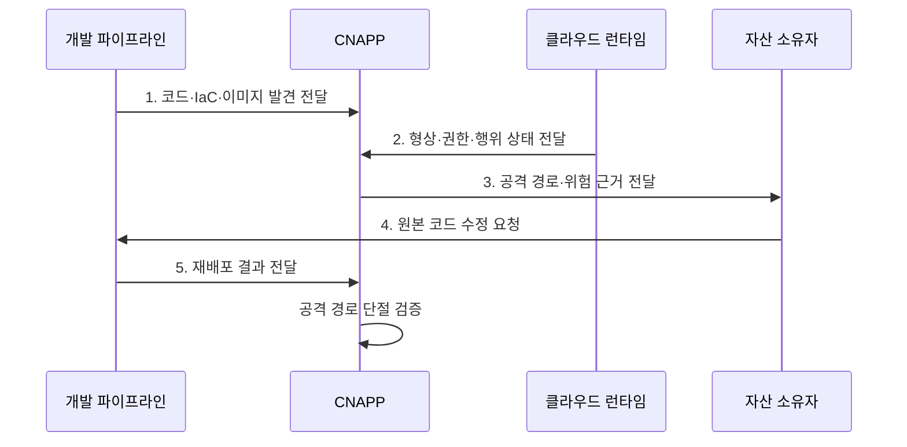

---
sidebar:
  order: 73
  label: "073. 클라우드 네이티브 애플리케이션 보호 플랫폼 (Cloud-Native Application Protection Platform, CNAPP)"
  badge:
    text: "미출제 · 70%"
    variant: note
title: "클라우드 네이티브 애플리케이션 보호 플랫폼 (Cloud-Native Application Protection Platform, CNAPP)"
date: "2026-08-02T12:24:00+09:00"
tags:
  - "notes-security"
weight: 73
extra:
  question_no: "073"
  source_status: "미출제"
  source_history: ""
  priority: 70
  priority_note: "클라우드 보안 도구군을 통합하는 코드-런타임 우산임"
---

## Ⅰ. 개요

핵심 용어

- **CNAPP**: 개발 코드부터 런타임까지 형상·권한·취약점·위협을 연결하여 공격 경로를 분석하는 통합 보안 플랫폼이다.
- **클라우드 네이티브**: 컨테이너·자동화·관리형 서비스를 활용해 클라우드 특성에 맞게 개발·운영하는 방식이다.

- 정의/개념: **CNAPP** 는 코드·IaC·이미지부터 런타임까지 클라우드 자산의 형상·권한·취약점·위협 관계를 연결해 공격 경로를 분석하는 **통합 보호 플랫폼**
- 배경/필요성: 분리 도구의 **경보 중복·맥락 단절**

#### 한줄 요약

- CNAPP는 각각 따로 울리는 보안 경보를 묶어 어떤 조합이 실제 중요 자산 침해로 이어지는지 보여 준다.

## Ⅱ. 특징

핵심 용어

- **IaC·이미지·런타임**: 인프라 설정 코드와 컨테이너 배포 패키지, 실제 실행 환경의 위험을 전 수명주기로 연결하는 대상이다.
- **CSPM·CIEM·CWPP**: 각각 클라우드 설정, 유효 권한, 워크로드 취약점과 런타임 위협을 점검하는 보호 기능이다.

- **전주기 연결**: IaC·코드·이미지·런타임 위험 결합
- **관계 분석**: 자산·권한·노출·취약점의 경로 계산
- **통합 우선순위화**: CSPM·CIEM·CWPP 결과 정렬

#### 한줄 요약

- 심각한 취약점 하나보다 인터넷에 노출되고 강한 권한까지 가진 취약 워크로드가 실제로 더 먼저 고쳐야 할 대상이다.

## Ⅲ. 구조 및 구성요소

핵심 용어

- **자산 관계 그래프·공격 경로**: 자원·권한·네트워크·취약점의 관계를 연결해 노출 지점에서 중요 자산까지의 도달 경로를 계산한다.
- **원본 코드 연계**: 운영 위험을 실제 IaC·이미지·소스와 연결하여 재현 가능한 위치에서 수정하게 하는 기능이다.

| 구성요소 | 책임 |
|:---|:---|
| **코드·IaC·이미지** | 배포 전 설정·비밀·**취약점 점검** |
| **CSPM·CIEM** | 형상·노출·**유효 권한 평가** |
| **CWPP** | 워크로드와 **런타임 위협 보호** |
| **자산 관계 그래프** | 위험 연결과 **공격 경로 계산** |
| **소유자·파이프라인 연계** | 위험과 **원본 코드·배포 경로 연결** |

#### 한줄 요약

- 개발 산출물과 운영 자원의 설정·권한·실행 위험을 한 그래프로 묶고 원인이 있는 코드까지 돌아가 수정한다.

## Ⅳ. 흐름도

핵심 용어

- **운영 드리프트**: 배포된 실제 설정이 승인된 코드나 기준과 달라져 코드 검사만으로는 발견하기 어려운 상태이다.
- **공격 경로 단절 검증**: 원본 수정과 재배포 후 노출·권한·취약점의 연결이 실제로 사라졌는지 다시 확인하는 절차이다.

**동작 원리**

- **1. 코드·IaC·이미지 발견 전달**: 배포 전 결함·비밀 정보 제공
- **2. 형상·권한·행위 상태 전달**: 운영 자산 실제 상태 제공
- **3. 공격 경로·위험 근거 전달**: 중요 자산 도달 가능성 제시
- **4. 원본 코드 수정 요청**: 재현 가능한 원인의 교정 지시
- **5. 재배포 결과 전달**: 공격 경로 단절의 재검증 자료 제공
#### 한줄 요약

- 배포 전 정보와 실제 운영 상태를 합쳐 공격 경로를 찾고 담당자가 원본 코드를 고친 뒤 같은 경로가 사라졌는지 확인한다.

## Ⅴ. 종류 및 비교

핵심 용어

- **CNAPP·개별 도구·단순 통합**: CNAPP는 위험 관계를 분석하고 개별 도구는 단일 영역을 보호하며 단순 통합은 경보를 한 화면에 집계한다.

| 클라우드 보호 유형 | CNAPP | 개별 보안 도구 | 단순 통합 제품군 |
|:---|:---|:---|:---|
| 적용 기준 | 클라우드 위험의 **통합 우선순위** | 단일 영역의 **전문 보호** | **운영 화면 통합** |
| 핵심 특징 | **코드·런타임 관계 분석** | **영역별 위험 탐지** | 경보의 **한 화면 집계** |
| 한계 | **데이터 공백·벤더 종속** | **경보 중복·이관 지연** | **관계 없는 점수 정렬** |

#### 한줄 요약

- 개별 도구는 한 부분만 보고 단순 통합은 경보를 모으지만 CNAPP는 경보 사이의 관계와 실제 공격 경로를 계산한다.

## Ⅵ. 실무 고려사항 및 대책

핵심 용어

- **NIST SP 800-190·SSDF 1.1**: 전자는 컨테이너 전주기 위험을, 후자는 안전한 개발·공급·취약점 대응 관행을 제시한다.
- **센서 공백·이식성**: 수집되지 않는 자산을 대조해 찾고 개방 API와 원본 보존으로 다른 도구로 자료와 정책을 옮길 수 있게 해야 한다.

| 문제 | 대책 | 효과 |
|:---|:---|:---|
| **컨테이너 전주기 위험** | **NIST SP 800-190 적용** | 이미지·오케스트레이터·**런타임 정렬** |
| **개발·공급망 결함** | **NIST SSDF 1.1 연계** | 원본 코드와 **취약점 대응 연결** |
| **센서 공백·벤더 종속** | **자산 대조·개방 API·원본 보존** | 분석 누락과 **이식성 위험 완화** |

#### 한줄 요약

- CNAPP는 외부에 노출된 컨테이너가 과도한 IAM 권한으로 민감 저장소에 접근하는 경로를 연결해 보여 주고 해당 권한부터 축소한다.

## Ⅶ. 결론

핵심 용어

- **위험 우선순위화**: 개별 심각도보다 실제 노출·유효 권한·중요 자산 도달 가능성을 결합해 먼저 고칠 대상을 정하는 과정이다.

- 코드·런타임 공격 경로는 **CNAPP**, 단일 영역은 **개별 도구**, 화면 집계만은 배제

#### 한줄 요약

- CNAPP는 코드와 런타임의 관계로 실제 침해 경로를 찾아 원본 코드에서 제거한다.
