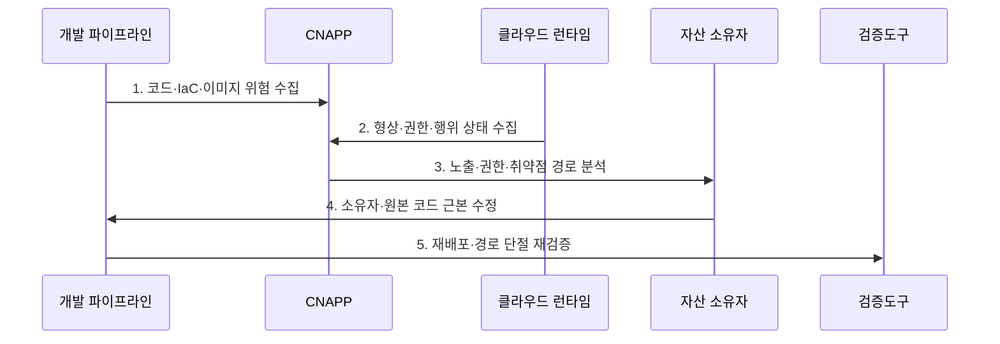

---
sidebar:
  order: 73
  label: "073. 클라우드 네이티브 애플리케이션 보호 플랫폼 (Cloud-Native Application Protection Platform, CNAPP)"
  badge:
    text: "미출제 · 70%"
    variant: note
title: "클라우드 네이티브 애플리케이션 보호 플랫폼 (Cloud-Native Application Protection Platform, CNAPP)"
date: "2026-07-25T22:13:00+09:00"
tags:
  - "notes-security"
weight: 73
extra:
  question_no: "073"
  source_status: "미출제"
  source_history: ""
  priority: 70
  priority_note: "클라우드 보안 도구군을 통합하는 코드-런타임 우산임"
---

## 미리 알고가기

- **클라우드 네이티브 애플리케이션 보호 플랫폼(Cloud-Native Application Protection Platform, CNAPP)**: 개발 코드부터 런타임까지 형상·권한·취약점·위협을 연결하여 공격 경로를 분석하는 통합 보안 플랫폼이다.
- **클라우드 네이티브(Cloud Native)**: 컨테이너·자동화·관리형 서비스를 활용해 클라우드 특성에 맞게 개발·운영하는 방식이다.
- **코드형 인프라(Infrastructure as Code, IaC)**: 인프라 설정을 코드 파일로 정의하고 형상 관리와 자동 배포를 적용하는 방식이다.
- **클라우드 보안 태세 관리(Cloud Security Posture Management, CSPM)**: 클라우드 자원의 설정 오류와 규제 준수 상태를 지속해서 점검하는 기능이다.
- **클라우드 인프라 권한 관리(Cloud Infrastructure Entitlement Management, CIEM)**: 사람과 워크로드에 부여된 실제 클라우드 권한을 분석하고 과도한 권한을 줄이는 기능이다.
- **클라우드 워크로드 보호 플랫폼(Cloud Workload Protection Platform, CWPP)**: 가상 머신·컨테이너·서버리스 워크로드의 취약점과 런타임 위협을 보호하는 기능이다.
- **이미지(Image)**: 컨테이너 실행에 필요한 파일과 설정을 묶은 불변 배포 패키지이다.
- **런타임(Runtime)**: 배포된 응용과 워크로드가 실제 실행되는 환경이다.
- **드리프트(Drift)**: 배포된 실제 설정이 승인된 코드나 기준과 달라진 상태이다.
- **자산 관계 그래프(Asset Relationship Graph)**: 자원·권한·네트워크·취약점 관계를 연결한 모델이다.
- **공격 경로(Attack Path)**: 공격자가 노출 지점에서 중요 자산까지 도달할 수 있는 연결 경로이다.
- **응용 프로그래밍 인터페이스(Application Programming Interface, API)**: 비밀 키나 토큰으로 인증하여 클라우드 기능과 데이터를 호출하는 접점이다.
- **비밀(Secret)**: 비밀번호·API 키·토큰처럼 인증과 암호화에 쓰는 민감 정보이다.
- **오탐(False Positive)**: 실제 위험이 아닌 상태를 위험으로 잘못 경보하는 결과이다.
- **NIST SP 800-190**: 컨테이너 이미지·레지스트리·오케스트레이터·런타임 위험과 대책을 제시한 지침이다.
- **NIST SP 800-218 SSDF 1.1**: 안전한 소프트웨어 개발 관행을 개발·공급·취약점 대응에 통합하는 공식 지침이다.

## Ⅰ. 개요

- 정의: 코드부터 런타임의 **위험·공격경로 통합**
- 기존 한계: 분리 도구의 **경보 중복·맥락 단절**

### 쉽게 이해하기 (학습용)

- CNAPP는 각각 따로 울리는 보안 경보를 묶어 어떤 조합이 실제 중요 자산 침해로 이어지는지 보여 준다.

## Ⅱ. 특징

- IaC·코드·이미지·런타임의 **전주기 연결**
- 자산·권한·노출·취약점의 **관계 분석**
- CSPM·CIEM·CWPP의 **통합 우선순위화**

### 쉽게 이해하기 (학습용)

- 심각한 취약점 하나보다 인터넷에 노출되고 강한 권한까지 가진 취약 워크로드가 실제로 더 먼저 고쳐야 할 대상이다.

## Ⅲ. 구조 및 구성요소

| 설계 요소 | 설명 |
|:---|:---|
| 코드·IaC·이미지 | 배포 전 설정·비밀·취약점 점검 |
| CSPM·CIEM | 형상·노출·유효 권한 평가 |
| CWPP | 워크로드와 런타임 위협 보호 |
| 자산 관계 그래프 | 위험 연결과 공격 경로 계산 |
| 소유자·파이프라인 연계 | 위험을 담당자와 원본 코드·배포 경로에 연결 |

### 쉽게 이해하기 (학습용)

- 개발 산출물과 운영 자원의 설정·권한·실행 위험을 한 그래프로 묶고 원인이 있는 코드까지 돌아가 수정한다.

## Ⅳ. 흐름도

| 절차 | 설명 |
|:---|:---|
| 코드·IaC·이미지 위험 수집 | 배포 전 결함·비밀 탐지 |
| 형상·권한·행위 상태 수집 | 운영 자산 실제 상태 확보 |
| 노출·권한·취약점 경로 분석 | 중요 자산 도달 가능성 계산 |
| 소유자·원본 코드 근본 수정 | 재현 가능한 원인 교정 |
| 재배포·경로 단절 재검증 | 운영 위험 제거를 확인 |

> 요약: 코드·운영 위험을 연결해 원본 코드 수정

### 쉽게 이해하기 (학습용)

- 배포 전 정보와 실제 운영 상태를 합쳐 공격 경로를 찾고 담당자가 원본 코드를 고친 뒤 같은 경로가 사라졌는지 확인한다.

## Ⅴ. 종류 및 비교

| 클라우드 보호 유형 | CNAPP | 개별 보안 도구 | 단순 통합 제품군 |
|:---|:---|:---|:---|
| 적용 기준 | 클라우드 위험 통합 우선순위 | 단일 영역 전문 보호 | 운영 화면 통합 |
| 핵심 특징 | **코드·런타임 관계 분석** | **영역별 위험 탐지** | 경보 한 화면 집계 |
| 한계 | 데이터 공백·벤더 종속 | 경보 중복·이관 지연 | 관계 없는 점수 정렬 |

### 쉽게 이해하기 (학습용)

- 개별 도구는 한 부분만 보고 단순 통합은 경보를 모으지만 CNAPP는 경보 사이의 관계와 실제 공격 경로를 계산한다.

## Ⅵ. 실무 고려사항 및 대책

| 고려사항 | 대책 | 효과 |
|:---|:---|:---|
| 컨테이너 전주기 위험 | **NIST SP 800-190 적용** | 이미지·오케스트레이터·런타임 정렬 |
| 개발·공급망 결함 | **NIST SSDF 1.1 연계** | 원본 코드·취약점 대응 연결 |
| 센서 공백·벤더 종속 | **자산 대조·개방 API·원본 보존** | 분석 누락·이식성 위험 완화 |

### 쉽게 이해하기 (학습용)

- CNAPP는 외부에 노출된 컨테이너가 과도한 IAM 권한으로 민감 저장소에 접근하는 경로를 연결해 보여 주고 해당 권한부터 축소한다.

## Ⅶ. 결론

- **공격경로·자산중요도·센서완전성**으로 CNAPP 범위를 결정한다.

### 쉽게 이해하기 (학습용)

- CNAPP는 코드와 런타임의 관계로 실제 침해 경로를 찾아 원본 코드에서 제거한다.
