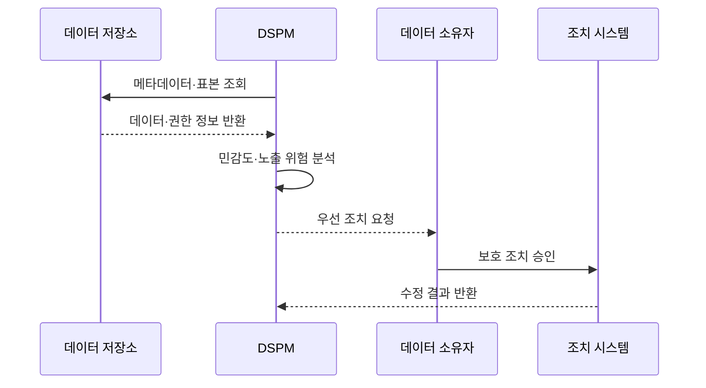

---
sidebar:
  order: 74
  label: "074. DSPM 데이터 보안 형상 관리 (Data Security Posture Management)"
  badge:
    text: "미출제 · 50%"
    variant: note
title: "DSPM 데이터 보안 형상 관리 (Data Security Posture Management)"
date: "2026-07-25T22:14:00+09:00"
tags:
  - "notes-security"
weight: 74
extra:
  question_no: "074"
  source_status: "미출제"
  source_history: ""
  priority: 50
  priority_note: "데이터 발견·분류·노출을 다루는 독립 클라우드 설계임"
---

## 미리 알고가기

- **데이터 보안 태세 관리(Data Security Posture Management, DSPM)**: 저장 데이터의 민감도·위치·접근·복제·노출을 지속해서 분석하고 위험을 줄이는 관리 체계이다.
- **데이터 보안 형상(Data Security Posture)**: 데이터의 민감도와 접근·암호화·공개 상태를 결합한 보호 상태
- **데이터 분류(Data Classification)**: 내용과 업무 가치를 기준으로 데이터의 민감도와 보호 등급을 정하는 활동
- **정형 데이터(Structured Data)**: 표와 열처럼 미리 정의된 구조로 저장된 데이터
- **비정형 데이터(Unstructured Data)**: 문서·이미지·메일처럼 고정된 표 구조가 없는 데이터
- **그림자 데이터(Shadow Data)**: 보안·거버넌스 관리 밖에서 생성·복제·보관되는 데이터
- **데이터 계보(Data Lineage)**: 데이터가 생성·변환·복제·이동한 경로와 관계
- **유효 접근(Effective Access)**: 직접·상속·그룹·공개 설정을 모두 합친 실제 접근 가능 범위
- **서비스형 소프트웨어(Software as a Service, SaaS)**: 공급자가 운영하는 완성된 애플리케이션을 인터넷으로 제공하는 서비스 모델이다.
- **클라우드 보안 태세 관리(Cloud Security Posture Management, CSPM)**: 클라우드 자원의 설정 오류와 규제 준수 상태를 점검하는 관리 기능이다.
- **데이터 유출 방지(Data Loss Prevention, DLP)**: 민감정보의 저장·전송·반출을 탐지하고 정책에 따라 차단하는 통제이다.
- **마스킹(Masking)**: 민감한 데이터 일부를 알아볼 수 없게 가리는 처리
- **비침투형 발견(Non-Intrusive Discovery)**: 운영 데이터 변경 없이 메타데이터나 읽기 권한으로 데이터를 찾는 방식
- **오탐(False Positive)**: 민감하지 않은 데이터를 민감하다고 잘못 분류한 결과

## Ⅰ. 개요

- **정의**: 저장 데이터의 위치·민감도·노출 관리
- **배경/필요성**: 그림자 데이터와 과도한 접근 축소
- **기준**: 민감도·권한·공개·암호화의 결합

### 쉽게 이해하기 (학습용)

- DSPM은 금고 설정만 보지 않고 어느 금고에 어떤 민감정보가 있고 누가 실제 열 수 있는지까지 연결해 본다.

## Ⅱ. 특징

- 정형·비정형·SaaS 데이터를 자동 발견한다.
- 내용과 업무 문맥으로 민감도를 분류한다.
- 복제·이동 경로에서 그림자 데이터를 식별한다.
- 직접·상속·공개 권한으로 유효 접근을 계산한다.
- 민감도와 노출 조합으로 조치 순위를 정한다.

### 쉽게 이해하기 (학습용)

- 같은 공개 설정이라도 빈 테스트 파일보다 고객정보 복제본이 든 저장소를 먼저 고치도록 위험의 실제 크기를 따진다.

## Ⅲ. 아키텍처 및 구성요소

| 설계 요소 | 설명 |
|:---|:---|
| 저장소 연동 | 저장소·소유자·복제본 연결 |
| 발견·분류 엔진 | 데이터 위치와 민감도 식별 |
| 접근·계보 분석 | 유효 권한과 이동 경로 계산 |
| 위험 우선순위 | 노출·민감도·보호 상태 결합 |
| 조치·증적 | 권한 축소·마스킹·삭제 관리 |
| 소유자·조치 연계 | 위험 근거를 데이터 책임자와 보호 시스템에 연결 |

### 쉽게 이해하기 (학습용)

- 저장소를 읽어 민감한 데이터를 찾고 실제 접근자와 복제 경로를 계산해 가장 위험한 위치부터 고친다.

## Ⅳ. 원리 및 절차 흐름도

| 절차 | 설명 |
|:---|:---|
| 메타데이터·표본 조회 | 최소 읽기 권한으로 저장소 검사 |
| 데이터·권한 정보 반환 | 내용·소유자·공유·암호화 제공 |
| 민감도·노출 위험 분석 | 계보와 유효 접근을 결합 |
| 우선 조치 요청 | 위험 근거와 수정 위치 전달 |
| 보호 조치 승인 | 권한 축소·마스킹·삭제 결정 |
| 수정 결과 반환 | 재스캔으로 위험 제거 확인 |

> 요약: 민감 데이터의 실제 접근 경로를 축소

### 쉽게 이해하기 (학습용)

- DSPM이 데이터를 바꾸지 않고 먼저 조사한 뒤 소유자에게 위험 근거를 보여 주고 승인된 보호 조치가 실제 반영됐는지 다시 확인한다.

## Ⅴ. 종류 및 비교

| 비교축 | DSPM | CSPM | DLP |
|:---|:---|:---|:---|
| 핵심 특징 | 저장 데이터·접근 관계 분석 | 클라우드 자원 설정 평가 | 데이터 사용·이동 통제 |
| 적용 기준 | 민감 데이터 위치·노출 파악 | 안전한 클라우드 구성 | 실시간 반출 탐지·차단 |
| 주요 위험 | 분류 오탐·스캔 공백 | 데이터 내용 미파악 | 미등록 저장 데이터 누락 |

### 쉽게 이해하기 (학습용)

- CSPM은 금고 설정, DLP는 문서 이동, DSPM은 금고 안의 내용과 실제 열쇠 소유자를 중심으로 본다.

## Ⅵ. 실무 사례

1. 공개 저장소의 **고객정보 복제본 탐지·폐기**

### 쉽게 이해하기 (학습용)

- DSPM은 관리 목록 밖의 클라우드 저장소에서 고객정보 복제본과 공개 권한을 함께 찾아 소유자를 확인하고 접근 차단·폐기를 수행한다.

## Ⅶ. 결론

- 미관리 민감 데이터와 과도한 접근 위험을 줄이기 위해 데이터의 민감도·소유자·유효 권한·복제 계보·보호 상태를 검토하여, 위험한 접근과 복제 경로를 우선 조치하는 DSPM을 활용해야 한다.

### 쉽게 이해하기 (학습용)

- DSPM의 성과는 발견 건수보다 미관리 민감 데이터와 불필요한 접근·복제 경로를 실제로 얼마나 없앴는지로 판단한다.
