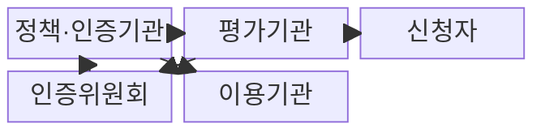
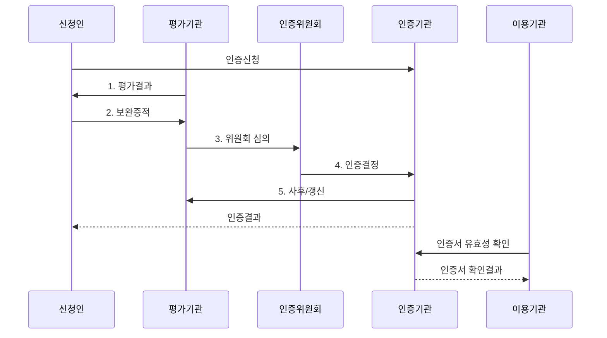

---
sidebar:
  order: 75
  label: "075. 클라우드 CSAP 보안 인증 등급제(Cloud Security Assurance Program)"
  badge:
    text: "기출 · 85%"
    variant: note
title: "클라우드 CSAP 보안 인증 등급제(Cloud Security Assurance Program)"
date: "2026-07-31T02:10:24+09:00"
tags:
  - "notes-security"
weight: 75
extra:
  question_no: "075"
  source_status: "기출"
  source_history: "128회, 132회, 138회"
  priority: 85
  priority_note: "128·132·138회 반복, 공공 클라우드 인증 핵심"
---

## 미리 알고가기

- **클라우드서비스 보안인증제(Cloud Security Assurance Program, CSAP)**: 클라우드 서비스의 보안조치가 법정 인증기준에 적합한지를 평가하고 인증하는 제도이다.
- **과학기술정보통신부(Ministry of Science and ICT, MSIT)**: CSAP 정책과 고시를 관할하는 중앙행정기관이다.
- **한국인터넷진흥원(Korea Internet & Security Agency, KISA)**: 클라우드 보안인증과 평가 업무를 수행하는 전문기관이다.
- **인증기관**: 법령에 따라 보안인증 업무를 수행하도록 지정된 기관이다.
- **평가기관**: 서면·현장·취약점 점검으로 인증평가를 수행하는 기관이다.
- **인증위원회**: 평가와 보완 결과를 심의하여 인증 여부를 결정하는 기구이다.
- **서비스형 인프라(Infrastructure as a Service, IaaS)**: 서버·저장소·네트워크 인프라를 서비스로 제공하는 모델이다.
- **서비스형 소프트웨어(Software as a Service, SaaS)**: 완성된 응용 소프트웨어를 인터넷으로 제공하는 모델이다.
- **서비스형 데스크톱(Desktop as a Service, DaaS)**: 원격 가상 데스크톱 환경을 서비스로 제공하는 모델이다.
- **CSAP 인증 유형**: IaaS·SaaS·DaaS로 구분하며 유형별 인증 유효기간은 5년이다.
- **CSAP 등급제**: 하 등급은 시행 중이며 상·중 등급은 고시 반영 후 적용될 예정이다.
- **인증 범위**: 인증서가 적용되는 서비스·자산·조직·시설·운영의 경계이다.
- **사후평가**: 인증 유효기간 중 매년 1회 기준 준수 상태를 확인하는 평가이다.
- **갱신평가**: 5년의 인증 유효기간 만료 전에 연장을 위해 받는 평가이다.
- **운영 드리프트(Operational Drift)**: 실제 운영 상태가 인증 당시 통제와 달라지는 현상이다.
- **클라우드컴퓨팅법 제23조의2**: 보안인증의 법적 근거와 인증기준 충족 의무를 규정한다.
- **클라우드컴퓨팅서비스 보안인증에 관한 고시**: 인증기준·절차·사후관리의 세부사항을 규정한다.

## Ⅰ. 개요

- 정의/개념: 클라우드 서비스의 법정 보안기준 적합성을 평가·인증하는 **공공 보안인증 제도**
- 배경/필요성: 단일 보안기준만으로는 공공 정보 중요도별 **통제 수준 구분 곤란**

### 쉽게 이해하기 (학습용)

- CSAP는 공공기관이 사용할 클라우드가 정해진 보안기준을 실제 인증 범위에서 지키는지 독립 평가로 확인하는 제도이다.

## Ⅱ. 특징

- IaaS·SaaS·DaaS 유형별 **5년 인증 유효기간**
- **하 등급 시행**과 상·중 등급의 고시 반영 후 적용 예정
- **연 1회 사후평가·만료 전 갱신평가**를 통한 적합성 유지

### 쉽게 이해하기 (학습용)

- 같은 회사의 서비스라도 제공 방식과 운영 경계가 다르면 인증 유형·등급·범위를 각각 확인해야 한다.

## Ⅲ. 구조 및 구성요소

| 구성요소 | 책임 |
|:---|:---|
| 정책·인증기관 | **고시 운영·인증 결정·사후관리** 수행 |
| 평가기관 | **서면·현장·취약점 평가**와 결과 제출 |
| 신청자 | 인증 범위·통제·**운영 증적** 준비 |
| 인증위원회 | 평가결과·보완증적의 **적합성 심의** |
| 이용기관 | 인증서의 **서비스명·유형·등급·범위·유효기간** 확인 |

### 쉽게 이해하기 (학습용)

- 신청인은 범위와 증적을 준비하고 평가기관은 통제 상태를 점검하며 인증위원회와 인증기관은 결과 심의·발급·유지관리를 담당한다.

## Ⅳ. 흐름도

**동작 원리**

1. **평가결과**: 평가기관이 서면·현장·취약점 점검과 부적합 사항 제공
2. **보완증적**: 신청자가 부적합 원인을 시정하고 이행 증거 제출
3. **위원회 심의**: 평가결과와 보완증적의 인증기준 적합성 심의
4. **인증결정**: 인증기관이 서비스 유형·등급·범위·유효기간 결정
5. **사후/갱신**: 연 1회 운영 준수 상태와 만료 전 연장 적합성 평가

### 쉽게 이해하기 (학습용)

- 인증은 서류 제출로 끝나지 않고 현장과 취약점을 확인한 뒤 보완·심의·발급을 거쳐 운영 중에도 유효성을 점검한다.

## Ⅴ. 종류 및 비교

| CSAP 평가 유형 | 최초평가 | 사후평가 | 갱신평가 |
|:---|:---|:---|:---|
| 적용 시점 | **최초 인증 신청** 시 | 인증 후 **매년 1회** | **5년 만료 전** |
| 평가 목적 | 인증기준의 **최초 적합성** 확인 | 운영 중 **기준 준수** 확인 | 인증 유효기간의 **연장 적합성** 확인 |
| 주요 범위 | 서면·현장·취약점의 **전체 평가** | 변경·운영 상태와 **부적합 조치** | 전체 기준과 **누적 변경사항** 재평가 |
| 결과 | 서비스 유형·등급·범위의 **인증결정** | 인증 유지·시정 등 **사후조치** | 인증 **갱신·종료 결정** |

### 쉽게 이해하기 (학습용)

- 최초평가는 인증 취득, 사후평가는 매년 유지, 갱신평가는 만료 전 연장을 판단한다.

## Ⅵ. 실무 고려사항 및 대책

| 고려사항 | 대책 | 효과 |
|:---|:---|:---|
| 법적 근거를 확인하지 않으면 인증 대상·절차 오판 | **클라우드컴퓨팅법 제23조의2** 준수 | 인증 대상과 **절차 적법성** 확보 |
| 시행 등급과 예정 등급을 혼동하면 조달 기준 오적용 | **하 등급 시행·상중 고시 반영 예정** 구분 | 현행 **등급 적용 오류** 방지 |
| 인증서와 도입 조건이 다르면 범위 밖 서비스 사용 | **서비스명·유형·등급·범위·유효기간** 대조 | 미인증·만료 서비스의 **공공 도입 방지** |

### 쉽게 이해하기 (학습용)

- 공공기관은 계약하려는 서비스명·등급·데이터센터·유효기간이 인증서 범위와 실제 도입 조건에 모두 일치하는지 대조해야 한다.

## Ⅶ. 결론

- 인증서 **서비스명·유형·등급·범위·유효기간**이 모두 일치하면 도입, 하나라도 다르면 **배제**

### 쉽게 이해하기 (학습용)

- 인증 보유 여부만 보지 말고 실제 이용 서비스가 인증 범위에 포함되며 운영 변화 뒤에도 인증이 유효한지를 확인해야 한다.
