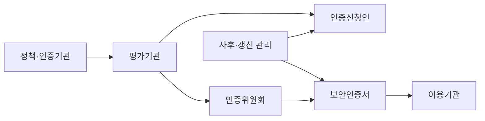
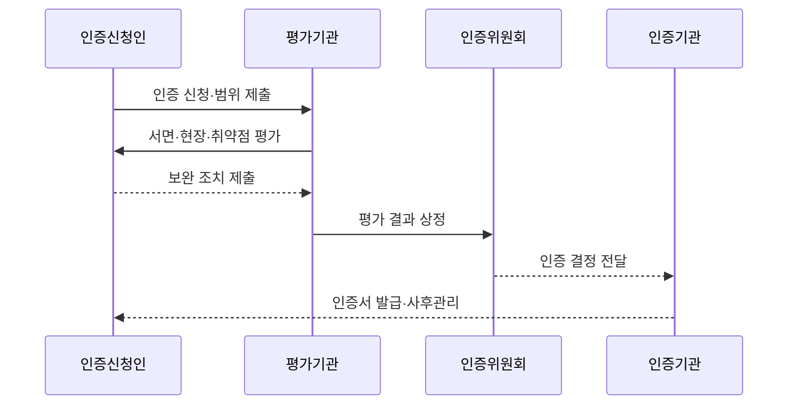

---
sidebar:
  order: 75
  label: "075. 클라우드 CSAP 보안 인증 등급제 (Cloud Security Assurance Program)"
  badge:
    text: "기출 · 85%"
    variant: note
title: "클라우드 CSAP 보안 인증 등급제 (Cloud Security Assurance Program)"
date: "2026-07-27T23:59:59+09:00"
tags:
  - "notes-security"
weight: 75
extra:
  question_no: "075"
  source_status: "기출"
  source_history: "128회, 132회, 138회"
  priority: 85
  priority_note: "128·132·138회 반복된 공공 클라우드 인증 핵심임"
---

## 미리 알고가기

- **CSAP(Cloud Security Assurance Program)**: 클라우드 서비스의 보안 조치가 법정 인증기준에 적합한지 평가·인증하는 제도
- **KISA(Korea Internet & Security Agency)**: 한국인터넷진흥원의 영문 약자로 CSAP 인증 업무를 수행할 수 있는 기관
- **과학기술정보통신부(Ministry of Science and ICT, MSIT)**: CSAP 고시와 정책을 담당하는 중앙행정기관
- **인증기관**: 법령에 따라 보안인증 업무를 수행하도록 지정된 기관
- **평가기관**: 서면·현장·취약점 점검 등 인증평가를 수행하는 기관
- **인증위원회**: 평가와 보완 결과를 심의해 인증 여부를 결정하는 기구
- **IaaS(Infrastructure as a Service)**: 서버·저장소·네트워크 인프라를 서비스로 제공하는 모델
- **PaaS(Platform as a Service)**: 응용 개발·배포·운영 환경을 서비스로 제공하는 모델
- **SaaS(Software as a Service)**: 완성된 응용 소프트웨어를 서비스로 제공하는 모델
- **복합 서비스**: IaaS·PaaS·SaaS 중 둘 이상을 결합해 제공하는 서비스
- **인증 범위**: 인증서가 적용되는 서비스·자산·조직·시설·운영 경계
- **사후평가**: 인증 유효기간 중 기준 준수 상태를 확인하는 평가
- **갱신평가**: 5년의 인증 유효기간 만료 전에 연장을 위해 받는 평가
- **운영 드리프트(Operational Drift)**: 실제 운영 상태가 인증 당시의 통제와 달라지는 현상
- **약어 읽기와 표기**: CSAP·KISA·MSIT는 씨에스에이피·키사·엠에스아이티로 읽고 영문 핵심 글자를 딴 표기이며, 인증 제도·수행 기관·정책 기관 역할을 구분함
- **서비스형 계층 읽기**: IaaS·PaaS·SaaS는 아이에이에스·피에이에스·에스에이에스로 읽고 as a Service의 앞에 인프라·플랫폼·소프트웨어 머리글자를 붙여 제공 계층을 나타냄

## Ⅰ. 개요

- **정의/개념**: 클라우드 서비스의 법정 보안기준 적합성을 평가·인증하는 제도
- **배경/필요성**: 일반 서비스 보안 수준만으로 공공 정보 위험 통제 곤란

### 쉽게 이해하기 (학습용)

- CSAP는 클라우드 서비스가 정해진 보안 기준을 실제 범위 안에서 설계하고 운영하는지 독립 평가로 확인하는 제도다.

## Ⅱ. 특징

- 범위 평가는 인증 밖 서비스의 오적용을 막는다
- 서비스 유형 구분은 책임 경계 누락을 막는다
- 상·중·하 등급은 위험별 통제 비용을 조정한다
- 서면·현장·취약점 평가는 통제 공백을 찾는다
- 사후·갱신 평가는 운영 드리프트를 막는다

### 쉽게 이해하기 (학습용)

- 같은 회사의 서비스라도 인증서에 적힌 서비스와 운영 경계 밖의 자원에는 그 인증을 그대로 적용할 수 없다.

## Ⅲ. 아키텍처 및 구성요소

| 설계 요소 | 설명 |
|:---|:---|
| 정책·인증기관 | 고시 운영과 인증 업무 수행 |
| 평가기관 | 서면·현장·취약점 평가 |
| 인증신청인 | 범위·통제·운영 증적 준비 |
| 인증위원회 | 평가·보완 결과 심의 |
| 보안인증서 | 유형·등급·범위·유효성 표시 |
| 이용기관 | 인증 적합성과 현재 상태 확인 |
| 사후·갱신 관리 | 준수 유지와 유효기간 연장 |

> 요약: 기관이 범위·통제를 평가하고 유효성을 관리한다

### 쉽게 이해하기 (학습용)

- 신청인이 범위와 증거를 내면 평가기관이 확인하고 위원회가 심의하며 이용기관은 발급된 인증의 범위와 유효성을 확인한다.

## Ⅳ. 원리 및 절차 흐름도

| 절차 | 설명 |
|:---|:---|
| 인증 신청·범위 제출 | 유형·등급·자산·조직 확정 |
| 서면·현장·취약점 평가 | 기준 이행과 실제 상태 점검 |
| 보완 조치 제출 | 부적합 원인 수정과 증적 제시 |
| 평가 결과 상정 | 보완을 포함한 보고서 제출 |
| 인증 결정 전달 | 위원회가 적합 여부 심의 |
| 인증서 발급·사후관리 | 범위 표시와 유지 상태 확인 |

> 요약: 범위별 이행을 평가해 인증하고 계속 관리한다.

### 쉽게 이해하기 (학습용)

- 인증은 서류 제출로 끝나지 않고 현장과 취약점을 확인해 부족한 점을 고친 뒤 심의를 거쳐 발급되고 운영 중에도 유지 여부를 점검한다.

## Ⅴ. CSAP 서비스 유형 비교

| 판단 기준 | IaaS | PaaS | SaaS·복합 |
|:---|:---|:---|:---|
| 적용 기준 | 서버·저장소·망 제공 | 앱 개발·운영 환경 제공 | 완성 앱 또는 복합 제공 |
| 핵심 특징 | 인프라 서비스 범위 평가 | 개발·실행 플랫폼 평가 | 소프트웨어·결합 범위 평가 |
| 한계 | 하부 통제 경계 누락 | 플랫폼 책임 경계 혼선 | 외부 연계·상속 통제 누락 |

> 요약: 제공 계층에 맞춰 인증 유형과 통제를 정한다

### 쉽게 이해하기 (학습용)

- 서비스가 제공하는 계층에 따라 인증 유형을 고르고 정보보호 수준에 맞는 등급과 실제 이용 범위가 인증서에 포함되는지 확인한다.

## Ⅵ. 실무 사례

1. 외부 연계·지원 조직까지 인증 범위에 넣는다
2. 운영 증적을 평가 전부터 상시 축적한다
3. 중요 변경 전에 인증 영향도를 검토한다
4. 도입 기관은 인증서 범위·유효성을 대조한다

### 쉽게 이해하기 (학습용)

- 사례 1은 실제 서비스에 관여하는 연계 시스템과 운영 조직을 빼고 좁은 범위만 인증받는 공백을 막는다.
- 사례 2는 계정·로그·사고·복구 통제가 평소에는 작동하지 않고 평가 때만 문서로 꾸며지는 일을 방지한다.
- 사례 3은 데이터센터·아키텍처·외부 사업자 변경이 인증 당시의 보안 경계를 깨뜨리지 않는지 먼저 확인한다.
- 사례 4는 제품 이름이 같다는 이유로 다른 서비스나 만료된 인증을 공공 업무에 잘못 적용하지 않게 한다.

## Ⅶ. 결론

- 공공 클라우드 도입이면 범위·등급·유효성을 확인한다.

### 쉽게 이해하기 (학습용)

- CSAP의 핵심은 인증서 보유 자체가 아니라 실제 이용 서비스가 인증 범위에 있고 그 통제가 변경 뒤에도 계속 유지되는지 확인하는 것이다.
