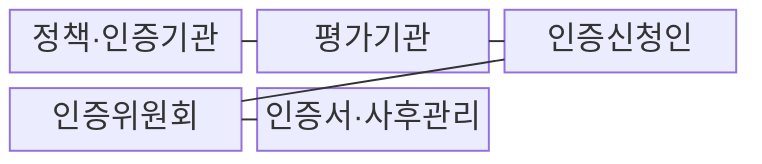
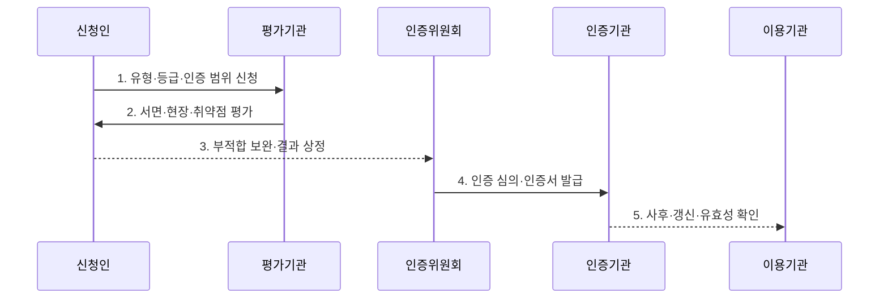

---
sidebar:
  order: 75
  label: "075. 클라우드 CSAP 보안 인증 등급제(Cloud Security Assurance Program)"
  badge:
    text: "기출 · 85%"
    variant: note
title: "클라우드 CSAP 보안 인증 등급제(Cloud Security Assurance Program)"
date: "2026-07-30T20:00:00+09:00"
tags:
  - "notes-security"
weight: 75
extra:
  question_no: "075"
  source_status: "기출"
  source_history: "128회, 132회, 138회"
  priority: 85
  priority_note: "128·132·138회 반복, 공공 클라우드 인증 핵심"
---

## 미리 알고가기

- **클라우드서비스 보안인증제(Cloud Security Assurance Program, CSAP)**: 클라우드 서비스의 보안조치가 법정 인증기준에 적합한지를 평가하고 인증하는 제도이다.
- **과학기술정보통신부(Ministry of Science and ICT, MSIT)**: CSAP 정책과 고시를 관할하는 중앙행정기관이다.
- **한국인터넷진흥원(Korea Internet & Security Agency, KISA)**: 클라우드 보안인증과 평가 업무를 수행하는 전문기관이다.
- **인증기관**: 법령에 따라 보안인증 업무를 수행하도록 지정된 기관이다.
- **평가기관**: 서면·현장·취약점 점검으로 인증평가를 수행하는 기관이다.
- **인증위원회**: 평가와 보완 결과를 심의하여 인증 여부를 결정하는 기구이다.
- **서비스형 인프라(Infrastructure as a Service, IaaS)**: 서버·저장소·네트워크 인프라를 서비스로 제공하는 모델이다.
- **서비스형 플랫폼(Platform as a Service, PaaS)**: 응용 개발·배포·운영 환경을 서비스로 제공하는 모델이다.
- **서비스형 소프트웨어(Software as a Service, SaaS)**: 완성된 응용 소프트웨어를 인터넷으로 제공하는 모델이다.
- **복합 서비스**: IaaS·PaaS·SaaS 중 둘 이상을 결합해 제공하는 서비스이다.
- **인증 범위**: 인증서가 적용되는 서비스·자산·조직·시설·운영의 경계이다.
- **사후평가**: 인증 유효기간 중 기준 준수 상태를 확인하는 평가이다.
- **갱신평가**: 5년의 인증 유효기간 만료 전에 연장을 위해 받는 평가이다.
- **운영 드리프트(Operational Drift)**: 실제 운영 상태가 인증 당시 통제와 달라지는 현상이다.
- **클라우드컴퓨팅법 제23조의2**: 보안인증의 법적 근거와 인증기준 충족 의무를 규정한다.
- **클라우드컴퓨팅서비스 보안인증에 관한 고시**: 인증기준·절차·사후관리의 세부사항을 규정한다.

## Ⅰ. 개요

- 정의/개념: 클라우드컴퓨팅법에 따른 **법정 보안인증 제도**
- 배경/필요성: 공공 정보의 **위험별 통제 수준 부족**

### 쉽게 이해하기 (학습용)

- CSAP는 공공기관이 사용할 클라우드가 정해진 보안기준을 실제 인증 범위에서 지키는지 독립 평가로 확인하는 제도이다.

## Ⅱ. 특징

- 서비스 유형·등급별 **위험 기반 인증**
- 서면·현장·취약점의 **다층 평가**
- 사후·갱신평가의 **운영 적합성 유지**

### 쉽게 이해하기 (학습용)

- 같은 회사의 서비스라도 제공 방식과 운영 경계가 다르면 인증 유형·등급·범위를 각각 확인해야 한다.

## Ⅲ. 구조 및 구성요소

| 구성요소 | 책임 |
|:---|:---|
| 정책·인증기관 | 고시 운영·인증 업무 수행 |
| 평가기관 | 서면·현장·취약점 평가 |
| 인증신청인 | 범위·통제·운영 증적 준비 |
| 인증위원회 | 평가·보완 결과 심의 |
| 인증서·사후관리 | 유형·등급·범위·유효성 관리 |

### 쉽게 이해하기 (학습용)

- 신청인은 범위와 증적을 준비하고 평가기관은 통제 상태를 점검하며 인증위원회와 인증기관은 결과 심의·발급·유지관리를 담당한다.

## Ⅳ. 흐름도

**동작 원리**

1. **유형·등급·인증 범위 신청**: 서비스·자산·조직 경계 확정
2. **서면·현장·취약점 평가**: 기준 이행·통제 상태 점검
3. **부적합 보완·결과 상정**: 원인 시정·보완 증적 제출
4. **인증 심의·인증서 발급**: 적합성 결정·범위 명시
5. **사후·갱신·유효성 확인**: 운영 변화·만료 상태 검증

### 쉽게 이해하기 (학습용)

- 인증은 서류 제출로 끝나지 않고 현장과 취약점을 확인한 뒤 보완·심의·발급을 거쳐 운영 중에도 유효성을 점검한다.

## Ⅴ. 종류 및 비교

| CSAP 서비스 유형 | IaaS | PaaS | SaaS·복합 |
|:---|:---|:---|:---|
| 적용 기준 | 서버·저장소·망 제공 | 앱 개발·운영 환경 제공 | 완성 앱·복합 기능 제공 |
| 핵심 특징 | **인프라 경계 평가** | **플랫폼 책임 평가** | **앱·연계 범위 평가** |
| 한계 | 상위 계층 통제 공백 | 플랫폼 책임 경계 혼선 | 외부 연계·종속 통제 누락 |

### 쉽게 이해하기 (학습용)

- 제공 계층에 따라 공급자와 이용자의 책임 경계가 달라지므로 실제 서비스 방식과 맞는 인증 유형을 선택해야 한다.

## Ⅵ. 실무 고려사항 및 대책

| 고려사항 | 대책 | 효과 |
|:---|:---|:---|
| 법정 인증 근거 | **클라우드컴퓨팅법 제23조의2 준수** | 대상·절차 적법성 확보 |
| 세부 평가·사후관리 | **클라우드컴퓨팅서비스 보안인증 고시 적용** | 범위·등급·유효성 일관화 |
| 도입 서비스 적합성 | **인증 범위·5년 유효성 대조** | 범위 밖·만료 서비스 방지 |

### 쉽게 이해하기 (학습용)

- 공공기관은 계약하려는 서비스명·등급·데이터센터·유효기간이 인증서 범위와 실제 도입 조건에 모두 일치하는지 대조해야 한다.

## Ⅶ. 결론

- **정보중요도·인증범위·유효성**으로 CSAP 서비스를 결정한다.

### 쉽게 이해하기 (학습용)

- 인증 보유 여부만 보지 말고 실제 이용 서비스가 인증 범위에 포함되며 운영 변화 뒤에도 인증이 유효한지를 확인해야 한다.
