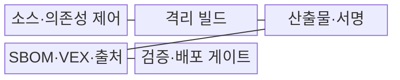
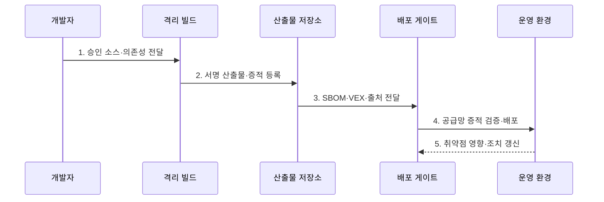

---
sidebar:
  order: 76
  label: "076. 소프트웨어 공급망 보안 (Supply Chain Security)"
  badge:
    text: "기출 · 85%"
    variant: note
title: "소프트웨어 공급망 보안 (Supply Chain Security)"
date: "2026-07-30T20:00:00+09:00"
tags:
  - "notes-security"
weight: 76
extra:
  question_no: "076"
  source_status: "기출"
  source_history: "128회, 134회, 135회, 138회"
  priority: 85
  priority_note: "128·134·135·138회 반복된 최우선 공급망 주제임"
---

## 미리 알고가기

- **소프트웨어 공급망(Software Supply Chain)**: 소스·의존성·빌드·저장소·배포를 거쳐 소프트웨어가 만들어지는 전체 연결이다.
- **의존성(Dependency)**: 응용이 기능을 사용하기 위해 포함하거나 호출하는 외부 소프트웨어이다.
- **전이 의존성(Transitive Dependency)**: 직접 선택한 의존성이 다시 포함한 간접 의존성이다.
- **소프트웨어 자재 명세서(Software Bill of Materials, SBOM)**: 제품의 구성요소·버전·식별자·관계를 기록한 명세서이다.
- **취약점 악용 가능성 교환(Vulnerability Exploitability eXchange, VEX)**: 제품별 취약점 영향 상태와 판단 근거를 전달하는 문서이다.
- **출처 증명(Provenance)**: 산출물을 누가 어떤 소스·도구·과정으로 만들었는지 나타내는 검증 정보이다.
- **소프트웨어 산출물 공급망 수준(Supply-chain Levels for Software Artifacts, SLSA)**: 소스와 빌드 무결성 보증을 단계적으로 강화하는 프레임워크이다.
- **산출물(Artifact)**: 빌드 과정에서 생성된 실행 파일·패키지·컨테이너 이미지이다.
- **불변 저장소(Immutable Repository)**: 같은 식별자로 산출물을 덮어쓰지 못하게 하는 저장소이다.
- **격리 빌드(Isolated Build)**: 다른 작업과 권한·파일·네트워크를 분리한 환경에서 수행하는 빌드이다.
- **재현 가능한 빌드(Reproducible Build)**: 같은 소스와 조건에서 동일 산출물을 다시 만들 수 있는 빌드이다.
- **단명 자격 증명(Ephemeral Credential)**: 한 작업이나 짧은 시간만 유효한 인증 정보이다.
- **NIST SP 800-218 SSDF 1.1**: 안전한 소프트웨어 개발 관행을 SDLC에 통합하는 공식 지침이다.
- **CISA VEX 최소 요구사항**: VEX 문서 메타데이터와 취약점별 제품 상태·근거의 최소 필드를 제시한다.

## Ⅰ. 개요

- 정의/개념: 개발·유통 전 과정의 **출처·무결성 보호**
- 배경/필요성: 전이 의존성의 **오염 범위 식별 곤란**

### 쉽게 이해하기 (학습용)

- 완성 프로그램만 검사하지 않고 재료의 출처와 생산 공정 및 취약점의 실제 영향을 함께 확인한다.

## Ⅱ. 특징

- SBOM·VEX의 **구성·영향 가시성**
- 격리 빌드·서명의 **산출물 무결성**
- 출처·승격 정책의 **배포 신뢰성**

### 쉽게 이해하기 (학습용)

- SBOM에 취약 부품이 있어도 모두 위험한 것은 아니므로 VEX의 영향 근거와 문서 발행자·최신성을 함께 확인한다.

## Ⅲ. 구조 및 구성요소

| 구성요소 | 책임 |
|:---|:---|
| 소스·의존성 제어 | 승인 출처·고정 버전 관리 |
| 격리 빌드 | 최소 권한 환경의 산출물 생성 |
| 산출물·서명 | 해시·서명·불변 저장 |
| SBOM·VEX·출처 | 구성·영향·생산 이력 제공 |
| 검증·배포 게이트 | 증적 검증 후 승격 허용 |

### 쉽게 이해하기 (학습용)

- 승인한 재료를 격리 환경에서 만들고 산출물과 생산 이력을 서명한 뒤 검증을 통과한 결과만 배포한다.

## Ⅳ. 흐름도

**동작 원리**

1. **승인 소스·의존성 전달**: 출처·버전·해시 고정
2. **서명 산출물·증적 등록**: 결과·빌드 출처 함께 저장
3. **SBOM·VEX·출처 전달**: 구성·영향·생산 정보 연결
4. **공급망 증적 검증·배포**: 서명·정책 검증 후 승격
5. **취약점 영향·조치 갱신**: 영향 제품·수정 상태 추적

### 쉽게 이해하기 (학습용)

- 배포 게이트는 산출물과 SBOM·VEX·출처 증명을 검증하고 운영 중 새 취약점의 영향과 조치 상태를 다시 연결한다.

## Ⅴ. 종류 및 비교

| 공급망 보안 증적 | SBOM | VEX | 출처 증명 |
|:---|:---|:---|:---|
| 적용 기준 | 영향 구성요소 식별 | 취약점 조치 우선순위 | 빌드 출처·무결성 검증 |
| 핵심 특징 | **부품·버전·관계 기록** | **제품별 영향 상태 기록** | **생산 주체·과정 기록** |
| 한계 | 취약점·진위 단독 미보장 | 발행자·근거·최신성 의존 | 취약점 정보 부족 |

### 쉽게 이해하기 (학습용)

- SBOM은 재료표, VEX는 취약점 영향 판정서, 출처 증명은 생산 이력이며 세 증적을 배포 관문에 연결해야 한다.

## Ⅵ. 실무 고려사항 및 대책

| 고려사항 | 대책 | 효과 |
|:---|:---|:---|
| 개발 보안 관행 | **NIST SP 800-218 SSDF 적용** | SDLC 공급망 위험 축소 |
| 취약점 영향 전달 | **CISA VEX 최소 요구사항 적용** | 상태·근거 상호운용성 확보 |
| 증적 위조·노후화 | **서명자·해시·최신성 검증** | 오염 산출물 승격 차단 |

### 쉽게 이해하기 (학습용)

- Log4j 사고에서는 SBOM으로 포함 제품을 찾고 VEX로 실제 실행 영향을 판단하며 서명과 최신성이 검증된 결과만 조치 우선순위에 쓴다.

## Ⅶ. 결론

- **출처·무결성·악용가능성**으로 공급망 배포를 결정한다.

### 쉽게 이해하기 (학습용)

- 공급망 보안의 성패는 문서 보유량이 아니라 신뢰할 수 있는 소스와 빌드에서 나온 산출물만 배포하고 새 취약점 영향을 즉시 찾는 데 달려 있다.
