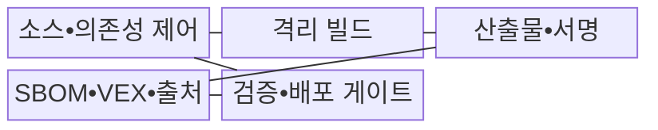
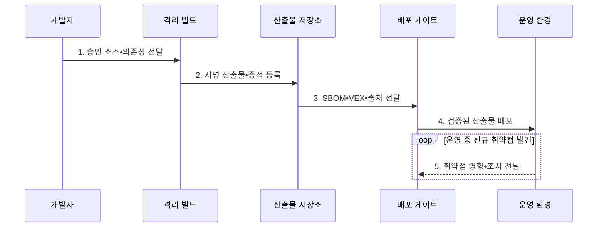

---
sidebar:
  order: 76
  label: "076. 소프트웨어 공급망 보안 (Supply Chain Security)"
  badge:
    text: "기출 • 85%"
    variant: note
title: "소프트웨어 공급망 보안 (Supply Chain Security)"
date: "2026-08-04T12:44:00+09:00"
tags:
  - "notes-security"
weight: 76
extra:
  question_no: "076"
  source_status: "기출"
  source_history: "128회, 134회, 135회, 138회"
  priority: 85
  priority_note: "128•134•135•138회 반복된 최우선 공급망 주제임"
---

## Ⅰ. 개요

핵심 용어

- **소프트웨어 공급망**: 소스•의존성•빌드•저장소•배포를 거쳐 소프트웨어가 만들어지는 전체 연결이다.
- **전이 의존성**: 개발자가 직접 선택한 구성요소가 다시 포함한 간접 의존성으로 오염 범위 파악을 어렵게 한다.

- 정의/개념: **소프트웨어 공급망 보안** 은 소스•의존성•빌드•저장소•배포 전 과정의 출처와 무결성을 통제•검증하는 **소프트웨어 위험관리 체계**
- 배경/필요성: 전이 의존성의 **오염 범위 식별 곤란**

#### 한줄 요약

- 완성 프로그램만 검사하지 않고 재료의 출처와 생산 공정 및 취약점의 실제 영향을 함께 확인한다.

## Ⅱ. 특징

핵심 용어

- **SBOM(Software Bill of Materials)** 은 제품의 구성 부품•버전•관계를 기록한 명세서다.
- **VEX(Vulnerability Exploitability eXchange)** 는 제품별 취약점 영향 상태와 판단 근거를 전달하는 문서다.
- **출처 증명**: 산출물을 누가 어떤 소스•도구•과정으로 만들었는지 나타내는 검증 정보이다.

- **구성•영향 가시성**: SBOM과 VEX로 오염 범위 판별
- **산출물 무결성**: 격리 빌드와 서명으로 변조 차단
- **배포 신뢰성**: 출처와 승격 정책으로 신뢰 검증

#### 한줄 요약

- SBOM에 취약 부품이 있어도 모두 위험한 것은 아니므로 VEX의 영향 근거와 문서 발행자•최신성을 함께 확인한다.

## Ⅲ. 구조 및 구성요소

핵심 용어

- **격리 빌드** 는 작업별 권한•파일•네트워크를 분리한 환경에서 산출물을 생성한다.
- **단명 자격** 은 하나의 빌드 작업과 짧은 시간에만 유효한 인증 정보다.
- **불변 저장소** 는 같은 식별자의 산출물을 덮어쓰지 못하게 보관하는 저장소다.
- **배포 게이트** 는 서명•증적 정책을 통과한 산출물만 운영으로 승격한다.

| 구성요소 | 책임 |
|:---|:---|
| 소스•의존성 제어 | **승인 출처•고정 버전** 관리 |
| 격리 빌드 | **단명 자격 증명•격리 환경** 으로 산출물 생성 |
| 산출물•서명 | **해시•서명** 과 불변 저장소로 변조 차단 |
| SBOM•VEX•출처 | **구성•영향 정보** 와 생산 이력 제공 |
| 검증•배포 게이트 | **증적 검증•승격 정책** 으로 배포 통제 |

#### 한줄 요약

- 승인한 재료를 격리 환경에서 만들고 산출물과 생산 이력을 서명한 뒤 검증을 통과한 결과만 배포한다.

## Ⅳ. 흐름도

핵심 용어

- **서명 산출물** 은 무결성과 발행 주체를 확인할 수 있도록 전자서명을 결합한 빌드 결과다.
- **증적** 은 SBOM•VEX•출처 정보를 산출물과 결속해 보존한 검증 자료다.
- **운영 영향 추적**: 새 취약점이 발견될 때 영향 제품•실행 가능성•수정 상태를 배포된 산출물까지 다시 연결하는 과정이다.

**동작 원리**

1. **승인 소스•의존성 전달**: 출처•버전•해시 고정
2. **서명 산출물•증적 등록**: 결과•빌드 출처 함께 저장
3. **SBOM•VEX•출처 전달**: 구성•영향•생산 정보 연결
4. **검증된 산출물 배포**: 서명•정책 통과 결과만 승격
5. **취약점 영향•조치 전달**: 영향 제품•수정 상태 추적

#### 한줄 요약

- 배포 게이트는 산출물과 SBOM•VEX•출처 증명을 검증하고 운영 중 새 취약점의 영향과 조치 상태를 다시 연결한다.

## Ⅴ. 종류 및 비교

핵심 용어

| 공급망 증적 | 담당 역할 | 결합 효과 |
|:---|:---|:---|
| **SBOM** | **부품•버전•관계 기록** | 영향받는 구성요소 식별 |
| **VEX** | **제품별 취약점 영향 상태 기록** | 조치 우선순위와 예외 근거 제공 |
| **출처 증명** | **생산 주체•빌드 과정 기록** | 산출물 출처•무결성 검증 |

#### 한줄 요약

- SBOM은 재료표, VEX는 취약점 영향 판정서, 출처 증명은 생산 이력이며 세 증적을 배포 관문에 연결해야 한다.

## Ⅵ. 실무 고려사항 및 대책

핵심 용어

- **SSDF(Secure Software Development Framework) 1.1** 은 안전한 개발 관행을 SDLC에 통합하는 지침이다.
- **SLSA(Supply-chain Levels for Software Artifacts) 1.2** 는 소스•빌드 출처와 무결성 보증 수준을 제시한다.
- **SDLC(Software Development Life Cycle)** 는 요구•설계•개발•시험•배포•운영의 소프트웨어 생명주기다.
- **CISA(Cybersecurity and Infrastructure Security Agency)** 는 미국의 사이버 보안•기반시설 보호 기관이다.
- **VEX 최소 요구사항** 은 취약점 영향 상태와 판단 근거의 필수 필드를 정의한다.
- **재현 빌드** 는 같은 소스와 조건에서 동일한 산출물을 다시 생성해 변조를 대조하는 방식이다.
- **NIST(National Institute of Standards and Technology)** 는 미국의 기술 표준과 지침을 개발하는 기관이다.
- **SP(Special Publication) 800-218** 은 SSDF 1.1의 안전한 소프트웨어 개발 관행을 제시한다.

| 문제 | 대책 | 효과 |
|:---|:---|:---|
| **개발 관행 불일치** 로 통제 공백 발생 | **NIST SP 800-218 SSDF 1.1** 적용 | **SDLC 공급망 위험** 축소 |
| **VEX 필드 불일치** 로 자동 연계 실패 | **CISA VEX 최소 요구사항** 적용 | **상태•근거 상호운용성** 확보 |
| **출처 증명 위조** 시 오염 판별 실패 | **SLSA 1.2•서명** 과 최신성 검증 | **오염 산출물 승격** 차단 |
| **빌드 재현 불가** 시 변조 원인 추적 곤란 | **재현 가능한 빌드** 로 결과 대조 | **빌드 변조 탐지력** 향상 |

#### 한줄 요약

- Log4j 사고에서는 SBOM으로 포함 제품을 찾고 VEX로 실제 실행 영향을 판단하며 서명과 최신성이 검증된 결과만 조치 우선순위에 쓴다.

## Ⅶ. 결론

핵심 용어

- **산출물 승격 조건**: 서명과 출처가 유효하고 구성•취약점 영향이 정책상 허용될 때만 운영 환경으로 배포하는 기준이다.

- 서명•출처가 유효하고 VEX 영향이 허용되면 **승격**, 하나라도 실패하면 **배포 차단**

#### 한줄 요약

- 공급망 보안의 성패는 문서 보유량이 아니라 신뢰할 수 있는 소스와 빌드에서 나온 산출물만 배포하고 새 취약점 영향을 즉시 찾는 데 달려 있다.
