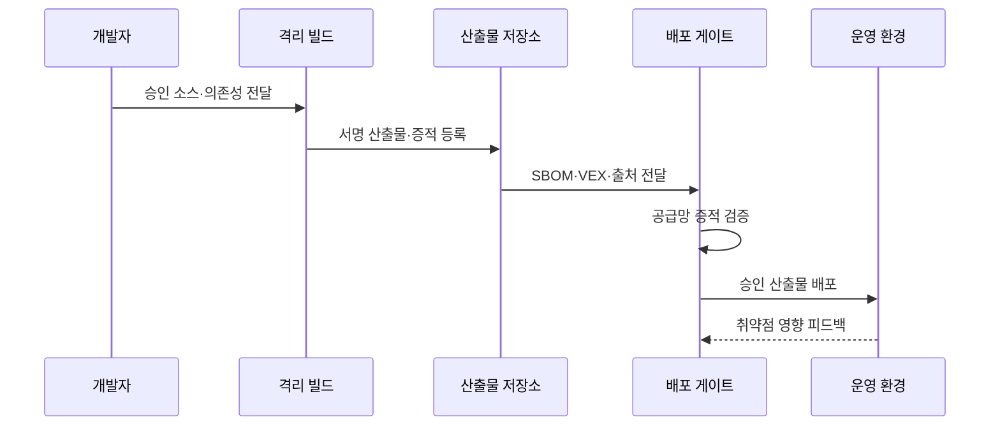

---
sidebar:
  order: 76
  label: "076. 소프트웨어 공급망 보안 (Supply Chain Security)"
  badge:
    text: "기출 · 85%"
    variant: note
title: "소프트웨어 공급망 보안 (Supply Chain Security)"
date: "2026-07-27T23:59:59+09:00"
tags:
  - "notes-security"
weight: 76
extra:
  question_no: "076"
  source_status: "기출"
  source_history: "128회, 134회, 135회, 138회"
  priority: 85
  priority_note: "128·134·135·138회 반복된 최우선 공급망 주제임"
---

## 미리 알고가기

- **소프트웨어 공급망(Software Supply Chain)**: 소스·의존성·빌드·저장소·배포를 거쳐 소프트웨어가 만들어지는 전체 연결
- **의존성(Dependency)**: 응용이 기능을 사용하기 위해 포함하거나 호출하는 외부 소프트웨어
- **전이 의존성(Transitive Dependency)**: 직접 선택한 의존성이 다시 포함한 간접 의존성
- **SBOM(Software Bill of Materials)**: 제품의 구성요소·버전·식별자·관계를 기록한 소프트웨어 자재 명세서
- **VEX(Vulnerability Exploitability eXchange)**: 특정 제품에서 알려진 취약점의 영향 여부와 근거를 전달하는 문서
- **출처 증명(Provenance)**: 산출물을 누가 어떤 소스·도구·과정으로 만들었는지 나타내는 검증 정보
- **SLSA(Supply-chain Levels for Software Artifacts)**: 소스와 빌드 무결성 보증을 단계적으로 강화하는 프레임워크
- **해시(Hash)**: 임의 길이 데이터를 고정 길이 값으로 바꾸어 변경 여부를 확인하는 함수와 결과
- **산출물(Artifact)**: 빌드 과정에서 생성된 실행 파일·패키지·컨테이너 이미지
- **불변 저장소(Immutable Repository)**: 저장된 산출물을 같은 식별자로 덮어쓰지 못하게 하는 저장소
- **격리 빌드(Isolated Build)**: 다른 작업과 권한·파일·네트워크를 분리한 환경에서 수행하는 빌드
- **재현 가능한 빌드(Reproducible Build)**: 같은 소스와 조건에서 동일한 산출물을 다시 만들 수 있는 빌드
- **단명 자격 증명(Ephemeral Credential)**: 한 작업이나 짧은 시간만 유효한 인증 정보
- **승격(Promotion)**: 검증을 통과한 산출물을 다음 저장소나 배포 단계로 이동시키는 절차
- **명세 약어 읽기와 표기**: SBOM은 에스봄으로 읽고 Software Bill of Materials의 머리글자를 딴 구성 명세이며, VEX는 벡스로 읽고 Vulnerability Exploitability eXchange에서 교환을 뜻하는 X를 강조한 영향 판정 문서
- **보증 단계(Supply-chain Levels for Software Artifacts, SLSA·살사)**: 영문 핵심 글자를 딴 공식 프레임워크명이며, 소스·빌드 산출물의 무결성 보증 수준을 높이는 역할

## Ⅰ. 개요

- 정의/개념: 소스·의존성·빌드·배포 전 과정의 출처와 무결성을 보호한다
- **배경/필요성**: 전이 의존성과 빌드 과정의 불투명성으로 오염 범위 식별 곤란

### 쉽게 이해하기 (학습용)

- 완성 프로그램만 검사하지 않고 재료가 어디서 왔고 누가 어떤 공정으로 만들었으며 어떤 결함의 영향을 받는지 확인한다.

## Ⅱ. 특징

- 의존성·빌드 식별은 오염 경로 추적 시간을 줄인다
- 격리 빌드·서명·출처는 산출물 변조를 막는다
- SBOM은 영향 제품 식별과 대응 시간을 줄인다
- VEX는 비영향 근거로 불필요한 패치 비용을 줄인다
- 서명자·최신성 검증은 위조 증적 승인을 막는다
- 모델·데이터·어댑터 포함은 AI 오염을 막는다

### 쉽게 이해하기 (학습용)

- SBOM에 취약 부품이 있다고 모두 위험한 것은 아니므로 VEX 근거와 실제 실행 경로를 보되 문서 자체의 발행자와 최신성도 확인해야 한다.

## Ⅲ. 아키텍처 및 구성요소

| 설계 요소 | 설명 |
|:---|:---|
| 소스·의존성 제어 | 승인 출처와 고정 버전 관리 |
| 격리 빌드 | 최소 권한 환경에서 산출물 생성 |
| 산출물·서명 | 해시·서명과 불변 저장 |
| SBOM·VEX·출처 | 구성·영향·생산 이력 제공 |
| 검증·배포 게이트 | 증적 검증 후 승격 허용 |
| 운영·취약점 대응 | 영향 제품 식별과 수정 추적 |

> 요약: 소스·빌드·증적을 검증해 배포 오염을 막는다

### 쉽게 이해하기 (학습용)

- 승인된 재료를 격리 환경에서 만들고 산출물과 생산 이력을 서명한 뒤 검증을 통과한 결과만 배포한다.

## Ⅳ. 원리 및 절차 흐름도

| 절차 | 설명 |
|:---|:---|
| 승인 소스·의존성 전달 | 출처·버전·해시를 고정 |
| 서명 산출물·증적 등록 | 빌드 결과와 출처를 함께 저장 |
| SBOM·VEX·출처 전달 | 구성·영향·생산 정보를 연결 |
| 공급망 증적 검증 | 서명자·무결성·정책 확인 |
| 승인 산출물 배포 | 검증된 불변 결과만 승격 |
| 취약점 영향 피드백 | 영향 제품과 수정 상태 갱신 |

> 요약: 검증된 재료와 빌드 결과만 배포한다.

### 쉽게 이해하기 (학습용)

- 개발자가 승인 재료를 보내면 격리 빌드가 서명된 제품과 이력을 만들고 배포 관문이 모두 맞는 경우에만 운영으로 보낸다.

## Ⅴ. 공급망 보안 증적 비교

| 판단 기준 | SBOM | VEX | 출처 증명 |
|:---|:---|:---|:---|
| 적용 기준 | 영향 구성요소 식별 | 취약점 조치 우선순위 | 빌드 출처·무결성 검증 |
| 핵심 특징 | 구성요소·버전·관계 기록 | 제품별 취약점 영향 기록 | 빌드 주체·과정 기록 |
| 한계 | 취약점·진위 단독 미보장 | 발행자·근거·최신성 | 구성·취약점 정보 부족 |

> 요약: SBOM은 구성, VEX는 영향, 출처는 생산 이력이다

### 쉽게 이해하기 (학습용)

- SBOM은 재료표, VEX는 결함 영향 판정서, 출처 증명은 생산 이력이며 공급망 보안은 이들을 실제 배포 관문에 연결한다.

## Ⅵ. 실무 사례

1. Log4j 취약점 발생 시 **SBOM 식별과 VEX 영향 판단**

### 쉽게 이해하기 (학습용)

- 공급자는 SBOM으로 Log4j 포함 제품과 버전을 찾고, 실제 취약 코드의 실행 가능성을 근거로 VEX 상태를 발행해 고객의 패치 우선순위를 돕는다.

## Ⅶ. 결론

- 소프트웨어 공급망의 구성 불명확성과 위변조를 극복하기 위해 부품 식별·출처·빌드 무결성·취약점 실행 가능성을 검토하여, SBOM과 VEX로 영향 판단과 조치를 연결해야 한다.

### 쉽게 이해하기 (학습용)

- 공급망 보안은 문서를 만드는 일이 아니라 믿을 수 있는 소스와 빌드에서 나온 산출물만 배포되고 새 취약점의 영향을 즉시 찾게 하는 체계다.
