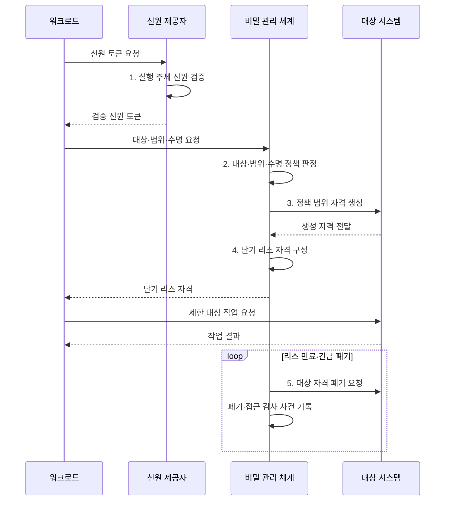

---
sidebar:
  order: 77
  label: "077. 비밀 관리 - Vault·AWS Secrets (Secrets Management)"
  badge:
    text: "미출제 · 50%"
    variant: note
title: "비밀 관리 - Vault·AWS Secrets (Secrets Management)"
date: "2026-08-02T12:32:00+09:00"
tags:
  - "notes-security"
weight: 77
extra:
  question_no: "077"
  source_status: "미출제"
  source_history: ""
  priority: 50
  priority_note: "동적 비밀·워크로드 신원·회전을 묶는 독립 설계임"
---

## Ⅰ. 개요

핵심 용어

- **비밀 관리**: 비밀번호·API 키·토큰·암호 키의 저장·인증·발급·회전·폐기·감사를 중앙 통제하는 체계이다.
- **하드코딩 비밀**: 소스·설정·이미지에 장기 자격을 직접 넣어 복제와 유출 뒤 피해가 지속되는 상태이다.

- 정의/개념: **비밀 관리**는 비밀번호·API 키·토큰·암호 키의 저장·인증·발급·회전·폐기·감사를 중앙 통제하는 **자격정보 보안 관리 체계**
- 배경/필요성: 하드코딩·장기 자격 탈취로 **접근 피해 장기화**

#### 한줄 요약

- 프로그램에 비밀번호를 넣지 않고 실행 주체의 신원을 확인하여 필요한 열쇠를 잠깐 빌려준 뒤 자동으로 거둔다.

## Ⅱ. 특징

핵심 용어

- **워크로드 신원·부트스트랩**: 실행 주체의 OIDC·PKI 신원으로 최초 인증용 고정 비밀을 대체하는 방식이다.
- **동적 비밀·리스**: 요청 때 생성한 자격에 TTL과 갱신·폐기 상태를 결속하여 짧은 수명만 허용하는 방식이다.

- **초기 비밀 제거**: 워크로드 신원으로 부트스트랩 대체
- **노출 피해 제한**: 최소 권한·수명의 동적 비밀 발급
- **수명주기 추적**: 리스·회전·폐기·감사 사건 연결

#### 한줄 요약

- 중앙 금고에 보관하는 데 그치지 않고 누가 어떤 비밀을 얼마나 오래 쓰며 사용 뒤 실제 폐기되는지를 통제한다.

## Ⅲ. 구조 및 구성요소

핵심 용어

- **정책·비밀 엔진**: 정책 엔진은 대상·작업·수명을 제한하고 비밀 엔진은 정적 값을 제공하거나 동적 자격을 생성한다.
- **회전·폐기·감사**: 기존 비밀을 새 값으로 교체하고 만료 전이라도 무효화하며 모든 접근과 변경 사건을 기록한다.

| 구성요소 | 책임 |
|:---|:---|
| 워크로드 인증 | **OIDC·PKI 신원**으로 실행 주체 확인 |
| 정책 엔진 | **대상·작업 범위**와 수명 제한 |
| 비밀 엔진 | **정적 저장·동적 자격** 생성 |
| 리스·회전 관리 | **리스 관리·비밀 회전**으로 갱신·폐기 |
| 보호 저장·감사 | **암호화 보관·감사 사건** 기록 |

#### 한줄 요약

- 신원을 확인하고 정책에 맞는 비밀을 짧게 발급하며 수명이 끝나면 폐기하고 모든 사건을 보호된 기록에 남긴다.

## Ⅳ. 흐름도

핵심 용어

- **단기 리스 자격**: 대상 시스템에 생성한 최소 권한 자격에 리스 식별자와 TTL을 결합해 워크로드에 제공하는 증명 정보이다.
- **긴급 폐기**: 유출이나 위험 변화가 확인되면 유효기간이 남아 있어도 대상 시스템의 자격을 즉시 무효화하는 처리이다.

**동작 원리**

1. **실행 주체 신원 검증**: 실행 환경·서비스 신원 확인
2. **대상·범위·수명 정책 판정**: 자원·작업·TTL 허용 여부 결정
3. **정책 범위 자격 생성**: 대상 시스템에 단기 자격 생성
4. **단기 리스 자격 구성**: 자격·리스 식별자·TTL 결합
5. **대상 자격 폐기 요청**: 만료·긴급 회수 시 접근 차단

#### 한줄 요약

- 프로그램은 자기 신원을 증명해 작업 시간만 유효한 자격을 받고 시간이 끝나면 자격이 자동으로 무효화된다.

## Ⅴ. 종류 및 비교

핵심 용어

- **고정·중앙 정적·동적 비밀**: 고정형은 파일에 장기 저장하고 중앙 정적형은 금고에서 값을 제공하며 동적형은 요청별 단기 자격을 생성한다.
- **Vault·AWS Secrets Manager**: Vault는 동적 엔진과 리스를 제공하고 AWS Secrets Manager는 관리형 정적 저장과 자동 회전을 제공한다.

| 비밀 관리 유형 | 고정 설정 | 중앙 정적 관리 | 동적 관리 |
|:---|:---|:---|:---|
| 적용 기준 | **격리 임시 개발** 환경 | **동적 발급 미지원** 대상 | **DB·클라우드 자동화** 대상 |
| 핵심 특징 | **코드·파일 장기 저장** | **금고의 정적 값 제공** | **요청별 단기 자격 생성** |
| 구현 예 | **환경 변수·설정 파일** | **AWS Secrets Manager** 정적 저장 | **Vault 동적 엔진**과 리스 |
| 한계 | **저장소·이미지 유출** | **회전 전파·캐시 지연** | **리스 서비스 가용성** 의존 |

#### 한줄 요약

- 고정 설정은 복제된 열쇠가 오래 남고 중앙 정적 관리는 보관을 개선하며 동적 관리는 작업마다 새 열쇠를 짧게 만든다.

## Ⅵ. 실무 고려사항 및 대책

핵심 용어

- **NIST SP 800-57**: 암호 키의 생성·저장·사용·회전·폐기 수명주기를 제시하는 공식 지침이다.
- **봉인 키·단계 회전**: 금고 암호화의 핵심 키를 분할·복구 가능하게 보호하고 구·신 비밀의 사용처를 순차 전환해 중단을 막는다.

| 문제 | 대책 | 효과 |
|:---|:---|:---|
| **암호 키 수명 불일치**로 폐기 누락 | **NIST SP 800-57 키 관리** 적용 | **생성·보관·폐기 일관성** 확보 |
| **부트스트랩 비밀 노출**로 금고 접근 탈취 | **워크로드 신원·동적 발급** 적용 | **탈취 유효시간·범위** 축소 |
| **금고 장애·봉인 키 유실**로 발급 중단 | **다중화·키 분할 보관·복구훈련** | **비밀 서비스 연속성** 확보 |
| **정적 비밀 회전 실패**로 구·신값 충돌 | **AWS 자동 회전·단계 전환** 적용 | **서비스 중단 없는 교체** 지원 |

#### 한줄 요약

- 애플리케이션은 Vault에서 작업 수명만큼 유효한 개별 DB 계정을 받고 만료 시 자동 폐기하여 공유 비밀번호를 남기지 않는다.

## Ⅶ. 결론

핵심 용어

- **최소 범위·최소 수명 자격**: 올바른 워크로드에 필요한 대상과 작업만 가능한 비밀을 짧게 발급하고 사용 후 확실히 폐기하는 원칙이다.

- 자동 생성·폐기 대상은 **동적 비밀**, 미지원 레거시는 **중앙 정적 비밀·회전** 적용

#### 한줄 요약

- 비밀 관리의 목표는 안전한 저장소 자체가 아니라 올바른 워크로드에 최소 범위 자격을 짧게 발급하고 확실히 폐기하는 것이다.
