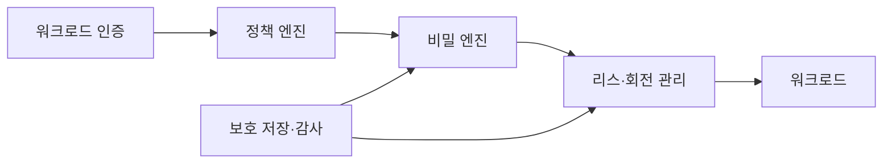
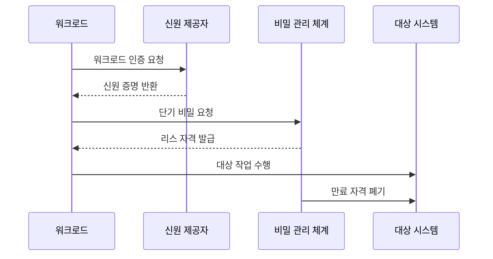

---
sidebar:
  order: 77
  label: "077. 비밀 관리 - Vault·AWS Secrets (Secrets Management)"
  badge:
    text: "미출제 · 50%"
    variant: note
title: "비밀 관리 - Vault·AWS Secrets (Secrets Management)"
date: "2026-07-25T13:04:00+09:00"
tags:
  - "notes-security"
weight: 77
extra:
  question_no: "077"
  source_status: "미출제"
  source_history: ""
  priority: 50
  priority_note: "동적 비밀·워크로드 신원·회전을 묶는 독립 설계임"
---

## 미리 알고가기

- **비밀(Secret)**: 노출되면 시스템 접근에 악용될 수 있는 비밀번호·API 키·토큰·암호 키
- **비밀 관리(Secrets Management)**: 비밀의 저장·인증·발급·회전·폐기·감사를 중앙 통제하는 체계
- **정적 비밀(Static Secret)**: 관리자가 만들고 교체하기 전까지 같은 값을 사용하는 자격 증명
- **동적 비밀(Dynamic Secret)**: 요청 시 생성되어 짧은 수명 뒤 자동 폐기되는 자격 증명
- **워크로드 신원(Workload Identity)**: 응용·컨테이너·서버리스 함수 등 실행 주체를 식별하는 신원
- **부트스트랩 비밀(Bootstrap Secret)**: 비밀 관리 체계에 처음 인증하기 위해 미리 배포해야 하는 초기 자격 증명
- **리스(Lease)**: 동적 비밀의 유효 기간과 갱신·폐기 상태를 관리하는 계약
- **회전(Rotation)**: 기존 비밀을 새 값으로 교체하고 사용처를 전환하는 절차
- **폐기(Revocation)**: 비밀이 만료 전이라도 더는 인증에 쓰이지 않게 만드는 처리
- **PKI(Public Key Infrastructure)**: 인증서와 공개키의 발급·배포·폐기를 관리하는 체계
- **OIDC(OpenID Connect)**: 사용자나 워크로드의 인증 결과를 표준 토큰으로 전달하는 인증 계층
- **Vault**: 정책 기반 비밀 저장과 동적 자격 발급을 제공하는 비밀 관리 제품군
- **AWS Secrets Manager**: AWS 환경에서 비밀 저장·회전·접근 통제를 제공하는 관리형 서비스
- **봉인 키(Seal Key)**: 비밀 저장소의 암호화 키를 보호하거나 저장소 잠금을 해제하는 핵심 키
- **인증 약어 읽기와 표기**: PKI·OIDC는 피케이아이·오아이디씨로 읽고 영문 머리글자를 딴 표기이며, 인증서 수명주기와 표준 신원 토큰 전달 역할을 함
- **제품·서비스 읽기**: Vault는 볼트로 읽는 금고 의미의 제품명이고 AWS Secrets Manager는 에이더블유에스 시크릿츠 매니저로 읽으며, 각각 정책형 비밀 엔진과 관리형 저장·회전을 제공함

## Ⅰ. 개요

- **정의/개념**: 비밀의 발급·사용·회수를 중앙 통제한다
- **배경/필요성**: 하드코딩·장기 자격의 노출 피해를 줄인다

### 쉽게 이해하기 (학습용)

- 프로그램 안에 비밀번호를 넣어 두지 않고 실행 중인 프로그램의 신원을 확인해 필요한 열쇠를 잠깐 빌려주고 자동으로 거둔다.

## Ⅱ. 특징

- 워크로드 신원은 초기 비밀 탈취 위험을 줄인다
- 최소 범위·수명 정책은 자격 악용 피해를 제한한다
- 동적 자격은 장기 비밀 공유와 추적 공백을 막는다
- 리스 폐기는 노출 자격의 유효 시간을 줄인다
- 감사 기록은 비밀 오용의 탐지·추적 시간을 줄인다

### 쉽게 이해하기 (학습용)

- 중앙 금고에 넣는 것만으로는 부족하며 누가 어떤 비밀을 얼마나 오래 쓰는지와 사용 뒤 실제로 폐기되는지를 통제해야 한다.

## Ⅲ. 아키텍처 및 구성요소

| 설계 요소 | 설명 |
|:---|:---|
| 워크로드 인증 | 서비스·컨테이너 신원 확인 |
| 정책 엔진 | 비밀 범위·작업·수명 제한 |
| 비밀 엔진 | 정적 저장과 동적 자격 생성 |
| 리스·회전 관리 | 갱신·만료·교체·폐기 |
| 워크로드 | 비밀을 메모리에서 단기 사용 |
| 보호 저장·감사 | 암호화 보관과 사건 기록 |

> 요약: 신원·정책·리스로 비밀의 수명과 사용을 통제한다

### 쉽게 이해하기 (학습용)

- 실행 주체를 확인하고 정책에 맞는 비밀을 만들어 짧게 전달하며 수명이 끝나면 자격을 폐기하고 기록을 남긴다.

## Ⅳ. 원리 및 절차 흐름도

| 절차 | 설명 |
|:---|:---|
| 워크로드 인증 요청 | 실행 환경과 서비스 신원 제시 |
| 신원 증명 반환 | 검증된 단기 신원 토큰 제공 |
| 단기 비밀 요청 | 대상·작업·필요 수명 제출 |
| 리스 자격 발급 | 정책 평가 후 동적 비밀 생성 |
| 대상 작업 수행 | 메모리에서 비밀을 제한 사용 |
| 만료 자격 폐기 | 리스 종료와 감사 기록 생성 |

> 요약: 워크로드 신원에 단기 비밀을 빌려준다.

### 쉽게 이해하기 (학습용)

- 프로그램은 자기 신원을 증명해 작업 시간만 유효한 자격을 받고 대상 시스템을 사용하며 시간이 끝나면 그 자격은 자동으로 무효가 된다.

## Ⅴ. 종류 및 비교

| 판단 기준 | 고정 설정 | 중앙 정적 관리 | 동적 관리 |
|:---|:---|:---|:---|
| 핵심 특징 | 코드·파일에 장기 저장 | 금고에서 정적 값 제공 | 요청마다 단기 자격 생성 |
| 적용 기준 | 격리된 임시 개발 환경 | 동적 발급 미지원 대상 | DB·클라우드 자동화 |
| 주요 위험 | 저장소·이미지 유출 | 회전 전파·캐시 지연 | 리스 갱신·가용성 |

> 요약: 동적 관리는 노출 시간을 줄이나 가용성이 필요하다

### 쉽게 이해하기 (학습용)

- 고정 설정은 복사된 열쇠가 오래 남고 중앙 정적 관리는 보관을 개선하며 동적 관리는 사용자와 작업마다 새 열쇠를 짧게 만든다.

## Ⅵ. 실무 사례

1. DB 계정을 요청마다 동적으로 발급한다
2. 저장소에 노출된 비밀을 즉시 폐기한다
3. 회전 중 구·신 자격 전환을 검증한다
4. 금고 장애에 봉인 키·복구 절차를 마련한다

### 쉽게 이해하기 (학습용)

- 사례 1은 여러 서비스가 같은 장기 DB 비밀번호를 나누지 않고 각 작업에 추적 가능한 단기 계정을 쓰게 한다.
- 사례 2는 Git 기록에서 문자열을 지우는 데 그치지 않고 대상 시스템의 자격 자체를 무효화해 복사본 사용을 막는다.
- 사례 3은 비밀을 바꿨지만 일부 인스턴스가 오래된 값을 계속 써서 장애나 보안 공백이 생기는 일을 방지한다.
- 사례 4는 중앙 금고가 멈췄을 때 모든 서비스가 무검증 우회하거나 영구 중단되지 않도록 제한된 복구 통로를 둔다.

## Ⅶ. 결론

- 장기 비밀이면 신원 기반 단기 자격으로 전환한다.

### 쉽게 이해하기 (학습용)

- 비밀 관리의 목표는 안전한 저장소가 아니라 올바른 워크로드에 최소 범위의 자격을 짧게 발급하고 사용 뒤 확실히 폐기하는 것이다.
