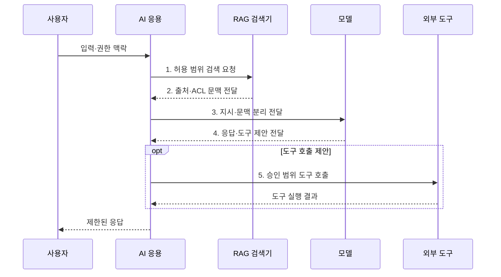

---
sidebar:
  order: 78
  label: "078. AI 보안 위협 전체 구조 (AI Security Threat Landscape)"
  badge:
    text: "기출 · 85%"
    variant: note
title: "AI 보안 위협 전체 구조 (AI Security Threat Landscape)"
date: "2026-08-02T12:34:00+09:00"
tags:
  - "notes-security"
weight: 78
extra:
  question_no: "078"
  source_status: "기출"
  source_history: "135회, 137회, 138회"
  priority: 85
  priority_note: "135·137·138회 반복된 AI 보안 위협 우산 주제임"
---

## Ⅰ. 개요

핵심 용어

- **AI 보안 위험관리**: 학습 데이터·모델·응용·검색·도구·운영 행동의 공격면을 수명주기 전체에서 식별하고 통제하는 체계이다.
- **모델 고유 위협**: 기존 응용 보안만으로 다루기 어려운 데이터 오염·가중치 변조·인젝션·에이전트 권한 오용 위험이다.

- 정의/개념: **AI 보안 위험관리** 는 학습 데이터·모델·응용·검색·도구·운영 행동의 공격면을 AI 수명주기 전체에서 식별·평가·통제하는 **보안 위험관리 체계**
- 배경/필요성: 기존 앱 보안만으로 **모델 조작·도구 오남용 통제 곤란**

#### 한줄 요약

- AI 보안은 모델만 지키는 일이 아니라 학습 재료부터 검색 문서와 연결 도구 및 실제 행동까지 전체 사슬을 보호하는 일이다.

## Ⅱ. 특징

핵심 용어

- **데이터 계보·모델 가중치**: 학습 데이터의 출처·변환·사용 이력과 학습 결과인 수치 집합의 무결성을 함께 추적한다.
- **프롬프트·RAG·도구 경계**: 비신뢰 입력과 검색 문맥을 상위 지시에서 분리하고 모델이 제안한 외부 행동을 별도 권한으로 검증한다.
- **지속 위험 관리**: 배포 전 적대적 평가와 운영 중 이상 감시 결과를 다음 통제 개선에 반복 반영하는 활동이다.

- **계보·공급망 무결성**: 데이터·가중치 변조 추적
- **신뢰 경계 분리**: 프롬프트·RAG·도구 권한 격리
- **지속 위험 관리**: 적대적 평가와 운영 감시 반복

#### 한줄 요약

- 답변이 정확해도 민감정보를 내보내거나 악성 문서 지시에 따라 결제를 실행하면 안전한 AI가 아니다.

## Ⅲ. 구조 및 구성요소

핵심 용어

- **데이터·모델 공급망**: 학습 재료와 의존성, 코드, 모델 가중치의 출처와 서명을 검증하여 오염과 변조를 방지하는 영역이다.
- **적대적 평가·외부 통신 통제**: 공격 입력으로 실패를 시험하고 AI 응용과 도구가 접속할 외부 목적지를 제한한다.

| 구성요소 | 책임 |
|:---|:---|
| 데이터 거버넌스 | **출처·데이터 계보** 와 오염 여부 관리 |
| 모델 공급망 | **코드·모델 가중치** 의 서명 검증 |
| 응용 신뢰 경계 | **프롬프트·RAG 문맥** 과 지시 분리 |
| 도구·권한 통제 | **에이전트 도구·외부 통신** 범위 제한 |
| 평가·운영 대응 | **적대적 평가·이상 탐지** 결과 환류 |

#### 한줄 요약

- 신뢰할 수 있는 데이터와 모델을 배포하고 입력·검색·도구 경계를 통제하며 공격 시험과 운영 감시로 전 단계를 확인한다.

## Ⅳ. 흐름도

핵심 용어

- **ACL 기반 검색**: 사용자 권한에 허용된 문서 조각만 벡터 데이터베이스에서 검색해 출처와 함께 모델 문맥에 전달하는 방식이다.
- **승인 범위 도구 호출**: 모델 제안을 최소 권한·사용자 승인·외부 통신 정책으로 재검증한 뒤 실제 기능을 실행하는 절차이다.

**동작 원리**

1. **허용 범위 검색 요청**: 사용자 ACL로 벡터 DB 범위 제한
2. **출처·ACL 문맥 전달**: 검색 문서의 출처·권한 표시
3. **지시·문맥 분리 전달**: 비신뢰 문서를 명령과 격리
4. **응답·도구 제안 전달**: 내용·권한·민감도 정책 평가
5. **승인 범위 도구 호출**: 최소 권한·승인·외부 통신 통제

#### 한줄 요약

- 사용자 입력과 검색 문서를 명령으로 바로 믿지 않고 모델 출력과 실제 도구 행동 사이에도 별도 정책과 승인을 둔다.

## Ⅴ. 종류 및 비교

핵심 용어

- **데이터 오염·백도어**: 학습 재료를 조작해 일반 성능이나 특정 입력에서의 모델 행동을 공격자 의도대로 바꾸는 위협이다.
- **가중치 탈취·인젝션**: 배포 모델의 핵심 자산을 복제하거나 비신뢰 입력을 명령으로 해석시켜 출력·행동을 바꾸는 위협이다.

| 인공지능(Artificial Intelligence, AI) 수명주기 | 보호 대상 | 대표 위협 |
|:---|:---|:---|
| **데이터·개발** | **학습 자료·라벨·코드·의존성** | 데이터 오염·백도어·의존성 변조 |
| **모델·배포** | **가중치·설정·배포 산출물** | 모델 탈취·변조·교체 |
| **추론·운영** | **입력·출력·도구 권한·자원** | 인젝션·정보 유출·도구 오용·자원 고갈 |

#### 한줄 요약

- 개발은 재료, 배포는 모델 산출물, 운영은 입력과 실제 행동을 지키며 단계 사이의 보안 공백도 함께 없애야 한다.

## Ⅵ. 실무 고려사항 및 대책

핵심 용어

- **NIST AI 100-1 RMF 1.0**: AI 위험을 Govern·Map·Measure·Manage 기능으로 관리하는 공식 프레임워크이다.
- **NIST AI 600-1**: AI RMF를 생성형 AI의 오용·정보 유출·에이전트 위험에 적용한 공식 프로파일이다.

| 문제 | 대책 | 효과 |
|:---|:---|:---|
| **부서별 위험 기준 불일치** 로 누락 발생 | **NIST AI 100-1 RMF 1.0** 적용 | Govern·Map·Measure·Manage **기능 정렬** |
| **생성형 AI 위험 식별 부족** 으로 대응 누락 | **NIST AI 600-1 프로파일** 적용 | **오용·유출 위험** 의 측정 구체화 |
| **도구 권한 과다** 시 무단 변경·유출 확대 | **최소 권한·사람 승인** 과 외부 통신 통제 | **무단 실행·정보 유출** 제한 |

#### 한줄 요약

- RAG 문서는 비신뢰 데이터로 표시하고 문서 속 지시가 사용자 권한을 넘거나 외부 도구를 실행하려 하면 정책 경계에서 거부한다.

## Ⅶ. 결론

핵심 용어

- **AI 신뢰 경계 유지**: 데이터·모델·검색 문맥·도구 사이에서 출처와 권한을 보존하여 한 단계의 실패가 실제 권한 오용으로 번지지 않게 하는 원칙이다.

- 계보·서명 실패는 **모델 배포 차단**, 고위험 도구 호출은 **사람 승인**

#### 한줄 요약

- AI 보안은 기존 응용 보안에 모델 고유 위협을 더하고 데이터·모델·검색·도구 사이의 신뢰 경계를 끝까지 유지하는 체계이다.
