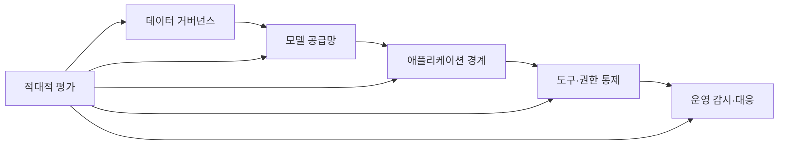
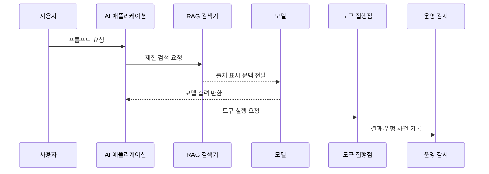

---
sidebar:
  order: 78
  label: "078. AI 보안 위협 전체 구조 (AI Security Threat Landscape)"
  badge:
    text: "기출 · 85%"
    variant: note
title: "AI 보안 위협 전체 구조 (AI Security Threat Landscape)"
date: "2026-07-27T23:59:59+09:00"
tags:
  - "notes-security"
weight: 78
extra:
  question_no: "078"
  source_status: "기출"
  source_history: "135회, 137회, 138회"
  priority: 85
  priority_note: "135·137·138회 반복된 AI 보안 위협 우산 주제임"
---

## 미리 알고가기

- **AI(Artificial Intelligence)**: 학습이나 규칙을 바탕으로 예측·생성·의사결정을 수행하는 시스템
- **기계학습(Machine Learning)**: 데이터에서 패턴과 모델 매개변수를 학습하는 AI 방식
- **모델 가중치(Model Weights)**: 학습으로 결정되어 모델의 출력을 좌우하는 수치 집합
- **프롬프트(Prompt)**: 생성형 AI에 지시·질문·문맥을 전달하는 입력
- **RAG(Retrieval-Augmented Generation)**: 외부 문서를 검색해 모델 입력 문맥에 결합하는 생성 방식
- **에이전트(Agent)**: 모델이 도구를 선택·호출하며 여러 단계를 수행하는 AI 응용
- **도구(Tool)**: AI가 검색·메일·코드 실행·데이터 변경을 수행하도록 연결된 외부 기능
- **벡터 데이터베이스(Vector Database)**: 의미 유사도 검색을 위해 수치 벡터를 저장·조회하는 데이터베이스
- **인젝션(Injection)**: 신뢰하지 않는 입력을 명령으로 해석하게 만들어 의도한 통제를 우회하는 공격
- **데이터 오염(Data Poisoning)**: 학습 데이터를 조작해 모델의 행동이나 성능을 바꾸는 공격
- **백도어(Backdoor)**: 특정 입력 조건에서 공격자가 원하는 행동을 하도록 숨겨 둔 기능
- **적대적 평가(Adversarial Evaluation)**: 공격 입력과 악용 시나리오로 AI의 보안 실패를 검증하는 활동
- **Egress Control**: 시스템에서 외부 네트워크로 나가는 통신 대상을 제한하는 통제
- **데이터 계보(Data Lineage)**: 데이터의 출처·변환·사용 이력을 추적하는 정보
- **추론(Inference)**: 학습된 모델이 새 입력에 대해 결과를 계산하는 단계
- **인공지능 약어(Artificial Intelligence, AI·에이아이)**: 영문 머리글자를 딴 표기이며, 학습·예측·생성·의사결정을 수행하는 시스템 범위를 나타냄
- **검색 증강 생성(Retrieval-Augmented Generation, RAG·래그)**: 검색 결과로 생성을 보강한다는 영문 머리글자를 딴 표기이며, 외부 문서를 모델 문맥에 결합하는 역할
- **외부 통신 통제(Egress Control·이그레스 컨트롤)**: Egress가 외부로 나감을 뜻해 붙인 표기이며, AI 앱·도구가 접속할 외부 목적지를 제한하는 역할

## Ⅰ. 개요

- 정의/개념: AI 데이터·모델·입력·도구 전 수명주기의 공격면을 관리한다
- **배경/필요성**: 기존 소프트웨어 보안만으로 모델·프롬프트·도구 위험 통제 곤란

### 쉽게 이해하기 (학습용)

- AI 보안은 모델 하나만 지키는 일이 아니라 학습 재료부터 검색 문서와 연결 도구 및 실제 행동까지 전체 사슬을 보호하는 일이다.

## Ⅱ. 특징

- 데이터 계보·무결성은 오염과 개인정보 유출을 막는다
- 공급망 검증은 변조 모델·의존성 배포를 막는다
- 입력·RAG 경계 분리는 악성 지시 실행을 막는다
- 최소 권한·승인은 에이전트의 무단 행동을 막는다
- 유출·가용성·비용 평가는 정확도 밖 실패를 찾는다

### 쉽게 이해하기 (학습용)

- 답변이 정확해도 민감정보를 내보내거나 잘못된 문서 명령으로 결제를 실행하면 안전한 AI라고 할 수 없다.

## Ⅲ. 아키텍처 및 구성요소

| 설계 요소 | 설명 |
|:---|:---|
| 데이터 거버넌스 | 출처·동의·무결성·계보 관리 |
| 모델 공급망 | 코드·가중치·의존성 검증 |
| 애플리케이션 경계 | 프롬프트·RAG·출력 신뢰 분리 |
| 도구·권한 통제 | 외부 행동의 범위·승인 제한 |
| 운영 감시·대응 | 유출·오용·비용 이상 탐지 |
| 적대적 평가 | 단계별 공격과 통제 검증 |

> 요약: 데이터부터 도구 행동까지 신뢰 경계를 통제한다

### 쉽게 이해하기 (학습용)

- 신뢰할 수 있는 데이터와 모델을 배포하고 입력·검색·도구 경계를 통제하며 공격 시험과 운영 감시가 전 단계를 다시 확인한다.

## Ⅳ. 원리 및 절차 흐름도

| 절차 | 설명 |
|:---|:---|
| 프롬프트 요청 | 사용자 입력과 권한 맥락 수집 |
| 제한 검색 요청 | 허용 자료와 접근 범위 적용 |
| 출처 표시 문맥 전달 | 외부 문서를 명령과 분리 |
| 모델 출력 반환 | 내용·민감정보·정책 검사 |
| 도구 실행 요청 | 최소 권한과 중요 행위 승인 |
| 결과·위험 사건 기록 | 유출·오용·비용 이상 탐지 |

> 요약: 입력부터 도구 행동까지 신뢰 경계를 유지한다.

### 쉽게 이해하기 (학습용)

- 사용자 입력과 검색 문서를 그대로 명령으로 믿지 않고 모델 출력과 실제 도구 행동 사이에도 별도 정책과 승인을 둔다.

## Ⅴ. AI 수명주기 위협 비교

| 판단 기준 | 데이터·개발 | 모델·배포 | 추론·운영 |
|:---|:---|:---|:---|
| 적용 기준 | 학습·미세조정 파이프라인 | 모델 저장·배포 환경 | 사용자 요청과 에이전트 운영 |
| 핵심 특징 | 학습 재료와 코드 보호 | 가중치·산출물 무결성 | 입력·출력·도구 행동 통제 |
| 한계 | 오염·백도어·의존성 공격 | 모델 탈취·변조·교체 | 인젝션·유출·자원 고갈 |

> 요약: 개발은 재료, 배포는 모델, 운영은 행동을 보호한다

### 쉽게 이해하기 (학습용)

- 개발 단계는 재료, 배포 단계는 모델 산출물, 운영 단계는 입력과 실제 행동을 지키며 전체 보안은 이 사이의 빈틈을 없앤다.

## Ⅵ. 실무 사례

1. 외부 모델·데이터의 출처·해시를 검증한다
2. RAG 문서를 명령이 아닌 데이터로 격리한다
3. 결제 도구를 읽기 전용·승인으로 제한한다
4. 유출·도구 오용·비용 폭증을 시험한다

### 쉽게 이해하기 (학습용)

- 사례 1은 출처가 불명확하거나 바뀐 모델과 데이터가 학습·배포 사슬에 들어오는 일을 막는다.
- 사례 2는 검색된 문서 안의 악성 지시가 시스템 명령처럼 취급되어 원래 정책을 바꾸지 못하게 한다.
- 사례 3은 모델이 잘못 판단해도 즉시 송금하지 못하도록 조회 권한과 사람 승인을 별도 경계에 둔다.
- 사례 4는 정답률 외에도 민감정보가 재현되는지와 무단 행동 및 과도한 연산 비용이 발생하는지를 검증한다.

## Ⅶ. 결론

- AI를 운영하면 데이터부터 행동까지 통합 보호한다.

### 쉽게 이해하기 (학습용)

- AI 보안은 기존 앱 보안에 모델 고유 위협을 더하고 데이터·모델·검색·도구 사이의 신뢰 경계를 끝까지 유지하는 체계다.
