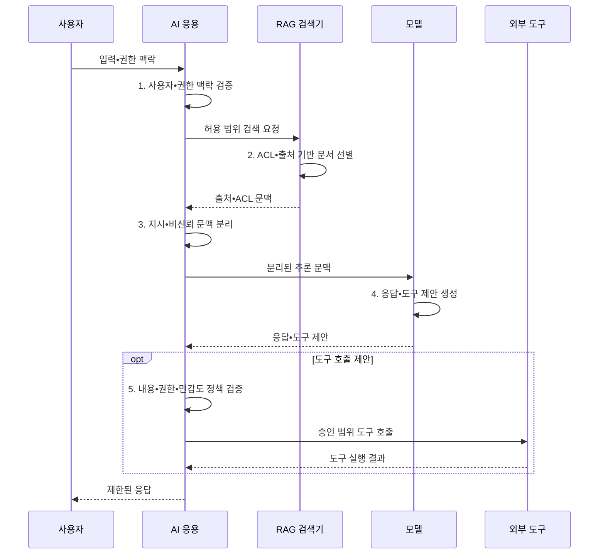

---
sidebar:
  order: 78
  label: "078. AI 보안 위협 전체 구조 (AI Security Threat Landscape)"
  badge:
    text: "기출 • 85%"
    variant: note
title: "AI 보안 위협 전체 구조 (AI Security Threat Landscape)"
date: "2026-08-05T11:24:00+09:00"
tags:
  - "notes-security"
weight: 78
extra:
  question_no: "078"
  source_status: "기출"
  source_history: "135회, 137회, 138회"
  priority: 85
  priority_note: "135•137•138회 반복된 AI 보안 위협 우산 주제임"
---

## Ⅰ. 개요

핵심 용어

- **AI(Artificial Intelligence) 보안 위험관리** 는 데이터•모델•응용•검색•도구의 공격면을 수명주기 전체에서 통제하는 체계다.
- **모델 고유 위협**: 기존 응용 보안만으로 다루기 어려운 데이터 오염•가중치 변조•인젝션•에이전트 권한 오용 위험이다.

- 정의/개념: **AI 보안 위험관리** 는 학습 데이터•모델•응용•검색•도구•운영 행동의 공격면을 AI 수명주기 전체에서 식별•평가•통제하는 **보안 위험관리 체계**
- 배경/필요성: 기존 앱 보안만으로 **모델 조작•도구 오남용 통제 곤란**

#### 한줄 요약

- AI 보안은 모델만 지키는 일이 아니라 학습 재료부터 검색 문서와 연결 도구 및 실제 행동까지 전체 사슬을 보호하는 일이다.

## Ⅱ. 특징

핵심 용어

- **데이터 계보** 는 학습 데이터의 출처•변환•사용 이력을 연결한 정보다.
- **모델 가중치** 는 학습 결과로 정해진 모델 내부의 수치 매개변수 집합이다.
- **프롬프트 경계** 는 비신뢰 입력을 시스템의 상위 지시와 분리하는 통제 지점이다.
- **RAG(Retrieval-Augmented Generation) 경계** 는 검색 문맥을 명령이 아닌 비신뢰 데이터로 구분하는 통제 지점이다.
- **도구 경계** 는 모델이 제안한 외부 행동을 별도 권한과 정책으로 검증하는 통제 지점이다.
- **지속 위험 관리**: 배포 전 적대적 평가와 운영 중 이상 감시 결과를 다음 통제 개선에 반복 반영하는 활동이다.

- **계보•공급망 무결성**: 데이터•가중치 변조 추적
- **신뢰 경계 분리**: 프롬프트•RAG•도구 권한 격리
- **지속 위험 관리**: 적대적 평가와 운영 감시 반복

#### 한줄 요약

- 답변이 정확해도 민감정보를 내보내거나 악성 문서 지시에 따라 결제를 실행하면 안전한 AI가 아니다.

## Ⅲ. 구조 및 구성요소

핵심 용어

- **데이터 공급망** 은 학습 재료의 출처•변환•의존성을 검증해 오염을 방지하는 영역이다.
- **모델 공급망** 은 코드•가중치•배포 산출물의 출처와 서명을 검증하는 영역이다.
- **적대적 평가** 는 공격 입력과 비정상 조건으로 AI 시스템의 보안 실패를 시험하는 활동이다.
- **외부 통신 통제** 는 AI 응용과 도구가 접속할 수 있는 외부 목적지를 제한하는 통제다.

| 구성요소 | 책임 |
|:---|:---|
| 데이터 거버넌스 | **출처•데이터 계보** 와 오염 여부 관리 |
| 모델 공급망 | **코드•모델 가중치** 의 서명 검증 |
| 응용 신뢰 경계 | **프롬프트•RAG 문맥** 과 지시 분리 |
| 도구•권한 통제 | **에이전트 도구•외부 통신** 범위 제한 |
| 평가•운영 대응 | **적대적 평가•이상 탐지** 결과 환류 |

#### 한줄 요약

- 신뢰할 수 있는 데이터와 모델을 배포하고 입력•검색•도구 경계를 통제하며 공격 시험과 운영 감시로 전 단계를 확인한다.

## Ⅳ. 흐름도

핵심 용어

- **ACL(Access Control List) 기반 검색** 은 사용자에게 허용된 문서 조각만 검색해 모델 문맥에 전달하는 방식이다.
- **DB(Database)** 는 구조화된 데이터를 저장•질의하는 데이터베이스다.
- **승인 범위 도구 호출**: 모델 제안을 최소 권한•사용자 승인•외부 통신 정책으로 재검증한 뒤 실제 기능을 실행하는 절차이다.

**동작 원리**

1. **사용자•권한 맥락 검증**: 요청 주체와 허용 데이터 범위 확인
2. **ACL•출처 기반 문서 선별**: 권한 있는 검색 문서만 추출
3. **지시•비신뢰 문맥 분리**: 검색 데이터를 상위 명령과 격리
4. **응답•도구 제안 생성**: 분리된 문맥에서 출력•행동 후보 산출
5. **내용•권한•민감도 정책 검증**: 도구 호출 전 승인 범위 재판정

#### 한줄 요약

- 사용자 입력과 검색 문서를 명령으로 바로 믿지 않고 모델 출력과 실제 도구 행동 사이에도 별도 정책과 승인을 둔다.

## Ⅴ. 종류 및 비교

핵심 용어

- **데이터 오염** 은 학습 재료를 조작해 모델의 일반 성능이나 행동을 바꾸는 위협이다.
- **백도어** 는 특정 입력에서만 공격자가 의도한 행동을 하도록 모델에 숨긴 기능이다.
- **가중치 탈취** 는 배포된 모델의 핵심 수치 자산을 무단 복제하는 위협이다.
- **인젝션** 은 비신뢰 입력을 명령으로 해석시켜 모델 출력•행동을 바꾸는 위협이다.

| AI 수명주기 | 보호 대상 | 대표 위협 |
|:---|:---|:---|
| **데이터•개발** | **학습 자료•라벨•코드•의존성** | 데이터 오염•백도어•의존성 변조 |
| **모델•배포** | **가중치•설정•배포 산출물** | 모델 탈취•변조•교체 |
| **추론•운영** | **입력•출력•도구 권한•자원** | 인젝션•정보 유출•도구 오용•자원 고갈 |

#### 한줄 요약

- 개발은 재료, 배포는 모델 산출물, 운영은 입력과 실제 행동을 지키며 단계 사이의 보안 공백도 함께 없애야 한다.

## Ⅵ. 실무 고려사항 및 대책

핵심 용어

- **NIST(National Institute of Standards and Technology)** 는 미국의 기술 표준과 지침을 개발하는 기관이다.
- **RMF(Risk Management Framework)** 는 위험을 식별•측정•대응•관리하는 구조화된 프레임워크다.
- **AI 100-1 RMF 1.0** 은 AI 위험을 Govern•Map•Measure•Manage 기능으로 관리한다.
- **AI 600-1** 은 AI RMF를 생성형 AI의 오용•정보 유출•에이전트 위험에 적용한 프로파일이다.

| 문제 | 대책 | 효과 |
|:---|:---|:---|
| **부서별 위험 기준 불일치** 로 누락 발생 | **NIST AI 100-1 RMF 1.0** 적용 | Govern•Map•Measure•Manage **기능 정렬** |
| **생성형 AI 위험 식별 부족** 으로 대응 누락 | **NIST AI 600-1 프로파일** 적용 | **오용•유출 위험** 의 측정 구체화 |
| **도구 권한 과다** 시 무단 변경•유출 확대 | **최소 권한•사람 승인** 과 외부 통신 통제 | **무단 실행•정보 유출** 제한 |

#### 한줄 요약

- RAG 문서는 비신뢰 데이터로 표시하고 문서 속 지시가 사용자 권한을 넘거나 외부 도구를 실행하려 하면 정책 경계에서 거부한다.

## Ⅶ. 결론

핵심 용어

- **AI 신뢰 경계 유지**: 데이터•모델•검색 문맥•도구 사이에서 출처와 권한을 보존하여 한 단계의 실패가 실제 권한 오용으로 번지지 않게 하는 원칙이다.

- 계보•서명 실패는 **모델 배포 차단**, 고위험 도구 호출은 **사람 승인**

#### 한줄 요약

- AI 보안은 기존 응용 보안에 모델 고유 위협을 더하고 데이터•모델•검색•도구 사이의 신뢰 경계를 끝까지 유지하는 체계이다.
