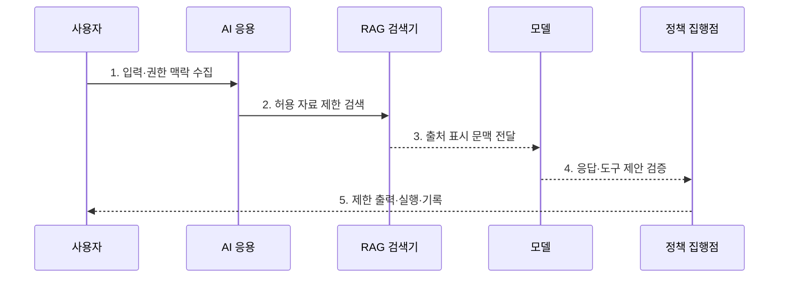

---
sidebar:
  order: 78
  label: "078. AI 보안 위협 전체 구조 (AI Security Threat Landscape)"
  badge:
    text: "기출 · 85%"
    variant: note
title: "AI 보안 위협 전체 구조 (AI Security Threat Landscape)"
date: "2026-07-30T20:00:00+09:00"
tags:
  - "notes-security"
weight: 78
extra:
  question_no: "078"
  source_status: "기출"
  source_history: "135회, 137회, 138회"
  priority: 85
  priority_note: "135·137·138회 반복된 AI 보안 위협 우산 주제임"
---

## 미리 알고가기

- **인공지능(Artificial Intelligence, AI)**: 학습이나 규칙을 바탕으로 예측·생성·의사결정을 수행하는 시스템이다.
- **기계학습(Machine Learning, ML)**: 데이터에서 패턴과 모델 매개변수를 학습하는 AI 방식이다.
- **모델 가중치(Model Weights)**: 학습으로 결정되어 모델 출력을 좌우하는 수치 집합이다.
- **프롬프트(Prompt)**: 생성형 AI에 지시·질문·문맥을 전달하는 입력이다.
- **검색 증강 생성(Retrieval-Augmented Generation, RAG)**: 외부 문서를 검색해 모델 입력 문맥에 결합하는 생성 방식이다.
- **에이전트(Agent)**: 모델이 도구를 선택·호출하며 여러 단계를 수행하는 AI 응용이다.
- **도구(Tool)**: AI가 검색·메일·코드 실행·데이터 변경을 수행하도록 연결한 외부 기능이다.
- **벡터 데이터베이스(Vector Database)**: 의미 유사도 검색용 수치 벡터를 저장·조회하는 데이터베이스이다.
- **인젝션(Injection)**: 비신뢰 입력을 명령으로 해석하게 하여 통제를 우회하는 공격이다.
- **데이터 오염(Data Poisoning)**: 학습 데이터를 조작해 모델의 행동이나 성능을 바꾸는 공격이다.
- **백도어(Backdoor)**: 특정 입력에서 공격자가 원하는 행동을 하도록 숨겨 둔 기능이다.
- **적대적 평가(Adversarial Evaluation)**: 공격 입력과 악용 시나리오로 AI의 보안 실패를 검증하는 활동이다.
- **외부 통신 통제(Egress Control)**: AI 응용과 도구가 접속할 외부 목적지를 제한하는 통제이다.
- **데이터 계보(Data Lineage)**: 데이터의 출처·변환·사용 이력을 추적하는 정보이다.
- **NIST AI 100-1 AI RMF 1.0**: AI 위험을 Govern·Map·Measure·Manage 기능으로 관리하는 공식 프레임워크이다.
- **NIST AI 600-1**: AI RMF 1.0을 생성형 AI 위험에 적용한 공식 프로파일이다.

## Ⅰ. 개요

- 정의/개념: AI 수명주기의 **통합 공격면 관리**
- 배경/필요성: 모델·프롬프트·도구의 **고유 위험 미통제**

### 쉽게 이해하기 (학습용)

- AI 보안은 모델만 지키는 일이 아니라 학습 재료부터 검색 문서와 연결 도구 및 실제 행동까지 전체 사슬을 보호하는 일이다.

## Ⅱ. 특징

- 데이터·모델의 **계보·공급망 무결성**
- 입력·RAG·도구의 **신뢰 경계 분리**
- 적대적 평가·감시의 **지속 위험 관리**

### 쉽게 이해하기 (학습용)

- 답변이 정확해도 민감정보를 내보내거나 악성 문서 지시에 따라 결제를 실행하면 안전한 AI가 아니다.

## Ⅲ. 구조 및 구성요소

| 구성요소 | 책임 |
|:---|:---|
| 데이터 거버넌스 | 출처·동의·무결성·계보 관리 |
| 모델 공급망 | 코드·가중치·의존성 검증 |
| 응용 신뢰 경계 | 프롬프트·RAG·출력 분리 |
| 도구·권한 통제 | 외부 행동 범위·승인 제한 |
| 평가·운영 대응 | 공격 시험·유출·오용 탐지 |

### 쉽게 이해하기 (학습용)

- 신뢰할 수 있는 데이터와 모델을 배포하고 입력·검색·도구 경계를 통제하며 공격 시험과 운영 감시로 전 단계를 확인한다.

## Ⅳ. 흐름도

**동작 원리**

1. **입력·권한 맥락 수집**: 사용자 입력·권한 확인
2. **허용 자료 제한 검색**: ACL·검색 범위 적용
3. **출처 표시 문맥 전달**: 외부 자료를 지침과 분리
4. **응답·도구 제안 검증**: 내용·권한·민감도 검사
5. **제한 출력·실행·기록**: 최소 권한 집행·이상 탐지

### 쉽게 이해하기 (학습용)

- 사용자 입력과 검색 문서를 명령으로 바로 믿지 않고 모델 출력과 실제 도구 행동 사이에도 별도 정책과 승인을 둔다.

## Ⅴ. 종류 및 비교

| AI 수명주기 위협 | 데이터·개발 | 모델·배포 | 추론·운영 |
|:---|:---|:---|:---|
| 적용 기준 | 학습·미세조정 | 저장·배포 환경 | 사용자·에이전트 운영 |
| 핵심 특징 | **재료·코드 보호** | **가중치·산출물 보호** | **입출력·행동 통제** |
| 한계 | 오염·백도어·의존성 | 탈취·변조·교체 | 인젝션·유출·자원 고갈 |

### 쉽게 이해하기 (학습용)

- 개발은 재료, 배포는 모델 산출물, 운영은 입력과 실제 행동을 지키며 단계 사이의 보안 공백도 함께 없애야 한다.

## Ⅵ. 실무 고려사항 및 대책

| 고려사항 | 대책 | 효과 |
|:---|:---|:---|
| 전사 AI 위험 체계 | **NIST AI 100-1 RMF 적용** | Govern·Map·Measure·Manage |
| 생성형 AI 고유 위험 | **NIST AI 600-1 프로파일 적용** | 오용·유출·환각 위험 구체화 |
| 도구의 실제 피해 | **최소 권한·승인·외부통신 통제** | 무단 변경·정보 유출 제한 |

### 쉽게 이해하기 (학습용)

- RAG 문서는 비신뢰 데이터로 표시하고 문서 속 지시가 사용자 권한을 넘거나 외부 도구를 실행하려 하면 정책 경계에서 거부한다.

## Ⅶ. 결론

- **영향도·신뢰경계·도구권한**으로 AI 통제를 결정한다.

### 쉽게 이해하기 (학습용)

- AI 보안은 기존 응용 보안에 모델 고유 위협을 더하고 데이터·모델·검색·도구 사이의 신뢰 경계를 끝까지 유지하는 체계이다.
